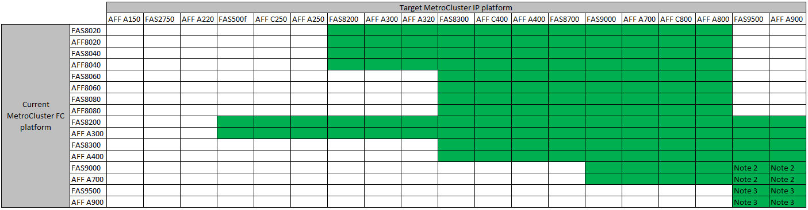

= Choosing your transition procedure
:icons: font
:imagesdir: ../media/

[.lead]
When transitioning to a MetroCluster IP configuration, you must have a combination of supported platform models.
You should also ensure that the MetroCluster IP platform is an appropriate size for the load that you are transitioning from the MetroCluster FC configuration to the MetroCluster IP configuration.

The following table shows the supported platform combinations. You can transition from platforms in the left-hand column to platforms listed as supported in the columns to the right, as indicated by the colored table cells.

For example, transitioning from a MetroCluster FC configuration consisting of AFF8060 controller modules to an IP configuration consisting of AFF A400 controller modules is supported.

* Note 1:  This platform combination requires ONTAP 9.11.1 or later.
* Note 2: You must have a 40GbE interface for the local cluster interfaces on the FC nodes. This platform combination requires ONTAP 9.12.1 or later.

* Note 3: You must have a 100GbE interface for the local cluster interfaces on the FC nodes. This platform combination requires ONTAP 9.12.1 or later.

* The transition procedures all require ONTAP 9.8 or later unless stated otherwise in the notes or as required by an individual platform.

[NOTE] 
====
* Do not exceed any object limits of the 'lower' of the platforms in the combination. Apply the lower object limit of the two platforms.
* If the target platform limits are lower then the MetroCluster limits, you must reconfigure the MetroCluster to be at, or below, the target platform limits before you add the new nodes.
* Refer to the link:https://hwu.netapp.html[Hardware universe^] for platform limits. 
====

You must select a transition procedure depending on your existing MetroCluster FC configuration.

A transition procedure replaces the back-end FC switch fabric or FC-VI connection with an IP switch network. The exact procedure depends on your starting configuration.

The original platforms and FC switches (if present) are retired at the end of the transition procedure.

[cols="20,20,20,40"]
|===

h| Starting configuration  h| Disruptive or nondisruptive h| Requirements h| Procedure
a| Eight node
a| Nondisruptive
a| New storage shelves are supported on new platforms.
a| link:concept_nondisruptively_transitioning_from_a_four_node_mcc_fc_to_a_mcc_ip_configuration.html[Link to procedure]

a| Four node
a| Nondisruptive
a| New storage shelves are supported on new platforms.
a| link:concept_nondisruptively_transitioning_from_a_four_node_mcc_fc_to_a_mcc_ip_configuration.html[Link to procedure]

a| Two node
a| Disruptive
a| New storage shelves are supported on both original and new platforms.
a| link:task_disruptively_transition_from_a_two_node_mcc_fc_to_a_four_node_mcc_ip_configuration.html[Link to procedure]

a| Two node
a| Disruptive
a| New storage shelves are supported on both original and new platforms. Old storage shelves must be retired.
a| link:task_disruptively_transition_while_move_volumes_from_old_shelves_to_new_shelves.html[Link to procedure]

a| Two node
a| Disruptive
a| Old storage shelves are not supported on new platforms. Old storage shelves must be retired.
a| link:task_disruptively_transition_when_exist_shelves_are_not_supported_on_new_controllers.html[Link to procedure]
|===

// 2023 Sep 21, BURT 1404890
// 2023 Jun 30, Issue 301
// BURT 1448684, 13 JAN 2022
// ontap-metrocluster/issues/103 2021.11.21
// 2022-DEC-14, BURT 1509650
// 2023-MAR-9, BURT 1533595 (new C-Series platforms)

