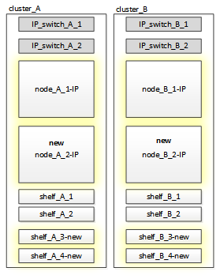

= Drive shelf reuse and drive requirements for disruptive FC-to-IP transition
:icons: font
:imagesdir: ../media/

[.lead]
You must ensure that adequate spare drives and root aggregate space is available on the storage shelves.

== Reusing the existing storage shelves

When using this procedure, the existing storage shelves are retained for use by the new configuration. When node_A_1-FC and node_B_1-FC are removed, the existing drive shelves are connected to node_A_1-IP and node_A_2-IP on cluster_A and to node_B_1-IP and node_B_2-IP on cluster_B.

* The existing storage shelves (those attached to node_A_1-FC and node_B_1-FC) must be supported by the new platform models.
+
If the existing shelves are not supported by the new platform models, see link:task_disruptively_transitioning_when_existing_shelves_are_not_supported_on_new_controllers.md#[Disruptively transitioning when existing shelves are not supported on new controllers (ONTAP 9.8 and later)].
+
https://hwu.netapp.com[NetApp Hardware Universe]

* You must ensure you don't exceed the platform limits for drives, etc.
+
HWU link

== Storage requirements for the additional controllers

Additional storage must be added, if necessary, to accommodate the two additional controllers (node_A_2-IP and node_B_2-ip), because the configuration is changing from a two-node to a four-node arrangement.

* Depending on the spare drives available in the existing shelves, additional drives must be added to accommodate the additional controllers in the configuration.
+
This might require additional storage shelves, as shown in the following illustration.
+

+
You need to have additional 14 - 18 drives each for the third and fourth controllers (node_A_2-IP and node_B_2-IP):

 ** Three pool0 drives
 ** Three pool1 drives
 ** Two spare drives
 ** Six to ten drives for the system volume

* You must ensure that the configuration, including the new nodes, does not exceed the platform limits for the configuration, including drive count, root aggregate size capacity, etc.
+
This information is available for each platform model at _NetApp Hardware Universe_.
+
https://hwu.netapp.com[NetApp Hardware Universe]
