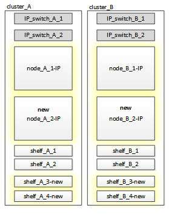
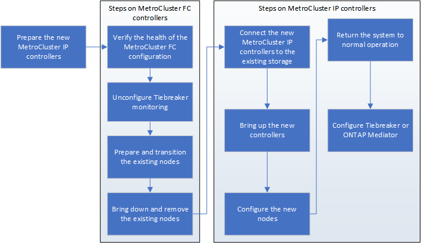

= Preparing for disruptive FC-to-IP transition
:icons: font
:imagesdir: ../media/

== General requirements for disruptive FC-to-IP transition

[.lead]
Before starting the transition process, you must make sure the configuration meets the requirements.

The existing MetroCluster FC configuration must meet the following requirements:

* It must be a two-node configuration and all nodes must be running ONTAP 9.8 or later.
+
It can be a two-node fabric-attached or stretched MetroCluster.

* It must meet all requirements and cabling as described in the _MetroCluster Installation and Configuration Guides_.
+
https://docs.netapp.com/ontap-9/topic/com.netapp.doc.dot-mcc-inst-cnfg-fabric/home.html[Fabric-attached MetroCluster installation and configuration]
+
https://docs.netapp.com/ontap-9/topic/com.netapp.doc.dot-mcc-inst-cnfg-stretch/home.html[Stretch MetroCluster installation and configuration]

* It cannot be configured with NetApp Storage Encryption (NSE).
* The MDV volumes cannot be encrypted.

You must have remote console access for all six nodes from either MetroCluster site or plan for travel between the sites as required by the procedure.

== Drive shelf reuse and drive requirements for disruptive FC-to-IP transition

[.lead]
You must ensure that adequate spare drives and root aggregate space is available on the storage shelves.

=== Reusing the existing storage shelves

When using this procedure, the existing storage shelves are retained for use by the new configuration. When node_A_1-FC and node_B_1-FC are removed, the existing drive shelves are connected to node_A_1-IP and node_A_2-IP on cluster_A and to node_B_1-IP and node_B_2-IP on cluster_B.

* The existing storage shelves (those attached to node_A_1-FC and node_B_1-FC) must be supported by the new platform models.
+
If the existing shelves are not supported by the new platform models, see link:task_disruptively_transitioning_when_existing_shelves_are_not_supported_on_new_controllers.md#[Disruptively transitioning when existing shelves are not supported on new controllers (ONTAP 9.8 and later)].
+
https://hwu.netapp.com[NetApp Hardware Universe]

* You must ensure you don't exceed the platform limits for drives, etc.
+
HWU link

=== Storage requirements for the additional controllers

Additional storage must be added, if necessary, to accommodate the two additional controllers (node_A_2-IP and node_B_2-ip), because the configuration is changing from a two-node to a four-node arrangement.

* Depending on the spare drives available in the existing shelves, additional drives must be added to accommodate the additional controllers in the configuration.
+
This might require additional storage shelves, as shown in the following illustration.
+

+
You need to have additional 14 - 18 drives each for the third and fourth controllers (node_A_2-IP and node_B_2-IP):

 ** Three pool0 drives
 ** Three pool1 drives
 ** Two spare drives
 ** Six to ten drives for the system volume

* You must ensure that the configuration, including the new nodes, does not exceed the platform limits for the configuration, including drive count, root aggregate size capacity, etc.
+
This information is available for each platform model at _NetApp Hardware Universe_.
+
https://hwu.netapp.com[NetApp Hardware Universe]

== Workflow for disruptive transition

[.lead]
You must follow the specific workflow to ensure a successful transition.

As you prepare for the transition, plan for travel between the sites. Note that after the remote nodes are racked and cabled, you need serial terminal access to the nodes. Service Processor access is not be available until the nodes are configured.

== Mapping ports from the MetroCluster FC nodes to the MetroCluster IP nodes

[.lead]
You must adjust the port and LIF configuration of the MetroCluster FC node so it is compatible with that of the MetroCluster IP node that will replace it.

When the new nodes are first booted during the upgrade process, each node uses the most recent configuration of the node it is replacing. When you boot node_A_1-IP, ONTAP attempts to host LIFs on the same ports that were used on node_A_1-FC.

During the transition procedure, you will perform steps on both the old and new nodes to ensure correct cluster, management, and data LIF configuration.

. Identify any conflicts between the existing MetroCluster FC port usage and the port usage for the MetroCluster IP interfaces on the new nodes.
+
You must identify the MetroCluster IP ports on the new MetroCluster IP controllers using the table below. Then check and record if any data LIFs or cluster LIFs exist on those ports on the MetroCluster FC nodes.
+
These conflicting data LIFs or cluster LIFs on the MetroCluster FC nodes will be moved at the appropriate step in the transition procedure.
+
NOTE: On the AFF A220 and FAS2750 systems, the MetroCluster IP physical ports are also used as cluster interfaces. If the new MetroCluster IP nodes are AFF A220 or FAS2750 systems, existing cluster LIFs do not need to be moved.
+
The following table shows the MetroCluster IP ports by platform model. You can ignore the VLAN ID column.
+
|===
| Platform model| MetroCluster IP port| VLAN ID|  
a|
AFF A800
a|
e0b
a|
Not used
a|
 
a|
e1b
a|
 
a|
AFF A700 and FAS9000
a|
e5a
a|
 
a|
e5b
a|
 
a|
AFF A320
a|
e0g
a|
 
a|
e0h
a|
 
a|
AFF A300 and FAS8200
a|
e1a
a|
 
a|
e1b
a|
 
a|
AFF A220 and FAS2750
a|
e0a
a|
10
a|
On these systems, these physical ports are also used as cluster interfaces.
a|
e0b
a|
20
a|
AFF A250 and FAS500f
a|
e0c
a|
10
a|
 
a|
e0d
a|
20
a|
 
|===
You can fill in the following table and refer to it later in the transition procedure.
+
|===
| Ports| Corresponding MetroCluster IP interface ports (from table above)| Conflicting LIFs on these ports on the MetroCluster FC nodes
a|
First MetroCluster IP port on node_A_1-FC
a|
 
a|
 
a|
Second MetroCluster IP port on node_A_1-FC
a|
 
a|
 
a|
First MetroCluster IP port on node_B_1-FC
a|
 
a|
 
a|
Second MetroCluster IP port on node_B_1-FC
a|
 
a|
 
|===

. Determine what physical ports are available on the new controllers and what LIFs can be hosted on the ports.
+
The controller's port usage depends on the platform model and IP switch model you will use in the MetroCluster IP configuration. You can gather the port usage of the new platforms from the _NetApp Hardware Universe_.
+
https://hwu.netapp.com[NetApp Hardware Universe]

. If desired, record the port information for node_A_1-FC and node_A_1-IP.
+
You will refer to the table as you carry out the transition procedure.
+
In the columns for node_A_1-IP, add the physical ports for the new controller module and plan the IPspaces and broadcast domains for the new node.
+
|===
|  | node_A_1-FC| node_A_1-IP
| LIF| Ports| IPspaces| Broadcast domains| Ports| IPspaces| Broadcast domains
a|
Cluster 1
a|
 
a|
 
a|
 
a|
 
a|
 
a|
 
a|
Cluster 2
a|
 
a|
 
a|
 
a|
 
a|
 
a|
 
a|
Cluster 3
a|
 
a|
 
a|
 
a|
 
a|
 
a|
 
a|
Cluster 4
a|
 
a|
 
a|
 
a|
 
a|
 
a|
 
a|
Node management
a|
 
a|
 
a|
 
a|
 
a|
 
a|
 
a|
Cluster management
a|
 
a|
 
a|
 
a|
 
a|
 
a|
 
a|
Data 1
a|
 
a|
 
a|
 
a|
 
a|
 
a|
 
a|
Data 2
a|
 
a|
 
a|
 
a|
 
a|
 
a|
 
a|
Data 3
a|
 
a|
 
a|
 
a|
 
a|
 
a|
 
a|
Data 4
a|
 
a|
 
a|
 
a|
 
a|
 
a|
 
a|
SAN
a|
 
a|
 
a|
 
a|
 
a|
 
a|
 
a|
Intercluster port
a|
 
a|
 
a|
 
a|
 
a|
 
a|
 
|===

. If desired, record all the port information for node_B_1-FC.
+
You will refer to the table as you carry out the upgrade procedure.
+
In the columns for node_B_1-IP, add the physical ports for the new controller module and plan the LIF port usage, IPspaces and broadcast domains for the new node.
+
|===
|  | node_B_1-FC| node_B_1-IP
| LIF| Physical ports| IPspaces| Broadcast domains| Physical ports| IPspaces| Broadcast domains
a|
Cluster 1
a|
 
a|
 
a|
 
a|
 
a|
 
a|
 
a|
Cluster 2
a|
 
a|
 
a|
 
a|
 
a|
 
a|
 
a|
Cluster 3
a|
 
a|
 
a|
 
a|
 
a|
 
a|
 
a|
Cluster 4
a|
 
a|
 
a|
 
a|
 
a|
 
a|
 
a|
Node management
a|
 
a|
 
a|
 
a|
 
a|
 
a|
 
a|
Cluster management
a|
 
a|
 
a|
 
a|
 
a|
 
a|
 
a|
Data 1
a|
 
a|
 
a|
 
a|
 
a|
 
a|
 
a|
Data 2
a|
 
a|
 
a|
 
a|
 
a|
 
a|
 
a|
Data 3
a|
 
a|
 
a|
 
a|
 
a|
 
a|
 
a|
Data 4
a|
 
a|
 
a|
 
a|
 
a|
 
a|
 
a|
SAN
a|
 
a|
 
a|
 
a|
 
a|
 
a|
 
a|
Intercluster port
a|
 
a|
 
a|
 
a|
 
a|
 
a|
 
|===

== Preparing the MetroCluster IP controllers

[.lead]
You must prepare the four new MetroCluster IP nodes and install the correct ONTAP version.

This task must be performed on each of the new nodes:

* node_A_1-IP
* node_A_2-IP
* node_B_1-IP
* node_B_2-IP

The nodes should be connected to any *new* storage shelves. They must *not* be connected to the existing storage shelves containing data.

These steps can be performed now, or later in the procedure when the controllers and shelves are racked. In any case, you must make sure you clear the configuration and prepare the nodes *before* connecting them to the existing storage shelves and *before* making any configuration changes to the MetroCluster FC nodes.

NOTE: Do not perform these steps with the MetroCluster IP controllers connected to the existing storage shelves that were connected to the MetroCluster FC controllers.

In these steps, you clear the configuration on the nodes and clear the mailbox region on new drives.

. Connect the controller modules to the new storage shelves.
. In Maintenance mode, display the HA state of the controller module and chassis: `ha-config show`
+
The HA state for all components should be mccip.

. If the displayed system state of the controller or chassis is not correct, set the HA state: `ha-config modify controller mccip``ha-config modify chassis mccip`
. Exit Maintenance mode: `halt`
+
After you run the command, wait until the node stops at the LOADER prompt.

. Repeat the following substeps on all four nodes to clear the configuration:
 .. Set the environmental variables to default values: `set-defaults`
 .. Save the environment: `saveenv``bye`
. Repeat the following substeps to boot all four nodes using the 9a option on the boot menu.
 .. At the LOADER prompt, launch the boot menu: `boot_ontap menu`
 .. At the boot menu, select option *9a* to reboot the controller.
. Boot each of the four nodes to Maintenance mode using option *5* on the boot menu.
. Record the system ID and from each of the four nodes: `sysconfig`
. Repeat the following steps on node_A_1-IP and node_B_1-IP.
 .. Assign ownership of all disks local to each site: `disk assign adapter.xx.*`
 .. Repeat the previous step for each HBA with attached drive shelves on node_A_1-IP and node_B_1-IP.
. Repeat the following steps on node_A_1-IP and node_B_1-IP to clear the mailbox region on each local disk.
 .. Destroy the mailbox region on each disk: `mailbox destroy local``mailbox destroy partner`
. Halt all four controllers: `halt`
. On each controller, display the boot menu: `boot_ontap menu`
. On each of the four controllers, clear the configuration: `wipeconfig`
+
When the wipeconfig operation completes, the node automatically returns to the boot menu.

. Repeat the following substeps to again boot all four nodes using the 9a option on the boot menu.
 .. At the LOADER prompt, launch the boot menu: `boot_ontap menu`
 .. At the boot menu, select option *9a* to reboot the controller.
 .. Let the controller module complete booting before moving to the next controller module.

+
After 9a completes, the nodes automatically return to the boot menu.
. Power off the controllers.

== Verifying the health of the MetroCluster FC configuration

[.lead]
You must verify the health and connectivity of the MetroCluster FC configuration prior to performing the transition

This task is performed on the MetroCluster FC configuration.

. Verify the operation of the MetroCluster configuration in ONTAP:
 .. Check whether the system is multipathed:``node run -node node-name sysconfig -a``
 .. Check for any health alerts on both clusters: `system health alert show`
 .. Confirm the MetroCluster configuration and that the operational mode is normal: `metrocluster show`
 .. Perform a MetroCluster check: `metrocluster check run`
 .. Display the results of the MetroCluster check: `metrocluster check show`
 .. Check for any health alerts on the switches (if present): `storage switch show`
 .. Run Config Advisor.
+
https://mysupport.netapp.com/site/tools/tool-eula/activeiq-configadvisor[NetApp Downloads: Config Advisor]

 .. After running Config Advisor, review the tool's output and follow the recommendations in the output to address any issues discovered.
. Verify that the nodes are in non-HA mode: `storage failover show`

== Removing the existing configuration from the Tiebreaker or other monitoring software

[.lead]
If the existing configuration is monitored with the MetroCluster Tiebreaker configuration or other third-party applications (for example, ClusterLion) that can initiate a switchover, you must remove the MetroCluster configuration from the Tiebreaker or other software prior to transition.

. Remove the existing MetroCluster configuration from the Tiebreaker software.
+
http://docs.netapp.com/ontap-9/topic/com.netapp.doc.hw-metrocluster-tiebreaker/GUID-34C97A45-0BFF-46DD-B104-2AB2805A983D.html[Removing MetroCluster configurations]

. Remove the existing MetroCluster configuration from any third-party application that can initiate switchover.
+
Refer to the documentation for the application.
