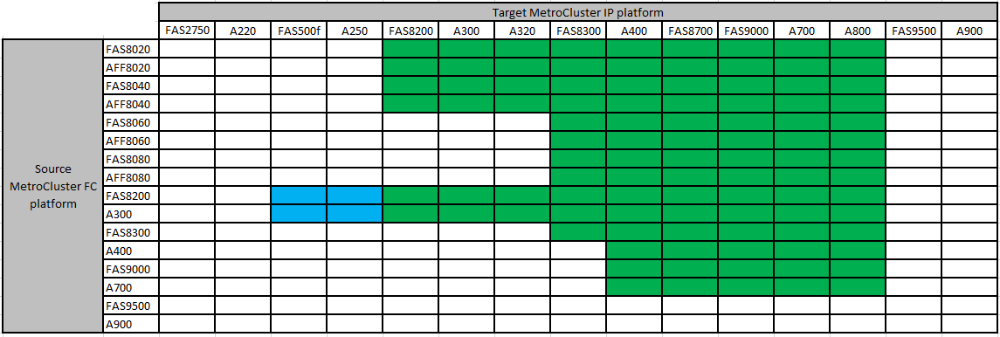

= Supported platforms for nondisruptive transition
:icons: font
:imagesdir: ../media/

[.lead]
When transitioning to a MetroCluster IP configuration, you must have a combination of supported platform models.
You should also ensure that the MetroCluster IP platform is an appropriate size for the load that you are transitioning from the MetroCluster FC configuration to the MetroCluster IP configuration.

The following table shows the supported platform combinations. You can transition from platforms in the left-hand column to platforms listed as supported in the columns to the right, as indicated by the colored table cells.

* A green cell shows that the combination is supported.
* A white (blank) cell indicates that the combination is unsupported.
* A blue cell shows that the combination is supported beginning with ONTAP 9.11.1.

For example, transitioning from a MetroCluster FC configuration consisting of AFF8060 controller modules to an IP configuration consisting of AFF A400 controller modules is supported.

== Transitions to a Cisco 9336C-FX2 shared switch configuration

Transitioning to a Cisco 9336C-FX2 shared switch configuration is not supported. A _shared switch configuration_ is one where the switches provide both the MetroCluster connections and the storage shelf connections.

Configurations in which the Cisco 9336C-FX2 switch provides only the MetroCluster connections are supported.
// ontap-metrocluster/issues/103 2021.11.21
