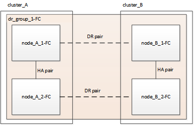
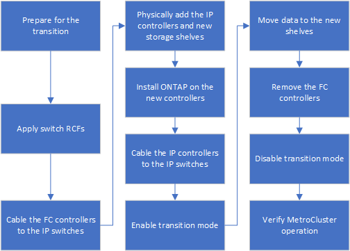

= Workflow for nondisruptive MetroCluster transition
:icons: font
:imagesdir: ../media/

[.lead]
You must follow the specific workflow to ensure a successful nondisruptive transition.

== Four-node FC configuration transition workflow

The transition process begins with a healthy four-node MetroCluster FC configuration.

The new MetroCluster IP nodes are added as a second DR group.

image::../media/transition_dr_groups_fc_and_ip.png[]

Data is transferred from the old DR group to the new DR group, and then the old nodes and their storage are removed from the configuration and decommissioned. The process ends with a four-node MetroCluster IP configuration.

== Eight-node FC configuration transition workflow

The transition process begins with a healthy eight-node MetroCluster FC configuration.

image::../media/mcc_dr_groups_8_node.gif[]

// change image
The new MetroCluster IP nodes are added a third DR group.

image::../media/transition_dr_groups_fc_and_ip.png[] 
//change image

Data is transferred from the old DR group to the new DR group, and then the old nodes and their storage are removed from the configuration and decommissioned. The process ends with an eight-node MetroCluster IP configuration.

image::../media/mcc_dr_groups_8_node.gif[]
// change image
== Transition process workflow

You will use the following workflow to transition the MetroCluster configuration.

