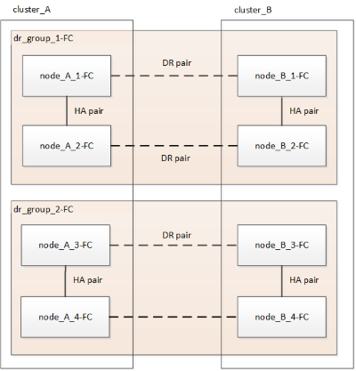
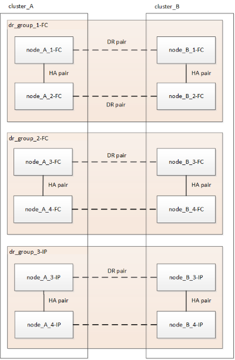
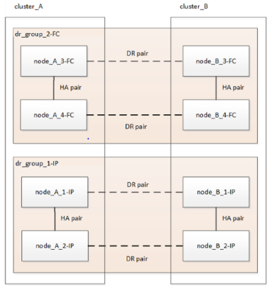
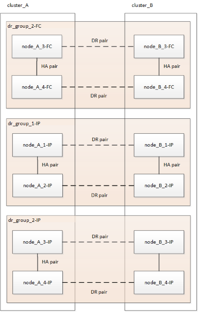
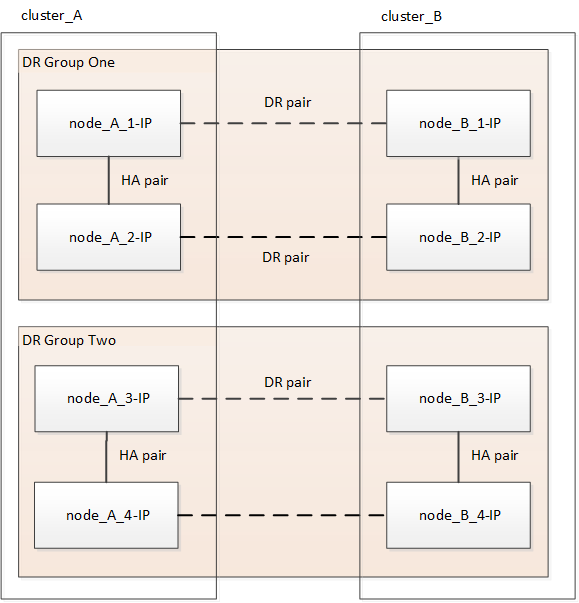

= Workflow for nondisruptive MetroCluster transition
:icons: font
:imagesdir: ../media/

[.lead]
You must follow the specific workflow to ensure a successful nondisruptive transition. Choose the workflow for your configuration:

*  <<Four-node FC configuration transition workflow>>
*  <<Eight-node FC configuration transition workflow>>

== Four-node FC configuration transition workflow

The transition process begins with a healthy four-node MetroCluster FC configuration.

image::../media/transition_dr_group_1_fc_nodes.png[]

The new MetroCluster IP nodes are added as a second DR group.

image::../media/transition_dr_groups_fc_and_ip.png[]

Data is transferred from the old DR group to the new DR group, and then the old nodes and their storage are removed from the configuration and decommissioned. The process ends with a four-node MetroCluster IP configuration.

image::../media/transition_dr_group_2_ip.png[]

== Eight-node FC configuration transition workflow

The transition process begins with a healthy eight-node MetroCluster FC configuration.

The new MetroCluster IP nodes are added as a third DR group.

Data is transferred from DR_group_1-FC to DR_group_1-IP, and then the old nodes and their storage are removed from the configuration and decommissioned. 

NOTE: If you want to transition an eight-node FC configuration to a four-node IP configuration, you must transition all of the data in DR_group_1-FC and DR_group_2-FC to the new IP DR group (DR_group_1-IP). You can then decommission both FC DR groups. After the FC DR groups have been removed, the process ends with a four-node MetroCluster IP configuration.

This process is repeated for DR_group_2-FC.

The process ends with an eight-node MetroCluster IP configuration.

 

== Transition process workflow

You will use the following workflow to transition the MetroCluster configuration.

image::../media/workflow_4n_transition_nondisruptive.png[]

// 2023 APR 17, BURT 1544621