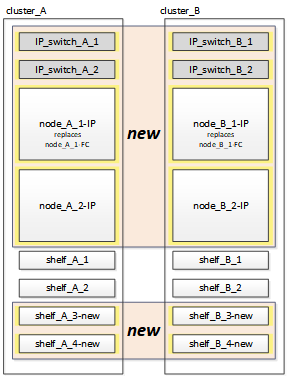
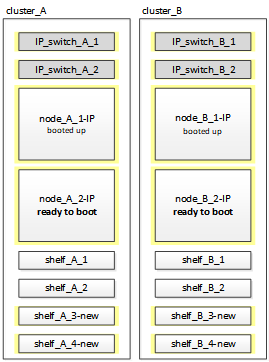

= Connecting the MetroCluster IP controller modules
:icons: font
:imagesdir: ../media/

[.lead]
You must add the four new controller modules and any additional storage shelves to the configuration. The new controller modules are added two-at-a-time.

== Setting up the new controllers

[.lead]
You must rack and cable the new MetroCluster IP controllers to the storage shelves previously connected to the MetroCluster FC controllers.

These steps must be performed on each of the MetroCluster IP nodes.

* node_A_1-IP
* node_A_2-IP
* node_B_1-IP
* node_B_2-IP

In the following example, two additional storage shelves are added at each site to provide storage to accommodate the new controller modules.

. Plan out the positioning of the new controller modules and storage shelves as needed.
+
The rack space depends on the platform model of the controller modules, the switch types, and the number of storage shelves in your configuration.

. Properly ground yourself.
. Rack the new equipment: controllers, storage shelves, and IP switches.
+
Do not cable the storage shelves or IP switches at this time.

. Connect the power cables and management console connection to the controllers.
. Verify that all storage shelves are powered off.
. Verify that no drives are connected by performing the following steps on all four nodes:
 .. At the LOADER prompt, launch the boot menu: `boot_ontap maint`
 .. Verify that no drives are connected: `disk show -v`
+
The output should show no drives.

 .. Halt the node: `halt`
. Boot all four nodes using the 9a option on the boot menu.
 .. At the LOADER prompt, launch the boot menu: `boot_ontap menu`
 .. At the boot menu, select option *9a* to reboot the controller.
 .. Let the controller module complete booting before moving to the next controller module.

+
After 9a completes, the nodes automatically return to the boot menu.
. Cable the storage shelves.
+
Refer to the controller installation and setup procedures for your model for cabling information.
+
https://docs.netapp.com/platstor/index.jsp[AFF and FAS Documentation Center]

. Cable the controllers to the IP switches as described in the _MetroCluster IP Installation and Configuration Guide_.
+
link:../install-ip/index.html[MetroCluster IP installation and configuration]

 ** link:../install-ip/task_install_and_cable_the_mcc_components.html#cabling-the-ip-switches[Cabling the IP switches]

. Prepare the IP switches for the application of the new RCF files.
+
Follow the steps in the section for your switch vendor from the _MetroCluster IP Installation and Configuration Guide_.
+
link:../install-ip/index.html[MetroCluster IP installation and configuration]

 ** link:../install-ip/task_install_and_cable_the_mcc_components.html#resetting-the-broadcom-ip-switch-to-factory-defaults[Resetting the Broadcom IP switch to factory defaults]
 ** link:../install-ip/task_install_and_cable_the_mcc_components.html#resetting-the-cisco-ip-switch-to-factory-defaults[Resetting the Cisco IP switch to factory defaults]

. Download and install the RCF files.
+
Follow the steps in the section for your switch vendor from the link:../install-ip/index.html[MetroCluster IP installation and configuration].

 ** link:../install-ip/task_install_and_cable_the_mcc_components.html#downloading-and-installing-the-broadcom-rcf-files[Downloading and installing the Broadcom RCF files]
 ** link:../install-ip/task_install_and_cable_the_mcc_components.html#downloading-and-installing-the-cisco-ip-rcf-files[Downloading and installing the Cisco IP RCF files]

. Turn on power to the first new controller (node_A_1-IP) and press Ctrl-C to interrupt the boot process and display the LOADER prompt.
. Boot the controller to Maintenance mode: `boot_ontap_maint`
. Display the system ID for the controller: `sysconfig -v`
. Confirm that the shelves from the existing configuration are visible from the new MetroCluster IP node: `storage show shelf``disk show -v`
. Halt the node: `halt`
. Repeat the preceding steps on the other node at the partner site (site_B).

== Connecting and booting up node_A_1-IP and node_B_1-IP

[.lead]
After connecting the MetroCluster IP controllers and IP switches, you transition and boot up node_A_1-IP and node_B_1-IP.

=== Bringing up node_A_1-IP

[.lead]
You must boot the node with the correct transition option.

. Boot node_A_1-IP to the boot menu: `boot_ontap menu`
. Issue the following command at the boot menu prompt to initiate transition: `boot_after_mcc_transition`
 ** This command reassigns all the disks owned by node_A_1-FC to node_A_1-IP.
  *** node_A_1-FC disks are assigned to node_A_1-IP
  *** node_B_1-FC disks are assigned to node_B_1-IP
 ** The command also automatically makes other required system ID reassignments so the MetroCluster IP nodes can boot to the ONTAP prompt.
 ** If the boot_after_mcc_transition command fails for any reason, it should be re-run from the boot menu.
*Note:*
 ** If the following prompt is displayed, enter Ctrl-C to continue. Checking MCC DR state... [enter Ctrl-C(resume), S(status), L(link)]_
 ** If the root volume was encrypted, the node halts with the following message. Halting the system, because root volume is encrypted (NetApp Volume Encryption) and the key import failed. If this cluster is configured with external (KMIP) key-manager, check the health of the key servers.

+
----

Please choose one of the following:
(1) Normal Boot.
(2) Boot without /etc/rc.
(3) Change password.
(4) Clean configuration and initialize all disks.
(5) Maintenance mode boot.
(6) Update flash from backup config.
(7) Install new software first.
(8) Reboot node.
(9) Configure Advanced Drive Partitioning. Selection (1-9)? `boot_after_mcc_transition`
This will replace all flash-based configuration with the last backup to disks. Are you sure you want to continue?: yes

MetroCluster Transition: Name of the MetroCluster FC node: `node_A_1-FC`
MetroCluster Transition: Please confirm if this is the correct value [yes|no]:? y
MetroCluster Transition: Disaster Recovery partner sysid of MetroCluster FC node node_A_1-FC: `systemID-of-node_B_1-FC`
MetroCluster Transition: Please confirm if this is the correct value [yes|no]:? y
MetroCluster Transition: Disaster Recovery partner sysid of local MetroCluster IP node: `systemID-of-node_B_1-IP`
MetroCluster Transition: Please confirm if this is the correct value [yes|no]:? y
----
. If data volumes are encrypted, restore the keys using the correct command for your key management configuration.
+
[options="header"]
|===
| If you are using...| Use this command...
a|
*Onboard key management*
a|
security key-manager onboard sync     For more information, see https://docs.netapp.com/ontap-9/topic/com.netapp.doc.pow-nve/GUID-E4AB2ED4-9227-4974-A311-13036EB43A3D.html[Restoring onboard key management encryption keys].
a|
*External key management*
a|
security key-manager key query -node node-name     For more information, see https://docs.netapp.com/ontap-9/topic/com.netapp.doc.pow-nve/GUID-32DA96C3-9B04-4401-92B8-EAF323C3C863.html[Restoring external key management encryption keys].
+
|===

. If the root volume is encrypted, use the procedure in link:../transition/task_connect_the_mcc_ip_controller_modules_2n_mcc_transition_supertask.html#recovering-key-management-if-the-root-volume-is-encrypted[Recovering key management if the root volume is encrypted].

=== Recovering key management if the root volume is encrypted

[.lead]
If the root volume is encrypted, you must use special boot commands to restore the key management.

You must have the passphrases gathered earlier.

. If onboard key management is used, perform the following substeps to restore the configuration.
 .. From the LOADER prompt, display the boot menu: `boot_ontap menu`
 .. Select option (10) Set onboard key management recovery secrets from the boot menu.
+
Respond as appropriate to the prompts:
+
----
This option must be used only in disaster recovery procedures. Are you sure? (y or n): `y`
Enter the passphrase for onboard key management: `passphrase`
Enter the passphrase again to confirm:`passphrase`

Enter the backup data:`backup-key`
----
+
The system boots to the boot menu.

 .. Enter option `6` at the boot menu.
+
Respond as appropriate to the prompts:
+
----
This will replace all flash-based configuration with the last backup to
disks. Are you sure you want to continue?: y

Following this, the system will reboot a few times and the following prompt will be available continue by saying y

WARNING: System ID mismatch. This usually occurs when replacing a boot device or NVRAM cards!
Override system ID? {y|n} y
----
+
After the reboots, the system will be at the LOADER prompt.

 .. From the LOADER prompt, display the boot menu: `boot_ontap menu`
 .. Again elect option (10) Set onboard key management recovery secrets from the boot menu.
+
Respond as appropriate to the prompts:
+
----
This option must be used only in disaster recovery procedures. Are you sure? (y or n): `y`
Enter the passphrase for onboard key management: `passphrase`
Enter the passphrase again to confirm:`passphrase`

Enter the backup data:`backup-key`
----
+
The system boots to the boot menu.

 .. Enter option `1` at the boot menu.
+
If the following prompt is displayed, you can enter Ctrl+C to resume the process._Checking MCC DR state... [enter Ctrl-C(resume), S(status), L(link)]_
+
The system boots to the ONTAP prompt.

 .. Restore the onboard key management: `security key-manager onboard sync`
+
Respond as appropriate to the prompts, using the passphrase you collected earlier:
+
----
cluster_A::> security key-manager onboard sync
Enter the cluster-wide passphrase for onboard key management in Vserver "cluster_A":: passphrase
----
. If external key management is used, perform the following substeps to restore the configuration.
 .. Set the required bootargs: `setenv bootarg.kmip.init.ipaddr ip-address``setenv bootarg.kmip.init.netmask netmask``setenv bootarg.kmip.init.gateway gateway-address``setenv bootarg.kmip.init.interface interface-id`
 .. From the LOADER prompt, display the boot menu: `boot_ontap menu`
 .. Select option (11) Configure node for external key management from the boot menu.
+
The system boots to the boot menu.

 .. Enter option `6` at the boot menu.
+
The system boots multiple times. You can respond affirmatively when prompted to continue the boot process.
+
After the reboots, the system will be at the LOADER prompt.

 .. Set the required bootargs: `setenv bootarg.kmip.init.ipaddr ip-address``setenv bootarg.kmip.init.netmask netmask``setenv bootarg.kmip.init.gateway gateway-address``setenv bootarg.kmip.init.interface interface-id`
 .. From the LOADER prompt, display the boot menu: `boot_ontap menu`
 .. Again select option (11) Configure node for external key management from the boot menu and respond to the prompts as required.
+
The system boots to the boot menu.

 .. Restore the external key management: `security key-manager external restore`

=== Creating the network configuration

[.lead]
You must create a network configuration that matches the configuration on the FC nodes. This is because the MetroCluster IP node replays the same configuration when it boots, which means that when node_A_1-IP and node_B_1-IP boot, ONTAP will try to host LIFs on the same ports that were used on node_A_1-FC and node_B_1-FC respectively.

As you create the network configuration, use the plan made in xref:concept_requirements_for_fc_to_ip_transition_2n_mcc_transition.adoc[Mapping ports from the MetroCluster FC nodes to the MetroCluster IP nodes] to assist you.

NOTE:

Additional configuration may be needed to bring up data LIFs after the MetroCluster IP nodes have been configured.

. Verify that all cluster ports are in the appropriate broadcast domain:
+
The cluster IPspace and cluster broadcast domain are required in order to create cluster LIFs

 .. View the IP spaces: `network ipspace show`
 .. Create IP spaces and assign cluster ports as needed.
+
http://docs.netapp.com/ontap-9/topic/com.netapp.doc.dot-cm-nmg/GUID-69120CF0-F188-434F-913E-33ACB8751A5D.html[Configuring IPspaces (cluster administrators only)]

 .. View the broadcast domains: `network port broadcast-domain show`
 .. Add any cluster ports to a broadcast domain as needed.
+
https://docs.netapp.com/ontap-9/topic/com.netapp.doc.dot-cm-nmg/GUID-003BDFCD-58A3-46C9-BF0C-BA1D1D1475F9.html[Adding or removing ports from a broadcast domain]

 .. Recreate VLANs and interface groups as needed.
+
VLAN and interface group membership might be different than that of the old node.
+
https://docs.netapp.com/ontap-9/topic/com.netapp.doc.dot-cm-nmg/GUID-8929FCE2-5888-4051-B8C0-E27CAF3F2A63.html[Creating a VLAN]
+
https://docs.netapp.com/ontap-9/topic/com.netapp.doc.dot-cm-nmg/GUID-DBC9DEE2-EAB7-430A-A773-4E3420EE2AA1.html[Combining physical ports to create interface groups]

. Verify that MTU settings are set correctly for the ports and broadcast domain and make changes using the following commands: `network port broadcast-domain show``network port broadcast-domain modify -broadcast- domain bcastdomainname -mtu mtu`

=== Setting up cluster ports and cluster LIFs

[.lead]
You must set up cluster ports and LIFs. The following steps need to be performed on the site A nodes which were booted up with root aggregates.

. Identify the list of LIFs using the desired Cluster port: `network interface show -curr-port portname``network interface show -home-port portname`
. For each cluster port, change the home port of any of the LIFs on that port to another port,
 .. Enter advanced privilege mode and enter y when prompted to continue: `set priv advanced`
 .. If the LIF being modified is a data LIF: `vserver config override -command "network interface modify -lif lifname -vserver vservername -home-port new-datahomeport`
 .. If the LIF is not a data LIF: `network interface modify -lif lifname -vserver vservername -home-port new-datahomeport`
 .. Revert the modified LIFs to their home port: `network interface revert * -vserver vserver_name`
 .. Verify that there are no LIFs on the cluster port: `network interface show -curr-port portname``network interface show -home-port portname`
 .. Remove the port from the current broadcast domain: `network port broadcast-domain remove-ports -ipspace ipspacename -broadcast-domain bcastdomainname -ports node_name:port_name`
 .. Add the port to the cluster IPspace and broadcast domain: `network port broadcast-domain add-ports -ipspace Cluster -broadcast-domain Cluster -ports node_name:port_name`
 .. Verify that the port's role has changed: `network port show`
 .. Repeat these substeps for each cluster port.
 .. Return to admin mode: `set priv admin`
. Create cluster LIFs on the new cluster ports:
 .. For autoconfiguration using link-local address for cluster LIF, use the following command: `network interface create -vserver Cluster -lif cluster_lifname -service-policy default-cluster -home-node a1name -home-port clusterport -auto true`
 .. To assign static IP address for the cluster LIF, use the following command: `network interface create -vserver Cluster -lif cluster_lifname -service-policy default-cluster -home-node a1name -home-port clusterport -address ip-address -netmask netmask -status-admin up`

=== Verifying LIF configuration

[.lead]
The node management LIF, cluster management LIF and intercluster LIF will still be present after the storage movement from the old controller. If necessary, you must move LIFs to appropriate ports.

. Verify if the management LIF and cluster management LIFs are on desired port already: `network interface show -service-policy default-management``network interface show -service-policy default-intercluster`
+
If the LIFs are on the desired ports, you can skip the rest of the steps in this task and proceed to the next task.

. For each node, cluster management, or intercluster LIFs are not on the desired port, change the home port of any of the LIFs on that port to another port,
 .. Repurpose the desired port by moving any LIFs hosted on desired port to another port using `vserver config override -command "network interface modify -lif <lifname> -vserver <vservername> -home-port <new-datahomeport>`
 .. Revert the modified LIFs to their new home port: `vserver config override -command "network interface revert -lif <lifname> -vserver <vservername>"`
 .. If the desired port is not in the right IPspace and broadcast domain, remove the port from the current IPspace and broadcast domain: `network port broadcast-domain remove-ports -ipspace <current-ipspace> -broadcast-domain <current-broadcast-domain> -ports <controller-name:current-port>`
 .. Move the desired port to the right IPspace and broadcast domain``network port broadcast-domain add-ports -ipspace <new-ipspace> -broadcast-domain <new-broadcast-domain> -ports <controller-name:new-port>``
 .. Verify that the port's role has changed: `network port show`
 .. Repeat these substeps for each port.
. Move node, cluster management LIFs and intercluster LIF to the desired port using the following commands:
 .. Change the LIF's home port: `network interface modify -vserver vserver -lif node_mgmt -home-port port -home-node homenode`
 .. Revert the LIF to its new home port: `network interface revert -lif node_mgmt -vserver vservername`
 .. Change the cluster management LIF's home port:``network interface modify -vserver vserver -lif cluster-mgmt-LIF-name -home-port port -home-node homenode``
 .. Revert the cluster management LIF to its new home port: `network interface revert -lif cluster-mgmt-LIF-name -vserver vservername`
 .. Change the intercluster LIF's home port:``network interface modify -vserver vserver -lif intercluster-lif-name -home-node nodename -home-port port``
 .. Revert the intercluster LIF to its new home port: `network interface revert -lifintercluster-lif-name -vserver vservername`

== Bringing up node_A_2-IP and node_B_2-IP

[.lead]
You must bring up and configure the new MetroCluster IP node at each site, creating an HA pair in each site.

=== Bringing up node_A_2-IP and node_B_2-IP

[.lead]
You must boot the new controller modules one at a time using the correct option at the boot menu.

In these steps, you boot up the two brand new nodes, expanding what had been a two-node configuration into a four-node configuration.

These steps are performed on the following nodes:

* node_A_2-IP
* node_B_2-IP

. Boot the new nodes using boot option `9c`.
+
----
Please choose one of the following:
(1) Normal Boot.
(2) Boot without /etc/rc.
(3) Change password.
(4) Clean configuration and initialize all disks.
(5) Maintenance mode boot.
(6) Update flash from backup config.
(7) Install new software first.
(8) Reboot node.
(9) Configure Advanced Drive Partitioning. Selection (1-9)? 9c
----
+
The node initializes and boots to the node setup wizard, similar to the following.
+
----
Welcome to node setup
You can enter the following commands at any time:
"help" or "?" - if you want to have a question clarified,
"back" - if you want to change previously answered questions, and
"exit" or "quit" - if you want to quit the setup wizard.
Any changes you made before quitting will be saved.
To accept a default or omit a question, do not enter a value. .
.
.
----
+
If option `9c` does not succeed, take the following steps to avoid possible data loss:

 ** Do not attempt to run option 9a.
 ** Physically disconnect the existing shelves that contain data from the original MetroCluster FC configuration (shelf_A_1, shelf_A_2, shelf_B_1, shelf_B_2).
 ** Contact technical support, referencing the KB article https://kb.netapp.com/Advice_and_Troubleshooting/Data_Protection_and_Security/MetroCluster/MetroCluster_FC_to_IP_transition_-_Option_9c_Failing[MetroCluster FC to IP transition - Option 9c Failing].
+
https://mysupport.netapp.com/site/global/dashboard[NetApp Support]

. Enable the AutoSupport tool by following the directions provided by the wizard.
. Respond to the prompts to configure the node management interface.
+
----
Enter the node management interface port: [e0M]:
Enter the node management interface IP address: 10.228.160.229
Enter the node management interface netmask: 225.225.252.0
Enter the node management interface default gateway: 10.228.160.1
----

. Verify that the storage failover mode is set to HA: `storage failover show -fields mode`
+
If the mode is not HA, set it: `storage failover modify -mode ha -node localhost`
+
You must then reboot the node for the change to take effect.

. List the ports in the cluster:``network port show``
+
For complete command syntax, see the man page.
+
The following example shows the network ports in cluster01:
+
----

cluster01::> network port show
                                                             Speed (Mbps)
Node   Port      IPspace      Broadcast Domain Link   MTU    Admin/Oper
------ --------- ------------ ---------------- ----- ------- ------------
cluster01-01
       e0a       Cluster      Cluster          up     1500   auto/1000
       e0b       Cluster      Cluster          up     1500   auto/1000
       e0c       Default      Default          up     1500   auto/1000
       e0d       Default      Default          up     1500   auto/1000
       e0e       Default      Default          up     1500   auto/1000
       e0f       Default      Default          up     1500   auto/1000
cluster01-02
       e0a       Cluster      Cluster          up     1500   auto/1000
       e0b       Cluster      Cluster          up     1500   auto/1000
       e0c       Default      Default          up     1500   auto/1000
       e0d       Default      Default          up     1500   auto/1000
       e0e       Default      Default          up     1500   auto/1000
       e0f       Default      Default          up     1500   auto/1000
----

. Exit the Node Setup wizard: `exit`
. Log into the admin account using the admin user name.
. Join the existing cluster using the Cluster Setup wizard.
+
----
:> cluster setup
Welcome to the cluster setup wizard.
You can enter the following commands at any time:
"help" or "?" - if you want to have a question clarified,
"back" - if you want to change previously answered questions, and "exit" or "quit" - if you want to quit the cluster setup wizard.
Any changes you made before quitting will be saved.
You can return to cluster setup at any time by typing "cluster setup". To accept a default or omit a question, do not enter a value.
Do you want to create a new cluster or join an existing cluster?
{create, join}:
join
----

. After you complete the Cluster Setup wizard and it exits, verify that the cluster is active and the node is healthy: `cluster show`
. Disable disk autoassignment: `storage disk option modify -autoassign off -node node_A_2-IP`
. If encryption is used, restore the keys using the correct command for your key management configuration.
+
[options="header"]
|===
| If you are using...| Use this command...
a|
*Onboard key management*
a|
security key-manager onboard sync     For more information, see https://docs.netapp.com/ontap-9/topic/com.netapp.doc.pow-nve/GUID-E4AB2ED4-9227-4974-A311-13036EB43A3D.html[Restoring onboard key management encryption keys].
a|
*External key management*
a|
security key-manager key query -node node-name     For more information, see https://docs.netapp.com/ontap-9/topic/com.netapp.doc.pow-nve/GUID-32DA96C3-9B04-4401-92B8-EAF323C3C863.html[Restoring external key management encryption keys].
+
|===

. Repeat the above steps on the second new controller module (node_B_2-IP).

=== Verifying MTU settings

[.lead]
Verify that MTU settings are set correctly for the ports and broadcast domain and make changes using the following commands

. Check the MTU size used in the cluster broadcast domain: `network port broadcast-domain show`
. If necessary, update the MTU size as needed: `network port broadcast-domain modify -broadcast-domain bcast-domain=name-mtu mtu-size`

=== Configuring intercluster LIFs

[.lead]
Configure the intercluster LIFs required for cluster peering.

This task must be performed on both of the new nodes, node_A_2-IP and node_B_2-IP.

. Configure the intercluster LIFs using the procedures in the _MetroCluster IP Installation and Configuration Guide_.
+
link:../install-ip/concept_configure_the_mcc_software_in_ontap.html#configuring-intercluster-lifs-for-cluster-peering[Configuring intercluster LIFs]

=== Verifying cluster peering

[.lead]
Verify that cluster_A and cluster_B are peered and nodes on each cluster can communicate with each other.

. Verify the cluster peering relationship: `cluster peer health show`
+
----
cluster01::> cluster peer health show
Node       cluster-Name                Node-Name
             Ping-Status               RDB-Health Cluster-Health  Avail…
---------- --------------------------- ---------  --------------- --------
node_A_1-IP
           cluster_B                   node_B_1-IP
             Data: interface_reachable
             ICMP: interface_reachable true       true            true
                                       node_B_2-IP
             Data: interface_reachable
             ICMP: interface_reachable true       true            true
node_A_2-IP
           cluster_B                   node_B_1-IP
             Data: interface_reachable
             ICMP: interface_reachable true       true            true
                                       node_B_2-IP
             Data: interface_reachable
             ICMP: interface_reachable true       true            true
----

. Ping to check that the peer addresses are reachable: `cluster peer ping -originating-node local-node -destination-cluster remote-cluster-name`
