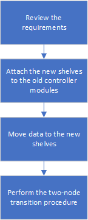
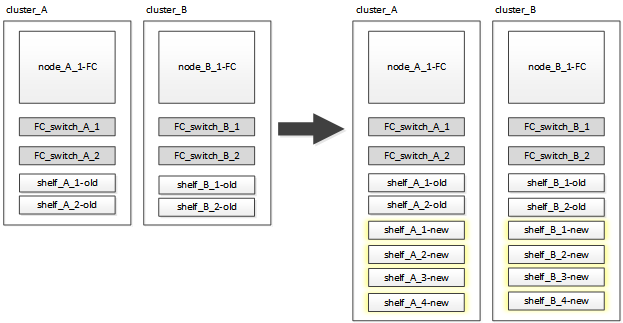

= Disruptively transitioning when existing shelves are not supported on new controllers (ONTAP 9.8 and later)
:icons: font
:imagesdir: ../media/

[.lead]
Starting with ONTAP 9.8, you can disruptively transition a two-node MetroCluster FC configuration and move data from the existing drive shelves even if the existing storage shelves are not supported by the new MetroCluster IP nodes.

* This procedure should only be used if the existing storage shelf models are not supported by the new MetroCluster IP platform models.
* This procedure is supported on systems running ONTAP 9.8 and later.
* This procedure is disruptive.
* This procedure applies only to a two-node MetroCluster FC configuration.
+
If you have a four-node MetroCluster FC configuration, see xref:concept_choosing_your_transition_procedure_mcc_transition.adoc[Choosing your transition procedure].

* You must meet all requirements and follow all steps in the procedure.

== Requirements for transition when shelves are not supported on the new nodes

[.lead]
Before starting the transition process, you must make sure the configuration meets the requirements.

* The existing configuration must be a two-node fabric-attached or stretch MetroCluster configuration and all nodes must be running ONTAP 9.8 or later.
+
The new MetroCluster IP controller modules should be running the same version of ONTAP 9.8.

* The existing and new platforms must be a supported combination for transition.
+
xref:concept_supported_platforms_for_transition.adoc[Supported platforms for nondisruptive transition]

* It must meet all requirements and cabling as described in the _MetroCluster Installation and Configuration Guides_.
+
link:../install-fc/index.html[Fabric-attached MetroCluster installation and configuration]

* New storage shelves provided with the new controllers (node_A_1-IP, node_A_2-IP, node_B_1-IP and node_B_2-IP) must be supported by the old controllers (node_A_1-FC and node_B_1-FC).
+
https://hwu.netapp.com[NetApp Hardware Universe]

* The old storage shelves are *not* supported by the new MetroCluster IP platform models.
+
https://hwu.netapp.com[NetApp Hardware Universe]

* Depending on the spare disks available in the existing shelves, additional drives must be added.
+
This might require additional drive shelves.
+
You need to have additional 14 to 18 drives for each controller:

 ** Three pool0 drives
 ** Three pool1 drives
 ** Two spare drives
 ** Six to ten drives for the system volume

* You must ensure that the configuration, including the new nodes, does not exceed the platform limits for the configuration, including drive count, root aggregate size capacity, etc.
+
This information is available for each platform model at _NetApp Hardware Universe_.
+
https://hwu.netapp.com[NetApp Hardware Universe]

* You must have remote console access for all six nodes from either MetroCluster site or plan for travel between the sites as required by the procedure.

== Workflow for disruptive transition when shelves are not supported by new controllers

[.lead]
If the existing shelf models are not supported by the new platform models, you must attach the new shelves to the old configuration, move data onto the new shelves, and then transition to the new configuration.

As you prepare for the transition, plan for travel between the sites. Note that after the remote nodes are racked and cabled, you need serial terminal access to the nodes. Service Processor access is not be available until the nodes are configured.

== Preparing the new controller modules

[.lead]
You must clear the configuration and disk ownership on the new controller modules and the new storage shelves.

. With the new storage shelves attached to the new MetroCluster IP controller modules, perform all the steps in the secontion link:../transition/concept_requirements_for_fc_to_ip_transition_2n_mcc_transition.html#preparing-the-metrocluster-ip-controllers[Preparing the MetroCluster IP controllers].
. Disconnect the new storage shelves from the new MetroCluster IP controller modules.

== Attaching the new disk shelves to the existing MetroCluster FC controllers

[.lead]
You must attach the new drive shelves to the existing controller modules before transitioning to a MetroCluster IP configuration.

The following illustration shows the new shelves attached to the MetroCluster FC configuration.

. Disable disk autoassignment on node_A_1-FC and node_A_2-FC: `disk option modify -node node-name -autoassign off`
+
This command must be issued on each node.
+
Disk auto-assign is disabled to avoid assignment of the shelves to be added to node_A_1-FC and node_B_1-FC. As part the transition, disks are needed for nodes node_A_1-IP and node_B_2-IP and if autoassign is allowed, disk ownership would later need to be removed before disks could be assigned to node_A_1-IP and node_B_2-IP.

. Attach the new shelves to the existing MetroCluster FC nodes, using FC-to-SAS bridges, if necessary.
+
See the requirements and procedures in the described in the _MetroCluster Service Guide_.
+
link:../maintain/task_hot_add_storage_to_a_mcc_fc_configuration_container_topic.html[Hot-adding storage to a MetroCluster FC configuration]

== Migrate root aggregates and move data to the new disk shelves

[.lead]
You must move the root aggregates from the old drive shelves to the new drive shelves that will be used by the MetroCluster IP nodes.

This task is performed prior to the transition on the existing nodes (node_A_1-FC and node_B_1-FC).

. Perform a negotiated switchover from controller node_B_1-FC: `metrocluster switchover`
. Perform the heal aggregates and heal root steps of the recovery from node_B_1-FC: `metrocluster heal -phase aggregates``metrocluster heal -phase root-aggregates`
. Boot controller node_A_1-FC: `boot_ontap`
. Assign the unowned disks on the new shelves to the appropriate pools for controller node_A_1-FC:
 .. Identify the disks on the shelves: `disk show -shelf pool_0_shelf -fields container-type,diskpathnames``disk show -shelf pool_1_shelf -fields container-type,diskpathnames`
 .. Enter local mode so the commands are run on the local node: `run local`
 .. Assign the disks: `disk assign disk1disk2disk3disk… -p 0``disk assign disk4disk5disk6disk… -p 1`
 .. Exit local mode: `exit`
. Create a new mirrored aggregate to become the new root aggregate for controller node_A_1-FC:
 .. Set the privilege mode to advanced: `set priv advanced`
 .. Create the aggregate: `aggregate create -aggregate new_aggr -disklist disk1, disk2, disk3,… -mirror-disklist disk4disk5, disk6,… -raidtypesame-as-existing-root -force-small-aggregate true aggr show -aggregate new_aggr -fields percent-snapshot-space`
+
If the percent-snapshot-space value is less than 5 percent, you must increase it to a value higher than 5 percent: `aggr modify new_aggr -percent-snapshot-space 5`

 .. Set the privilege mode back to admin: `set priv admin`
. Confirm that the new aggregate is created properly: `node run -node local sysconfig -r`
. Create the node and cluster-level configuration backups:
+
NOTE: When the backups are created during switchover, the cluster is aware of the switched over state on recovery. You must ensure that the backup and upload of the system configuration is successful as without this backup it is *not* possible to reform the MetroCluster configuration between clusters.

 .. Create the cluster backup: `system configuration backup create -node local -backup-type cluster -backup-name cluster-backup-name`
 .. Check cluster backup creation `job show -id job-idstatus`
 .. Create the node backup: `system configuration backup create -node local -backup-type node -backup-name node-backup-name`
 .. Check for both cluster and node backups: `system configuration backup show`
+
You can repeat the command until both backups are shown in the output.

. Make copies of the backups.
+
The backups must be stored at a separate location because they will be lost locally when the new root volume is booted.
+
You can upload the backups to an FTP or HTTP server, or copy the backups using scp commands.
+
[options="header"]
|===
| Method|
a|
*Upload the backup to the FTP or HTTP server*
a|

 .. Upload the cluster backup: `system configuration backup upload -node local -backup cluster-backup-name -destination URL`
 .. Upload the node backup: `system configuration backup upload -node local -backup node-backup-name -destination URL`

a|
*Copy the backups onto a remote server using secure copy*
a|
    From the remote server use the following scp commands:

 .. Copy the cluster backup: `scp diagnode-mgmt-FC:/mroot/etc/backups/config/cluster-backup-name.7z .`
 .. Copy the node backup: `scp diag@node-mgmt-FC:/mroot/etc/backups/config/node-backup-name.7z .`

+
|===

. Halt node_A_1-FC: `halt -node local -ignore-quorum-warnings true`
. Boot node_A_1-FC to Maintenance mode: `boot_ontap maint`
. From Maintenance mode, make required changes to set the aggregate as root:
 .. Set the HA policy to cfo: `aggr options new_aggr ha_policy cfo`
+
Respond `yes` when prompted to proceed.
+
----
Are you sure you want to proceed (y/n)?
----

 .. Set the new aggregate as root: `aggr options new_aggr root`
 .. Halt to the LOADER prompt: `halt`
. Boot the controller and back up the system configuration.
+
The node boots in recovery mode when the new root volume is detected

 .. Boot the controller: `boot_ontap`
 .. Log in and back up the configuration.
+
When you log in, you will see the following warning:
+
----
Warning: The correct cluster system configuration backup must be restored. If a backup
from another cluster or another system state is used then the root volume will need to be
recreated and NGS engaged for recovery assistance.
----

 .. Enter advanced privilege mode: `set -privilege advanced`
 .. Back up the cluster configuration to a server: `system configuration backup download -node local -source URL of server/cluster-backup-name.7z`
 .. Back up the node configuration to a server: `system configuration backup download -node local -source URL of server/node-backup-name.7z`
 .. Return to admin mode: `set -privilege admin`

. Check the health of the cluster:
 .. Issue the following command: `cluster show`
 .. Set the privilege mode to advanced: `set -privilege advanced`
 .. Verify the cluster configuration details: `cluster ring show`
 .. Return to the admin privilege level: `set -privilege admin`
. Confirm the operational mode of the MetroCluster configuration and perform a MetroCluster check.
 .. Confirm the MetroCluster configuration and that the operational mode is normal: `metrocluster show`
 .. Confirm that all expected nodes are shown: `metrocluster node show`
 .. Issue the following command: `metrocluster check run`
 .. Display the results of the MetroCluster check: `metrocluster check show`
. Perform a switchback from controller node_B_1-FC: `metrocluster switchback`
. Verify the operation of the MetroCluster configuration:
 .. Confirm the MetroCluster configuration and that the operational mode is normal: `metrocluster show`
 .. Perform a MetroCluster check: `metrocluster check run`
 .. Display the results of the MetroCluster check: `metrocluster check show`
. Add the new root volume to the Volume Location Database.
 .. Set the privilege mode to advanced: `set -privilege advanced`
 .. Add the volume to the node: `volume add-other-volumes –node node_A_1-FC`
 .. Return to the admin privilege level: `set -privilege admin`
. Check that the volume is now visible and has mroot.
 .. Display the aggregates: `storage aggregate show`
 .. Verify that the root volume has mroot: `storage aggregate show -fields has-mroot`
 .. Display the volumes: `volume show`
. Create a new security certificate to re-enable access to System Manager: `security certificate create -common-name name -type server -size 2048`
. Repeat the previous steps to migrate the aggregates on shelves owned by node_A_1-FC.
. Perform a cleanup.
+
You must perform the following steps on both node_A_1-FC and node_B_1-FC to remove the old root volume and root aggregate.

 .. Delete the old root volume: `run local``vol offline old_vol0``vol destroy old_vol0``exit``volume remove-other-volume -vserver node_name -volume old_vol0`
 .. Delete the original root aggregate: `aggr offline -aggregate old_aggr0_site``aggr delete -aggregate old_aggr0_site`

. Migrate the data volumes to aggregates on the new controllers, one volume at a time.
+
Use the following section of the _Controller Upgrade Express Guide_.
+
http://docs.netapp.com/platstor/topic/com.netapp.doc.hw-upgrade-controller/GUID-AFE432F6-60AD-4A79-86C0-C7D12957FA63.html[Creating an aggregate and moving volumes to the new nodes]

. Retire the old shelves by performing all the steps in the section xref:task_disruptively_transition_while_move_volumes_from_old_shelves_to_new_shelves.adoc[Retiring shelves moved from node_A_1-FC and node_A_2-FC].

== Transitioning the configuration

[.lead]
You must follow the detailed transition procedure.

In the following steps you are directed to other sections in this guide. You must perform the steps in each referenced section in the order given.

. Plan port mapping.
+
Perform all the steps in the section link:../transition/concept_requirements_for_fc_to_ip_transition_2n_mcc_transition.html#mapping-ports-from-the-metrocluster-fc-nodes-to-the-metrocluster-ip-nodes[Mapping ports from the MetroCluster FC nodes to the MetroCluster IP nodes].

. Prepare the MetroCluster IP controllers.
+
Perform all the steps in the section link:../transition/concept_requirements_for_fc_to_ip_transition_2n_mcc_transition.html#preparing-the-metrocluster-ip-controllers[Preparing the MetroCluster IP controllers].

. Verify the health of the MetroCluster configuration.
+
Perform all the steps in the section link:../transition/concept_requirements_for_fc_to_ip_transition_2n_mcc_transition.html#verifying-the-health-of-the-metrocluster-fc-configuration[Verifying the health of the MetroCluster FC configuration]

. Prepare and remove the existing MetroCluster FC nodes.
+
Perform all the steps in the section link:../transition/task_transition_the_mcc_fc_nodes_2n_mcc_transition_supertask.html[Transitioning the MetroCluster FC nodes].

. Add the new MetroCluster IP nodes.
+
Perform all the steps in the section xref:task_connect_the_mcc_ip_controller_modules_2n_mcc_transition_supertask.adoc[Connecting the MetroCluster IP controller modules].

. Complete the transition and initial configuration of the new MetroCluster IP nodes.
+
Perform all the steps in the section xref:task_configure_the_new_nodes_and_complete_transition.doc[Configuring the new nodes and completing transition].
