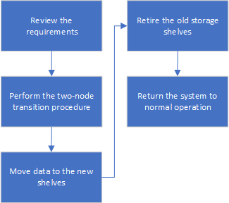

= Disruptively transitioning from MetroCluster FC to MetroCluster IP when retiring storage shelves (ONTAP 9.8 and later)
:icons: font
:imagesdir: ../media/

[.lead]
Beginning with ONTAP 9.8, you can disruptively transition a two-node MetroCluster FC configuration to a four-node MetroCluster IP configuration and retire the existing storage shelves. The procedure includes steps to move data from the existing drive shelves to the new configuration, and then retire the old shelves.

* This procedure is used when you plan to retire the existing storage shelves and move all data to the new shelves in the MetroCluster IP configuration.
* The existing storage shelf models must be supported by the new MetroCluster IP nodes.
* This procedure is supported on systems running ONTAP 9.8 and later.
* This procedure is disruptive.
* This procedure applies only to a two-node MetroCluster FC configuration.
+
If you have a four-node MetroCluster FC configuration, see link:concept_choosing_your_transition_procedure_mcc_transition.html[Choosing your transition procedure].

* You must meet all requirements and follow all steps in the procedure.

== Enable console logging 

include::../_include/console-logging.adoc[] 
== Requirements for transition when retiring old shelves

Before starting the transition process, you must make sure the existing MetroCluster FC configuration meets the requirements.

* It must be a two-node fabric-attached or stretch MetroCluster configuration and all nodes must be running ONTAP 9.8 or later.
+
The new MetroCluster IP controller modules should be running the same version of ONTAP 9.8.

* The existing and new platforms must be a supported combination for transition.
+
link:concept_supported_platforms_for_transition.html[Supported platforms for nondisruptive transition]

* It must meet all requirements and cabling as described in the _MetroCluster Installation and Configuration Guides_.
+
link:../install-fc/index.html[Fabric-attached MetroCluster installation and configuration]

The new configuration must also meet the following requirements:

* The new MetroCluster IP platform models must support the old storage shelf models.
+
https://hwu.netapp.com[NetApp Hardware Universe^]

* Depending on the spare disks available in the existing shelves, additional drives must be added.
+
This might require additional drive shelves.
+
You need to have additional 14 to 18 drives for each controller:

 ** Three pool 0 drives
 ** Three pool 1 drives
 ** Two spare drives
 ** Six to ten drives for the system volume

* You must ensure that the configuration, including the new nodes, does not exceed the platform limits for the configuration, including drive count, root aggregate size capacity, etc.
+
This information is available for each platform model at https://hwu.netapp.com[NetApp Hardware Universe^]

You must have remote console access for all six nodes from either MetroCluster site or plan for travel between the sites as required by the procedure.

== Workflow for disruptive transition when moving data and retiring old storage shelves

You must follow the specific workflow to ensure a successful transition.

As you prepare for the transition, plan for travel between the sites. Note that after the remote nodes are racked and cabled, you need serial terminal access to the nodes. Service Processor access is not be available until the nodes are configured.

== Transitioning the configuration

You must follow the detailed transition procedure.

.About this task

In the following steps you are directed to other procedures. You must perform the steps in each referenced procedure in the order given.

.Steps

. Plan port mapping using the steps in link:../transition/concept_requirements_for_fc_to_ip_transition_2n_mcc_transition.html#mapping-ports-from-the-metrocluster-fc-nodes-to-the-metrocluster-ip-nodes[Mapping ports from the MetroCluster FC nodes to the MetroCluster IP nodes].
. Prepare the MetroCluster IP controllers using the steps in link:../transition/concept_requirements_for_fc_to_ip_transition_2n_mcc_transition.html#preparing-the-metrocluster-ip-controllers[Preparing the MetroCluster IP controllers].
. Verify the health of the MetroCluster FC configuration.
+
Perform the steps in link:../transition/concept_requirements_for_fc_to_ip_transition_2n_mcc_transition.html#verifying-the-health-of-the-metrocluster-fc-configuration[Verifying the health of the MetroCluster FC configuration].

. Gather information from the MetroCluster FC configuration.
+
Perform the steps in link:task_transition_the_mcc_fc_nodes_2n_mcc_transition_supertask.html#gathering-information-from-the-existing-controller-modules-before-the-transition[Gathering information from the existing controller modules before the transition].

. Remove Tiebreaker monitoring, if necessary.
+
Perform the steps in  link:../transition/concept_requirements_for_fc_to_ip_transition_2n_mcc_transition.html#verifying-the-health-of-the-metrocluster-fc-configuration[Removing the existing configuration from the Tiebreaker or other monitoring software].

. Prepare and remove the existing MetroCluster FC nodes.
+
Perform the steps in link:task_transition_the_mcc_fc_nodes_2n_mcc_transition_supertask.html[Transitioning the MetroCluster FC nodes].

. Connect the new MetroCluster IP nodes.
+
Perform the steps in  link:task_connect_the_mcc_ip_controller_modules_2n_mcc_transition_supertask.html[Connecting the MetroCluster IP controller modules].

. Configure the new MetroCluster IP nodes and complete transition.
+
Perform the steps in  link:task_configure_the_new_nodes_and_complete_transition.html[Configuring the new nodes and completing transition].

== Migrating the root aggregates

After the transition is complete, migrate the existing root aggregates leftover from the MetroCluster FC configuration to new shelves in the MetroCluster IP configuration.

.About this task
This task moves the root aggregates for node_A_1-FC and node_B_1-FC to disk shelves owned by the new MetroCluster IP controllers:

.Steps

. Assign pool 0 disks on the new local storage shelf to the controller that has the root being migrated (e.g., if the root of node_A_1-FC is being migrated, assign pool 0 disks on the new shelf to node_A_1-IP)
+
Note that the migration _removes and does not re-create the root mirror_, so pool 1 disks do not need to be assigned before issuing the migrate command

. Set the privilege mode to advanced:
+
`set priv advanced`
. Migrate the root aggregate:
+
`system node migrate-root -node node-name -disklist disk-id1,disk-id2,diskn -raid-type raid-type`
+
** The node-name is the node to which the root aggregate is being migrated.
** The disk-id identifies the pool 0 disks on the new shelf.
** The raid-type is normally the same as the raid-type of the existing root aggregate.
** You can use the command `job show -idjob-id-instance` to check the migration status, where job-id is the value provided when the migrate-root command is issued.
+
For example, if the root aggregate for node_A_1-FC consisted of three disks with raid_dp, the following command would be used to migrate root to a new shelf 11:
+
----
system node migrate-root -node node_A_1-IP -disklist 3.11.0,3.11.1,3.11.2 -raid-type raid_dp
----
. Wait until the migration operation completes and the node automatically reboots.
. Assign pool 1 disks for the root aggregate on a new shelf directly connected to the remote cluster.
. Mirror the migrated root aggregate.
. Wait for the root aggregate to complete resynchronising.
+
You can use the storage aggregate show command to check the sync status of the aggregates.

. Repeat these steps for the other root aggregate.

== Migrating the data aggregates

Create data aggregates on the new shelves and use volume move to transfer the data volumes from the old shelves to the aggregates on the new shelves.

. Move the data volumes to aggregates on the new controllers, one volume at a time.
+
http://docs.netapp.com/platstor/topic/com.netapp.doc.hw-upgrade-controller/GUID-AFE432F6-60AD-4A79-86C0-C7D12957FA63.html[Creating an aggregate and moving volumes to the new nodes^]

== Retiring shelves moved from node_A_1-FC and node_A_2-FC

You retire the old storage shelves from the original MetroCluster FC configuration. These shelves were originally owned by node_A_1-FC and node_A_2-FC.

. Identify the aggregates on the old shelves on cluster_B that need to be deleted.
+
In this example the following data aggregates are hosted by the MetroCluster FC cluster_B and need to be deleted: aggr_data_a1 and aggr_data_a2.
+
NOTE: You need to perform the steps to identify, offline and delete the data aggregates on the shelves. The example is for one cluster only.
+

----
cluster_B::> aggr show

Aggregate     Size Available Used% State   #Vols  Nodes            RAID Status
--------- -------- --------- ----- ------- ------ ---------------- ------------
aggr0_node_A_1-FC
           349.0GB   16.83GB   95% online       1 node_A_1-IP      raid_dp,
                                                                   mirrored,
                                                                   normal
aggr0_node_A_2-IP
           349.0GB   16.83GB   95% online       1 node_A_2-IP      raid_dp,
                                                                   mirrored,
                                                                   normal
...
8 entries were displayed.

cluster_B::>
----

. Check if the data aggregates have any MDV_aud volumes, and delete them prior to deleting the aggregates.
+
You must delete the MDV_aud volumes as they cannot be moved.

. Take each of the aggregates offline, and then delete them:
.. Take the aggregate offline:
+
`storage aggregate offline -aggregate aggregate-name`
+
The following example shows the aggregate node_B_1_aggr0 being taken offline:
+
----
cluster_B::> storage aggregate offline -aggregate node_B_1_aggr0

Aggregate offline successful on aggregate: node_B_1_aggr0
----

.. Delete the aggregate:
+
`storage aggregate delete -aggregate aggregate-name`
+
You can destroy the plex when prompted.
+
The following example shows the aggregate node_B_1_aggr0 being deleted.
+
----
cluster_B::> storage aggregate delete -aggregate node_B_1_aggr0
Warning: Are you sure you want to destroy aggregate "node_B_1_aggr0"? {y|n}: y
[Job 123] Job succeeded: DONE

cluster_B::>
----
. After deleting all aggregates, power down, disconnect, and remove the shelves.
. Repeat the above steps to retire the cluster_A shelves.

== Completing transition

With the old controller modules removed, you can complete the transition process.

.Step

. Complete the transition process.
+
Perform the steps in link:task_return_the_system_to_normal_operation_2n_mcc_transition_supertask.html[Returning the system to normal operation].

// BURT 1448684, 01 FEB 2022
