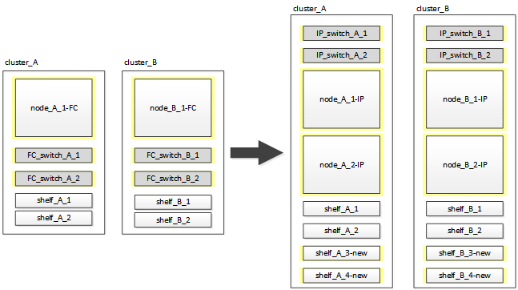

= Disruptively transitioning from a two-node MetroCluster FC to a four-node MetroCluster IP configuration (ONTAP 9.8 and later)
:icons: font
:imagesdir: ../media/

[.lead]
Starting with ONTAP 9.8, you can transition workloads and data from an existing two-node MetroCluster FC configuration to a new four-node MetroCluster IP configuration. Disk shelves from the MetroCluster FC nodes are moved to the IP nodes.

The following illustration provides a simplified view of the configuration before and after this transition procedure.



* This procedure is supported on systems running ONTAP 9.8 and later.
* This procedure is disruptive.
* This procedure applies only to a two-node MetroCluster FC configuration.
+
If you have a four-node MetroCluster FC configuration, see xref:concept_choosing_your_transition_procedure_mcc_transition.adoc[Choosing your transition procedure].

* ADP is not supported on the four-node MetroCluster IP configuration created by this procedure.
* You must meet all requirements and follow all steps in the procedure.
* The existing storage shelves are moved to the new MetroCluster IP nodes.
* Additional storage shelves can be added to the configuration if necessary.
+
See link:task_disruptively_transitioning_from_a_two_node_metrocluster_fc_to_a_four_node_metrocluster_ip_configuration.md#[Drive shelf reuse and drive requirements for disruptive FC-to-IP transition].

== Example naming in this procedure

[.lead]
This procedure uses example names throughout to identify the DR groups, nodes, and switches involved.

The nodes in the original configuration have the suffix -FC, indicating that they are in a fabric-attached or stretch MetroCluster configuration.

|===
| Components| cluster_A at site_A| cluster_B at site_B
a|
dr_group_1-FC
a|

* node_A_1-FC
* shelf_A_1
* shelf_A_2

a|

* node_B_1-FC
* shelf_B_1
* shelf_B_2

a|
dr_group_2-IP
a|

* node_A_1-IP
* node_A_2-IP
* shelf_A_1
* shelf_A_2
* shelf_A_3-new
* shelf_A_4-new

a|

* node_B_1-IP
* node_B_2-IP
* shelf_B_1
* shelf_B_2
* shelf_B_3-new
* shelf_B_4-new

a|
Switches
a|

* switch_A_1-FC
* switch_A_2-FC
* switch_A_1-IP
* switch_A_2-IP

a|

* switch_B_1-FC
* switch_B_2-FC
* switch_B_1-IP
* switch_B_2-IP

|===

== General requirements for disruptive FC-to-IP transition

[.lead]
Before starting the transition process, you must make sure the configuration meets the requirements.

The existing MetroCluster FC configuration must meet the following requirements:

* It must be a two-node configuration and all nodes must be running ONTAP 9.8 or later.
+
It can be a two-node fabric-attached or stretched MetroCluster.

* It must meet all requirements and cabling as described in the _MetroCluster Installation and Configuration Guides_.
+
https://docs.netapp.com/ontap-9/topic/com.netapp.doc.dot-mcc-inst-cnfg-fabric/home.html[Fabric-attached MetroCluster installation and configuration]
+
https://docs.netapp.com/ontap-9/topic/com.netapp.doc.dot-mcc-inst-cnfg-stretch/home.html[Stretch MetroCluster installation and configuration]

* It cannot be configured with NetApp Storage Encryption (NSE).
* The MDV volumes cannot be encrypted.

You must have remote console access for all six nodes from either MetroCluster site or plan for travel between the sites as required by the procedure.

=== Drive shelf reuse and drive requirements for disruptive FC-to-IP transition

[.lead]
You must ensure that adequate spare drives and root aggregate space is available on the storage shelves.

==== Reusing the existing storage shelves

When using this procedure, the existing storage shelves are retained for use by the new configuration. When node_A_1-FC and node_B_1-FC are removed, the existing drive shelves are connected to node_A_1-IP and node_A_2-IP on cluster_A and to node_B_1-IP and node_B_2-IP on cluster_B.

* The existing storage shelves (those attached to node_A_1-FC and node_B_1-FC) must be supported by the new platform models.
+
If the existing shelves are not supported by the new platform models, see link:task_disruptively_transitioning_when_existing_shelves_are_not_supported_on_new_controllers.md#[Disruptively transitioning when existing shelves are not supported on new controllers (ONTAP 9.8 and later)].
+
https://hwu.netapp.com[NetApp Hardware Universe]

* You must ensure you don't exceed the platform limits for drives, etc.
+
HWU link

==== Storage requirements for the additional controllers

Additional storage must be added, if necessary, to accommodate the two additional controllers (node_A_2-IP and node_B_2-ip), because the configuration is changing from a two-node to a four-node arrangement.

* Depending on the spare drives available in the existing shelves, additional drives must be added to accommodate the additional controllers in the configuration.
+
This might require additional storage shelves, as shown in the following illustration.
+
image::../media/transition_2n_4_new_ip_nodes_on_the_shelves.png[]
+
You need to have additional 14 - 18 drives each for the third and fourth controllers (node_A_2-IP and node_B_2-IP):

 ** Three pool0 drives
 ** Three pool1 drives
 ** Two spare drives
 ** Six to ten drives for the system volume

* You must ensure that the configuration, including the new nodes, does not exceed the platform limits for the configuration, including drive count, root aggregate size capacity, etc.
+
This information is available for each platform model at _NetApp Hardware Universe_.
+
https://hwu.netapp.com[NetApp Hardware Universe]

== Workflow for disruptive transition

[.lead]
You must follow the specific workflow to ensure a successful transition.

As you prepare for the transition, plan for travel between the sites. Note that after the remote nodes are racked and cabled, you need serial terminal access to the nodes. Service Processor access is not be available until the nodes are configured.

image::../media/workflow_2n_transition_bsaic.png[]

== Mapping ports from the MetroCluster FC nodes to the MetroCluster IP nodes

[.lead]
You must adjust the port and LIF configuration of the MetroCluster FC node so it is compatible with that of the MetroCluster IP node that will replace it.

When the new nodes are first booted during the upgrade process, each node uses the most recent configuration of the node it is replacing. When you boot node_A_1-IP, ONTAP attempts to host LIFs on the same ports that were used on node_A_1-FC.

During the transition procedure, you will perform steps on both the old and new nodes to ensure correct cluster, management, and data LIF configuration.

. Identify any conflicts between the existing MetroCluster FC port usage and the port usage for the MetroCluster IP interfaces on the new nodes.
+
You must identify the MetroCluster IP ports on the new MetroCluster IP controllers using the table below. Then check and record if any data LIFs or cluster LIFs exist on those ports on the MetroCluster FC nodes.
+
These conflicting data LIFs or cluster LIFs on the MetroCluster FC nodes will be moved at the appropriate step in the transition procedure.
+
NOTE: On the AFF A220 and FAS2750 systems, the MetroCluster IP physical ports are also used as cluster interfaces. If the new MetroCluster IP nodes are AFF A220 or FAS2750 systems, existing cluster LIFs do not need to be moved.
+
The following table shows the MetroCluster IP ports by platform model. You can ignore the VLAN ID column.
+
|===
| Platform model| MetroCluster IP port| VLAN ID|  
a|
AFF A800
a|
e0b
a|
Not used
a|
 
a|
e1b
a|
 
a|
AFF A700 and FAS9000
a|
e5a
a|
 
a|
e5b
a|
 
a|
AFF A320
a|
e0g
a|
 
a|
e0h
a|
 
a|
AFF A300 and FAS8200
a|
e1a
a|
 
a|
e1b
a|
 
a|
AFF A220 and FAS2750
a|
e0a
a|
10
a|
On these systems, these physical ports are also used as cluster interfaces.
a|
e0b
a|
20
a|
AFF A250 and FAS500f
a|
e0c
a|
10
a|
 
a|
e0d
a|
20
a|
 
|===
You can fill in the following table and refer to it later in the transition procedure.
+
|===
| Ports| Corresponding MetroCluster IP interface ports (from table above)| Conflicting LIFs on these ports on the MetroCluster FC nodes
a|
First MetroCluster IP port on node_A_1-FC
a|
 
a|
 
a|
Second MetroCluster IP port on node_A_1-FC
a|
 
a|
 
a|
First MetroCluster IP port on node_B_1-FC
a|
 
a|
 
a|
Second MetroCluster IP port on node_B_1-FC
a|
 
a|
 
|===

. Determine what physical ports are available on the new controllers and what LIFs can be hosted on the ports.
+
The controller's port usage depends on the platform model and IP switch model you will use in the MetroCluster IP configuration. You can gather the port usage of the new platforms from the _NetApp Hardware Universe_.
+
https://hwu.netapp.com[NetApp Hardware Universe]

. If desired, record the port information for node_A_1-FC and node_A_1-IP.
+
You will refer to the table as you carry out the transition procedure.
+
In the columns for node_A_1-IP, add the physical ports for the new controller module and plan the IPspaces and broadcast domains for the new node.
+
|===
|  | node_A_1-FC| node_A_1-IP
| LIF| Ports| IPspaces| Broadcast domains| Ports| IPspaces| Broadcast domains
a|
Cluster 1
a|
 
a|
 
a|
 
a|
 
a|
 
a|
 
a|
Cluster 2
a|
 
a|
 
a|
 
a|
 
a|
 
a|
 
a|
Cluster 3
a|
 
a|
 
a|
 
a|
 
a|
 
a|
 
a|
Cluster 4
a|
 
a|
 
a|
 
a|
 
a|
 
a|
 
a|
Node management
a|
 
a|
 
a|
 
a|
 
a|
 
a|
 
a|
Cluster management
a|
 
a|
 
a|
 
a|
 
a|
 
a|
 
a|
Data 1
a|
 
a|
 
a|
 
a|
 
a|
 
a|
 
a|
Data 2
a|
 
a|
 
a|
 
a|
 
a|
 
a|
 
a|
Data 3
a|
 
a|
 
a|
 
a|
 
a|
 
a|
 
a|
Data 4
a|
 
a|
 
a|
 
a|
 
a|
 
a|
 
a|
SAN
a|
 
a|
 
a|
 
a|
 
a|
 
a|
 
a|
Intercluster port
a|
 
a|
 
a|
 
a|
 
a|
 
a|
 
|===

. If desired, record all the port information for node_B_1-FC.
+
You will refer to the table as you carry out the upgrade procedure.
+
In the columns for node_B_1-IP, add the physical ports for the new controller module and plan the LIF port usage, IPspaces and broadcast domains for the new node.
+
|===
|  | node_B_1-FC| node_B_1-IP
| LIF| Physical ports| IPspaces| Broadcast domains| Physical ports| IPspaces| Broadcast domains
a|
Cluster 1
a|
 
a|
 
a|
 
a|
 
a|
 
a|
 
a|
Cluster 2
a|
 
a|
 
a|
 
a|
 
a|
 
a|
 
a|
Cluster 3
a|
 
a|
 
a|
 
a|
 
a|
 
a|
 
a|
Cluster 4
a|
 
a|
 
a|
 
a|
 
a|
 
a|
 
a|
Node management
a|
 
a|
 
a|
 
a|
 
a|
 
a|
 
a|
Cluster management
a|
 
a|
 
a|
 
a|
 
a|
 
a|
 
a|
Data 1
a|
 
a|
 
a|
 
a|
 
a|
 
a|
 
a|
Data 2
a|
 
a|
 
a|
 
a|
 
a|
 
a|
 
a|
Data 3
a|
 
a|
 
a|
 
a|
 
a|
 
a|
 
a|
Data 4
a|
 
a|
 
a|
 
a|
 
a|
 
a|
 
a|
SAN
a|
 
a|
 
a|
 
a|
 
a|
 
a|
 
a|
Intercluster port
a|
 
a|
 
a|
 
a|
 
a|
 
a|
 
|===

== Preparing the MetroCluster IP controllers

[.lead]
You must prepare the four new MetroCluster IP nodes and install the correct ONTAP version.

This task must be performed on each of the new nodes:

* node_A_1-IP
* node_A_2-IP
* node_B_1-IP
* node_B_2-IP

The nodes should be connected to any *new* storage shelves. They must *not* be connected to the existing storage shelves containing data.

These steps can be performed now, or later in the procedure when the controllers and shelves are racked. In any case, you must make sure you clear the configuration and prepare the nodes *before* connecting them to the existing storage shelves and *before* making any configuration changes to the MetroCluster FC nodes.

NOTE: Do not perform these steps with the MetroCluster IP controllers connected to the existing storage shelves that were connected to the MetroCluster FC controllers.

In these steps, you clear the configuration on the nodes and clear the mailbox region on new drives.

. Connect the controller modules to the new storage shelves.
. In Maintenance mode, display the HA state of the controller module and chassis: `ha-config show`
+
The HA state for all components should be mccip.

. If the displayed system state of the controller or chassis is not correct, set the HA state: `ha-config modify controller mccip``ha-config modify chassis mccip`
. Exit Maintenance mode: `halt`
+
After you run the command, wait until the node stops at the LOADER prompt.

. Repeat the following substeps on all four nodes to clear the configuration:
 .. Set the environmental variables to default values: `set-defaults`
 .. Save the environment: `saveenv``bye`
. Repeat the following substeps to boot all four nodes using the 9a option on the boot menu.
 .. At the LOADER prompt, launch the boot menu: `boot_ontap menu`
 .. At the boot menu, select option *9a* to reboot the controller.
. Boot each of the four nodes to Maintenance mode using option *5* on the boot menu.
. Record the system ID and from each of the four nodes: `sysconfig`
. Repeat the following steps on node_A_1-IP and node_B_1-IP.
 .. Assign ownership of all disks local to each site: `disk assign adapter.xx.*`
 .. Repeat the previous step for each HBA with attached drive shelves on node_A_1-IP and node_B_1-IP.
. Repeat the following steps on node_A_1-IP and node_B_1-IP to clear the mailbox region on each local disk.
 .. Destroy the mailbox region on each disk: `mailbox destroy local``mailbox destroy partner`
. Halt all four controllers: `halt`
. On each controller, display the boot menu: `boot_ontap menu`
. On each of the four controllers, clear the configuration: `wipeconfig`
+
When the wipeconfig operation completes, the node automatically returns to the boot menu.

. Repeat the following substeps to again boot all four nodes using the 9a option on the boot menu.
 .. At the LOADER prompt, launch the boot menu: `boot_ontap menu`
 .. At the boot menu, select option *9a* to reboot the controller.
 .. Let the controller module complete booting before moving to the next controller module.

+
After 9a completes, the nodes automatically return to the boot menu.
. Power off the controllers.

== Verifying the health of the MetroCluster FC configuration

[.lead]
You must verify the health and connectivity of the MetroCluster FC configuration prior to performing the transition

This task is performed on the MetroCluster FC configuration.

. Verify the operation of the MetroCluster configuration in ONTAP:
 .. Check whether the system is multipathed:``node run -node node-name sysconfig -a``
 .. Check for any health alerts on both clusters: `system health alert show`
 .. Confirm the MetroCluster configuration and that the operational mode is normal: `metrocluster show`
 .. Perform a MetroCluster check: `metrocluster check run`
 .. Display the results of the MetroCluster check: `metrocluster check show`
 .. Check for any health alerts on the switches (if present): `storage switch show`
 .. Run Config Advisor.
+
https://mysupport.netapp.com/site/tools/tool-eula/activeiq-configadvisor[NetApp Downloads: Config Advisor]

 .. After running Config Advisor, review the tool's output and follow the recommendations in the output to address any issues discovered.
. Verify that the nodes are in non-HA mode: `storage failover show`

== Removing the existing configuration from the Tiebreaker or other monitoring software

[.lead]
If the existing configuration is monitored with the MetroCluster Tiebreaker configuration or other third-party applications (for example, ClusterLion) that can initiate a switchover, you must remove the MetroCluster configuration from the Tiebreaker or other software prior to transition.

. Remove the existing MetroCluster configuration from the Tiebreaker software.
+
http://docs.netapp.com/ontap-9/topic/com.netapp.doc.hw-metrocluster-tiebreaker/GUID-34C97A45-0BFF-46DD-B104-2AB2805A983D.html[Removing MetroCluster configurations]

. Remove the existing MetroCluster configuration from any third-party application that can initiate switchover.
+
Refer to the documentation for the application.

== Transitioning the MetroCluster FC nodes

[.lead]
You must gather information from the existing MetroCluster FC nodes, send an autosupport message announcing the start of maintenance, and transition the nodes.

=== Gathering information from the existing controller modules before the transition

[.lead]
Before transitioning, you must gather information for each of the nodes.

This task is performed on the existing nodes:

* node_A_1-FC
* node_B_1-FC

. Gather the output from the following commands.
+
|===
| Category| Commands
a|
License
a|
system license show
a|
Shelves, numbers of disks in each shelf, flash storage details, memory, NVRAM, and network cards
a|
system node run -node node_name sysconfig
a|
Cluster network and node management LIFs
a|
system node run -node node_name sysconfig network interface show -role cluster,node-mgmt,data
a|
SVM information
a|
vserver show
a|
Protocol information
a|
    nfs show
+
iscsi show
+
cifs show
a|
Physical ports
a|
    network port show -node node_name -type physical
+
network port show
a|
Failover Groups
a|
    network interface failover-groups show -vserver vserver_name
+
Record the names and ports of failover groups that are not clusterwide.
a|
VLAN configuration
a|
network port vlan show -node node_name     Record each network port and VLAN ID pairing.
a|
Interface group configuration
a|
network port ifgrp show -node node_name -instance     Record the names of the interface groups and the ports assigned to them.
a|
Broadcast domains
a|
network port broadcast-domain show
a|
IPspace
a|
network ipspace show
a|
Volume info
a|
    volume show
+
volume show -fields encrypt
a|
Aggregate Info
a|
    storage aggregate show
+
storage aggr encryption show
+
storage aggregate object-store show
a|
Disk ownership information
a|
    storage aggregate show
+
storage aggr encryption show

storage aggregate object-store show
    a|
    Encryption
    a|
        storage failover mailbox-disk show

....
 security key-manager backup show

 Also preserve the passphrase used to enable key-manager. In the case of external key-manager you will need the authentication information for the client and server.

 security key-manager show

 security key-manager external show

 systemshell local kenv kmip.init.ipaddr ip-address

 systemshell local kenv kmip.init.netmask netmask

 systemshell local kenv kmip.init.gateway gateway

 systemshell local kenv kmip.init.interface interface


|===
....

=== Sending a custom AutoSupport message prior to maintenance

[.lead]
Before performing the maintenance, you should issue an AutoSupport message to notify NetApp technical support that maintenance is underway. This prevents them from opening a case on the assumption that a disruption has occurred.

This task must be performed on each MetroCluster site.

. To prevent automatic support case generation, send an Autosupport message to indicate maintenance is underway.
 .. Issue the following command: `system node autosupport invoke -node * -type all -message MAINT=maintenance-window-in-hours`
+
maintenance-window-in-hours specifies the length of the maintenance window, with a maximum of 72 hours. If the maintenance is completed before the time has elapsed, you can invoke an AutoSupport message indicating the end of the maintenance period:``system node autosupport invoke -node * -type all -message MAINT=end``

 .. Repeat the command on the partner cluster.

=== Transitioning, shutting down, and removing the MetroCluster FC nodes

[.lead]
In addition to issuing commands on the MetroCluster FC nodes, this task includes physical uncabling and removal of the controller modules at each site.

This task must be performed on each of the old nodes:

* node_A_1-FC
* node_B_1-FC

. Stop all client traffic.
. On either of the MetroCluster FC nodes, for example node_A_1-FC, enable transition.
 .. Set the advanced privilege level: `set -priv advanced`
 .. Enable transition: `metrocluster transition enable -transition-mode disruptive`
 .. Return to admin mode: `set -priv admin`
. Unmirror the root aggregate by deleting the remote plex of the root aggregates.
 .. Identify the root aggregates: `storage aggregate show -root true`
 .. Display the pool1 aggregates: `storage aggregate plex show -pool 1`
 .. Delete the local plex of the root aggregate: `aggr plex delete aggr-name -plex plex-name`
 .. Offline the remote plex of the root aggregate: `aggr plex offline root-aggregate -plex remote-plex-for-root-aggregate`
+
For example:
+
----
 # aggr plex offline aggr0_node_A_1-FC_01 -plex plex4
----
. Confirm the mailbox count, disk autoassign, and transition mode before proceeding using the following commands on each controller:
 .. Set the advanced privilege level: `set -priv advanced`
 .. Confirm that only three mailbox drives are shown for each controller module: `storage failover mailbox-disk show`
 .. Return to admin mode: `set -priv admin`
 .. Confirm that the transition mode is disruptive: metrocluster transition show
. Check for any broken disks: `disk show -broken`
. Remove or replace any broken disks
. Confirm aggregates are healthy using the following commands on node_A_1-FC and node_B_1-FC:``storage aggregate show```storage aggregate plex show`
+
The storage aggregate show command indicates that the root aggregate is unmirrored.

. Check for any VLANs or interface groups: `network port ifgrp show``network port vlan show`
+
If none are present, skip the following two steps.

. Display the list of LIfs using VLANs or ifgrps: `network interface show -fields home-port,curr-port``network port show -type if-group | vlan`
. Remove any VLANs and interface groups.
+
You must perform these steps for all LIFs in all SVMs, including those SVMs with the -mc suffix.

 .. Move any LIFs using the VLANs or interface groups to an available port: `network interface modify -vserver vserver-name -lif lif_name -home- port port`
 .. Display the LIFs that are not on their home ports: `network interface show -is-home false`
 .. Revert all LIFs to their respective home ports: `network interface revert -vserver vserver_name -lif lif_name`
 .. Verify that all LIFs are on their home ports: `network interface show -is-home false`
+
No LIFs should appear in the output.

 .. Remove VLAN and ifgrp ports from broadcast domain:: `network port broadcast-domain remove-ports -ipspace ipspace -broadcast-domain broadcast-domain-name -ports nodename:portname,nodename:portname,..`
 .. Verify that all the vlan and ifgrp ports are not assigned to a broadcast domain: `network port show -type if-group | vlan`
 .. Delete all VLANs: `network port vlan delete -node nodename -vlan-name vlan-name`
 .. Delete interface groups: `network port ifgrp delete -node nodename -ifgrp ifgrp-name`

. Move any LIFs as required to resolve conflicts with the MetroCluster IP interface ports.
+
You must move the LIFs identified in step 1 of link:task_disruptively_transitioning_from_a_two_node_metrocluster_fc_to_a_four_node_metrocluster_ip_configuration.md#[Mapping ports from the MetroCluster FC nodes to the MetroCluster IP nodes].

 .. Move any LIFs hosted on the desired port to another port: `network interface modify -lif lifname -vserver vserver-name -home-port new-homeport``network interface revert -lif lifname -vserver vservername`
 .. If necessary, move the destination port to an appropriate IPspace and broadcast domain. `network port broadcast-domain remove-ports -ipspace current-ipspace -broadcast-domain current-broadcast-domain -ports controller-name:current-port``network port broadcast-domain add-ports -ipspace new-ipspace -broadcast-domain new-broadcast-domain -ports controller-name:new-port`

. Halt the MetroCluster FC controllers (node_A_1-FC and node_B_1-FC): `system node halt`
. At the LOADER prompt, synchronize the hardware clocks between the FC and IP controller modules.
 .. On the old MetroCluster FC node (node_A_1-FC), display the date: `show date`
 .. On the new MetroCluster IP controllers (node_A_1-IP and node_B_1-IP), set the date shown on original controller: `set date mm/dd/yy`
 .. On the new MetroCluster IP controllers (node_A_1-IP and node_B_1-IP), verify the date: `show date`
. Halt and power off the MetroCluster FC controller modules (node_A_1-FC and node_B_1-FC), FC-to-SAS bridges (if present), FC switches (if present) and each storage shelf connected to these nodes.
. Disconnect the shelves from the MetroCluster FC controllers and document which shelves are local storage to each cluster.
+
If the configuration uses FC-to-SAS bridges or FC back-end switches, disconnect and remove them.

. In Maintenance mode on the MetroCluster FC nodes (node_A_1-FC and node_B_1-FC), confirm no disks are connected: `disk show -v`
. Power down and remove the MetroCluster FC nodes.

At this point, the MetroCluster FC controllers have been removed and the shelves are disconnected from all controllers.

image::../media/transition_2n_remove_fc_nodes.png[]

== Connecting the MetroCluster IP controller modules

[.lead]
You must add the four new controller modules and any additional storage shelves to the configuration. The new controller modules are added two-at-a-time.

=== Setting up the new controllers

[.lead]
You must rack and cable the new MetroCluster IP controllers to the storage shelves previously connected to the MetroCluster FC controllers.

These steps must be performed on each of the MetroCluster IP nodes.

* node_A_1-IP
* node_A_2-IP
* node_B_1-IP
* node_B_2-IP

In the following example, two additional storage shelves are added at each site to provide storage to accommodate the new controller modules.

image::../media/transition_2n_4_new_ip_nodes_and_shelves.png[]

. Plan out the positioning of the new controller modules and storage shelves as needed.
+
The rack space depends on the platform model of the controller modules, the switch types, and the number of storage shelves in your configuration.

. Properly ground yourself.
. Rack the new equipment: controllers, storage shelves, and IP switches.
+
Do not cable the storage shelves or IP switches at this time.

. Connect the power cables and management console connection to the controllers.
. Verify that all storage shelves are powered off.
. Verify that no drives are connected by performing the following steps on all four nodes:
 .. At the LOADER prompt, launch the boot menu: `boot_ontap maint`
 .. Verify that no drives are connected: `disk show -v`
+
The output should show no drives.

 .. Halt the node: `halt`
. Boot all four nodes using the 9a option on the boot menu.
 .. At the LOADER prompt, launch the boot menu: `boot_ontap menu`
 .. At the boot menu, select option *9a* to reboot the controller.
 .. Let the controller module complete booting before moving to the next controller module.

+
After 9a completes, the nodes automatically return to the boot menu.
. Cable the storage shelves.
+
Refer to the controller installation and setup procedures for your model for cabling information.
+
https://docs.netapp.com/platstor/index.jsp[AFF and FAS Documentation Center]

. Cable the controllers to the IP switches as described in the _MetroCluster IP Installation and Configuration Guide_.
+
http://docs.netapp.com/ontap-9/topic/com.netapp.doc.dot-mcc-inst-cnfg-ip/home.html[MetroCluster IP installation and configuration]

 ** http://docs.netapp.com/ontap-9/topic/com.netapp.doc.dot-mcc-inst-cnfg-ip/GUID-4255F6AB-8CA7-4772-B282-218AE0DC60A8.html[Cabling the IP switches]

. Prepare the IP switches for the application of the new RCF files.
+
Follow the steps in the section for your switch vendor from the _MetroCluster IP Installation and Configuration Guide_.
+
http://docs.netapp.com/ontap-9/topic/com.netapp.doc.dot-mcc-inst-cnfg-ip/home.html[MetroCluster IP installation and configuration]

 ** http://docs.netapp.com/ontap-9/topic/com.netapp.doc.dot-mcc-inst-cnfg-ip/GUID-39831E44-33C8-46E9-BD48-76CAFC2D71F7.html[Resetting the Broadcom IP switch to factory defaults]
 ** http://docs.netapp.com/ontap-9/topic/com.netapp.doc.dot-mcc-inst-cnfg-ip/GUID-BFE8D886-FC64-40B6-8DBD-32F0EE1FD6C7.html[Resetting the Cisco IP switch to factory defaults]

. Download and install the RCF files.
+
Follow the steps in the section for your switch vendor from the http://docs.netapp.com/ontap-9/topic/com.netapp.doc.dot-mcc-inst-cnfg-ip/home.html[MetroCluster IP installation and configuration].

 ** http://docs.netapp.com/ontap-9/topic/com.netapp.doc.dot-mcc-inst-cnfg-ip/GUID-4E169910-43BC-4BDB-89F6-18B09F5A728C.html[Downloading and installing the Broadcom RCF files]
 ** http://docs.netapp.com/ontap-9/topic/com.netapp.doc.dot-mcc-inst-cnfg-ip/GUID-89FE081E-9E71-431F-9D66-80EBB2D80B8D.html[Downloading and installing the Cisco IP RCF files]

. Turn on power to the first new controller (node_A_1-IP) and press Ctrl-C to interrupt the boot process and display the LOADER prompt.
. Boot the controller to Maintenance mode: `boot_ontap_maint`
. Display the system ID for the controller: `sysconfig -v`
. Confirm that the shelves from the existing configuration are visible from the new MetroCluster IP node: `storage show shelf``disk show -v`
. Halt the node: `halt`
. Repeat the preceding steps on the other node at the partner site (site_B).

=== Connecting and booting up node_A_1-IP and node_B_1-IP

[.lead]
After connecting the MetroCluster IP controllers and IP switches, you transition and boot up node_A_1-IP and node_B_1-IP..

==== Transitioning node_A_1-IP

[.lead]
You must boot the first new MetroCluster IP node using the correct transition command and configure the networking on the node.

===== Bringing up node_A_1-IP

[.lead]
You must boot the node with the correct transition option.

. Boot node_A_1-IP to the boot menu: `boot_ontap menu`
. Issue the following command at the boot menu prompt to initiate transition: `boot_after_mcc_transition`
 ** This command reassigns all the disks owned by node_A_1-FC to node_A_1-IP.
  *** node_A_1-FC disks are assigned to node_A_1-IP
  *** node_B_1-FC disks are assigned to node_B_1-IP
 ** The command also automatically makes other required system ID reassignments so the MetroCluster IP nodes can boot to the ONTAP prompt.
 ** If the boot_after_mcc_transition command fails for any reason, it should be re-run from the boot menu.
*Note:*
 ** If the following prompt is displayed, enter Ctrl-C to continue. Checking MCC DR state... [enter Ctrl-C(resume), S(status), L(link)]_
 ** If the root volume was encrypted, the node halts with the following message. Halting the system, because root volume is encrypted (NetApp Volume Encryption) and the key import failed. If this cluster is configured with external (KMIP) key-manager, check the health of the key servers.

+
----

Please choose one of the following:
(1) Normal Boot.
(2) Boot without /etc/rc.
(3) Change password.
(4) Clean configuration and initialize all disks.
(5) Maintenance mode boot.
(6) Update flash from backup config.
(7) Install new software first.
(8) Reboot node.
(9) Configure Advanced Drive Partitioning. Selection (1-9)? `boot_after_mcc_transition`
This will replace all flash-based configuration with the last backup to disks. Are you sure you want to continue?: yes

Metrocluster Transition: Name of the MetroCluster FC node: `node_A_1-FC`
Metrocluster Transition: Please confirm if this is the correct value [yes|no]:? y
Metrocluster Transition: Disaster Recovery partner sysid of MetroCluster FC node node_A_1-FC: `systemID-of-node_B_1-FC`
Metrocluster Transition: Please confirm if this is the correct value [yes|no]:? y
Metrocluster Transition: Disaster Recovery partner sysid of local Metrocluster IP node: `systemID-of-node_B_1-IP`
Metrocluster Transition: Please confirm if this is the correct value [yes|no]:? y
----
. If data volumes are encrypted, restore the keys using the correct command for your key management configuration.
+
|===
| If you are using...| Use this command...
a|
*Onboard key management*
a|
security key-manager onboard sync     For more information, see https://docs.netapp.com/ontap-9/topic/com.netapp.doc.pow-nve/GUID-E4AB2ED4-9227-4974-A311-13036EB43A3D.html[Restoring onboard key management encryption keys].
a|
*External key management*
a|
security key-manager key query -node node-name     For more information, see https://docs.netapp.com/ontap-9/topic/com.netapp.doc.pow-nve/GUID-32DA96C3-9B04-4401-92B8-EAF323C3C863.html[Restoring external key management encryption keys].
+
|===

. If the root volume is encrypted, use the procedure in link:task_disruptively_transitioning_from_a_two_node_metrocluster_fc_to_a_four_node_metrocluster_ip_configuration.md#[Recovering key management if the root volume is encrypted].

===== Recovering key management if the root volume is encrypted

[.lead]
If the root volume is encrypted, you must use special boot commands to restore the key management.

You must have the passphrases gathered earlier.

. If onboard key management is used, perform the following substeps to restore the configuration.
 .. From the LOADER prompt, display the boot menu: `boot_ontap menu`
 .. Select option (10) Set onboard key management recovery secrets from the boot menu.
+
Respond as appropriate to the prompts:
+
----
This option must be used only in disaster recovery procedures. Are you sure? (y or n): `y`
Enter the passphrase for onboard key management: `passphrase`
Enter the passphrase again to confirm:`passphrase`

Enter the backup data:`backup-key`
----
+
The system boots to the boot menu.

 .. Enter option `6` at the boot menu.
+
Respond as appropriate to the prompts:
+
----
This will replace all flash-based configuration with the last backup to
disks. Are you sure you want to continue?: y

Following this, the system will reboot a few times and the following prompt will be available continue by saying y

WARNING: System ID mismatch. This usually occurs when replacing a boot device or NVRAM cards!
Override system ID? {y|n} y
----
+
After the reboots, the system will be at the LOADER prompt.

 .. From the LOADER prompt, display the boot menu: `boot_ontap menu`
 .. Again elect option (10) Set onboard key management recovery secrets from the boot menu.
+
Respond as appropriate to the prompts:
+
----
This option must be used only in disaster recovery procedures. Are you sure? (y or n): `y`
Enter the passphrase for onboard key management: `passphrase`
Enter the passphrase again to confirm:`passphrase`

Enter the backup data:`backup-key`
----
+
The system boots to the boot menu.

 .. Enter option `1` at the boot menu.
+
If the following prompt is displayed, you can enter Ctrl+C to resume the process._Checking MCC DR state... [enter Ctrl-C(resume), S(status), L(link)]_
+
The system boots to the ONTAP prompt.

 .. Restore the onboard key management: `security key-manager onboard sync`
+
Respond as appropriate to the prompts, using the passphrase you collected earlier:
+
----
cluster_A::> security key-manager onboard sync
Enter the cluster-wide passphrase for onboard key management in Vserver "cluster_A":: passphrase
----
. If external key management is used, perform the following substeps to restore the configuration.
 .. Set the required bootargs: `setenv bootarg.kmip.init.ipaddr ip-address``setenv bootarg.kmip.init.netmask netmask``setenv bootarg.kmip.init.gateway gateway-address``setenv bootarg.kmip.init.interface interface-id`
 .. From the LOADER prompt, display the boot menu: `boot_ontap menu`
 .. Select option (11) Configure node for external key management from the boot menu.
+
The system boots to the boot menu.

 .. Enter option `6` at the boot menu.
+
The system boots multiple times. You can respond affirmatively when prompted to continue the boot process.
+
After the reboots, the system will be at the LOADER prompt.

 .. Set the required bootargs: `setenv bootarg.kmip.init.ipaddr ip-address``setenv bootarg.kmip.init.netmask netmask``setenv bootarg.kmip.init.gateway gateway-address``setenv bootarg.kmip.init.interface interface-id`
 .. From the LOADER prompt, display the boot menu: `boot_ontap menu`
 .. Again select option (11) Configure node for external key management from the boot menu and respond to the prompts as required.
+
The system boots to the boot menu.

 .. Restore the external key management: `security key-manager external restore`

===== Creating the network configuration

[.lead]
You must create a network configuration that matches the configuration on the FC nodes. This is because the MetroCluster IP node replays the same configuration when it boots, which means that when node_A_1-IP and node_B_1-IP boot, ONTAP will try to host LIFs on the same ports that were used on node_A_1-FC and node_B_1-FC respectively.

As you create the network configuration, use the plan made in link:task_disruptively_transitioning_from_a_two_node_metrocluster_fc_to_a_four_node_metrocluster_ip_configuration.md#[Mapping ports from the MetroCluster FC nodes to the MetroCluster IP nodes] to assist you.

NOTE:

Additional configuration may be needed to bring up data LIFs after the MetroCluster IP nodes have been configured.

. Verify that all cluster ports are in the appropriate broadcast domain:
+
The cluster IPspace and cluster broadcast domain are required in order to create cluster LIFs

 .. View the IP spaces: `network ipspace show`
 .. Create IP spaces and assign cluster ports as needed.
+
http://docs.netapp.com/ontap-9/topic/com.netapp.doc.dot-cm-nmg/GUID-69120CF0-F188-434F-913E-33ACB8751A5D.html[Configuring IPspaces (cluster administrators only)]

 .. View the broadcast domains: `network port broadcast-domain show`
 .. Add any cluster ports to a broadcast domain as needed.
+
https://docs.netapp.com/ontap-9/topic/com.netapp.doc.dot-cm-nmg/GUID-003BDFCD-58A3-46C9-BF0C-BA1D1D1475F9.html[Adding or removing ports from a broadcast domain]

 .. Recreate VLANs and interface groups as needed.
+
VLAN and interface group membership might be different than that of the old node.
+
https://docs.netapp.com/ontap-9/topic/com.netapp.doc.dot-cm-nmg/GUID-8929FCE2-5888-4051-B8C0-E27CAF3F2A63.html[Creating a VLAN]
+
https://docs.netapp.com/ontap-9/topic/com.netapp.doc.dot-cm-nmg/GUID-DBC9DEE2-EAB7-430A-A773-4E3420EE2AA1.html[Combining physical ports to create interface groups]

. Verify that MTU settings are set correctly for the ports and broadcast domain and make changes using the following commands: `network port broadcast-domain show``network port broadcast-domain modify -broadcast- domain bcastdomainname -mtu mtu`

===== Setting up cluster ports and cluster LIFs

[.lead]
You must set up cluster ports and LIFs. The following steps need to be performed on the site A nodes which were booted up with root aggregates.

. Identify the list of LIFs using the desired Cluster port: `network interface show -curr-port portname``network interface show -home-port portname`
. For each cluster port, change the home port of any of the LIFs on that port to another port,
 .. Enter advanced privilege mode and enter y when prompted to continue: `set priv advanced`
 .. If the LIF being modified is a data LIF: `vserver config override -command "network interface modify -lif lifname -vserver vservername -home-port new-datahomeport`
 .. If the LIF is not a data LIF: `network interface modify -lif lifname -vserver vservername -home-port new-datahomeport`
 .. Revert the modified LIFs to their home port: `network interface revert * -vserver vserver_name`
 .. Verify that there are no LIFs on the cluster port: `network interface show -curr-port portname``network interface show -home-port portname`
 .. Remove the port from the current broadcast domain: `network port broadcast-domain remove-ports -ipspace ipspacename -broadcast-domain bcastdomainname -ports node_name:port_name`
 .. Add the port to the cluster IPspace and broadcast domain: `network port broadcast-domain add-ports -ipspace Cluster -broadcast-domain Cluster -ports node_name:port_name`
 .. Verify that the port's role has changed: `network port show`
 .. Repeat these substeps for each cluster port.
 .. Return to admin mode: `set priv admin`
. Create cluster LIFs on the new cluster ports:
 .. For autoconfiguration using link-local address for cluster LIF, use the following command: `network interface create -vserver Cluster -lif cluster_lifname -service-policy default-cluster -home-node a1name -home-port clusterport -auto true`
 .. To assign static IP address for the cluster LIF, use the following command: `network interface create -vserver Cluster -lif cluster_lifname -service-policy default-cluster -home-node a1name -home-port clusterport -address ip-address -netmask netmask -status-admin up`

===== Verifying LIF configuration

[.lead]
The node management LIF, cluster management LIF and intercluster LIF will still be present after the storage movement from the old controller. If necessary, you must move LIFs to appropriate ports.

. Verify if the management LIF and cluster management LIFs are on desired port already: `network interface show -service-policy default-management``network interface show -service-policy default-intercluster`
+
If the LIFs are on the desired ports, you can skip the rest of the steps in this task and proceed to the next task.

. For each node, cluster management, or intercluster LIFs are not on the desired port, change the home port of any of the LIFs on that port to another port,
 .. Repurpose the desired port by moving any LIFs hosted on desired port to another port using `vserver config override -command "network interface modify -lif <lifname> -vserver <vservername> -home-port <new-datahomeport>`
 .. Revert the modified LIFs to their new home port: `vserver config override -command "network interface revert -lif <lifname> -vserver <vservername>"`
 .. If the desired port is not in the right IPspace and broadcast domain, remove the port from the current IPspace and broadcast domain: `network port broadcast-domain remove-ports -ipspace <current-ipspace> -broadcast-domain <current-broadcast-domain> -ports <controller-name:current-port>`
 .. Move the desired port to the right IPspace and broadcast domain``network port broadcast-domain add-ports -ipspace <new-ipspace> -broadcast-domain <new-broadcast-domain> -ports <controller-name:new-port>``
 .. Verify that the port's role has changed: `network port show`
 .. Repeat these substeps for each port.
. Move node, cluster management LIFs and intercluster LIF to the desired port using the following commands:
 .. Change the LIF's home port: `network interface modify -vserver vserver -lif node_mgmt -home-port port -home-node homenode`
 .. Revert the LIF to its new home port: `network interface revert -lif node_mgmt -vserver vservername`
 .. Change the cluster management LIF's home port:``network interface modify -vserver vserver -lif cluster-mgmt-LIF-name -home-port port -home-node homenode``
 .. Revert the cluster management LIF to its new home port: `network interface revert -lif cluster-mgmt-LIF-name -vserver vservername`
 .. Change the intercluster LIF's home port:``network interface modify -vserver vserver -lif intercluster-lif-name -home-node nodename -home-port port``
 .. Revert the intercluster LIF to its new home port: `network interface revert -lifintercluster-lif-name -vserver vservername`

==== Transitioning node_B_1-IP

[.lead]
Repeat the previous tasks in this section to transition node_B_1-IP.

=== Bringing up node_A_2-IP and node_B_2-IP

[.lead]
You must bring up and configure the new MetroCluster IP node at each site, creating an HA pair in each site.

==== Bringing up node_A_2-IP and node_B_2-IP

[.lead]
You must boot the new controller modules one at a time using the correct option at the boot menu.

In these steps, you boot up the two brand new nodes, expanding what had been a two-node configuration into a four-node configuration.

These steps are performed on the following nodes:

* node_A_2-IP
* node_B_2-IP

image::../media/transition_2n_booting_a_2_and_b_2.png[]

. Boot the new nodes using boot option `9c`.
+
----
Please choose one of the following:
(1) Normal Boot.
(2) Boot without /etc/rc.
(3) Change password.
(4) Clean configuration and initialize all disks.
(5) Maintenance mode boot.
(6) Update flash from backup config.
(7) Install new software first.
(8) Reboot node.
(9) Configure Advanced Drive Partitioning. Selection (1-9)? 9c
----
+
The node initializes and boots to the node setup wizard, similar to the following.
+
----
Welcome to node setup
You can enter the following commands at any time:
"help" or "?" - if you want to have a question clarified,
"back" - if you want to change previously answered questions, and
"exit" or "quit" - if you want to quit the setup wizard.
Any changes you made before quitting will be saved.
To accept a default or omit a question, do not enter a value. .
.
.
----
+
If option `9c` does not succeed, take the following steps to avoid possible data loss:

 ** Do not attempt to run option 9a.
 ** Physically disconnect the existing shelves that contain data from the original MetroCluster FC configuration (shelf_A_1, shelf_A_2, shelf_B_1, shelf_B_2).
 ** Contact technical support, referencing the KB article https://kb.netapp.com/Advice_and_Troubleshooting/Data_Protection_and_Security/MetroCluster/MetroCluster_FC_to_IP_transition_-_Option_9c_Failing[MetroCluster FC to IP transition - Option 9c Failing].
+
https://mysupport.netapp.com/site/global/dashboard[NetApp Support]

. Enable the AutoSupport tool by following the directions provided by the wizard.
. Respond to the prompts to configure the node management interface.
+
----
Enter the node management interface port: [e0M]:
Enter the node management interface IP address: 10.228.160.229
Enter the node management interface netmask: 225.225.252.0
Enter the node management interface default gateway: 10.228.160.1
----

. Verify that the storage failover mode is set to HA: `storage failover show -fields mode`
+
If the mode is not HA, set it: `storage failover modify -mode ha -node localhost`
+
You must then reboot the node for the change to take effect.

. List the ports in the cluster:``network port show``
+
For complete command syntax, see the man page.
+
The following example shows the network ports in cluster01:
+
----

cluster01::> network port show
                                                             Speed (Mbps)
Node   Port      IPspace      Broadcast Domain Link   MTU    Admin/Oper
------ --------- ------------ ---------------- ----- ------- ------------
cluster01-01
       e0a       Cluster      Cluster          up     1500   auto/1000
       e0b       Cluster      Cluster          up     1500   auto/1000
       e0c       Default      Default          up     1500   auto/1000
       e0d       Default      Default          up     1500   auto/1000
       e0e       Default      Default          up     1500   auto/1000
       e0f       Default      Default          up     1500   auto/1000
cluster01-02
       e0a       Cluster      Cluster          up     1500   auto/1000
       e0b       Cluster      Cluster          up     1500   auto/1000
       e0c       Default      Default          up     1500   auto/1000
       e0d       Default      Default          up     1500   auto/1000
       e0e       Default      Default          up     1500   auto/1000
       e0f       Default      Default          up     1500   auto/1000
----

. Exit the Node Setup wizard: `exit`
. Log into the admin account using the admin user name.
. Join the existing cluster using the Cluster Setup wizard.
+
----
:> cluster setup
Welcome to the cluster setup wizard.
You can enter the following commands at any time:
"help" or "?" - if you want to have a question clarified,
"back" - if you want to change previously answered questions, and "exit" or "quit" - if you want to quit the cluster setup wizard.
Any changes you made before quitting will be saved.
You can return to cluster setup at any time by typing "cluster setup". To accept a default or omit a question, do not enter a value.
Do you want to create a new cluster or join an existing cluster?
{create, join}:
join
----

. After you complete the Cluster Setup wizard and it exits, verify that the cluster is active and the node is healthy: `cluster show`
. Disable disk autoassignment: `storage disk option modify -autoassign off -node node_A_2-IP`
. If encryption is used, restore the keys using the correct command for your key management configuration.
+
|===
| If you are using...| Use this command...
a|
*Onboard key management*
a|
security key-manager onboard sync     For more information, see https://docs.netapp.com/ontap-9/topic/com.netapp.doc.pow-nve/GUID-E4AB2ED4-9227-4974-A311-13036EB43A3D.html[Restoring onboard key management encryption keys].
a|
*External key management*
a|
security key-manager key query -node node-name     For more information, see https://docs.netapp.com/ontap-9/topic/com.netapp.doc.pow-nve/GUID-32DA96C3-9B04-4401-92B8-EAF323C3C863.html[Restoring external key management encryption keys].
+
|===

. Repeat the above steps on the second new controller module (node_B_2-IP).

==== Verifying MTU settings

[.lead]
Verify that MTU settings are set correctly for the ports and broadcast domain and make changes using the following commands

. Check the MTU size used in the cluster broadcast domain: `network port broadcast-domain show`
. If necessary, update the MTU size as needed: `network port broadcast-domain modify -broadcast-domain bcast-domain=name-mtu mtu-size`

==== Configuring intercluster LIFs

[.lead]
Configure the intercluster LIFs required for cluster peering.

This task must be performed on both of the new nodes, node_A_2-IP and node_B_2-IP.

. Configure the intercluster LIFs using the procedures in the _MetroCluster IP Installation and Configuration Guide_.
+
http://docs.netapp.com/ontap-9/topic/com.netapp.doc.dot-mcc-inst-cnfg-ip/GUID-415B212C-9F9B-4638-8036-A14A463BDAFC.html[Configuring intercluster LIFs on dedicated ports]
+
http://docs.netapp.com/ontap-9/topic/com.netapp.doc.dot-mcc-inst-cnfg-ip/GUID-FE905454-2F33-4CF4-8ACD-459271FF40E7.html[Configuring intercluster LIFs on shared data ports]

==== Verifying cluster peering

[.lead]
Verify that cluster_A and cluster_B are peered and nodes on each cluster can communicate with each other.

. Verify the cluster peering relationship: `cluster peer health show`
+
----
cluster01::> cluster peer health show
Node       cluster-Name                Node-Name
             Ping-Status               RDB-Health Cluster-Health  Avail…
---------- --------------------------- ---------  --------------- --------
node_A_1-IP
           cluster_B                   node_B_1-IP
             Data: interface_reachable
             ICMP: interface_reachable true       true            true
                                       node_B_2-IP
             Data: interface_reachable
             ICMP: interface_reachable true       true            true
node_A_2-IP
           cluster_B                   node_B_1-IP
             Data: interface_reachable
             ICMP: interface_reachable true       true            true
                                       node_B_2-IP
             Data: interface_reachable
             ICMP: interface_reachable true       true            true
----

. Ping to check that the peer addresses are reachable: `cluster peer ping -originating-node local-node -destination-cluster remote-cluster-name`

== Configuring the new nodes and completing transition

[.lead]
With the new nodes added, you must complete the transition steps and configure the MetroCluster IP nodes.

=== Configuring the MetroCluster IP nodes and disabling transition

[.lead]
You must implement the MetroCluster IP connections, refresh the MetroCluster configuration, and disable transition mode.

. Form the new nodes into a DR group by issuing the following commands from controller node_A_1-IP `metrocluster configuration-settings dr-group create -partner-cluster peer-cluster-name -local-node local-controller-name -remote-node remote-controller-name``metrocluster configuration-settings dr-group show`
. Create MetroCluster IP interfaces (node_A_1-IP, node_A_2-IP, node_B_1-IP, node_B_2-IP) -- two interfaces need to be created per controller; eight interfaces in total, using the following command: `metrocluster configuration-settings interface create -cluster-name cluster-name -home-node controller-name -home-port port -address ip-address -netmask netmask``metrocluster configuration-settings interface show`
. Perform the MetroCluster connect operation from controller node_A_1-IP to connect the MetroCluster sites -- this operation can take a few minutes to complete. `metrocluster configuration-settings connection connect`
. Verify that the remote cluster disks are visible from each controller via the iSCSI connections: `disk show`
+
You should see the remote disks belonging to the other nodes in the configuration.

. Mirror the root aggregate for node_A_1-IP and node_B_1-IP: `aggregate mirror -aggregate root-aggr`
. Assign disks for node_A_2-IP and node_B_2-IP.
+
Pool 1 disk assignments where already made for node_A_1-IP and node_B_1-IP when the boot_after_mcc_transtion command was issued at the boot menu.

 .. Issue the following commands on node_A_2-IP: `+disk assign disk1disk2disk3 ... diskn -sysid node_B_2-IP-controller-sysid -pool 1 -force+`
 .. Issue the following commands on node_B_2-IP: `+disk assign disk1disk2disk3 ... diskn -sysid node_A_2-IP-controller-sysid -pool 1 -force+`

. Confirm ownership has been updated for the remote disks: `disk show`
. If necessary, refresh the ownership information using the following commands:
 .. Go to advanced privilege mode and enter y when prompted to continue: `set priv advanced`
 .. Refresh disk ownership: `disk refresh-ownership controller-name`
 .. Return to admin mode: `set priv admin`
. Mirror the root aggregates for node_A_2-IP and node_B_2-IP: `aggregate mirror -aggregate root-aggr`
. Verify that the aggregate re-synchronization has completed for root and data aggregates: `aggr show``aggr plex show`
+
The resync can take some time but must complete before proceeding with the following steps.

. Refresh the Metrocluster configuration to incorporate the new nodes:
 .. Go to advanced privilege mode and enter y when prompted to continue: `set priv advanced`
 .. Refresh the configuration:
+
|===
| If you have configured...| Issue this command...
a|
A single aggregate in each cluster:
a|
`metrocluster configure -refresh true -allow-with-one-aggregate true`
a|
More than a single aggregate in each cluster
a|
`metrocluster configure -refresh true`
|===

 .. Return to admin mode: `set priv admin`
. Disable MetroCluster transition mode:
 .. Enter advanced privilege mode and enter y when prompted to continue: `set priv advanced`
 .. Disable transition mode: `metrocluster transition disable`
 .. Return to admin mode: `set priv admin`

=== Setting up data LIFs on the new nodes

[.lead]
You must configure data LIFs on the new nodes, node_A_2-IP and node_B_2-IP.

You must add any new ports available on new controllers to a broadcast domain if not already assigned to one. If required, create VLANs or interface groups on the new ports. See the _Network Management Guide_.

https://docs.netapp.com/ontap-9/topic/com.netapp.doc.dot-cm-nmg/home.html[Network and LIF management]

. Run the following commands to identify the current port usage and broadcast domains: `network port show``network port broadcast-domain show`
. Add ports to broadcast domains and VLANs as necessary.
 .. View the IP spaces: `network ipspace show`
 .. Create IP spaces and assign data ports as needed.
+
http://docs.netapp.com/ontap-9/topic/com.netapp.doc.dot-cm-nmg/GUID-69120CF0-F188-434F-913E-33ACB8751A5D.html[Configuring IPspaces (cluster administrators only)]

 .. View the broadcast domains: `network port broadcast-domain show`
 .. Add any data ports to a broadcast domain as needed.
+
https://docs.netapp.com/ontap-9/topic/com.netapp.doc.dot-cm-nmg/GUID-003BDFCD-58A3-46C9-BF0C-BA1D1D1475F9.html[Adding or removing ports from a broadcast domain]

 .. Recreate VLANs and interface groups as needed.
+
VLAN and interface group membership might be different than that of the old node.
+
https://docs.netapp.com/ontap-9/topic/com.netapp.doc.dot-cm-nmg/GUID-8929FCE2-5888-4051-B8C0-E27CAF3F2A63.html[Creating a VLAN]
+
https://docs.netapp.com/ontap-9/topic/com.netapp.doc.dot-cm-nmg/GUID-DBC9DEE2-EAB7-430A-A773-4E3420EE2AA1.html[Combining physical ports to create interface groups]
. Verify that the LIFs are hosted on the appropriate node and ports on the MetroCluster IP nodes (including the SVM with -mc vserver) as needed.
+
See the information gathered in link:task_disruptively_transitioning_from_a_two_node_metrocluster_fc_to_a_four_node_metrocluster_ip_configuration.md#[Creating the network configuration].

 .. Run the below command to check the home port of the LIFs: `network interface show -field home-port`
 .. If necessary, modify the LIF configuration: `vserver config override -command "network interface modify -vserver vserver_name -home-port active_port_after_upgrade -lif lif_name -home- node new_node_name"`
 .. Revert the LIFs to their home ports: `network interface revert * -vserver vserver_name`

=== Bringing up the SVMs

[.lead]
Due to the changes if LIF configuration, you must restart the SVMs on the new nodes.

. Check the state of the SVMs: `metrocluster vserver show`
. Restart the SVMs on cluster_A that do not have an -mc suffix: `vserver start -vserver svm-name -force true`
. Repeat the previous steps on the partner cluster.
. Check that all SVMs are in a healthy state: `metrocluster vserver show`
. Verify that all data LIFs are online: `network interface show`

=== Moving a system volume to the new nodes

[.lead]
To improve resiliency, a system volume should be moved from controller node_A_1-IP to controller node_A_2-IP, and also from node_B_1-IP to node_B_2-IP. You must create a mirrored aggregate on the destination node for the system volume.

System volumes have the name form MDV_CRS_*_A or MDV_CRS_*_B. _A and _B are unrelated to the site_A and site_B references used throughout this section; e.g., MDV_CRS_*_A is not associated with site_A.

. Assign at least three pool 0 and three pool 1 disks each for controllers node_A_2-IP and node_B_2-IP as needed.
. Enable disk auto-assignment.
. Move the _B system volume from node_A_1-IP to node_A_2-IP using the following steps from site_A.
 .. Create a mirrored aggregate on controller node_A_2-IP to hold the system volume: `aggr create -aggregate new_node_A_2-IP_aggr -diskcount 10 -mirror true -node nodename_node_A_2-IP``aggr show`
+
The mirrored aggregate requires five pool 0 and five pool 1 spare disks owned by controller node_A_2-IP.
+
The advanced option, "-force-small-aggregate true" can be used to limit disk use to 3 pool 0 and 3 pool 1 disks, if disks are in short supply.

 .. List the system volumes associated with the admin SVM: `vserver show``volume show -vserver admin-vserver-name`
+
You should identify volumes contained by aggregates owned by site_A. site_B system volumes will also be shown.
. Move the MDV_CRS_*_B system volume for site_A to the mirrored aggregate created on controller node_A_2-IP
 .. Check for possible destination aggregates: `volume move target-aggr show -vserver admin-vserver-name -volume system_vol_MDV_B`
+
The newly created aggregate on node_A_2-IP should be listed.

 .. Move the volume to the newly created aggregate on node_A_2-IP: `set advanced``volume move start -vserver admin-vserver -volume system_vol_MDV_B -destination-aggregate new_node_A_2-IP_aggr -cutover-window 40`
 .. Check status for the move operation: `volume move show -vserver admin-vserver-name -volume system_vol_MDV_B`
 .. When the move operation complete, verify the MDV_CRS_*_B system is contained by the new aggregate on node_A_2-IP: `set admin``volume show -vserver admin-vserver`
. Repeat the above steps on site_B (node_B_1-IP and node_B_2-IP).

== Returning the system to normal operation

[.lead]
You must perform final configuration steps and return the MetroCluster configuration to normal operation.

=== Verifying MetroCluster operation and assigning drives after transition

[.lead]
You must verify that the MetroCluster is operating correctly and assign drives to the second pair of new nodes (node_A_2-IP and node_B_2-IP).

. Confirm that the MetroCluster configuration-type is IP-fabric: `metrocluster show`
. Perform a MetroCluster check.
 .. Issue the following command: `metrocluster check run`
 .. Display the results of the MetroCluster check: `metrocluster check show`
. Confirm that the DR group with the MetroCluster IP nodes is configured: `metrocluster node show`
. Create and mirror additional data aggregates for controllers node_A_2-IP and node_B_2-IP at each site as needed.

=== Installing licenses for the new controller module

[.lead]
You must add licenses for the new controller module for any ONTAP services that require standard (node-locked) licenses. For features with standard licenses, each node in the cluster must have its own key for the feature.

For detailed information about licensing, see the knowledgebase article 3013749: Data ONTAP 8.2 Licensing Overview and References on the NetApp Support Site and the _System Administration Reference_.

. If necessary, obtain license keys for the new node on the NetApp Support Site in the My Support section under Software licenses.
+
If the site does not have the license keys you need, contact your sales or support representative.

. Issue the following command to install each license key: `system license add -license-code license_key`
+
The license_key is 28 digits in length.
+
Repeat this step for each required standard (node-locked) license.

=== Completing configuration of the nodes

[.lead]
There are miscellaneous configuration steps that can be performed prior to completing the procedures. Some of these steps are optional.

. Configure the service processor: `system service-processor network modify`
. Set up autosupport on the new nodes: `system node autosupport modify`
. The controllers can be optionally renamed as part of the transition. The following command is used to rename a controller: `system node rename -node <old-name> -newname <new-name>`
+
The renaming operation can take a few minutes to complete. Confirm that any name changes have propagated to each node prior to continuing with other steps using the system show -fields node command.

. Configure a monitoring service as desired.
+
https://docs.netapp.com/ontap-9/topic/com.netapp.doc.dot-mcc-inst-cnfg-ip/GUID-33D59B4E-6134-4CD4-9844-440E5114D1ED.html[Considerations for using ONTAP Mediator or MetroCluster Tiebreaker]
+
https://docs.netapp.com/ontap-9/topic/com.netapp.doc.dot-mcc-inst-cnfg-ip/GUID-2A6C990C-E7D5-4184-844D-19142C89E67F.html[Configuring the ONTAP Mediator service for unplanned automatic switchover]
+
https://docs.netapp.com/ontap-9/topic/com.netapp.doc.hw-metrocluster-tiebreaker/home.html[Tiebreaker Software Installation and Configuration Guide]

=== Sending a custom AutoSupport message after maintenance

[.lead]
After completing the transition, you should send an AutoSupport message indicating the end of maintenance, so automatic case creation can resume.

. To resume automatic support case generation, send an Autosupport message to indicate that the maintenance is complete.
 .. Issue the following command: `system node autosupport invoke -node * -type all -message MAINT=end`
 .. Repeat the command on the partner cluster.
