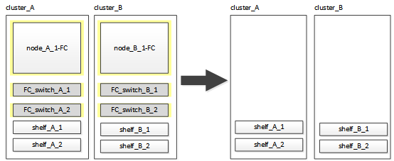

= Transitioning the MetroCluster FC nodes
:icons: font
:imagesdir: ../media/

[.lead]
You must gather information from the existing MetroCluster FC nodes, send an autosupport message announcing the start of maintenance, and transition the nodes.

== Gathering information from the existing controller modules before the transition

[.lead]
Before transitioning, you must gather information for each of the nodes.

This task is performed on the existing nodes:

* node_A_1-FC
* node_B_1-FC

. Gather the output from the following commands.
+
|===
| Category| Commands
a|
License
a|
system license show
a|
Shelves, numbers of disks in each shelf, flash storage details, memory, NVRAM, and network cards
a|
system node run -node node_name sysconfig
a|
Cluster network and node management LIFs
a|
system node run -node node_name sysconfig network interface show -role cluster,node-mgmt,data
a|
SVM information
a|
vserver show
a|
Protocol information
a|
    nfs show
+
iscsi show
+
cifs show
a|
Physical ports
a|
    network port show -node node_name -type physical
+
network port show
a|
Failover Groups
a|
    network interface failover-groups show -vserver vserver_name
+
Record the names and ports of failover groups that are not clusterwide.
a|
VLAN configuration
a|
network port vlan show -node node_name     Record each network port and VLAN ID pairing.
a|
Interface group configuration
a|
network port ifgrp show -node node_name -instance     Record the names of the interface groups and the ports assigned to them.
a|
Broadcast domains
a|
network port broadcast-domain show
a|
IPspace
a|
network ipspace show
a|
Volume info
a|
    volume show
+
volume show -fields encrypt
a|
Aggregate Info
a|
    storage aggregate show
+
storage aggr encryption show
+
storage aggregate object-store show
a|
Disk ownership information
a|
    storage aggregate show
+
storage aggr encryption show

storage aggregate object-store show
    a|
    Encryption
    a|
        storage failover mailbox-disk show

....
 security key-manager backup show

 Also preserve the passphrase used to enable key-manager. In the case of external key-manager you will need the authentication information for the client and server.

 security key-manager show

 security key-manager external show

 systemshell local kenv kmip.init.ipaddr ip-address

 systemshell local kenv kmip.init.netmask netmask

 systemshell local kenv kmip.init.gateway gateway

 systemshell local kenv kmip.init.interface interface


|===
....

== Sending a custom AutoSupport message prior to maintenance

[.lead]
Before performing the maintenance, you should issue an AutoSupport message to notify NetApp technical support that maintenance is underway. This prevents them from opening a case on the assumption that a disruption has occurred.

This task must be performed on each MetroCluster site.

. To prevent automatic support case generation, send an Autosupport message to indicate maintenance is underway.
 .. Issue the following command: `system node autosupport invoke -node * -type all -message MAINT=maintenance-window-in-hours`
+
maintenance-window-in-hours specifies the length of the maintenance window, with a maximum of 72 hours. If the maintenance is completed before the time has elapsed, you can invoke an AutoSupport message indicating the end of the maintenance period:``system node autosupport invoke -node * -type all -message MAINT=end``

 .. Repeat the command on the partner cluster.

== Transitioning, shutting down, and removing the MetroCluster FC nodes

[.lead]
In addition to issuing commands on the MetroCluster FC nodes, this task includes physical uncabling and removal of the controller modules at each site.

This task must be performed on each of the old nodes:

* node_A_1-FC
* node_B_1-FC

. Stop all client traffic.
. On either of the MetroCluster FC nodes, for example node_A_1-FC, enable transition.
 .. Set the advanced privilege level: `set -priv advanced`
 .. Enable transition: `metrocluster transition enable -transition-mode disruptive`
 .. Return to admin mode: `set -priv admin`
. Unmirror the root aggregate by deleting the remote plex of the root aggregates.
 .. Identify the root aggregates: `storage aggregate show -root true`
 .. Display the pool1 aggregates: `storage aggregate plex show -pool 1`
 .. Delete the local plex of the root aggregate: `aggr plex delete aggr-name -plex plex-name`
 .. Offline the remote plex of the root aggregate: `aggr plex offline root-aggregate -plex remote-plex-for-root-aggregate`
+
For example:
+
----
 # aggr plex offline aggr0_node_A_1-FC_01 -plex plex4
----
. Confirm the mailbox count, disk autoassign, and transition mode before proceeding using the following commands on each controller:
 .. Set the advanced privilege level: `set -priv advanced`
 .. Confirm that only three mailbox drives are shown for each controller module: `storage failover mailbox-disk show`
 .. Return to admin mode: `set -priv admin`
 .. Confirm that the transition mode is disruptive: metrocluster transition show
. Check for any broken disks: `disk show -broken`
. Remove or replace any broken disks
. Confirm aggregates are healthy using the following commands on node_A_1-FC and node_B_1-FC:``storage aggregate show```storage aggregate plex show`
+
The storage aggregate show command indicates that the root aggregate is unmirrored.

. Check for any VLANs or interface groups: `network port ifgrp show``network port vlan show`
+
If none are present, skip the following two steps.

. Display the list of LIfs using VLANs or ifgrps: `network interface show -fields home-port,curr-port``network port show -type if-group | vlan`
. Remove any VLANs and interface groups.
+
You must perform these steps for all LIFs in all SVMs, including those SVMs with the -mc suffix.

 .. Move any LIFs using the VLANs or interface groups to an available port: `network interface modify -vserver vserver-name -lif lif_name -home- port port`
 .. Display the LIFs that are not on their home ports: `network interface show -is-home false`
 .. Revert all LIFs to their respective home ports: `network interface revert -vserver vserver_name -lif lif_name`
 .. Verify that all LIFs are on their home ports: `network interface show -is-home false`
+
No LIFs should appear in the output.

 .. Remove VLAN and ifgrp ports from broadcast domain:: `network port broadcast-domain remove-ports -ipspace ipspace -broadcast-domain broadcast-domain-name -ports nodename:portname,nodename:portname,..`
 .. Verify that all the vlan and ifgrp ports are not assigned to a broadcast domain: `network port show -type if-group | vlan`
 .. Delete all VLANs: `network port vlan delete -node nodename -vlan-name vlan-name`
 .. Delete interface groups: `network port ifgrp delete -node nodename -ifgrp ifgrp-name`

. Move any LIFs as required to resolve conflicts with the MetroCluster IP interface ports.
+
You must move the LIFs identified in step 1 of link:concept_requirements_for_fc_to_ip_transition_2n_mcc_transition.md#[Mapping ports from the MetroCluster FC nodes to the MetroCluster IP nodes].

 .. Move any LIFs hosted on the desired port to another port: `network interface modify -lif lifname -vserver vserver-name -home-port new-homeport``network interface revert -lif lifname -vserver vservername`
 .. If necessary, move the destination port to an appropriate IPspace and broadcast domain. `network port broadcast-domain remove-ports -ipspace current-ipspace -broadcast-domain current-broadcast-domain -ports controller-name:current-port``network port broadcast-domain add-ports -ipspace new-ipspace -broadcast-domain new-broadcast-domain -ports controller-name:new-port`

. Halt the MetroCluster FC controllers (node_A_1-FC and node_B_1-FC): `system node halt`
. At the LOADER prompt, synchronize the hardware clocks between the FC and IP controller modules.
 .. On the old MetroCluster FC node (node_A_1-FC), display the date: `show date`
 .. On the new MetroCluster IP controllers (node_A_1-IP and node_B_1-IP), set the date shown on original controller: `set date mm/dd/yy`
 .. On the new MetroCluster IP controllers (node_A_1-IP and node_B_1-IP), verify the date: `show date`
. Halt and power off the MetroCluster FC controller modules (node_A_1-FC and node_B_1-FC), FC-to-SAS bridges (if present), FC switches (if present) and each storage shelf connected to these nodes.
. Disconnect the shelves from the MetroCluster FC controllers and document which shelves are local storage to each cluster.
+
If the configuration uses FC-to-SAS bridges or FC back-end switches, disconnect and remove them.

. In Maintenance mode on the MetroCluster FC nodes (node_A_1-FC and node_B_1-FC), confirm no disks are connected: `disk show -v`
. Power down and remove the MetroCluster FC nodes.

At this point, the MetroCluster FC controllers have been removed and the shelves are disconnected from all controllers.


