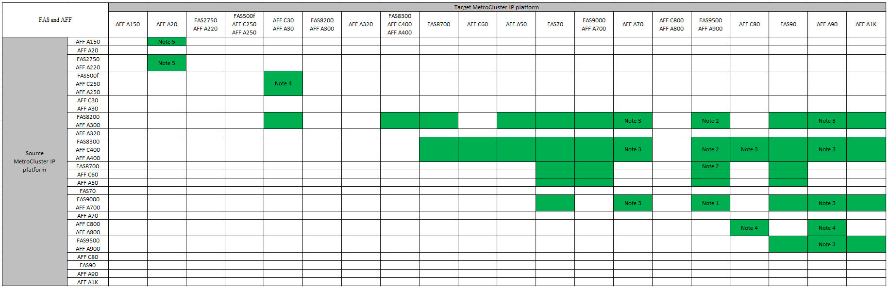
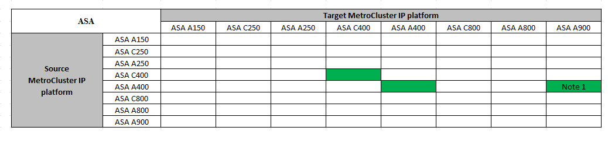
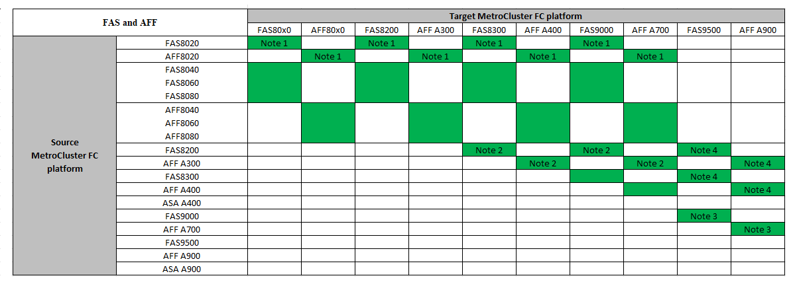

= Choose a controller upgrade procedure
:icons: font
:imagesdir: ../media/

[.lead]
The controller upgrade procedure you use depends on the platform model and type of MetroCluster configuration.

In an upgrade procedure, the controllers are replaced with a new controller model. The storage shelf models are not upgraded.

* In switchover and switchback procedures, the MetroCluster switchover operation is used to provide nondisruptive service to clients while the controller modules on the partner cluster are upgraded.

* In an ARL-based controller upgrade procedure, the aggregate relocation operations are used to nondisruptively move data from the old configuration to the new, upgraded configuration.

== Supported controller upgrades

Learn about supported MetroCluster IP and FC controller upgrade combinations. 

=== Supported MetroCluster IP controller upgrades using "system controller replace" commands

Refer to the table in link:task_upgrade_controllers_system_control_commands_in_a_four_node_mcc_ip.html[Upgrade controllers in a four-node MetroCluster IP configuration using switchover and switchback with "system controller replace" commands (ONTAP 9.13.1 and later)] for supported platforms.

=== All other supported MetroCluster IP controller upgrades

Find your *Source* platform from the MetroCluster controller upgrade tables in this section. If the intersection of the *Source* platform row and *Target* platform column is blank, the upgrade is not supported.

* If your platform is not listed, there is no supported controller upgrade combination.

* When you perform a controller upgrade, the old and the new platform type *must* match:

** You can upgrade a FAS system to a FAS system, or an AFF A-Series to an AFF A-Series.
** You cannot upgrade a FAS system to an AFF A-Series, or an AFF A-Series to an AFF C-Series.
+
For example, if the platform you want to upgrade is a FAS8200, you can upgrade to a FAS9000. You cannot upgrade a FAS8200 system to an AFF A700 system. 
* All nodes (old and new) in the MetroCluster configuration must be running the same ONTAP version.

.Supported AFF and FAS MetroCluster IP controller upgrades 

The following table shows the supported platform combinations for upgrading an AFF or FAS system manually in a MetroCluster IP configuration:

* Note 1: For this upgrade use the procedure link:task_upgrade_A700_to_A900_in_a_four_node_mcc_ip_us_switchover_and_switchback.html[Upgrade controllers from AFF A700/FAS9000 to AFF A900/FAS9500 in a MetroCluster IP configuration using switchover and switchback (ONTAP 9.10.1 or later)]
* Note 2: Controller upgrades are supported on systems running ONTAP 9.13.1 or later.
* Note 3: The target platform cannot have internal drives until after the controller upgrade is complete. You can add the internal drives after the upgrade.
* Note 4: Requires replacement of the controller modules.
* Note 5: Requires IOM modules to convert the old controllers to an external SAS shelf. Refer to the link:https://hwu.netapp.com/[NetApp Hardware Universe^] for supported IOM modules.

.Supported ASA MetroCluster IP controller upgrades 

The following table shows the supported platform combinations for upgrading an ASA system manually in a MetroCluster IP configuration:

* Note 1: Controller upgrades are supported on systems running ONTAP 9.13.1 or later.

=== Supported MetroCluster FC controller upgrades

Find your *Source* platform from the MetroCluster controller upgrade tables in this section. If the intersection of the *Source* platform row and *Target* platform column is blank, the upgrade is not supported.

* If your platform is not listed, there is no supported controller upgrade combination.

* When you perform a controller upgrade, the old and the new platform type *must* match:

** You can upgrade a FAS system to a FAS system, or an AFF A-Series to an AFF A-Series.
** You cannot upgrade a FAS system to an AFF A-Series, or an AFF A-Series to an AFF C-Series.
+
For example, if the platform you want to upgrade is a FAS8200, you can upgrade to a FAS9000. You cannot upgrade a FAS8200 system to an AFF A700 system. 
* All nodes (old and new) in the MetroCluster configuration must be running the same ONTAP version.

.Supported AFF and FAS MetroCluster FC controller upgrades 

The following table shows the supported platform combinations for upgrading an AFF or FAS system in a MetroCluster FC configuration:

* Note 1: For upgrading controllers when FCVI connections on existing FAS8020 or AFF8020 nodes use ports 1c and 1d, see the following
 https://kb.netapp.com/Advice_and_Troubleshooting/Data_Protection_and_Security/MetroCluster/Upgrading_controllers_when_FCVI_connections_on_existing_FAS8020_or_AFF8020_nodes_use_ports_1c_and_1d[Knowledge base article^].

* Note 2: Controller upgrades from AFF A300 or FAS8200 platforms using onboard ports 0e and 0f as FC-VI connections are only supported on the following systems:
** ONTAP 9.9.1 and earlier 	
** ONTAP 9.10.1P9 	
** ONTAP 9.11.1P5 	
** ONTAP 9.12.1GA 	
** ONTAP 9.13.1 and later
+
For more information, review the link:https://mysupport.netapp.com/site/bugs-online/product/ONTAP/BURT/1507088[Public Report^].

* Note 3: For this upgrade refer to link:task_upgrade_A700_to_A900_in_a_four_node_mcc_fc_us_switchover_and_switchback.html[Upgrade controllers from AFF A700/FAS9000 to AFF A900/FAS9500 in a MetroCluster FC configuration using switchover and switchback (ONTAP 9.10.1 or later)]

* Note 4: Controller upgrades are supported on systems running ONTAP 9.13.1 or later.

.Supported ASA MetroCluster FC controller upgrades 

The following table shows the supported platform combinations for upgrading an ASA system in a MetroCluster FC configuration:

[cols=3*,options="header"]
|===
| Source MetroCluster FC platform
| Destination MetroCluster FC platform
| Supported?
.2+| ASA A400 | ASA A400 | Yes | ASA A900 | No
.2+| ASA A900 | ASA A400 | No | ASA A900 | Yes (see Note 1)
|===

* Note 1: Controller upgrades are supported on systems running ONTAP 9.14.1 or later.

== Choose a procedure that uses the switchover and switchback process

After reviewing the supported upgrade combinations, choose the correct controller upgrade procedure for your configuration. 

[cols="2,1,1,2"]
|===

h| MetroCluster type h| Upgrade method  h| ONTAP version h| Procedure

a|
IP 
a|
Upgrade with 'system controller replace' commands
a|
9.13.1 and later
a|
link:task_upgrade_controllers_system_control_commands_in_a_four_node_mcc_ip.html[Link to procedure]
a|
FC 
a|
Upgrade with 'system controller replace' commands
a|
9.10.1 and later
a|
link:task_upgrade_controllers_system_control_commands_in_a_four_node_mcc_fc.html[Link to procedure]
a|
FC
a|
Manual upgrade with CLI commands (AFF A700/FAS9000 to AFF A900/FAS9500 only)
a|
9.10.1 and later
a|
link:task_upgrade_A700_to_A900_in_a_four_node_mcc_fc_us_switchover_and_switchback.html[Link to procedure]
a|
IP 
a|
Manual upgrade with CLI commands (AFF A700/FAS9000 to AFF A900/FAS9500 only)
a|
9.10.1 and later
a|
link:task_upgrade_A700_to_A900_in_a_four_node_mcc_ip_us_switchover_and_switchback.html[Link to procedure]
a|
FC 
a|
Manual upgrade with CLI commands
a|
9.8 and later
a|
link:task_upgrade_controllers_in_a_four_node_fc_mcc_us_switchover_and_switchback_mcc_fc_4n_cu.html[Link to procedure]

a|
IP 
a|
Manual upgrade with CLI commands
a|
9.8 and later
a|
link:task_upgrade_controllers_in_a_four_node_ip_mcc_us_switchover_and_switchback_mcc_ip.html[Link to procedure]

|===

== Choosing a procedure using aggregate relocation

In an ARL-based controller upgrade procedure, the aggregate relocation operations are used to
nondisruptively move data from the old configuration to the new, upgraded configuration.

|===
h| MetroCluster type  h| Aggregate relocation  h| ONTAP version h| Procedure

a|
FC 
a|
Using "system controller replace" commands to upgrade controller models in the same chassis
a|
9.10.1 and later
a|
https://docs.netapp.com/us-en/ontap-systems-upgrade/upgrade-arl-auto-affa900/index.html[Link to procedure^]

a|
FC 
a|
Using `system controller replace` commands
a|
9.8 and later
a|
https://docs.netapp.com/us-en/ontap-systems-upgrade/upgrade-arl-auto-app/index.html[Link to procedure^]

a|
FC 
a|
Using `system controller replace` commands
a|
9.5 through 9.7
a|
https://docs.netapp.com/us-en/ontap-systems-upgrade/upgrade-arl-auto/index.html[Link to procedure^]

a|
FC 
a|
Using manual ARL commands
a|
9.8
a|
https://docs.netapp.com/us-en/ontap-systems-upgrade/upgrade-arl-manual-app/index.html[Link to procedure^]

a|
FC 
a|
Using manual ARL commands
a|
9.7 and earlier
a|
https://docs.netapp.com/us-en/ontap-systems-upgrade/upgrade-arl-manual/index.html[Link to procedure^]

|===

// 2024 Jul 31, ONTAPDOC-2219
// 2024 Jun 17, ONTAPDOC-1734
// 2024 Feb 2024, ONTAPDOC-1708
// 2023 Oct 24, ONTAPDOC-1201
// 2023 APR 17, BURT 1535231
// BURT 1491888  August 8th, 2022
// 2022-DEC-19, BURT 1509650
// 2023-MAR-9, BURT 1533595 (new C-Series platforms)

