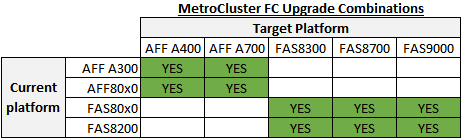
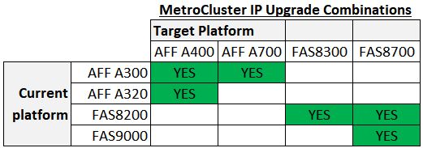

= Choose a controller upgrade procdure
:icons: font
:imagesdir: ../media/

[.lead]
The controller upgrade procedure you use depends on the platform model, scope of the upgrade, and type of MetroCluster configuration.

== Supported platform combinations for controller upgrade using switchover and switchback in a MetroCluster FC configuration

* The target (new) platform must be a different model than the original platform.
* Platform models with internal shelves are not supported.
* You can only upgrade specific platform models using this procedure in a MetroCluster FC configuration. 
** The following table shows the supported platform model combinations. 
** If the intersection of the *Current platform* row and *Target platform* column is not green, this procedure cannot be used. 
+
Refer to https://docs.netapp.com/us-en/ontap-metrocluster/upgrade/concept_choosing_an_upgrade_method_mcc.html[Choosing an upgrade or refresh method] for additional procedures.

NOTE: Upgrading a FAS8020 or AFF8020 is not supported when using 1c and 1d ports in FC-VI mode.

== Supported platform combinations for controller upgrade using switchover and switchback in a MetroCluster FC configuration

* The platforms must be running ONTAP 9.8 or later.
* The target (new) platform must be a different model than the original platform.

* Platform models with internal shelves are not supported.
* You can only upgrade specific platform models using this procedure in a MetroCluster IP configuration. 
** The following table shows the supported platform model combinations. 
** If the intersection of the *Current platform* row and *Target platform* column is not green, this procedure cannot be used. 
+
Refer to https://docs.netapp.com/us-en/ontap-metrocluster/upgrade/concept_choosing_an_upgrade_method_mcc.html[Choosing an upgrade or refresh method] for additional procedures.

NOTE: AFF A320 platform models are not supported for upgrade when using BES-53248 IP switches.

== Choosing a procedure that does not use aggregate relocation

|===

h| Type of upgrade or refresh h| MetroCluster type h| First ONTAP version support h| Procedure

a|
* Scope: Platform (controller modules) only
* Method: Automated switchover/switchback
a|
FC
a|
9.10.1
a|
link:task_upgrade_controllers_system_control_commands_in_a_four_node_mcc_fc.html[Upgrading controllers in a four-node MetroCluster FC configuration using switchover and switchback with "system controller replace" commands (ONTAP 9.10.1 and later)]
a|
* Scope: Platform (controller modules) only
* Method: Automated switchover/switchback
a|
IP
a|
9.10.1
a|
link:task_upgrade_A700_to_A900_in_a_four_node_mcc_ip_us_switchover_and_switchback.html[Upgrade controllers from AFF A700 to AFF A900 in a MetroCluster IP configuration using switchover and switchback (ONTAP 9.10.1 and later)]

a|
* Scope: Platform (controller modules) only
* Method: Switchover/switchback
a|
FC
a|
9.8
a|
link:task_upgrade_controllers_in_a_four_node_fc_mcc_us_switchover_and_switchback_mcc_fc_4n_cu.html[Upgrading controllers in a MetroCluster FC configuration using switchover and switchback]

a|
* Scope: Platform (controller modules) only
* Method: Switchover/switchback
a|
IP
a|
9.8
a|
link:task_upgrade_controllers_in_a_four_node_ip_mcc_us_switchover_and_switchback_mcc_ip.html[Upgrading controllers in a MetroCluster IP configuration using switchover and switchback (ONTAP 9.8 and later)]

|===

== Choosing a procedure using aggregate relocation

|===
h| Aggregate relocation procedure h|  MetroCluster type h| First ONTAP version support h| Procedure

a|
Using `system controller replace` commands and swapping the controller module and NVM
a|
FC
a|
9.10.1 and later
a|
https://docs.netapp.com/us-en/ontap-systems-upgrade/upgrade-arl-auto-affa900/index.html[Use "system controller replace" commands to upgrade AFF A700 to AFF A900 running ONTAP 9.10.1 RC2 or later^]

a|
Using `system controller replace` commands
a|
FC
a|
9.8 and later
a|
https://docs.netapp.com/us-en/ontap-systems-upgrade/upgrade-arl-auto-app/index.html[Using "`system controller replace`" commands to upgrade controller hardware running ONTAP 9.8 and later^]

a|
Using `system controller replace` commands
a|
FC
a|
9.5 through 9.7
a|
https://docs.netapp.com/us-en/ontap-systems-upgrade/upgrade-arl-auto/index.html[Using "`system controller replace`" commands to upgrade controller hardware running ONTAP 9.5 to ONTAP 9.7^]

a|
Using manual ARL commands
a|
FC
a|
9.8
a|
https://docs.netapp.com/us-en/ontap-systems-upgrade/upgrade-arl-manual-app/index.html[Manually upgrade controller hardware running ONTAP 9.8 and later^]

a|
Using manual ARL commands
a|
FC
a|
9.7 and earlier
a|
https://docs.netapp.com/us-en/ontap-systems-upgrade/upgrade-arl-manual/index.html[Manually upgrade controller hardware running ONTAP 9.7 and earlier^]

|===

// BURT 1491888  August 8th, 2022
