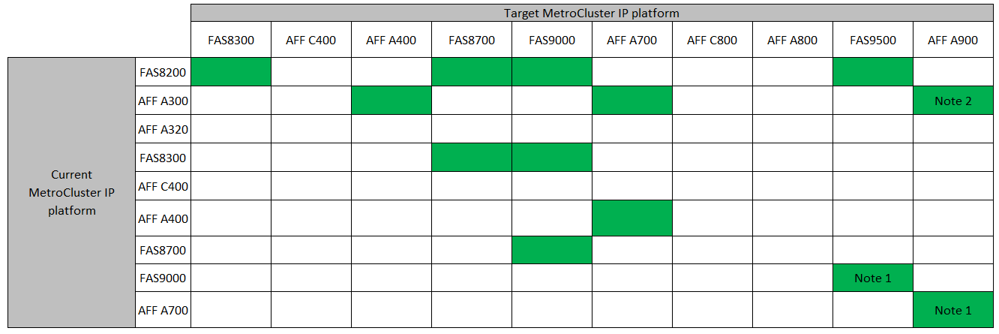
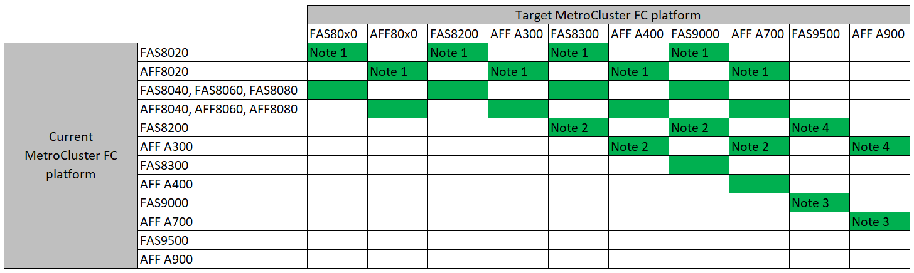

= Choose a controller upgrade procedure
:icons: font
:imagesdir: ../media/

[.lead]
The controller upgrade procedure you use depends on the platform model and type of MetroCluster configuration.

In an upgrade procedure, the controllers are replaced with a
new controller model.
The storage shelf models are not upgraded.

* In switchover and switchback procedures, the MetroCluster switchover operation is used to provide
nondisruptive service to clients while the controller modules on the partner cluster are upgraded.

* In an ARL-based controller upgrade procedure, the aggregate relocation operations are used to
nondisruptively move data from the old configuration to the new, upgraded configuration.

== Choosing a procedure that uses the switchover and switchback process

Select your Current platform from the FC or IP table below. If the intersection of the Current platform row and Target platform column is blank, the upgrade is not supported.

=== Supported MetroCluster IP controller upgrades

* Note 1: For this upgrade use the procedure link:task_upgrade_A700_to_A900_in_a_four_node_mcc_ip_us_switchover_and_switchback.html[Upgrade controllers from AFF A700/FAS9000 to AFF A900/FAS9500 in a MetroCluster IP configuration using switchover and switchback (ONTAP 9.10.1 or later)]
// removing as not supported in table: * AFF A320 platform models are not supported for upgrade when using BES-53248 IP switches.

=== Supported MetroCluster FC controller upgrades

* Note 1: For upgrading controllers when FCVI connections on existing FAS8020 or AFF8020 nodes use ports 1c and 1d, see the following
 https://kb.netapp.com/Advice_and_Troubleshooting/Data_Protection_and_Security/MetroCluster/Upgrading_controllers_when_FCVI_connections_on_existing_FAS8020_or_AFF8020_nodes_use_ports_1c_and_1d[Knowledge base article].

* Note 2: Controller upgrades from AFF A300 or FAS8200 platforms using onboard ports 0e and 0f as FC-VI connections are supported only on systems running ONTAP 9.9.1. or earlier, or ONTAP 9.10.1P9 and later. For more information, review the link:https://mysupport.netapp.com/site/bugs-online/product/ONTAP/BURT/1507088[Public Report].

* Note 3: For this upgrade refer to link:task_upgrade_A700_to_A900_in_a_four_node_mcc_fc_us_switchover_and_switchback.html[Upgrade controllers from AFF A700/FAS9000 to AFF A900/FAS9500 in a MetroCluster FC configuration using switchover and switchback (ONTAP 9.10.1 or later)]

[cols="2,1,1,2"]
|===

h| MetroCluster type h| Upgrade method  h| ONTAP version h| Procedure

a|
FC 
a|
Upgrade with 'system controller replace' commands
a|
9.10.1 and later
a|
link:task_upgrade_controllers_system_control_commands_in_a_four_node_mcc_fc.html[Link to procedure]
a|
FC
a|
Manual upgrade with CLI commands (AFF A700/FAS9000 to AFF A900/FAS9500 only)
a|
9.10.1 and later
a|
link:task_upgrade_A700_to_A900_in_a_four_node_mcc_fc_us_switchover_and_switchback.html[Link to procedure]
a|
IP 
a|
Manual upgrade with CLI commands (AFF A700/FAS9000 to AFF A900/FAS9500 only)
a|
9.10.1 and later
a|
link:task_upgrade_A700_to_A900_in_a_four_node_mcc_ip_us_switchover_and_switchback.html[Link to procedure]
a|
FC 
a|
Manual upgrade with CLI commands
a|
9.8 and later
a|
link:task_upgrade_controllers_in_a_four_node_fc_mcc_us_switchover_and_switchback_mcc_fc_4n_cu.html[Link to procedure]

a|
IP 
a|
Manual upgrade with CLI commands
a|
9.8 and later
a|
link:task_upgrade_controllers_in_a_four_node_ip_mcc_us_switchover_and_switchback_mcc_ip.html[Link to procedure]

|===

== Choosing a procedure using aggregate relocation

In an ARL-based controller upgrade procedure, the aggregate relocation operations are used to
nondisruptively move data from the old configuration to the new, upgraded configuration.

|===
h| MetroCluster type  h| Aggregate relocation  h| ONTAP version h| Procedure

a|
FC 
a|
Using `system controller replace` commands and swapping the controller module and NVM (upgrade from AFF A700 to AFF A900 only)
a|
9.10.1 and later
a|
https://docs.netapp.com/us-en/ontap-systems-upgrade/upgrade-arl-auto-affa900/index.html[Link to procedure^]

a|
FC 
a|
Using `system controller replace` commands
a|
9.8 and later
a|
https://docs.netapp.com/us-en/ontap-systems-upgrade/upgrade-arl-auto-app/index.html[Link to procedure^]

a|
FC 
a|
Using `system controller replace` commands
a|
9.5 through 9.7
a|
https://docs.netapp.com/us-en/ontap-systems-upgrade/upgrade-arl-auto/index.html[Link to procedure^]

a|
FC 
a|
Using manual ARL commands
a|
9.8
a|
https://docs.netapp.com/us-en/ontap-systems-upgrade/upgrade-arl-manual-app/index.html[Link to procedure^]

a|
FC 
a|
Using manual ARL commands
a|
9.7 and earlier
a|
https://docs.netapp.com/us-en/ontap-systems-upgrade/upgrade-arl-manual/index.html[Link to procedure^]

|===

// BURT 1491888  August 8th, 2022
// 2022-DEC-19, BURT 1509650
