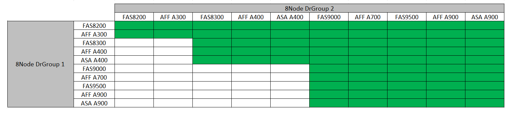
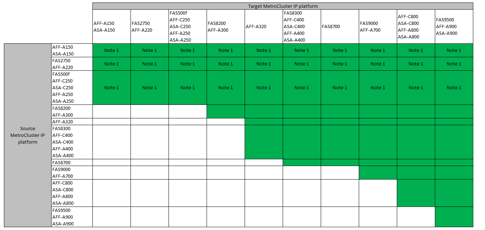

= Choosing a system refresh method
:icons: font
:imagesdir: ../media/

[.lead]
The system refresh procedure you use depends on the platform model, and type of MetroCluster configuration.
Refresh procedures apply to the controllers and the storage shelves.
In the refresh procedures, new controllers and shelves are added to the MetroCluster configuration,
creating a second DR group, and then data is nondisruptively migrated to the new nodes.
The original controllers are then retired.

=== Supported MetroCluster FC tech refresh combinations

* You must complete the tech refresh procedure before adding a new load.
* All nodes in the MetroCluster configuration must be running the same ONTAP version. For example, if you have an eight-node configuration, all eight nodes must be running the same ONTAP version. 
* Do not exceed any object limits of the 'lower' of the platforms in the combination. Apply the lower object limit of the two platforms.
* If the target platform limits are lower then the MetroCluster limits, you must reconfigure the MetroCluster to be at, or below, the target platform limits before you add the new nodes. 
* Refer to the link:https://hwu.netapp.html[Hardware universe^] for platform limits. 

=== Supported MetroCluster IP tech refresh combinations

*Note 1:* This combination requires ONTAP 9.13.1 or later. 

* You must complete the tech refresh procedure before adding a new load.
* All nodes in the MetroCluster configuration must be running the same ONTAP version. For example, if you have an eight-node configuration, all eight nodes must be running the same ONTAP version. 
* Do not exceed any object limits of the 'lower' of the platforms in the combination. Apply the lower object limit of the two platforms.
* If the target platform limits are lower than the MetroCluster limits, you must reconfigure the MetroCluster to be at, or below, the target platform limits before you add the new nodes. 											
* Refer to the link:https://hwu.netapp.html[Hardware universe^] for platform limits. 

[%header,cols="2,1,1,2"]
|===
a| Refresh method
a| Configuration type
a| ONTAP version
a| Procedure
a|
* Method: Expand the MetroCluster configuration and then remove the old nodes
a|
Four-node FC
a|
9.6 and later
a|
link:task_refresh_4n_mcc_fc.html[Link to procedure]

a|
* Method: Expand the MetroCluster configuration and then remove the old nodes
a|
Four-node IP
a|
9.8 and later
a|
link:task_refresh_4n_mcc_ip.html[Link to procedure]

|===

// 2023 Feb 6, ONTAPDOC-1633
// BURT 1491888  August 8th, 2022
// 2022-DEC-14, BURT 1509650

// 2023-MAR-9, BURT 1533595 (new C-Series platforms)

