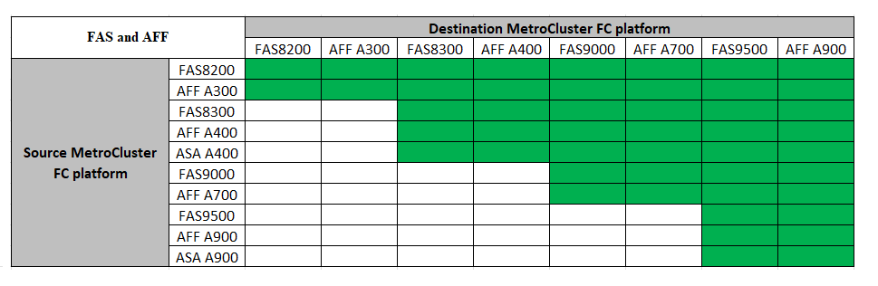
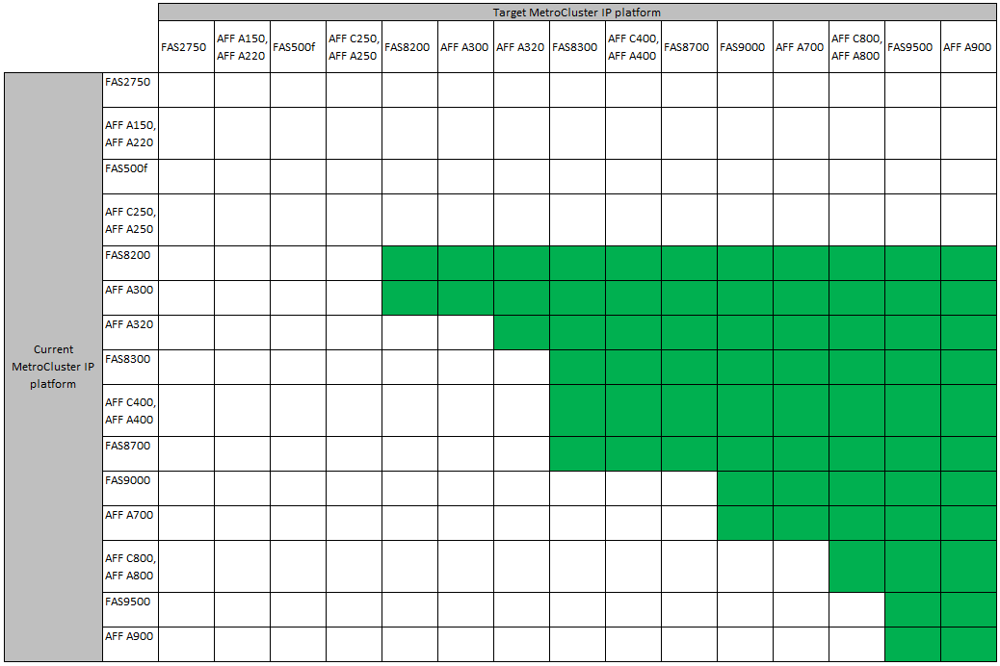

= Choosing a system refresh method
:icons: font
:imagesdir: ../media/

[.lead]
The system refresh procedure you use depends on the platform model, and type of MetroCluster configuration.
Refresh procedures apply to the controllers and the storage shelves.
In the refresh procedures, new controllers and shelves are added to the MetroCluster configuration,
creating a second DR group, and then data is nondisruptively migrated to the new nodes.
The original controllers are then retired.

=== Supported MetroCluster FC tech refresh combinations

* Ensure that you complete the tech refresh procedure before adding a new load.
 
NOTE: Do not exceed any object limits of the 'lower' of the platforms in the combination. Apply the lower object limit of the two platforms. Refer to the link:https://hwu.netapp.html[Hardware universe^] for platform limits. 

=== Supported MetroCluster IP tech refresh combinations

* Finish the tech refresh procedure before adding a new load.
 
NOTE: Do not exceed any object limits of the 'lower' of the platforms in the combination. Apply the lower object limit of the two platforms. Refer to the link:https://hwu.netapp.html[Hardware universe^] for platform limits. 

[%header,cols="2,1,1,2"]
|===
a| Refresh method
a| Configuration type
a| ONTAP version
a| Procedure
a|
* Method: Expand the MetroCluster configuration and then remove the old nodes
a|
Four-node FC
a|
9.6 and later
a|
link:task_refresh_4n_mcc_fc.html[Link to procedure]

a|
* Method: Expand the MetroCluster configuration and then remove the old nodes
a|
Four-node IP
a|
9.8
a|
link:task_refresh_4n_mcc_ip.html[Link to procedure]

|===

// BURT 1491888  August 8th, 2022
// 2022-DEC-14, BURT 1509650
