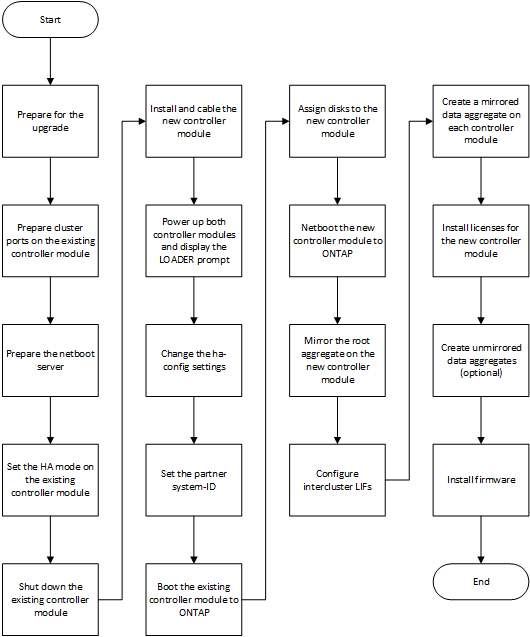

= Adding a new controller module to each cluster
:icons: font
:imagesdir: ../media/

[.lead]
You must add a new controller module to each site, creating an HA pair in each site. This is a multistep process involving both hardware and software changes that must be performed in the proper order at each site.

* The new controller module must be received from NetApp as part of the upgrade kit.
+
You should verify that PCIe cards in the new controller module are compatible and supported by the new controller module.
+
https://hwu.netapp.com[NetApp Hardware Universe]

* Your system must have an empty slot available for the new controller module when upgrading to a single-chassis HA pair (an HA pair in which both controller modules reside in the same chassis).
+
NOTE: This configuration is not supported on all systems. Platforms with single chassis configurations that are supported in ONTAP 9 are AFF A300, FAS8200, FAS8300, AFF A400, AFF80xx, FAS8020, FAS8060, FAS8080, and FAS9000.

* You must have rack space and cables for the new controller module when upgrading to a dual-chassis HA pair (an HA pair in which the controller modules reside in separate chassis).
+
NOTE: This configuration is not supported on all systems.

* You must connect each controller module to the management network through its e0a port or, if your system has one, you can connect to the e0M port as the management port.
* These tasks must be repeated at each site.
* The preexisting controller modules are referred to as the _existing_ controller modules.
+
The examples in this procedure have the console prompt `existing_ctlr>`.

* The controller modules that are being added are referred to as the _new_ controller modules; the examples in this procedure have the console prompt `new_ctlr>`.
* This task uses the following workflow:

