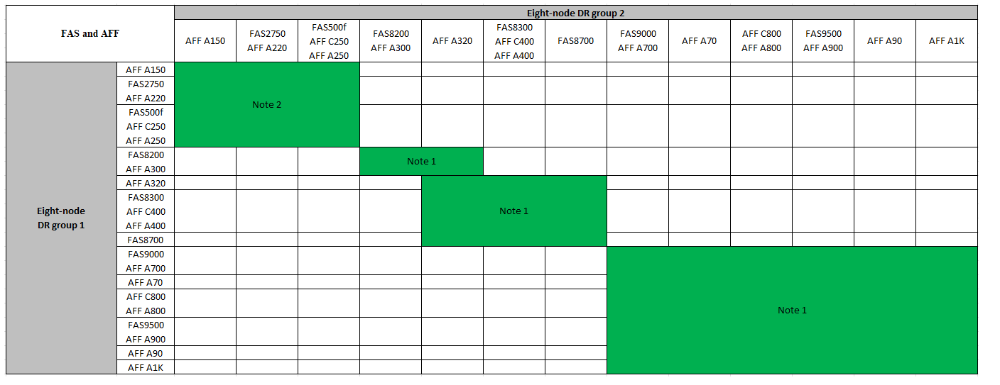
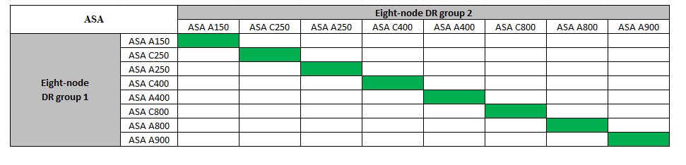

= Expand a MetroCluster IP configuration
:icons: font
:imagesdir: ../media/

[.lead]
Depending on your ONTAP version, you can expand your MetroCluster IP configuration by adding four new nodes as a new DR group.

Beginning with ONTAP 9.13.1, you can temporarily expand an eight-node MetroCluster configuration to refresh the controllers and storage. See link:task_refresh_4n_mcc_ip.html[Refreshing a four-node or an eight-node MetroCluster IP configuration (ONTAP 9.8 and later)] for more information.

Beginning with ONTAP 9.9.1, you can add four new nodes to the MetroCluster IP configuration as a second DR group. This creates an eight-node MetroCluster configuration.

.Before you begin

* The old and new nodes must be running the same version of ONTAP.

* This procedure describes the steps required to add one four-node DR group to an existing MetroCluster IP configuration. If you are refreshing an eight-node configuration, you must repeat the entire procedure for each DR group, adding one at a time.

* Verify that the old and new platform models are supported for platform mixing.
+
https://hwu.netapp.com[NetApp Hardware Universe^]

* Verify that the old and new platform models are both supported by the IP switches.
+
https://hwu.netapp.com[NetApp Hardware Universe^]

* If you are link:task_refresh_4n_mcc_ip.html[refreshing a four-node or an eight-node MetroCluster IP configuration], the new nodes must have enough storage to accommodate the data of the old nodes, along with adequate disks for root aggregates and spare disks.

* Verify that you have a default broadcast domain created on the old nodes. 
+
When you add new nodes to an existing cluster without a default broadcast domain, node management LIFs are created for the new nodes using universal unique identifiers (UUIDs) instead of the expected names. For more information, see the Knowledge Base article https://kb.netapp.com/onprem/ontap/os/Node_management_LIFs_on_newly-added_nodes_generated_with_UUID_names[Node management LIFs on newly-added nodes generated with UUID names^].

== Enable console logging 

include::../_include/console-logging.adoc[] 

== Example naming in this procedure

This procedure uses example names throughout to identify the DR groups, nodes, and switches involved.

|===

h| DR groups h| cluster_A at site_A h| cluster_B at site_B
a|
dr_group_1-old
a|

* node_A_1-old
* node_A_2-old

a|

* node_B_1-old
* node_B_2-old

a|
dr_group_2-new
a|

* node_A_3-new
* node_A_4-new

a|

* node_B_3-new
* node_B_4-new

|===

// 2024 Aug 13, ONTAPDOC-1988
== Supported platform combinations when adding a second DR group

The following tables shows the supported platform combinations for eight-node MetroCluster IP configurations. 

[IMPORTANT] 
====
* All nodes in the MetroCluster configuration must be running the same ONTAP version. For example, if you have an eight-node configuration, all eight nodes must be running the same ONTAP version.
* The combinations in this table apply only to regular or permanent 8 node configurations. 
* The platform combinations shown in this table *do not* apply if you are using the transition or refresh procedures. 
* All nodes in one DR group must be of the same type and configuration.
====

.Supported AFF and FAS MetroCluster IP expansion combinations

The following table shows the supported platform combinations for expanding an AFF or FAS system in a MetroCluster IP configuration:

* *Note 1*: ONTAP 9.9.1 or later (or the minimum ONTAP version supported on the platform) is required for these combinations. 
* *Note 2*: ONTAP 9.13.1 or later (or the minimum ONTAP version supported on the platform) is required for these combinations. 

.Supported ASA MetroCluster IP expansion combinations

The following table shows the supported platform combinations for expanding an ASA system in a MetroCluster IP configuration:

== Sending a custom AutoSupport message prior to maintenance

Before performing the maintenance, you should issue an AutoSupport message to notify NetApp technical support that maintenance is underway. Informing technical support that maintenance is underway prevents them from opening a case on the assumption that a disruption has occurred.

.About this task

This task must be performed on each MetroCluster site.

.Steps
. To prevent automatic support case generation, send an Autosupport message to indicate the upgrade is underway.
.. Issue the following command:
+
`system node autosupport invoke -node * -type all -message "MAINT=10h Upgrading <old-model> to <new-model>`
+
This example specifies a 10 hour maintenance window. You might want to allow additional time, depending on your plan.
+
If the maintenance is completed before the time has elapsed, you can invoke an AutoSupport message indicating the end of the maintenance period:
+
`system node autosupport invoke -node * -type all -message MAINT=end`

.. Repeat the command on the partner cluster.

== Considerations for VLANs when adding a new DR group

* The following VLAN considerations apply when expanding a MetroCluster IP configuration:
+
include::../_include/models_supporting_vlan-id.adoc[]

* Both DR groups use the same VLANs when you expand from a four-node to an eight-node MetroCluster configuration.

* If both DR groups cannot be configured using the same VLAN, you must upgrade the DR group that doesn't support the `vlan-id` parameter to use a VLAN that is supported by the other DR group.

* Depending on your ONTAP version, you can change some MetroCluster IP interface properties after initial configuration. Refer to link:../maintain/task-modify-ip-netmask-properties.html[Modify the properties of a MetroCluster IP interface] for details on what is supported. 

== Verifying the health of the MetroCluster configuration

You must verify the health and connectivity of the MetroCluster configuration prior to performing the expansion.

.Steps

. Verify the operation of the MetroCluster configuration in ONTAP:
.. Check whether the system is multipathed:
+
`node run -node <node-name> sysconfig -a`

.. Check for any health alerts on both clusters:
+
`system health alert show`
.. Confirm the MetroCluster configuration and that the operational mode is normal:
+
`metrocluster show`
.. Perform a MetroCluster check:
+
`metrocluster check run`
.. Display the results of the MetroCluster check:
+
`metrocluster check show`
.. Run Config Advisor.
+
https://mysupport.netapp.com/site/tools/tool-eula/activeiq-configadvisor[NetApp Downloads: Config Advisor]

.. After running Config Advisor, review the tool's output and follow the recommendations in the output to address any issues discovered.
. Verify that the cluster is healthy:
+
`cluster show`
+
----
cluster_A::> cluster show
Node           Health  Eligibility   
-------------- ------  -----------   
node_A_1       true    true          
node_A_2       true    true          

cluster_A::>
----

. Verify that all cluster ports are up:
+
`network port show -ipspace Cluster`
+
----
cluster_A::> network port show -ipspace Cluster

Node: node_A_1-old

                                                  Speed(Mbps) Health
Port      IPspace      Broadcast Domain Link MTU  Admin/Oper  Status
--------- ------------ ---------------- ---- ---- ----------- --------
e0a       Cluster      Cluster          up   9000  auto/10000 healthy
e0b       Cluster      Cluster          up   9000  auto/10000 healthy

Node: node_A_2-old

                                                  Speed(Mbps) Health
Port      IPspace      Broadcast Domain Link MTU  Admin/Oper  Status
--------- ------------ ---------------- ---- ---- ----------- --------
e0a       Cluster      Cluster          up   9000  auto/10000 healthy
e0b       Cluster      Cluster          up   9000  auto/10000 healthy

4 entries were displayed.

cluster_A::>
----

. Verify that all cluster LIFs are up and operational:
+
`network interface show -vserver Cluster`
+
Each cluster LIF should display true for Is Home and have a Status Admin/Oper of up/up
+
----
cluster_A::> network interface show -vserver cluster

            Logical      Status     Network          Current       Current Is
Vserver     Interface  Admin/Oper Address/Mask       Node          Port    Home
----------- ---------- ---------- ------------------ ------------- ------- -----
Cluster
            node_A_1-old_clus1
                       up/up      169.254.209.69/16  node_A_1   e0a     true
            node_A_1-old_clus2
                       up/up      169.254.49.125/16  node_A_1   e0b     true
            node_A_2-old_clus1
                       up/up      169.254.47.194/16  node_A_2   e0a     true
            node_A_2-old_clus2
                       up/up      169.254.19.183/16  node_A_2   e0b     true

4 entries were displayed.

cluster_A::>
----

. Verify that auto-revert is enabled on all cluster LIFs:
+
`network interface show -vserver Cluster -fields auto-revert`
+
----
cluster_A::> network interface show -vserver Cluster -fields auto-revert

          Logical
Vserver   Interface     Auto-revert
--------- ------------- ------------
Cluster
           node_A_1-old_clus1
                        true
           node_A_1-old_clus2
                        true
           node_A_2-old_clus1
                        true
           node_A_2-old_clus2
                        true

    4 entries were displayed.

cluster_A::>
----

== Removing the configuration from monitoring applications

If the existing configuration is monitored with the MetroCluster Tiebreaker software, the ONTAP Mediator or other third-party applications (for example, ClusterLion) that can initiate a switchover, you must remove the MetroCluster configuration from the monitoring software prior to upgrade.

.Steps

. Remove the existing MetroCluster configuration from Tiebreaker, Mediator, or other software that can initiate switchover.
+
[cols="2*"]

|===

h| If you are using... h| Use this procedure...

a|
Tiebreaker
a|
link:../tiebreaker/concept_configuring_the_tiebreaker_software.html#commands-for-modifying-metrocluster-tiebreaker-configurations[Removing MetroCluster Configurations].
a|
Mediator
a|
Issue the following command from the ONTAP prompt:

`metrocluster configuration-settings mediator remove`
a|
Third-party applications
a|
Refer to the product documentation.
|===

. Remove the existing MetroCluster configuration from any third-party application that can initiate switchover.
+
Refer to the documentation for the application.

== Preparing the new controller modules

You must prepare the four new MetroCluster nodes and install the correct ONTAP version.

.About this task

This task must be performed on each of the new nodes:

* node_A_3-new
* node_A_4-new
* node_B_3-new
* node_B_4-new

In these steps, you clear the configuration on the nodes and clear the mailbox region on new drives.

.Steps

. Rack the new controllers.
. Cable the new MetroCluster IP nodes to the IP switches as shown in link:../install-ip/using_rcf_generator.html[Cable the IP switches].

. Configure the MetroCluster IP nodes using the following procedures:
.. link:../install-ip/task_sw_config_gather_info.html[Gather required information]
.. link:../install-ip/task_sw_config_restore_defaults.html[Restore system defaults on a controller module]
.. link:../install-ip/task_sw_config_verify_haconfig.html[Verify the ha-config state of components]
.. link:../install-ip/task_sw_config_assign_pool0.html#manually-assigning-drives-for-pool-0-ontap-9-4-and-later[Manually assign drives for pool 0 (ONTAP 9.4 and later)]
. From Maintenance mode, issue the halt command to exit Maintenance mode, and then issue the boot_ontap command to boot the system and get to cluster setup.
+
Do not complete the cluster wizard or node wizard at this time.

== Upgrade RCF files

If you are installing new switch firmware, you must install the switch firmware before upgrading the RCF file.

.About this task

This procedure disrupts traffic on the switch where the RCF file is upgraded. Traffic will resume once the new RCF file is applied.

.Steps
. Verify the health of the configuration.
.. Verify that the MetroCluster components are healthy:
+
`metrocluster check run`
+
----
cluster_A::*> metrocluster check run

----

+
The operation runs in the background.

.. After the `metrocluster check run` operation completes, run `metrocluster check show` to view the results.
+
After approximately five minutes, the following results are displayed:
+
----
-----------
::*> metrocluster check show

Component           Result
------------------- ---------
nodes               ok
lifs                ok
config-replication  ok
aggregates          ok
clusters            ok
connections         not-applicable
volumes             ok
7 entries were displayed.
----

.. Check the status of the running MetroCluster check operation:
+
`metrocluster operation history show -job-id 38`
.. Verify that there are no health alerts:
+
`system health alert show`
. Prepare the IP switches for the application of the new RCF files.
+
Follow the steps for your switch vendor:
+
* link:../install-ip/task_switch_config_broadcom.html[Reset the Broadcom IP switch to factory defaults]
+
* link:../install-ip/task_switch_config_cisco.html[Reset the Cisco IP switch to factory defaults]
+
* link:../install-ip/task_switch_config_nvidia.html[Reset the NVIDIA IP SN2100 switch to factory defaults]

. Download and install the IP RCF file, depending on your switch vendor.

+
NOTE: Update the switches in the following order:  Switch_A_1, Switch_B_1, Switch_A_2, Switch_B_2

* link:../install-ip/task_switch_config_broadcom.html[Download and install the Broadcom IP RCF files]

* link:../install-ip/task_switch_config_cisco.html[Download and install the Cisco IP RCF files]
+
* link:../install-ip/task_switch_config_nvidia.html[Download and install the NVIDIA IP RCF files]
+
NOTE: If you have an L2 shared or L3 network configuration, you might need to adjust the ISL ports on the intermediate/customer switches. The switch port mode might change from 'access' to 'trunk' mode. Only proceed to upgrade the second switch pair (A_2, B_2) if the network connectivity between switches A_1 and B_1 is fully operational and the network is healthy.

== Join the new nodes to the clusters

You must add the four new MetroCluster IP nodes to the existing MetroCluster configuration.

.About this task

You must perform this task on both clusters.

.Steps

. Add the new MetroCluster IP nodes to the existing MetroCluster configuration.

.. Join the first new MetroCluster IP node (node_A_1-new) to the existing MetroCluster IP configuration.
+
----

Welcome to the cluster setup wizard.

You can enter the following commands at any time:
  "help" or "?" - if you want to have a question clarified,
  "back" - if you want to change previously answered questions, and
  "exit" or "quit" - if you want to quit the cluster setup wizard.
     Any changes you made before quitting will be saved.

You can return to cluster setup at any time by typing "cluster setup".
To accept a default or omit a question, do not enter a value.

This system will send event messages and periodic reports to NetApp Technical
Support. To disable this feature, enter
autosupport modify -support disable
within 24 hours.

Enabling AutoSupport can significantly speed problem determination and
resolution, should a problem occur on your system.
For further information on AutoSupport, see:
http://support.netapp.com/autosupport/

Type yes to confirm and continue {yes}: yes

Enter the node management interface port [e0M]: 172.17.8.93

172.17.8.93 is not a valid port.

The physical port that is connected to the node management network. Examples of
node management ports are "e4a" or "e0M".

You can type "back", "exit", or "help" at any question.

Enter the node management interface port [e0M]:
Enter the node management interface IP address: 172.17.8.93
Enter the node management interface netmask: 255.255.254.0
Enter the node management interface default gateway: 172.17.8.1
A node management interface on port e0M with IP address 172.17.8.93 has been created.

Use your web browser to complete cluster setup by accessing https://172.17.8.93

Otherwise, press Enter to complete cluster setup using the command line
interface:

Do you want to create a new cluster or join an existing cluster? {create, join}:
join

Existing cluster interface configuration found:

Port    MTU     IP              Netmask
e0c     9000    169.254.148.217 255.255.0.0
e0d     9000    169.254.144.238 255.255.0.0

Do you want to use this configuration? {yes, no} [yes]: yes
.
.
.
----

.. Join the second new MetroCluster IP node (node_A_2-new) to the existing MetroCluster IP configuration.
. Repeat these steps to join node_B_1-new and node_B_2-new to cluster_B.

== Configuring intercluster LIFs, creating the MetroCluster interfaces, and mirroring root aggregates

You must create cluster peering LIFs, create the MetroCluster interfaces on the new MetroCluster IP nodes.

.About this task

* The home port used in the examples are platform-specific. You should use the home port specific to your MetroCluster IP node platform.

* Review the information in <<Considerations for VLANs when adding a new DR group>> before performing this task. 

.Steps

. On the new MetroCluster IP nodes, configure the intercluster LIFs using the following procedures:
+
link:../install-ip/task_sw_config_configure_clusters.html#peering-the-clusters[Configuring intercluster LIFs on dedicated ports]
+
link:../install-ip/task_sw_config_configure_clusters.html#peering-the-clusters[Configuring intercluster LIFs on shared data ports]

. On each site, verify that cluster peering is configured:
+
`cluster peer show`
+
The following example shows the cluster peering configuration on cluster_A:
+
----
cluster_A:> cluster peer show
Peer Cluster Name         Cluster Serial Number Availability   Authentication
------------------------- --------------------- -------------- --------------
cluster_B                 1-80-000011           Available      ok
----
+
The following example shows the cluster peering configuration on cluster_B:
+
----
cluster_B:> cluster peer show
Peer Cluster Name         Cluster Serial Number Availability   Authentication
------------------------- --------------------- -------------- --------------
cluster_A                 1-80-000011           Available      ok
cluster_B::>
----

. Create the DR group for the MetroCluster IP nodes:
+
`metrocluster configuration-settings dr-group create -partner-cluster`
+
For more information on the MetroCluster configuration settings and connections, see the following:
+
link:../install-ip/concept_considerations_mcip.html[Considerations for MetroCluster IP configurations]
+
link:../install-ip/task_sw_config_configure_clusters.html#creating-the-dr-group[Creating the DR group]
+
----
cluster_A::> metrocluster configuration-settings dr-group create -partner-cluster
cluster_B -local-node node_A_1-new -remote-node node_B_1-new
[Job 259] Job succeeded: DR Group Create is successful.
cluster_A::>
----

. Verify that the DR group was created.
+
`metrocluster configuration-settings dr-group show`
+
----
cluster_A::> metrocluster configuration-settings dr-group show

DR Group ID Cluster                    Node               DR Partner Node
----------- -------------------------- ------------------ ------------------
1           cluster_A
                                       node_A_1-old        node_B_1-old
                                       node_A_2-old        node_B_2-old
            cluster_B
                                       node_B_1-old        node_A_1-old
                                       node_B_2-old        node_A_2-old
2           cluster_A
                                       node_A_1-new        node_B_1-new
                                       node_A_2-new        node_B_2-new
            cluster_B
                                       node_B_1-new        node_A_1-new
                                       node_B_2-new        node_A_2-new
8 entries were displayed.

cluster_A::>
----

. Configure the MetroCluster IP interfaces for the newly joined MetroCluster IP nodes:
+
[NOTE]
====
* If supported, you can specify a different (non-default) VLAN higher than 100 (between 101 and 4095) using the `-vlan-id` parameter in the `metrocluster configuration-settings interface create` command. Refer to <<Considerations for VLANs when adding a new DR group>> for supported platform information. 
* You can configure the MetroCluster IP interfaces from either cluster.
====
+
`metrocluster configuration-settings interface create -cluster-name`
+
----
cluster_A::> metrocluster configuration-settings interface create -cluster-name cluster_A -home-node node_A_1-new -home-port e1a -address 172.17.26.10 -netmask 255.255.255.0
[Job 260] Job succeeded: Interface Create is successful.

cluster_A::> metrocluster configuration-settings interface create -cluster-name cluster_A -home-node node_A_1-new -home-port e1b -address 172.17.27.10 -netmask 255.255.255.0
[Job 261] Job succeeded: Interface Create is successful.

cluster_A::> metrocluster configuration-settings interface create -cluster-name cluster_A -home-node node_A_2-new -home-port e1a -address 172.17.26.11 -netmask 255.255.255.0
[Job 262] Job succeeded: Interface Create is successful.

cluster_A::> :metrocluster configuration-settings interface create -cluster-name cluster_A -home-node node_A_2-new -home-port e1b -address 172.17.27.11 -netmask 255.255.255.0
[Job 263] Job succeeded: Interface Create is successful.

cluster_A::> metrocluster configuration-settings interface create -cluster-name cluster_B -home-node node_B_1-new -home-port e1a -address 172.17.26.12 -netmask 255.255.255.0
[Job 264] Job succeeded: Interface Create is successful.

cluster_A::> metrocluster configuration-settings interface create -cluster-name cluster_B -home-node node_B_1-new -home-port e1b -address 172.17.27.12 -netmask 255.255.255.0
[Job 265] Job succeeded: Interface Create is successful.

cluster_A::> metrocluster configuration-settings interface create -cluster-name cluster_B -home-node node_B_2-new -home-port e1a -address 172.17.26.13 -netmask 255.255.255.0
[Job 266] Job succeeded: Interface Create is successful.

cluster_A::> metrocluster configuration-settings interface create -cluster-name cluster_B -home-node node_B_2-new -home-port e1b -address 172.17.27.13 -netmask 255.255.255.0
[Job 267] Job succeeded: Interface Create is successful.
----

[Arabic, start=6]
. Verify the MetroCluster IP interfaces are created:
+
`metrocluster configuration-settings interface show`
+
----
cluster_A::>metrocluster configuration-settings interface show

DR                                                                    Config
Group Cluster Node    Network Address Netmask         Gateway         State
----- ------- ------- --------------- --------------- --------------- ---------
1     cluster_A
             node_A_1-old
                 Home Port: e1a
                      172.17.26.10    255.255.255.0   -               completed
                 Home Port: e1b
                      172.17.27.10    255.255.255.0   -               completed
              node_A_2-old
                 Home Port: e1a
                      172.17.26.11    255.255.255.0   -               completed
                 Home Port: e1b
                      172.17.27.11    255.255.255.0   -               completed
      cluster_B
             node_B_1-old
                 Home Port: e1a
                      172.17.26.13    255.255.255.0   -               completed
                 Home Port: e1b
                      172.17.27.13    255.255.255.0   -               completed
              node_B_1-old
                 Home Port: e1a
                      172.17.26.12    255.255.255.0   -               completed
                 Home Port: e1b
                      172.17.27.12    255.255.255.0   -               completed
2     cluster_A
             node_A_3-new
                 Home Port: e1a
                      172.17.28.10    255.255.255.0   -               completed
                 Home Port: e1b
                      172.17.29.10    255.255.255.0   -               completed
              node_A_3-new
                 Home Port: e1a
                      172.17.28.11    255.255.255.0   -               completed
                 Home Port: e1b
                      172.17.29.11    255.255.255.0   -               completed
      cluster_B
             node_B_3-new
                 Home Port: e1a
                      172.17.28.13    255.255.255.0   -               completed
                 Home Port: e1b
                      172.17.29.13    255.255.255.0   -               completed
              node_B_3-new
                 Home Port: e1a
                      172.17.28.12    255.255.255.0   -               completed
                 Home Port: e1b
                      172.17.29.12    255.255.255.0   -               completed
8 entries were displayed.

cluster_A>
----

. Connect the MetroCluster IP interfaces:
+
`metrocluster configuration-settings connection connect`
+
NOTE: This command might take several minutes to complete.

+
----
cluster_A::> metrocluster configuration-settings connection connect

cluster_A::>
----

. Verify the connections are properly established: `metrocluster configuration-settings connection show`
+
----
cluster_A::> metrocluster configuration-settings connection show

DR                    Source          Destination
Group Cluster Node    Network Address Network Address Partner Type Config State
----- ------- ------- --------------- --------------- ------------ ------------
1     cluster_A
              node_A_1-old
                 Home Port: e1a
                      172.17.28.10    172.17.28.11    HA Partner   completed
                 Home Port: e1a
                      172.17.28.10    172.17.28.12    DR Partner   completed
                 Home Port: e1a
                      172.17.28.10    172.17.28.13    DR Auxiliary completed
                 Home Port: e1b
                      172.17.29.10    172.17.29.11    HA Partner   completed
                 Home Port: e1b
                      172.17.29.10    172.17.29.12    DR Partner   completed
                 Home Port: e1b
                      172.17.29.10    172.17.29.13    DR Auxiliary completed
              node_A_2-old
                 Home Port: e1a
                      172.17.28.11    172.17.28.10    HA Partner   completed
                 Home Port: e1a
                      172.17.28.11    172.17.28.13    DR Partner   completed
                 Home Port: e1a
                      172.17.28.11    172.17.28.12    DR Auxiliary completed
                 Home Port: e1b
                      172.17.29.11    172.17.29.10    HA Partner   completed
                 Home Port: e1b
                      172.17.29.11    172.17.29.13    DR Partner   completed
                 Home Port: e1b
                      172.17.29.11    172.17.29.12    DR Auxiliary completed

DR                    Source          Destination
Group Cluster Node    Network Address Network Address Partner Type Config State
----- ------- ------- --------------- --------------- ------------ ------------
1     cluster_B
              node_B_2-old
                 Home Port: e1a
                      172.17.28.13    172.17.28.12    HA Partner   completed
                 Home Port: e1a
                      172.17.28.13    172.17.28.11    DR Partner   completed
                 Home Port: e1a
                      172.17.28.13    172.17.28.10    DR Auxiliary completed
                 Home Port: e1b
                      172.17.29.13    172.17.29.12    HA Partner   completed
                 Home Port: e1b
                      172.17.29.13    172.17.29.11    DR Partner   completed
                 Home Port: e1b
                      172.17.29.13    172.17.29.10    DR Auxiliary completed
              node_B_1-old
                 Home Port: e1a
                      172.17.28.12    172.17.28.13    HA Partner   completed
                 Home Port: e1a
                      172.17.28.12    172.17.28.10    DR Partner   completed
                 Home Port: e1a
                      172.17.28.12    172.17.28.11    DR Auxiliary completed
                 Home Port: e1b
                      172.17.29.12    172.17.29.13    HA Partner   completed
                 Home Port: e1b
                      172.17.29.12    172.17.29.10    DR Partner   completed
                 Home Port: e1b
                      172.17.29.12    172.17.29.11    DR Auxiliary completed

DR                    Source          Destination
Group Cluster Node    Network Address Network Address Partner Type Config State
----- ------- ------- --------------- --------------- ------------ ------------
2     cluster_A
              node_A_1-new**
                 Home Port: e1a
                      172.17.26.10    172.17.26.11    HA Partner   completed
                 Home Port: e1a
                      172.17.26.10    172.17.26.12    DR Partner   completed
                 Home Port: e1a
                      172.17.26.10    172.17.26.13    DR Auxiliary completed
                 Home Port: e1b
                      172.17.27.10    172.17.27.11    HA Partner   completed
                 Home Port: e1b
                      172.17.27.10    172.17.27.12    DR Partner   completed
                 Home Port: e1b
                      172.17.27.10    172.17.27.13    DR Auxiliary completed
              node_A_2-new
                 Home Port: e1a
                      172.17.26.11    172.17.26.10    HA Partner   completed
                 Home Port: e1a
                      172.17.26.11    172.17.26.13    DR Partner   completed
                 Home Port: e1a
                      172.17.26.11    172.17.26.12    DR Auxiliary completed
                 Home Port: e1b
                      172.17.27.11    172.17.27.10    HA Partner   completed
                 Home Port: e1b
                      172.17.27.11    172.17.27.13    DR Partner   completed
                 Home Port: e1b
                      172.17.27.11    172.17.27.12    DR Auxiliary completed

DR                    Source          Destination
Group Cluster Node    Network Address Network Address Partner Type Config State
----- ------- ------- --------------- --------------- ------------ ------------
2     cluster_B
              node_B_2-new
                 Home Port: e1a
                      172.17.26.13    172.17.26.12    HA Partner   completed
                 Home Port: e1a
                      172.17.26.13    172.17.26.11    DR Partner   completed
                 Home Port: e1a
                      172.17.26.13    172.17.26.10    DR Auxiliary completed
                 Home Port: e1b
                      172.17.27.13    172.17.27.12    HA Partner   completed
                 Home Port: e1b
                      172.17.27.13    172.17.27.11    DR Partner   completed
                 Home Port: e1b
                      172.17.27.13    172.17.27.10    DR Auxiliary completed
              node_B_1-new
                 Home Port: e1a
                      172.17.26.12    172.17.26.13    HA Partner   completed
                 Home Port: e1a
                      172.17.26.12    172.17.26.10    DR Partner   completed
                 Home Port: e1a
                      172.17.26.12    172.17.26.11    DR Auxiliary completed
                 Home Port: e1b
                      172.17.27.12    172.17.27.13    HA Partner   completed
                 Home Port: e1b
                      172.17.27.12    172.17.27.10    DR Partner   completed
                 Home Port: e1b
                      172.17.27.12    172.17.27.11    DR Auxiliary completed
48 entries were displayed.

cluster_A::>
----

. Verify disk auto-assignment and partitioning:
+
`disk show -pool Pool1`
+
----
cluster_A::> disk show -pool Pool1
                     Usable           Disk    Container   Container
Disk                   Size Shelf Bay Type    Type        Name      Owner
---------------- ---------- ----- --- ------- ----------- --------- --------
1.10.4                    -    10   4 SAS     remote      -         node_B_2
1.10.13                   -    10  13 SAS     remote      -         node_B_2
1.10.14                   -    10  14 SAS     remote      -         node_B_1
1.10.15                   -    10  15 SAS     remote      -         node_B_1
1.10.16                   -    10  16 SAS     remote      -         node_B_1
1.10.18                   -    10  18 SAS     remote      -         node_B_2
...
2.20.0              546.9GB    20   0 SAS     aggregate   aggr0_rha1_a1 node_a_1
2.20.3              546.9GB    20   3 SAS     aggregate   aggr0_rha1_a2 node_a_2
2.20.5              546.9GB    20   5 SAS     aggregate   rha1_a1_aggr1 node_a_1
2.20.6              546.9GB    20   6 SAS     aggregate   rha1_a1_aggr1 node_a_1
2.20.7              546.9GB    20   7 SAS     aggregate   rha1_a2_aggr1 node_a_2
2.20.10             546.9GB    20  10 SAS     aggregate   rha1_a1_aggr1 node_a_1
...
43 entries were displayed.

cluster_A::>
----

. Mirror the root aggregates:
+
`storage aggregate mirror -aggregate aggr0_node_A_1-new`
+
NOTE: You must complete this step on each MetroCluster IP node.
+

----
cluster_A::> aggr mirror -aggregate aggr0_node_A_1-new

Info: Disks would be added to aggregate "aggr0_node_A_1-new"on node "node_A_1-new"
      in the following manner:

      Second Plex

        RAID Group rg0, 3 disks (block checksum, raid_dp)
                                                            Usable Physical
          Position   Disk                      Type           Size     Size
          ---------- ------------------------- ---------- -------- --------
          dparity    4.20.0                    SAS               -        -
          parity     4.20.3                    SAS               -        -
          data       4.20.1                    SAS         546.9GB  558.9GB

      Aggregate capacity available forvolume use would be 467.6GB.

Do you want to continue? {y|n}: y

cluster_A::>
----

. Verify that the root aggregates are mirrored:
+
`storage aggregate show`
+
----
cluster_A::> aggr show

Aggregate     Size Available Used% State   #Vols  Nodes            RAID Status
--------- -------- --------- ----- ------- ------ ---------------- ------------
aggr0_node_A_1-old
           349.0GB   16.84GB   95% online       1 node_A_1-old      raid_dp,
                                                                   mirrored,
                                                                   normal
aggr0_node_A_2-old
           349.0GB   16.84GB   95% online       1 node_A_2-old      raid_dp,
                                                                   mirrored,
                                                                   normal
aggr0_node_A_1-new
           467.6GB   22.63GB   95% online       1 node_A_1-new      raid_dp,
                                                                   mirrored,
                                                                   normal
aggr0_node_A_2-new
           467.6GB   22.62GB   95% online       1 node_A_2-new      raid_dp,
                                                                   mirrored,
                                                                   normal
aggr_data_a1
            1.02TB    1.01TB    1% online       1 node_A_1-old      raid_dp,
                                                                   mirrored,
                                                                   normal
aggr_data_a2
            1.02TB    1.01TB    1% online       1 node_A_2-old      raid_dp,
                                                                   mirrored,
----

== Finalizing the addition of the new nodes

You must incorporate the new DR group into the MetroCluster configuration and create mirrored data aggregates on the new nodes.

.Steps

. Refresh the MetroCluster configuration:
.. Enter advanced privilege mode:
+
`set -privilege advanced`
.. Refresh the MetroCluster configuration on any of the nodes:
+
[cols="30,70"]
|===

h| If your MetroCluster configuration has... h| Then do this...
a|
Multiple data aggregates
a|
From any node's prompt, run:

`metrocluster configure <node-name>`
a|
A single mirrored data aggregate at one or both sites
a|

From any node's prompt, configure the MetroCluster with the `-allow-with-one-aggregate true` parameter:

`metrocluster configure -allow-with-one-aggregate true <node-name>`

|===

.. Reboot each of the new nodes:
+
`node reboot -node <node_name> -inhibit-takeover true`
+
NOTE: The nodes do not need to be rebooted in a specific order but you should wait until the node is fully booted and all connections are established before rebooting the next node.

.. Return to admin privilege mode:
+
`set -privilege admin`

. Create mirrored data aggregates on each of the new MetroCluster nodes:
+
`storage aggregate create -aggregate <aggregate-name> -node <node-name> -diskcount <no-of-disks> -mirror true`
+
NOTE: You must create at least one mirrored data aggregate per site. It is recommended to have two mirrored data aggregates per site on MetroCluster IP nodes to host the MDV volumes, however a single aggregate per site is supported (but not recommended). It is acceptable that one site of the MetroCluster has a single mirrored data aggregate and the other site has more than one mirrored data aggregate.
+
The following example shows the creation of an aggregate on node_A_1-new.
+
----
cluster_A::> storage aggregate create -aggregate data_a3 -node node_A_1-new -diskcount 10 -mirror t

Info: The layout for aggregate "data_a3" on node "node_A_1-new" would be:

      First Plex

        RAID Group rg0, 5 disks (block checksum, raid_dp)
                                                            Usable Physical
          Position   Disk                      Type           Size     Size
          ---------- ------------------------- ---------- -------- --------
          dparity    5.10.15                   SAS               -        -
          parity     5.10.16                   SAS               -        -
          data       5.10.17                   SAS         546.9GB  547.1GB
          data       5.10.18                   SAS         546.9GB  558.9GB
          data       5.10.19                   SAS         546.9GB  558.9GB

      Second Plex

        RAID Group rg0, 5 disks (block checksum, raid_dp)
                                                            Usable Physical
          Position   Disk                      Type           Size     Size
          ---------- ------------------------- ---------- -------- --------
          dparity    4.20.17                   SAS               -        -
          parity     4.20.14                   SAS               -        -
          data       4.20.18                   SAS         546.9GB  547.1GB
          data       4.20.19                   SAS         546.9GB  547.1GB
          data       4.20.16                   SAS         546.9GB  547.1GB

      Aggregate capacity available for volume use would be 1.37TB.

Do you want to continue? {y|n}: y
[Job 440] Job succeeded: DONE

cluster_A::>
----

. Verify that the nodes are added to their DR group.
+
----
cluster_A::*> metrocluster node show

DR                               Configuration  DR
Group Cluster Node               State          Mirroring Mode
----- ------- ------------------ -------------- --------- --------------------
1     cluster_A
              node_A_1-old        configured     enabled   normal
              node_A_2-old        configured     enabled   normal
      cluster_B
              node_B_1-old        configured     enabled   normal
              node_B_2-old        configured     enabled   normal
2     cluster_A
              node_A_3-new        configured     enabled   normal
              node_A_4-new        configured     enabled   normal
      cluster_B
              node_B_3-new        configured     enabled   normal
              node_B_4-new        configured     enabled   normal
8 entries were displayed.

cluster_A::*>
----

. Move the MDV_CRS volumes in advanced privilege mode.
.. Display the volumes to identify the MDV volumes:
+
If you have a single mirrored data aggregate per site then move both the MDV volumes to this single aggregate. If you have two or more mirrored data aggregates, then move each MDV volume to a different aggregate.
+
If you are expanding a four-node MetroCluster configuration to a permanent eight-node configuration, you should move one of the MDV volumes to the new DR group. 
+
The following example shows the MDV volumes in the `volume show` output:
+
----
cluster_A::> volume show
Vserver   Volume       Aggregate    State      Type       Size  Available Used%
--------- ------------ ------------ ---------- ---- ---------- ---------- -----
...

cluster_A   MDV_CRS_2c78e009ff5611e9b0f300a0985ef8c4_A
                       aggr_b1      -          RW            -          -     -
cluster_A   MDV_CRS_2c78e009ff5611e9b0f300a0985ef8c4_B
                       aggr_b2      -          RW            -          -     -
cluster_A   MDV_CRS_d6b0b313ff5611e9837100a098544e51_A
                       aggr_a1      online     RW         10GB     9.50GB    0%
cluster_A   MDV_CRS_d6b0b313ff5611e9837100a098544e51_B
                       aggr_a2      online     RW         10GB     9.50GB    0%
...
11 entries were displayed.mple
----

 .. Set the advanced privilege level:
+
`set -privilege advanced`
.. Move the MDV volumes, one at a time:
+
`volume move start -volume <mdv-volume> -destination-aggregate <aggr-on-new-node> -vserver <svm-name>`
+
The following example shows the command and output for moving "MDV_CRS_d6b0b313ff5611e9837100a098544e51_A" to aggregate "data_a3" on "node_A_3".
+
----
cluster_A::*> vol move start -volume MDV_CRS_d6b0b313ff5611e9837100a098544e51_A -destination-aggregate data_a3 -vserver cluster_A

Warning: You are about to modify the system volume
         "MDV_CRS_d6b0b313ff5611e9837100a098544e51_A". This might cause severe
         performance or stability problems. Do not proceed unless directed to
         do so by support. Do you want to proceed? {y|n}: y
[Job 494] Job is queued: Move "MDV_CRS_d6b0b313ff5611e9837100a098544e51_A" in Vserver "cluster_A" to aggregate "data_a3". Use the "volume move show -vserver cluster_A -volume MDV_CRS_d6b0b313ff5611e9837100a098544e51_A" command to view the status of this operation.
----

.. Use the volume show command to check that the MDV volume has been successfully moved:
+
`volume show <mdv-name>`
+
The following output shows that the MDV volume has been successfully moved.
+
----
cluster_A::*> vol show MDV_CRS_d6b0b313ff5611e9837100a098544e51_B
Vserver     Volume       Aggregate    State      Type       Size  Available Used%
---------   ------------ ------------ ---------- ---- ---------- ---------- -----
cluster_A   MDV_CRS_d6b0b313ff5611e9837100a098544e51_B
                       aggr_a2      online     RW         10GB     9.50GB    0%
----

. Move epsilon from an old node to a new node:
+
.. Identify which node currently has epsilon:
+
`cluster show -fields epsilon`
+
----
cluster_B::*> cluster show -fields epsilon
node             epsilon
---------------- -------
node_A_1-old      true
node_A_2-old      false
node_A_3-new      false
node_A_4-new      false
4 entries were displayed.
----

.. Set epsilon to false on the old node (node_A_1-old):
+
`cluster modify -node <old-node> -epsilon false*`
.. Set epsilon to true on the new node (node_A_3-new):
+
`cluster modify -node <new-node> -epsilon true`
.. Verify that epsilon has moved to the correct node:
+
`cluster show -fields epsilon`
+

----
cluster_A::*> cluster show -fields epsilon
node             epsilon
---------------- -------
node_A_1-old      false
node_A_2-old      false
node_A_3-new      true
node_A_4-new      false
4 entries were displayed.
----

. If your system supports end-to-end encryption, you can link:../maintain/task-configure-encryption.html#enable-end-to-end-encryption[Enable end-to-end encryption] on the new DR group.

// 2024 Oct 23, ONTAPDOC-2504, ONTAPDOC-2218
// 2024 Sep 05, GH 386, 374
// 2024 Jul 08, ONTAPDOC-1942
// 2024 Jun 17, ONTAPDOC-1734
// 2024 Apr 19, GH 341
// 2024 Feb 22, GH issue 366
// 2024 Feb 21, GH issue 371
// 2024 Jan 23, ONTAPDOC-1494
// 2023 Oct 24, ONTAPDOC-1201
// 2023 Oct 02, ONTAPDOC-1388
// 2023 SEP 1, ONTAPDOC-836
// 2023-07-26, GH #305
// 2023 Apr 12, 1532180
// 2021-04-21 1374268
// 2023-02-20, GH225
// 2023-03-02, GH225
