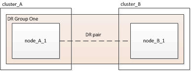
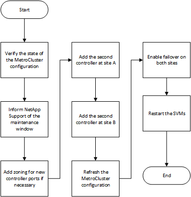

= Expanding a two-node MetroCluster FC configuration to a four-node configuration
:icons: font
:imagesdir: ../media/

[.lead]
Expanding a two-node MetroCluster FC configuration to a four-node MetroCluster FC configuration involves adding a controller to each cluster to form an HA pair at each MetroCluster site, and then refreshing the MetroCluster FC configuration.

.Before you begin

* The nodes must be running ONTAP 9 or later in a MetroCluster FC configuration.
+
This procedure is not supported on earlier versions of ONTAP or in MetroCluster IP configurations.
* If the platforms in your two-node configuration are not supported in ONTAP 9.2 and you plan to upgrade to platforms supported in ONTAP 9.2 _and_ expand to a four-node cluster, you must upgrade the platforms in the two-node configuration _before_ expanding the MetroCluster FC configuration.
* The existing MetroCluster FC configuration must be healthy.
* The equipment you are adding must be supported and meet all of the requirements described in the following procedures:
+
link:../install-fc/index.html[Fabric-attached MetroCluster installation and configuration]
+
link:../install-stretch/concept_considerations_differences.html[Stretch MetroCluster installation and configuration]

* You must have available FC switch ports to accommodate the new controllers and any new bridges.
* Verify that you have a default broadcast domain created on the old nodes. 
+
When you add new nodes to an existing cluster without a default broadcast domain, node management LIFs are created for the new nodes using universal unique identifiers (UUIDs) instead of the expected names. For more information, see the Knowledge Base article https://kb.netapp.com/onprem/ontap/os/Node_management_LIFs_on_newly-added_nodes_generated_with_UUID_names[Node management LIFs on newly-added nodes generated with UUID name^s].
* You need the admin password and access to an FTP or SCP server.

.About this task

* This procedure applies only to MetroCluster FC configurations.
* This procedure is disruptive and takes approximately four hours to complete.
* Before performing this procedure, the MetroCluster FC configuration consists of two single-node clusters:
+

+
After completing this procedure, the MetroCluster FC configuration consists of two HA pairs, one at each site:
+
image::../media/mcc_dr_groups_4_node.gif[]

* Both sites must be expanded equally.
+
A MetroCluster configuration cannot consist of an uneven number of nodes.

* This procedure can take over an hour per site, with additional time for tasks such as initializing the disks and netbooting the new nodes.
+
The time to initialize the disks depends on the size of the disks.

* This procedure uses the following workflow:

// 2023 SEP 1, ONTAPDOC-836
// BURT 1448684, 01 FEB 2022
