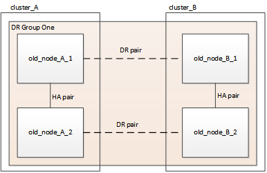
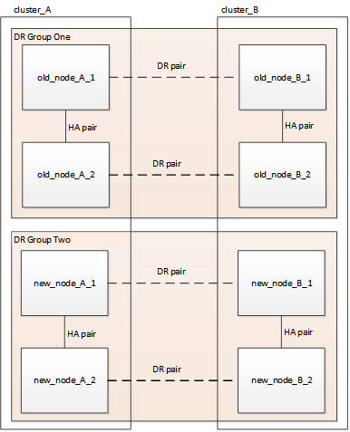
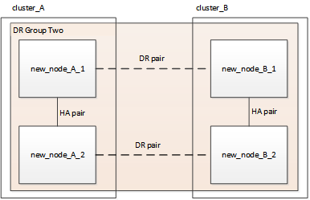

= Refreshing a four-node MetroCluster FC configuration
:icons: font
:imagesdir: ../media/

[.lead]
You can upgrade the controllers and storage in a four-node MetroCluster configuration by expanding the configuration to become an eight-node configuration and then removing the old disaster recovery (DR) group.

.About this task

References to "old nodes" mean the nodes that you intend to replace.

* You can only refresh specific platform models using this procedure in a MetroCluster FC configuration. 
** For information on what platform upgrade combinations are supported review the MetroCluster FC refresh table in  link:../upgrade/concept_choosing_tech_refresh_mcc.html#supported-metrocluster-fc-tech-refresh-combinations[Choosing a system refresh method].

== Enable console logging 

include::../_include/console-logging.adoc[]

// 2024 Aug 13, ONTAPDOC-1988

== Perform the refresh procedure

Use the following steps to refresh the MetroCluster FC configuration. 

.Steps

. Gather information from the old nodes.
+
At this stage, the four-node configuration appears as shown in the following image:
+

. Perform all of the steps in the four-node expansion procedure for your MetroCluster type.
+
link:task_expand_a_four_node_mcc_fc_configuration_to_an_eight_node_configuration.html[Expanding a four-node MetroCluster FC configuration to an eight-node configuration^]
+
When the expansion procedure is complete, the configuration appears as shown in the following image:
+

. Move the CRS volumes.
+
Perform the steps in link:https://docs.netapp.com/us-en/ontap-metrocluster/upgrade/task_move_a_metadata_volume_in_mcc_configurations.html[Move a metadata volume in MetroCluster configurations^].

. Move the data from the old nodes to new nodes using the following procedures:
//ONTAPDOC-1711
.. Perform all the steps in https://docs.netapp.com/us-en/ontap-systems-upgrade/upgrade/upgrade-create-aggregate-move-volumes.html[Create an aggregate and moving volumes to the new nodes^].
+
NOTE: You might choose to mirror the aggregate when or after it is created.

.. Perform all the steps in https://docs.netapp.com/us-en/ontap-systems-upgrade/upgrade/upgrade-move-lifs-to-new-nodes.html[Move non-SAN data LIFs and cluster management LIFs to the new nodes^].
.. Perform all the steps in https://docs.netapp.com/us-en/ontap-systems-upgrade/upgrade/upgrade-delete-san-lifs.html[Delete SAN LIFs no longer required from the original nodes^].

. Follow the steps in the procedure for removing the old DR group.
+
link:concept_removing_a_disaster_recovery_group.html[Removing a Disaster Recovery group^]
+
After you have removed the old DR group (DR group one), the configuration appears as shown in the following image:
+

// BURT 1448684, 01 FEB 2022
