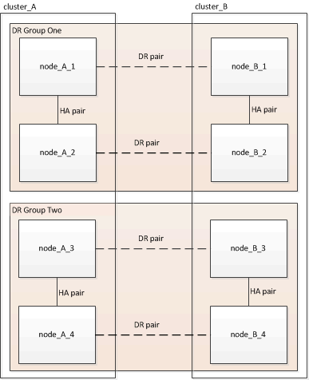
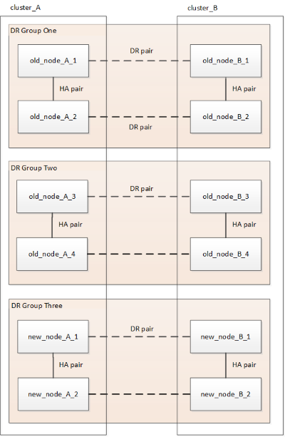
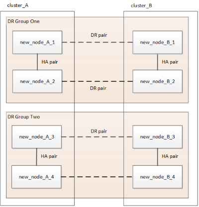

= Refreshing a four-node or an eight-node MetroCluster IP configuration (ONTAP 9.8 and later)
:icons: font
:imagesdir: ../media/

[.lead]
You can use this procedure to upgrade controllers and storage in four-node or eight-node configurations.

Beginning with ONTAP 9.13.1, you can upgrade the controllers and storage in an eight-node MetroCluster IP configuration by expanding the configuration to become a temporary twelve-node configuration and then removing the old disaster recovery (DR) groups.

Beginning with ONTAP 9.8, you can upgrade the controllers and storage in a four-node MetroCluster IP configuration by expanding the configuration to become a temporary eight-node configuration and then removing the old DR group.

.About this task

* If you have an eight-node configuration, your system must be running ONTAP 9.13.1 or later.
* If you have a four-node configuration, your system must be running ONTAP 9.8 or later.
* If you are upgrading the IP switches, they must be upgraded before performing this refresh procedure.
* This procedure describes the steps required to refresh one four-node DR group. If you have an eight-node configuration (two DR groups) you can refresh one or both DR groups. 
+
If you refresh both DR groups, you must refresh one DR group at a time. 
* References to "old nodes" mean the nodes that you intend to replace.
* For eight-node configurations, the source and target eight-node MetroCluster platform combination must be supported. 
+
NOTE: If you refresh both DR groups, the platform combination might not be supported after you refresh the first DR group. You must refresh both DR groups to achieve a supported eight-node configuration.

* You can only refresh specific platform models using this procedure in a MetroCluster IP configuration. 
** For information on which platform upgrade combinations are supported review the MetroCluster IP refresh table in  link:../upgrade/concept_choosing_tech_refresh_mcc.html#supported-metrocluster-ip-tech-refresh-combinations[Choosing a system refresh method].
* The lower limits of the source and target platform apply. If you transition to a higher platform, the limits of the new platform applies only after the tech refresh of all DR groups is completed.
* If you perform a tech refresh to a platform with lower limits than the source platform, you must adjust and reduce the limits to be at, or below, the target platform limits before performing this procedure. 

.Steps

. Gather information from the old nodes.
+
At this stage, the four-node configuration appears as shown in the following image:
+
image::../media/mcc_dr_group_a.png[]
+
The eight-node configuration appears as shown in the following image:
+

. To prevent automatic support case generation, send an AutoSupport message to indicate the upgrade is underway.
.. Issue the following command:
 +
`system node autosupport invoke -node * -type all -message "MAINT=10h Upgrading _old-model_ to _new-model"_`
+
The following example specifies a 10 hour maintenance window. You might want to allow additional time depending on your plan.
+
If the maintenance is completed before the time has elapsed, you can invoke an AutoSupport message indicating the end of the maintenance period:
+
`system node autosupport invoke -node * -type all -message MAINT=end`

.. Repeat the command on the partner cluster.
. Remove the existing MetroCluster configuration from Tiebreaker, Mediator, or other software that can initiate switchover.
+
[cols=2*]

|===

h| If you are using... h| Use this procedure...

a|
Tiebreaker
a|
. Use the Tiebreaker CLI `monitor remove` command to remove the MetroCluster configuration.
+
In the following example, "`cluster_A`" is removed from the software:
+
----

NetApp MetroCluster Tiebreaker :> monitor remove -monitor-name cluster_A
Successfully removed monitor from NetApp MetroCluster Tiebreaker
software.
----

. Confirm that the MetroCluster configuration is removed properly by using the Tiebreaker CLI `monitor show -status` command.
+
----

NetApp MetroCluster Tiebreaker :> monitor show -status
----

a|
Mediator
a|
Issue the following command from the ONTAP prompt:

`metrocluster configuration-settings mediator remove`
a|
Third-party applications
a|
Refer to the product documentation.
|===

. Perform all of the steps in link:../upgrade/task_expand_a_four_node_mcc_ip_configuration.html[Expanding a MetroCluster IP configuration] to add the new nodes and storage to the configuration.
+
When the expansion procedure is complete, the temporary configuration appears as shown in the following images:
+
.Temporary eight-node configuration
+
image::../media/mcc_dr_group_b.png[]
+
.Temporary twelve-node configuration
+

. Move the CRS volumes.
+
Perform the steps in link:../maintain/task_move_a_metadata_volume_in_mcc_configurations.html[Moving a metadata volume in MetroCluster configurations].

. Move the data from the old nodes to new nodes using the following procedures in link:https://docs.netapp.com/us-en/ontap-systems-upgrade/index.html[AFF and FAS System Upgrade Documentation^]

.. Perform all the steps in http://docs.netapp.com/platstor/topic/com.netapp.doc.hw-upgrade-controller/GUID-AFE432F6-60AD-4A79-86C0-C7D12957FA63.html[Creating an aggregate and moving volumes to the new nodes^].
+
NOTE: You might choose to mirror the aggregate when or after it is created.
 .. Perform all the steps in http://docs.netapp.com/platstor/topic/com.netapp.doc.hw-upgrade-controller/GUID-95CA9262-327D-431D-81AA-C73DEFF3DEE2.html[Moving non-SAN data LIFs and cluster management LIFs to the new nodes].

. Modify the cluster's peer IP address of the transitioned nodes for each cluster:
.. Identify the cluster_A peer using the `cluster peer show` command:
+
----
cluster_A::> cluster peer show
Peer Cluster Name         Cluster Serial Number Availability   Authentication
------------------------- --------------------- -------------- --------------
cluster_B         1-80-000011           Unavailable    absent
----

... Modify the cluster_A peer IP address using the following command:
+
`cluster peer modify -cluster cluster_A -peer-addrs node_A_3_IP -address-family ipv4`

.. Identify the cluster_B peer using the `cluster peer show` command:
+
----
cluster_B::> cluster peer show
Peer Cluster Name         Cluster Serial Number Availability   Authentication
------------------------- --------------------- -------------- --------------
cluster_A         1-80-000011           Unavailable    absent
----
... Modify the cluster_B peer IP address using the following command:
+
`cluster peer modify -cluster cluster_B -peer-addrs node_B_3_IP -address-family ipv4`

.. Verify that the cluster peer IP address is updated for each cluster:
... Verify that the IP address is updated for each cluster using the `cluster peer show -instance` command.
+
The `Remote Intercluster Addresses` field in the following examples displays the updated IP address. 
+
Example for cluster_A:
+
-----
cluster_A::> cluster peer show -instance

Peer Cluster Name: cluster_B
           Remote Intercluster Addresses: 172.21.178.204, 172.21.178.212 
      Availability of the Remote Cluster: Available
                     Remote Cluster Name: cluster_B
                     Active IP Addresses: 172.21.178.212, 172.21.178.204
                   Cluster Serial Number: 1-80-000011
                    Remote Cluster Nodes: node_B_3-IP,
                                          node_B_4-IP
                   Remote Cluster Health: true
                 Unreachable Local Nodes: -
          Address Family of Relationship: ipv4
    Authentication Status Administrative: use-authentication
       Authentication Status Operational: ok
                        Last Update Time: 4/20/2023 18:23:53
            IPspace for the Relationship: Default
Proposed Setting for Encryption of Inter-Cluster Communication: -
Encryption Protocol For Inter-Cluster Communication: tls-psk
  Algorithm By Which the PSK Was Derived: jpake

cluster_A::>

-----
+
Example for cluster_B
+
-----
cluster_B::> cluster peer show -instance

                       Peer Cluster Name: cluster_A
           Remote Intercluster Addresses: 172.21.178.188, 172.21.178.196 <<<<<<<< Should reflect the modified address
      Availability of the Remote Cluster: Available
                     Remote Cluster Name: cluster_A
                     Active IP Addresses: 172.21.178.196, 172.21.178.188
                   Cluster Serial Number: 1-80-000011
                    Remote Cluster Nodes: node_A_3-IP,
                                          node_A_4-IP
                   Remote Cluster Health: true
                 Unreachable Local Nodes: -
          Address Family of Relationship: ipv4
    Authentication Status Administrative: use-authentication
       Authentication Status Operational: ok
                        Last Update Time: 4/20/2023 18:23:53
            IPspace for the Relationship: Default
Proposed Setting for Encryption of Inter-Cluster Communication: -
Encryption Protocol For Inter-Cluster Communication: tls-psk
  Algorithm By Which the PSK Was Derived: jpake

cluster_B::>
-----

. Follow the steps in link:concept_removing_a_disaster_recovery_group.html[Removing a Disaster Recovery group] to remove the old DR group.
+
. If you want to refresh both DR groups in an eight-node configuration, you must repeat the entire procedure for each of the DR groups.
+
After you have removed the old DR group, the configuration appears as shown in the following images:
+
.Four-node configuration
image::../media/mcc_dr_group_d.png[]
+
.Eight-node configuration
+

. Confirm the operational mode of the MetroCluster configuration and perform a MetroCluster check.
.. Confirm the MetroCluster configuration and that the operational mode is normal:
+
`metrocluster show`

.. Confirm that all expected nodes are shown:
+
`metrocluster node show`

.. Issue the following command:
+
`metrocluster check run`

.. Display the results of the MetroCluster check:
+
`metrocluster check show`

. Restore monitoring if necessary, using the procedure for your configuration.
+
[cols=2*]

|===

h| If you are using... h| Use this procedure

a|
Tiebreaker
a|
link:../tiebreaker/concept_configuring_the_tiebreaker_software.html#adding-metrocluster-configurations[Adding MetroCluster configurations] in the _MetroCluster Tiebreaker Installation and Configuration_.
a|
Mediator
a|
link:https://docs.netapp.com/us-en/ontap-metrocluster/install-ip/concept_mediator_requirements.html[Configuring the ONTAP Mediator service from a MetroCluster IP configuration] in the _MetroCluster IP Installation and Configuration_.
a|
Third-party applications
a|
Refer to the product documentation.
|===

. To resume automatic support case generation, send an Autosupport message to indicate that the maintenance is complete.
.. Issue the following command:
+
`system node autosupport invoke -node * -type all -message MAINT=end`
.. Repeat the command on the partner cluster.

// BURT 1374268, 21 APR 2021
// BURT 1448684, 02 FEB 2022
// 14 Apr 2023, BURT 1546321