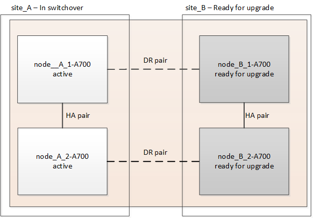
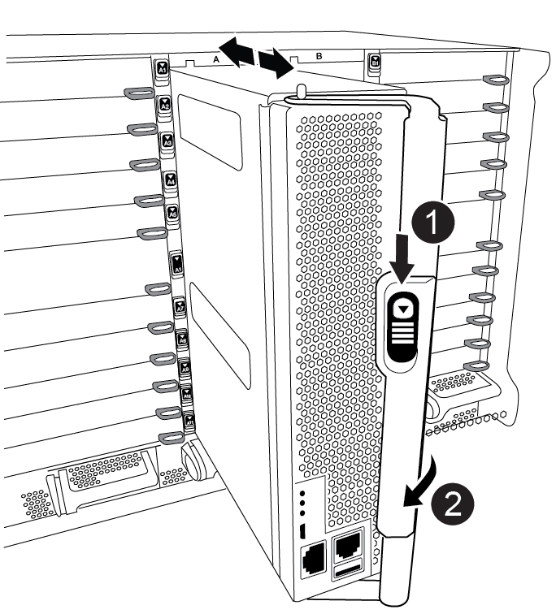
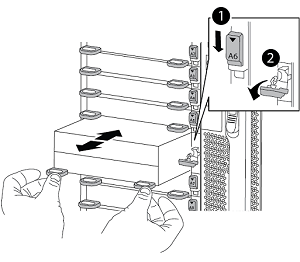
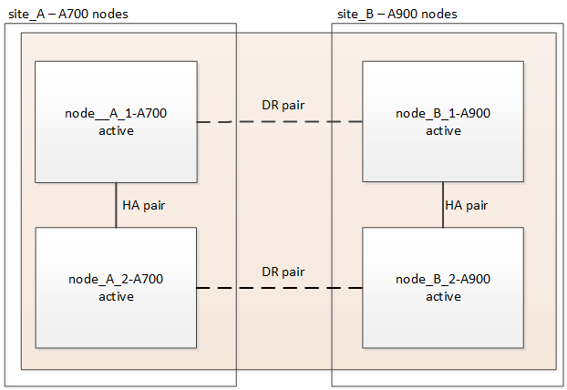

= Upgrade controllers from AFF A700/FAS9000 to AFF A900/FAS9500 in a MetroCluster FC configuration using switchover and switchback (ONTAP 9.10.1 or later)
:icons: font
:imagesdir: ../media/

[.lead]
You can use the MetroCluster switchover operation to provide nondisruptive service to clients while the controller modules on the partner cluster are upgraded. You cannot  upgrade other components (such as storage shelves or switches) as part of this procedure.

.About this task

* You can use this procedure only for controller upgrade.
+
You cannot upgrade other components in the configuration, such as storage shelves or switches, at the same time.

* You can use this procedure to upgrade an AFF A700 to AFF A900 with ONTAP 9.10.1 and later.
* You can use this procedure to upgrade a FAS9000 to FAS9500 with ONTAP 9.10.1P3 and later.
** Four and eight-node configurations are supported in ONTAP 9.10.1 and later.
+
NOTE: The AFF A900 system is only supported in ONTAP 9.10.1 or later.
+
https://hwu.netapp.com/[NetApp Hardware Universe^]

* All controllers in the configuration should be upgraded during the same maintenance period.

+
The following table shows the supported model matrix for the controller upgrade.
|===

h| Old platform model h| New platform model

a|

 ** AFF A700

a|

 ** AFF A900
a|

  ** FAS9000

a|

 ** FAS9500

a|

|===
* During the upgrade procedure, you are required to change the MetroCluster fabric, including the RCF and physical changes of cabling. You can perform the RCF and cabling changes before performing the controller upgrade.
* This upgrade procedure does not require you do not change the storage, FC, and Ethernet connections between the original nodes and the new nodes.
* During the upgrade procedure, you should not add or remove other cards from the AFF A700 or FAS9000 system. For more information, see the https://hwu.netapp.com/[NetApp Hardware Universe^]

The following example names are used in examples and graphics in this procedure:

* site_A
 ** Before upgrade:
  *** node_A_1-A700
  *** node_A_2-A700
 ** After upgrade:
  *** node_A_1-A900
  *** node_A_2-A900
* site_B
 ** Before upgrade:
  *** node_B_1-A700
  *** node_B_2-A700
 ** After upgrade:
  *** node_B_1-A900
  *** node_B_2-A900

== Prepare for the upgrade
Before making any changes to the existing MetroCluster configuration, you must check the health of the configuration, change the RCF files and cabling to match to new port connectivity topology required for the AFF A900 or FAS9000 fabric MetroCluster configuration, and perform other miscellaneous tasks.

== Clear slot 7 on the AFF A700 controller
The MetroCluster configuration on an AFF A900 or FAS9500 requires 8 FC-VI ports across FC-VI cards in slots 5 and 7. Before starting the upgrade, if there are cards in slot 7 on the AFF A700 or FAS9000, you must move them to other slots for all the nodes of the cluster.

=== Verify the health of the MetroCluster configuration
Before you update the RCF files and cabling for the AFF A900 or FAS9500 fabric MetroCluster configuration, you must verify the health and connectivity of the configuration.

.Steps

. Verify the operation of the MetroCluster configuration in ONTAP:
 .. Check whether the nodes are multipathed:
 +
`node run -node _node-name_ sysconfig -a`
+
You should issue this command for each node in the MetroCluster configuration.

.. Verify that there are no broken disks in the configuration:
+
`storage disk show -broken`
+
You should issue this command on each node in the MetroCluster configuration.

.. Check for any health alerts:
+
`system health alert show`
+
You should issue this command on each cluster.

.. Verify the licenses on the clusters:
+
`system license show`
+
You should issue this command on each cluster.

.. Verify the devices connected to the nodes:
+
`network device-discovery show`
+
You should issue this command on each cluster.

.. Verify that the time zone and time are set correctly on both sites:
+
`cluster date show`
+
You should issue this command on each cluster. You can use the `cluster date` commands to configure the time and time zone.
. Check for any health alerts on the switches (if present):
+
`storage switch show`
+
You should issue this command on each cluster.

. Confirm the operational mode of the MetroCluster configuration and perform a MetroCluster check.
.. Confirm the MetroCluster configuration and that the operational mode is normal:
+
`metrocluster show`

.. Confirm that all expected nodes are shown:
+
`metrocluster node show`

.. Issue the following command:
+
`metrocluster check run`
.. Display the results of the MetroCluster check:
+
`metrocluster check show`
. Check the MetroCluster cabling with the Config Advisor tool.
.. Download and run Config Advisor.
+
https://mysupport.netapp.com/site/tools/tool-eula/activeiq-configadvisor[NetApp Downloads: Config Advisor^]

.. After running Config Advisor, review the tool's output and follow the recommendations in the output to address any issues discovered.

=== Update the fabric switch RCF files
The AFF A900 or FAS9500 fabric MetroCluster requires two four-port FC-VI adapters per node compared to a single four-port FC-VI adapter required by an AFF A700. Before you start the controller upgrade to the AFF A900 or FAS9500 controller, you must modify the fabric switch RCF files to support the AFF A900 or FAS9500 connection topology.

.	From the https://mysupport.netapp.com/site/products/all/details/metrocluster-rcf/downloads-tab[MetroCluster RCF file download page^], download the correct RCF file for an AFF A900 or FAS9500 fabric MetroCluster and the switch model that is in use on the AFF A700 or FAS9000 configuration.
.	[[Update-RCF]]Update the RCF file on the fabric A switches, switch A1, and switch B1 by following the steps in link:../disaster-recovery/task_cfg_switches_mcfc.html[Configuring the FC switches].

+
NOTE: The RCF file update to support the AFF A900 or FAS9500 fabric MetroCluster configuration does not affect the port and connections used for the AFF A700 or FAS9000 fabric MetroCluster configuration.

.	After updating the RCF files on the fabric A switches, all storage and FC-VI connections should come online. Check the FC-VI connections:
+
`metrocluster interconnect mirror show`
+
.. Verify that the local and remote site disks are listed in the `sysconfig` output.

. [[verify-healthy]]You must verify that MetroCluster is in a healthy state after the RCF file update for fabric A switches.
..	Check metro cluster connections:
`metrocluster interconnect mirror show`
..	Run metrocluster check:
`metrocluster check run`
..	See the MetroCluster run results when the run completes:
`metrocluster check show`
.	Update the fabric B switches (switches 2 and 4) by repeating <<Update-RCF, Step 2>> to <<verify-healthy, Step 5>>.

=== Verify the health of the MetroCluster configuration after the RCF file update
You must verify the health and connectivity of the MetroCluster configuration before performing the upgrade.

.Steps

. Verify the operation of the MetroCluster configuration in ONTAP:
 .. Check whether the nodes are multipathed:
 +
`node run -node _node-name_ sysconfig -a`
+
You should issue this command for each node in the MetroCluster configuration.

.. Verify that there are no broken disks in the configuration:
+
`storage disk show -broken`
+
You should issue this command on each node in the MetroCluster configuration.

.. Check for any health alerts:
+
`system health alert show`
+
You should issue this command on each cluster.

.. Verify the licenses on the clusters:
+
`system license show`
+
You should issue this command on each cluster.

.. Verify the devices connected to the nodes:
+
`network device-discovery show`
+
You should issue this command on each cluster.

.. Verify that the time zone and time are set correctly on both sites:
+
`cluster date show`
+
You should issue this command on each cluster. You can use the `cluster date` commands to configure the time and time zone.
. Check for any health alerts on the switches (if present):
+
`storage switch show`
+
You should issue this command on each cluster.

. Confirm the operational mode of the MetroCluster configuration and perform a MetroCluster check.
.. Confirm the MetroCluster configuration and that the operational mode is normal:
+
`metrocluster show`

.. Confirm that all expected nodes are shown:
+
`metrocluster node show`

.. Issue the following command:
+
`metrocluster check run`
.. Display the results of the MetroCluster check:
+
`metrocluster check show`
. Check the MetroCluster cabling with the Config Advisor tool.
.. Download and run Config Advisor.
+
https://mysupport.netapp.com/site/tools/tool-eula/activeiq-configadvisor[NetApp Downloads: Config Advisor^]

.. After running Config Advisor, review the tool's output and follow the recommendations in the output to address any issues discovered.

=== Map ports from the AFF A700 or FAS9000 nodes to the AFF A900 or FAS9500 nodes

During the controller upgrade process, you must only change the connections that are mentioned in this procedure.

If the AFF A700 or FAS9000 controllers have a card in slot 7, you should move it to another slot before starting the controller upgrade procedure. You must have slot 7 available for the addition of the second FC-VI adapter that is required for the functioning of fabric MetroCluster on the AFF A900 or FAS9500 controllers.

=== Gather information before the upgrade

Before upgrading, you must gather information for each of the nodes, and, if necessary, adjust the network broadcast domains, remove any VLANs and interface groups, and gather encryption information.

.About this task

This task is performed on the existing MetroCluster FC configuration.

.Steps

.	Gather the MetroCluster configuration node system IDs:
+
`metrocluster node show -fields node-systemid,dr-partner-systemid`
+
During the replacement procedure you will replace these system IDs with the system IDs of the controller modules.
+
In this example for a four-node MetroCluster FC configuration, the following old system IDs are retrieved:
+
* node_A_1-A700: 537037649
* node_A_2-A700: 537407030
* node_B_1-A700: 0537407114
* node_B_2-A700: 537035354

+
----
Cluster_A::*> metrocluster node show -fields node-systemid,ha-partner-systemid,dr-partner-systemid,dr-auxiliary-systemid
dr-group-id cluster    node           node-systemid ha-partner-systemid dr-partner-systemid dr-auxiliary-systemid
----------- ------------------------- ------------- ------------------- ------------------- ---------------------
1           Cluster_A  nodeA_1-A700   537407114     537035354           537411005           537410611
1           Cluster_A  nodeA_2-A700   537035354     537407114           537410611           537411005
1           Cluster_B  nodeB_1-A700   537410611     537411005           537035354           537407114
1           Cluster_B  nodeB_2-A700   537411005

4 entries were displayed.
----

. Gather port and LIF information for each node.
+
You should gather the output of the following commands for each node:
+
 * `network interface show -role cluster,node-mgmt`
 * `network port show -node _node-name_ -type physical`
 * `network port vlan show -node _node-name_`
 * `network port ifgrp show -node _node_name_ -instance`
 * `network port broadcast-domain show`
 * `network port reachability show -detail`
 * `network ipspace show`
 * `volume show`
 * `storage aggregate show`
 * `system node run -node _node-name_ sysconfig -a`

. If the MetroCluster nodes are in a SAN configuration, collect the relevant information.
+
You should gather the output of the following commands:

 * `fcp adapter show -instance`
 * `fcp interface show -instance`
 * `iscsi interface show`
 * `ucadmin show`

. If the root volume is encrypted, collect and save the passphrase used for key-manager:
+
`security key-manager backup show`
. If the MetroCluster nodes are using encryption for volumes or aggregates, copy information about the keys and passphrases.
+
For additional information, see https://docs.netapp.com/us-en/ontap/encryption-at-rest/backup-key-management-information-manual-task.html[Backing up onboard key management information manually^].

.. If Onboard Key Manager is configured:
+
`security key-manager onboard show-backup`
+
You will need the passphrase later in the upgrade procedure.

.. If enterprise key management (KMIP) is configured, issue the following commands:
+
`security key-manager external show -instance`
+
`security key-manager key query`

=== Remove the existing configuration from the Tiebreaker or other monitoring software

If the existing configuration is monitored with the MetroCluster Tiebreaker configuration or other third-party applications (for example, ClusterLion) that can initiate a switchover, you must remove the MetroCluster configuration from the Tiebreaker or other software prior to transition.

.Steps

. Remove the existing MetroCluster configuration from the Tiebreaker software.
+

link:../tiebreaker/concept_configuring_the_tiebreaker_software.html#removing-metrocluster-configurations[Removing MetroCluster Configurations]

. Remove the existing MetroCluster configuration from any third-party application that can initiate switchover.
+
Refer to the documentation for the application.

=== Send a custom AutoSupport message prior to maintenance

Before performing the maintenance, you should issue an AutoSupport message to notify NetApp technical support that maintenance is underway. Informing technical support that maintenance is underway prevents them from opening a case on the assumption that a disruption has occurred.

.About this task

This task must be performed on each MetroCluster site.

.Steps

. To prevent automatic support case generation, send an Autosupport message to indicate maintenance is underway.
.. Issue the following command:
+
`system node autosupport invoke -node * -type all -message MAINT=__maintenance-window-in-hours__`
+
`maintenance-window-in-hours` specifies the length of the maintenance window, with a maximum of 72 hours. If the maintenance is completed before the time has elapsed, you can invoke an AutoSupport message indicating the end of the maintenance period:
+
`system node autosupport invoke -node * -type all -message MAINT=end`

.. Repeat the command on the partner cluster.

== Switch over the MetroCluster configuration

You must switch over the configuration to site_A so that the platforms on site_B can be upgraded.

.About this task

This task must be performed on site_A.

After completing this task, site_A is active and serving data for both sites. Site_B is inactive, and ready to begin the upgrade process, as shown in the following illustration. (This illustration also applies to upgrading a FAS9000 to a FAS9500 controller.)

.Steps

. Switch over the MetroCluster configuration to site_A so that site_B's nodes can be upgraded:

.. Issue the following command on site_A:
+
`metrocluster switchover -controller-replacement true`
+
The operation can take several minutes to complete.

.. Monitor the switchover operation:
+
`metrocluster operation show`
.. After the operation is complete, confirm that the nodes are in switchover state:
+
`metrocluster show`

.. Check the status of the MetroCluster nodes:
+
`metrocluster node show`

. Heal the data aggregates.
.. Heal the data aggregates:
+
`metrocluster heal data-aggregates`
.. Confirm the heal operation is complete by running the `metrocluster operation show` command on the healthy cluster:
+
----

cluster_A::> metrocluster operation show
  Operation: heal-aggregates
      State: successful
 Start Time: 7/29/2020 20:54:41
   End Time: 7/29/2020 20:54:42
     Errors: -
----
. Heal the root aggregates.
.. Heal the data aggregates:
+
`metrocluster heal root-aggregates`
.. Confirm the heal operation is complete by running the `metrocluster operation show` command on the healthy cluster:
+
----

cluster_A::> metrocluster operation show
  Operation: heal-root-aggregates
      State: successful
 Start Time: 7/29/2020 20:58:41
   End Time: 7/29/2020 20:59:42
     Errors: -
----

== Remove the AFF A700 or FAS9000 controller module and NVS at site_B

You must remove the old controllers from the configuration.

You perform this task on site_B.

.Before you begin
If you are not already grounded, properly ground yourself.

.Steps

. Connect to the serial console of the old controllers (node_B_1-700 and node_B_2-700) at site_B and verify it is displaying the `LOADER` prompt.

.	Gather the bootarg values from both nodes at site_B: `printenv`

.	Power off the chassis at site_B.

== Remove the controller module and NVS from both nodes at site_B
=== Remove the AFF A700 or FAS9000 controller module

Use the following procedure to remove the AFF A700 or FAS9000 controller module.

.Steps
.	Detach the console cable, if any, and the management cable from the controller module before removing the controller module.
.	Unlock and remove the controller module from the chassis.
..	Slide the orange button on the cam handle downward until it unlocks.
+

+
|===
|  |Cam handle release button
|  |Cam handle
|===

..	Rotate the cam handle so that it completely disengages the controller module from the chassis, and then slide the controller module out of the chassis.
Make sure that you support the bottom of the controller module as you slide it out of the chassis.

=== Remove the AFF A700 or FAS9000 NVS module

Use the following procedure to remove the AFF A700 or FAS9000 NVS module.

NOTE:	The AFF A700 or FAS9000 NVS module is in slot 6 and is double the height compared to the other modules in the system.

.	Unlock and remove the NVS from slot 6.
..	Depress the lettered and numbered cam button.
The cam button moves away from the chassis.
..	Rotate the cam latch down until it is in a horizontal position.
The NVS disengages from the chassis and moves a few inches.
..	Remove the NVS from the chassis by pulling on the pull tabs on the sides of the module face.
+

+
|===
|  |Lettered and numbered I/O cam latch
|  |I/O latch completely unlocked
|===

NOTE: If there are any add-on modules used as coredump devices on the AFF A700 or FAS9000 non-volatile storage module, do not transfer those to the AFF A900 or FAS9500 NVS. Do not transfer any parts from the AFF A700 or A900 controller module and NVS to the AFF A900 or FAS9500 controller module.

== Install the AFF A900 or FAS9500 NVS and controller module

You must install the AFF A900 or FAS9500 NVS and controller module from the upgrade kit on both nodes at Site_B. Do not move the coredump device from the AFF A700 or FAS9000 NVS module to the AFF A900 or FAS9500 NVS module.

.Before you start
If you are not already grounded, properly ground yourself.

=== Install the AFF A900 or FAS9500 NVS

Use the following procedure to install the AFF A900 or FAS9500 NVS in slot 6 of both nodes at site_B

.Steps
.	Align the NVS with the edges of the chassis opening in slot 6.
.	Gently slide the NVS into the slot until the lettered and numbered I/O cam latch begins to engage with the I/O cam pin, and then push the I/O cam latch all the way up to lock the NVS in place.
+

+
|===
|  |Lettered and numbered I/O cam latch
|  |I/O latch completely unlocked
|===

=== Install the AFF A900 or FAS9500 controller module
Use the following procedure to install the AFF A900 or FAS9500 controller module.

.Steps

.	Align the end of the controller module with the opening in the chassis, and then gently push the controller module halfway into the system.
.	Firmly push the controller module into the chassis until it meets the midplane and is fully seated.
The locking latch rises when the controller module is fully seated.
+
CAUTION: Do not use excessive force when sliding the controller module into the chassis to avoid damaging the connectors.

.	Cable the management and console ports to the controller module.
+

+
|===
|  |Cam handle release button
|  |Cam handle
|===

.	Install the second X91129A card in slot 7 of each node.
..	Connect FC-VI ports from slot 7 to the switches. Refer to the link:../install-fc/index.html[Fabric-attached installation and configuration] documentation and go to the AFF A900 or FAS9500 fabric MetroCluster connection requirements for the type of switch in your environment.
.	Power ON the chassis and connect to the serial console.
.	After BIOS initialization, if the node starts to autoboot, interrupt the AUTOBOOT by pressing Control-C.
.	After you interrupt the autoboot, the nodes stop at the LOADER prompt. If you do not interrupt autoboot on time and node1 starts booting, wait for the prompt to press Control-C to go into the boot menu. After the node stops at the boot menu, use option 8 to reboot the node and interrupt the autoboot during the reboot.
.	At the `LOADER` prompt, set the default environment variables: `set-defaults`
.	Save the default environment variables settings: `saveenv`

=== Netboot the nodes at site_B

After swapping the AFF A900 or FAS9500 controller module and NVS, you need to netboot the AFF A900 or FAS9500 nodes and install the same ONTAP version and patch level that is running on the cluster. The term `netboot` means you are booting from an ONTAP image stored on a remote server. When preparing for `netboot`, you must add a copy of the ONTAP 9 boot image onto a web server that the system can access.

It is not possible to check the ONTAP version installed on the boot media of an AFF A900 or FAS9500 controller module unless it is installed in a chassis and powered ON. The ONTAP version on the AFF A900 or FAS9500 boot media must be same as the ONTAP version running on the AFF A700 or FAS9000 system that is being upgraded and both the primary and backup boot images should match. You can configure the images by performing a `netboot` followed by the `wipeconfig` command from the boot menu. If the controller module was previously used in another cluster, the `wipeconfig` command clears any residual configuration on the boot media.

.Before you start

•	Verify that you can access a HTTP server with the system.
•	You need to download the necessary system files for your system and the correct version of ONTAP from the link:https://mysupport.netapp.com/site/[NetApp Support^] site.
About this task
You must `netboot` the new controllers if the version of ONTAP installed is not the same as the version installed on the original controllers. After you install each new controller, you boot the system from the ONTAP 9 image stored on the web server. You can then download the correct files to the boot media device for subsequent system boots.

.Steps
.	Access link:https://mysupport.netapp.com/site/[NetApp Support^] to download the files required to perform a system netboot used for performing the netboot of the system.
.	[[step2-download-software]]Download the appropriate ONTAP software from the software download section of the NetApp Support Site and store the `<ontap_version>_image.tgz` file on a web-accessible directory.
.	Change to the web-accessible directory and verify that the files you need are available.
    Your directory listing should contain `<ontap_version>_image.tgz`.
.	Configure the `netboot` connection by choosing one of the following actions.
Note:	You should use the management port and IP as the `netboot` connection. Do not use a data LIF IP or a data outage might occur while the upgrade is being performed.
+
|===
h|If Dynamic Host Configuration Protocol (DHCP) is...	h|Then...
|Running	|Configure the connection automatically by using the following command at the boot environment prompt:
`ifconfig e0M -auto`
|Not running	|Manually configure the connection by using the following command at the boot environment prompt:
`ifconfig e0M -addr=<filer_addr> -mask=<netmask> -gw=<gateway> - dns=<dns_addr> domain=<dns_domain>`

`<filer_addr>` is the IP address of the storage system.
`<netmask>` is the network mask of the storage system.
`<gateway>` is the gateway for the storage system.
`<dns_addr>` is the IP address of a name server on your network. This parameter is optional.
`<dns_domain>` is the Domain Name Service (DNS) domain name. This parameter is optional.

NOTE:	Other parameters might be necessary for your interface. Enter help ifconfig at the firmware prompt for details.

|===

.	Perform `netboot` on node 1:
`netboot http://<web_server_ip/path_to_web_accessible_directory>/netboot/kernel`
The `<path_to_the_web-accessible_directory>` should lead to where you downloaded the `<ontap_version>_image.tgz` in  <<step2-download-software, Step 2>>.
+
NOTE:	Do not interrupt the boot.

.	Wait for node 1 that is running on the AFF A900 or FAS9500 controller module to boot and display the boot menu options as shown below:
+
----
Please choose one of the following:

(1)  Normal Boot.
(2)  Boot without /etc/rc.
(3)  Change password.
(4)  Clean configuration and initialize all disks.
(5)  Maintenance mode boot.
(6)  Update flash from backup config.
(7)  Install new software first.
(8)  Reboot node.
(9)  Configure Advanced Drive Partitioning.
(10) Set Onboard Key Manager recovery secrets.
(11) Configure node for external key management.
Selection (1-11)?
----

.	From the boot menu, select option `(7) Install new software first`.
This menu option downloads and installs the new ONTAP image to the boot device.
+
NOTE:	Disregard the following message: `This procedure is not supported for Non-Disruptive Upgrade on an HA pair.` This note applies to nondisruptive ONTAP software upgrades, and not controller upgrades.
Always use netboot to update the new node to the desired image. If you use another method to install the image on the new controller, the wrong incorrect image might install. This issue applies to all ONTAP releases.

.	If you are prompted to continue the procedure, enter `y`, and when prompted for the package, enter the URL:
http://<web_server_ip/path_to_web-accessible_directory>/<ontap_version>_image.tgz
.	Complete the following substeps to reboot the controller module:
..	Enter `n` to skip the backup recovery when you see the following prompt:
`Do you want to restore the backup configuration now? {y|n}`
..	Enter `y` to reboot when you see the following prompt:
`The node must be rebooted to start using the newly installed software. Do you want to reboot now? {y|n}`
+
The controller module reboots but stops at the boot menu because the boot device was reformatted, and the configuration data needs to be restored.
.	At the prompt, run the `wipeconfig` command to clear any previous configuration on the boot media:
..	When you see the message below, answer `yes`:
`This will delete critical system configuration, including cluster membership.
Warning: do not run this option on a HA node that has been taken over.
Are you sure you want to continue?:`
..	The node reboots to finish the `wipeconfig` and then stops at the boot menu.
.	Select option `5` to go to maintenance mode from the boot menu. Answer `yes` to the prompts until the node stops at maintenance mode and the command prompt `*>`.

=== Restore the HBA configuration

Depending on the presence and configuration of HBA cards in the controller module, you need to configure them correctly for your site's usage.

.Steps

. In Maintenance mode configure the settings for any HBAs in the system:
.. Check the current settings of the ports: `ucadmin show`
.. Update the port settings as needed.

+

|===

h| If you have this type of HBA and desired mode... h| Use this command...

a|
CNA FC
a|
`ucadmin modify -m fc -t initiator _adapter-name_`
a|
CNA Ethernet
a|
`ucadmin modify -mode cna _adapter-name_`
a|
FC target
a|
`fcadmin config -t target _adapter-name_`
a|
FC initiator
a|
`fcadmin config -t initiator _adapter-name_`
|===

=== Set the HA state on the new controllers and chassis
You must verify the HA state of the controllers and chassis, and, if necessary, update the state to match your system configuration.

.Steps

. In Maintenance mode, display the HA state of the controller module and chassis:
+
`ha-config show`
+
The HA state for all components should be mcc.

.	If the displayed system state of the controller or chassis is not correct, set the HA state:
+
`ha-config modify controller mcc`
+
`ha-config modify chassis mcc`
.	Halt the node: `halt`
The node should stop at the `LOADER>` prompt.
.	On each node, check the system date, time, and time zone: `Show date`
.	If necessary, set the date in UTC or Greenwich Mean Time (GMT): `set date <mm/dd/yyyy>`
.	Check the time by using the following command at the boot environment prompt: `show time`
.	If necessary, set the time in UTC or GMT: `set time <hh:mm:ss>`
.	Save the settings: `saveenv`
.	Gather environment variables: `printenv`
.	Boot the node back into Maintenance mode to enable the configuration changes to take effect:
`boot_ontap maint`
.	Verify the changes you made are effective and ucadmin shows FC initiator ports online.
+
|===
h|If you have this type of HBA…	h| Use this command…
a|
CNA
a|
`ucadmin show`
a|
FC
a|
`fcadmin show`
|===

.	Verify the ha-config mode: `ha-config show`
.. Verify that you have the following output:
+
----
*> ha-config show
Chassis HA configuration: mcc
Controller HA configuration: mcc
----

=== Set the HA state on the new controllers and chassis

You must verify the HA state of the controllers and chassis, and, if necessary, update the state to match your system configuration.

.Steps

. In Maintenance mode, display the HA state of the controller module and chassis:
+
`ha-config show`
+
The HA state for all components should be mcc.
+

|===

h| If the MetroCluster configuration has... h| The HA state should be...

a|
Two nodes
a|
mcc-2n
a|
Four or eight nodes
a|
mcc
|===

. If the displayed system state of the controller is not correct, set the HA state for the controller module and chassis:
+

|===

h| If the MetroCluster configuration has... h| Issue these commands...

a|
*Two nodes*
a|
`ha-config modify controller mcc-2n`

`ha-config modify chassis mcc-2n`
a|
*Four or eight nodes*
a|
`ha-config modify controller mcc`

`ha-config modify chassis mcc`
|===

=== Reassign root aggregate disks

Reassign the root aggregate disks to the new controller module, using the sysids gathered earlier

.About this task

This task is performed in Maintenance mode.

The old system IDs were identified in link:task_upgrade_controllers_in_a_four_node_fc_mcc_us_switchover_and_switchback_mcc_fc_4n_cu.html[Gathering information before the upgrade].

The examples in this procedure use controllers with the following system IDs:

|===

h| Node h| Old system ID h| New system ID

a|
node_B_1
a|
4068741254
a|
1574774970
|===

.Steps

. Cable all other connections to the new controller modules (FC-VI, storage, cluster interconnect, etc.).

. Halt the system and boot to Maintenance mode from the `LOADER` prompt:
+
`boot_ontap maint`

. Display the disks owned by node_B_1-A700:
+
`disk show -a`
+
The example output shows the system ID of the new controller module (1574774970). However, the root aggregate disks are still owned by the old system ID (4068741254). This example does not show drives owned by other nodes in the MetroCluster configuration.
+
----
*> disk show -a
Local System ID: 1574774970

  DISK         OWNER                     POOL   SERIAL NUMBER    HOME                      DR HOME
------------   -------------             -----  -------------    -------------             -------------
...
rr18:9.126L44 node_B_1-A700(4068741254)   Pool1  PZHYN0MD         node_B_1-A700(4068741254)  node_B_1-A700(4068741254)
rr18:9.126L49 node_B_1-A700(4068741254)   Pool1  PPG3J5HA         node_B_1-A700(4068741254)  node_B_1-A700(4068741254)
rr18:8.126L21 node_B_1-A700(4068741254)   Pool1  PZHTDSZD         node_B_1-A700(4068741254)  node_B_1-A700(4068741254)
rr18:8.126L2  node_B_1-A700(4068741254)   Pool0  S0M1J2CF         node_B_1-A700(4068741254)  node_B_1-A700(4068741254)
rr18:8.126L3  node_B_1-A700(4068741254)   Pool0  S0M0CQM5         node_B_1-A700(4068741254)  node_B_1-A700(4068741254)
rr18:9.126L27 node_B_1-A700(4068741254)   Pool0  S0M1PSDW         node_B_1-A700(4068741254)  node_B_1-A700(4068741254)
...
----

. Reassign the root aggregate disks on the drive shelves to the new controller:
+
`disk reassign -s _old-sysid_ -d _new-sysid_`
+
The following example shows reassignment of drives:
+
----
*> disk reassign -s 4068741254 -d 1574774970
Partner node must not be in Takeover mode during disk reassignment from maintenance mode.
Serious problems could result!!
Do not proceed with reassignment if the partner is in takeover mode. Abort reassignment (y/n)? n

After the node becomes operational, you must perform a takeover and giveback of the HA partner node to ensure disk reassignment is successful.
Do you want to continue (y/n)? Jul 14 19:23:49 [localhost:config.bridge.extra.port:error]: Both FC ports of FC-to-SAS bridge rtp-fc02-41-rr18:9.126L0 S/N [FB7500N107692] are attached to this controller.
y
Disk ownership will be updated on all disks previously belonging to Filer with sysid 4068741254.
Do you want to continue (y/n)? y
----

. Check that all disks are reassigned as expected: `disk show`
+
----
*> disk show
Local System ID: 1574774970

  DISK        OWNER                      POOL   SERIAL NUMBER   HOME                      DR HOME
------------  -------------              -----  -------------   -------------             -------------
rr18:8.126L18 node_B_1-A900(1574774970)   Pool1  PZHYN0MD        node_B_1-A900(1574774970)  node_B_1-A900(1574774970)
rr18:9.126L49 node_B_1-A900(1574774970)   Pool1  PPG3J5HA        node_B_1-A900(1574774970)  node_B_1-A900(1574774970)
rr18:8.126L21 node_B_1-A900(1574774970)   Pool1  PZHTDSZD        node_B_1-A900(1574774970)  node_B_1-A900(1574774970)
rr18:8.126L2  node_B_1-A900(1574774970)   Pool0  S0M1J2CF        node_B_1-A900(1574774970)  node_B_1-A900(1574774970)
rr18:9.126L29 node_B_1-A900(1574774970)   Pool0  S0M0CQM5        node_B_1-A900(1574774970)  node_B_1-A900(1574774970)
rr18:8.126L1  node_B_1-A900(1574774970)   Pool0  S0M1PSDW        node_B_1-A900(1574774970)  node_B_1-A900(1574774970)
*>
----

. Display the aggregate status: `aggr status`
+
----
*> aggr status
           Aggr            State       Status           Options
aggr0_node_b_1-root    online      raid_dp, aggr    root, nosnap=on,
                           mirrored                     mirror_resync_priority=high(fixed)
                           fast zeroed
                           64-bit
----

. Repeat the above steps on the partner node (node_B_2-A900).

=== Boot up the new controllers

You must reboot the controllers from the boot menu to update the controller flash image. Additional steps are required if encryption is configured.

.About this task

This task must be performed on all the new controllers.

.Steps

. Halt the node: `halt`

. If external key manager is configured, set the related bootargs:
+
`setenv bootarg.kmip.init.ipaddr _ip-address_`
+
`setenv bootarg.kmip.init.netmask _netmask_`
+
`setenv bootarg.kmip.init.gateway _gateway-address_`
+
`setenv bootarg.kmip.init.interface _interface-id_`
. Display the boot menu: `boot_ontap menu`
. If root encryption is used, issue the boot menu command for your key management configuration.
+

|===

h| If you are using... h| Select this boot menu option...

a|
Onboard key management
a|
Option 10 and follow the prompts to provide the required inputs to recover or restore the key-manager configuration
a|
External key management
a|
Option 11 and follow the prompts to provide the required inputs to recover  or restore the key-manager configuration
|===

. If autoboot is enabled, interrupt autoboot by pressing control-C.
. From the boot menu, run option (6).
+
NOTE: Option 6 will reboot the node twice before completing.
+

Respond `y` to the system id change prompts. Wait for the second reboot messages:
+
----
Successfully restored env file from boot media...

Rebooting to load the restored env file...
----

. Double-check that the partner-sysid is correct: `printenv partner-sysid`
+
If the partner-sysid is not correct, set it: `setenv partner-sysid _partner-sysID_`

. If root encryption is used, issue the boot menu command again for your key management configuration.
+

|===

h| If you are using... h| Select this boot menu option...

a|
Onboard key management
a|
Option 10 and follow the prompts to provide the required inputs to recover or restore the key-manager configuration
a|
External key management
a|
Option 11  and follow the prompts to provide the required inputs to recover or restore the key-manager configuration
|===

+
You might need to issue the `recover_xxxxxxxx_keymanager` command at the boot menu prompt multiple times until the nodes completely boot.

. Boot the nodes: `boot_ontap`

. Wait for the replaced nodes to boot up.
+
If either node is in takeover mode, perform a giveback using the `storage failover giveback` command.

. Verify that all ports are in a broadcast domain:

.. View the broadcast domains:
+
`network port broadcast-domain show`

.. Add any ports to a broadcast domain as needed.
+
link:https://docs.netapp.com/us-en/ontap/networking/add_or_remove_ports_from_a_broadcast_domain97.html[Add or remove ports from a broadcast domain^]

.. Add the physical port that will host the intercluster LIFs to the corresponding Broadcast domain.
.. Modify intercluster LIFs to use the new physical port as home port.
.. After the intercluster LIFs are up, check the cluster peer status and re-establish cluster peering as needed.
+
You may need to reconfigure cluster peering.
+
link:https://docs.netapp.com/us-en/ontap-metrocluster/install-fc/concept_configure_the_mcc_software_in_ontap.html#peering-the-clusters[Creating a cluster peer relationship]

.. Recreate VLANs and interface groups as needed.
+
VLAN and interface group membership might be different than that of the old node.
+
link:https://docs.netapp.com/us-en/ontap/networking/configure_vlans_over_physical_ports.html#create-a-vlan[Creating a VLAN^]
+
link:https://docs.netapp.com/us-en/ontap/networking/combine_physical_ports_to_create_interface_groups.html[Combining physical ports to create interface groups^]
. If encryption is used, restore the keys using the correct command for your key management configuration.
+

|===

h| If you are using... h| Use this command...

a|
Onboard key management
a|
`security key-manager onboard sync`

For more information, see link:https://docs.netapp.com/us-en/ontap/encryption-at-rest/restore-onboard-key-management-encryption-keys-task.html[Restoring onboard key management encryption keys^].
a|
External key management
a|
`security key-manager external restore -vserver _SVM_ -node _node_ -key-server _host_name\|IP_address:port_ -key-id key_id -key-tag key_tag _node-name_`

For more information, see link:https://docs.netapp.com/us-en/ontap/encryption-at-rest/restore-external-encryption-keys-93-later-task.html[Restoring external key management encryption keys^].

|===

=== Verify LIF configuration

Verify that LIFs are hosted on appropriate node/ports prior to switchback. The following steps need to be performed

.About this task

This task is performed on site_B, where the nodes have been booted up with root aggregates.

.Steps

. Verify that LIFs are hosted on the appropriate node and ports prior to switchback.
.. Change to the advanced privilege level:
+
`set -privilege advanced`
.. Override the port configuration to ensure proper LIF placement:
+
`vserver config override -command "network interface modify" -vserver _vserver_name_ -home-port _active_port_after_upgrade_ -lif _lif_name_ -home-node _new_node_name_"`
+
When entering the `network interface modify` command within the `vserver config override` command, you cannot use the tab autocomplete feature. You can create the `network interface modify` using autocomplete and then enclose it in the `vserver config override` command.

.. Return to the admin privilege level:
 +
`set -privilege admin`
. Revert the interfaces to their home node:
+
`network interface revert * -vserver _vserver-name_`
+
Perform this step on all SVMs as required.

== Switch back the MetroCluster configuration

After the new controllers have been configured, you switch back the MetroCluster configuration to return the configuration to normal operation.

.About this task

In this task, you will perform the switchback operation, returning the MetroCluster configuration to normal operation. The nodes on site_A are still awaiting upgrade as shown in the  following illustration. (This illustration also applies to upgrading a FAS9000 to a FAS9500 controller).

.Steps

. Issue the `metrocluster node show` command on site_B and check the output.

.. Verify that the new nodes are represented correctly.
.. Verify that the new nodes are in "Waiting for switchback state."

. Switchback the cluster:
+
`metrocluster switchback`
. Check the progress of the switchback operation:
+
`metrocluster show`
+
The switchback operation is still in progress when the output displays `waiting-for-switchback`:
+
----
cluster_B::> metrocluster show
Cluster                   Entry Name          State
------------------------- ------------------- -----------
 Local: cluster_B         Configuration state configured
                          Mode                switchover
                          AUSO Failure Domain -
Remote: cluster_A         Configuration state configured
                          Mode                waiting-for-switchback
                          AUSO Failure Domain -
----
+
The switchback operation is complete when the output displays `normal`:
+
----
cluster_B::> metrocluster show
Cluster                   Entry Name          State
------------------------- ------------------- -----------
 Local: cluster_B         Configuration state configured
                          Mode                normal
                          AUSO Failure Domain -
Remote: cluster_A         Configuration state configured
                          Mode                normal
                          AUSO Failure Domain -
----
+
If a switchback takes a long time to finish, you can check on the status of in-progress baselines by using the `metrocluster config-replication resync-status show` command. This command is at the advanced privilege level.

== Check the health of the MetroCluster configuration

After upgrading the controller modules you must verify the health of the MetroCluster configuration.

.About this task

This task can be performed on any node in the MetroCluster configuration.

.Steps

. Verify the operation of the MetroCluster configuration:

.. Confirm the MetroCluster configuration and that the operational mode is normal:
+
`metrocluster show`
.. Perform a MetroCluster check:
+
`metrocluster check run`
.. Display the results of the MetroCluster check:
+
`metrocluster check show`

== Upgrade the nodes on site_A

You must repeat the upgrade tasks on site_A.

.Step
. Repeat the steps to upgrade the nodes on site_A, beginning with link:task_upgrade_controllers_in_a_four_node_fc_mcc_us_switchover_and_switchback_mcc_fc_4n_cu.html[Prepare for the upgrade].
+
As you perform the tasks, all example references to the sites and nodes are reversed. For example, when the example is given to switchover from site_A, you will switchover from Site_B.

== Send a custom AutoSupport message after maintenance

After completing the upgrade, you should send an AutoSupport message indicating the end of maintenance, so automatic case creation can resume.

.Step
. To resume automatic support case generation, send an Autosupport message to indicate that the maintenance is complete.
.. Issue the following command:
+
`system node autosupport invoke -node * -type all -message MAINT=end`
.. Repeat the command on the partner cluster.

== Restore Tiebreaker monitoring

If the MetroCluster configuration was previously configured for monitoring by the Tiebreaker software, you can restore the Tiebreaker connection.

. Use the steps in: link:../tiebreaker/concept_configuring_the_tiebreaker_software.html#adding-metrocluster-configurations[Adding MetroCluster configurations] in the _MetroCluster Tiebreaker Installation and Configuration_ section.

//BURT 1414896 /05/01/22
