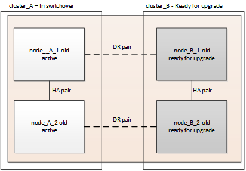
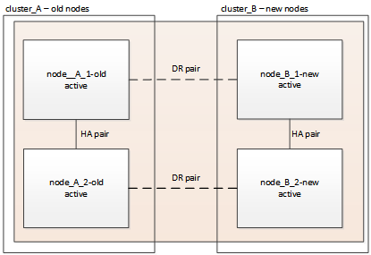

= Upgrading controllers in a MetroCluster FC configuration using switchover and switchback
:icons: font
:imagesdir: ../media/

[.lead]
You can use the MetroCluster switchover operation to provide nondisruptive service to clients while the controller modules on the partner cluster are upgraded. Other components (such as storage shelves or switches) cannot be upgraded as part of this procedure.

== Supported platform combinations

You can upgrade certain platforms using the switchover and switchback operation in a MetroCluster FC configuration. 

For information on what platform upgrade combinations are supported review the MetroCluster FC upgrade table in  link:concept_choosing_controller_upgrade_mcc.html#metrocluster-fc-controller-upgrades[Choose a controller upgrade procedure].

Refer to https://docs.netapp.com/us-en/ontap-metrocluster/upgrade/concept_choosing_an_upgrade_method_mcc.html[Choosing an upgrade or refresh method] for additional procedures.

== About this task

* You can use this procedure only for controller upgrade.
+
Other components in the configuration, such as storage shelves or switches, cannot be upgraded at the same time.

* You can use this procedure with certain ONTAP versions:
** Two-node configurations are supported in ONTAP 9.3 and later.
** Four- and eight-node configurations are supported in ONTAP 9.8 and later.
+
Do not use this procedure on four- or eight-node configurations running ONTAP versions prior to 9.8.
* Your original and new platforms must be compatible and supported.
+
https://hwu.netapp.com[NetApp Hardware Universe]
+
NOTE: If the original or new platforms are FAS8020 or AFF8020 systems using ports 1c and 1d in FC-VI mode, see the Knowledge Base article link:https://kb.netapp.com/Advice_and_Troubleshooting/Data_Protection_and_Security/MetroCluster/Upgrading_controllers_when_FCVI_connections_on_existing_FAS8020_or_AFF8020_nodes_use_ports_1c_and_1d[Upgrading controllers when FCVI connections on existing FAS8020 or AFF8020 nodes use ports 1c and 1d.^]

* The licenses at both sites must match. You can obtain new licenses from link:https://mysupport.netapp.com/site/[NetApp Support^].

* This procedure applies to controller modules in a MetroCluster FC configuration (a two-node stretch MetroCluster or a two, four-node, or eight-node fabric-attached MetroCluster configuration).
* All controllers in the same DR group should be upgraded during the same maintenance period.
+
Operating the MetroCluster configuration with different controller types in the same DR group is not supported outside of this maintenance activity. For eight-node MetroCluster configurations, the controllers within a DR Group must be the same, but both DR groups can use different controller types.

* Mapping of storage, FC and Ethernet connections between original nodes and new nodes in advance is recommended.
* If the new platform has fewer slots than the original system, or if it has fewer or different types of ports, you might need to add an adapter to the new system.
+
For more information, see the https://hwu.netapp.com/[NetApp Hardware Universe^]

The following example names are used in this procedure:

* site_A
 ** Before upgrade:
  *** node_A_1-old
  *** node_A_2-old
 ** After upgrade:
  *** node_A_1-new
  *** node_A_2-new
* site_B
 ** Before upgrade:
  *** node_B_1-old
  *** node_B_2-old
 ** After upgrade:
  *** node_B_1-new
  *** node_B_2-new

// BURT 1391601, 23 FEB 2022

== Preparing for the upgrade

Before making any changes to the existing MetroCluster configuration, you must check the health of the configuration, prepare the new platforms, and perform other miscellaneous tasks.

=== Verifying the health of the MetroCluster configuration

You must verify the health and connectivity of the MetroCluster configuration prior to performing the upgrade.

.Steps

. Verify the operation of the MetroCluster configuration in ONTAP:
 .. Check whether the nodes are multipathed:
 +
`node run -node _node-name_ sysconfig -a`
+
You should issue this command for each node in the MetroCluster configuration.

.. Verify that there are no broken disks in the configuration:
+
`storage disk show -broken`
+
You should issue this command on each node in the MetroCluster configuration.

.. Check for any health alerts:
+
`system health alert show`
+
You should issue this command on each cluster.

.. Verify the licenses on the clusters:
+
`system license show`
+
You should issue this command on each cluster.

.. Verify the devices connected to the nodes:
+
`network device-discovery show`
+
You should issue this command on each cluster.

.. Verify that the time zone and time are set correctly on both sites:
+
`cluster date show`
+
You should issue this command on each cluster. You can use the `cluster date` commands to configure the time and time zone.
. Check for any health alerts on the switches (if present):
+
`storage switch show`
+
You should issue this command on each cluster.

. Confirm the operational mode of the MetroCluster configuration and perform a MetroCluster check.
.. Confirm the MetroCluster configuration and that the operational mode is normal:
+
`metrocluster show`

.. Confirm that all expected nodes are shown:
+
`metrocluster node show`

.. Issue the following command:
+
`metrocluster check run`
.. Display the results of the MetroCluster check:
+
`metrocluster check show`
. Check the MetroCluster cabling with the Config Advisor tool.
.. Download and run Config Advisor.
+
https://mysupport.netapp.com/site/tools/tool-eula/activeiq-configadvisor[NetApp Downloads: Config Advisor]

.. After running Config Advisor, review the tool's output and follow the recommendations in the output to address any issues discovered.

=== Mapping ports from the old nodes to the new nodes

You must plan the mapping of the LIFs on physical ports on the old nodes to the physical ports on the new nodes.

.About this task

When the new node is first booted during the upgrade process, it will replay the most recent configuration of the old node it is replacing. When you boot node_A_1-new, ONTAP attempts to host LIFs on the same ports that were used on node_A_1-old. Therefore, as part of the upgrade you must adjust the port and LIF configuration so it is compatible with that of the old node. During the upgrade procedure, you will perform steps on both the old and new nodes to ensure correct cluster, management, and data LIF configuration.

The following table shows examples of configuration changes related to the port requirements of the new nodes.

[cols="1,1,3"]
|===

3+h| Cluster interconnect physical ports
h| Old controller h| New controller h| Required action

a|
e0a, e0b

a|
e3a, e3b

a|
No matching port. After upgrade, you must recreate cluster ports.
link:task_prepare_cluster_ports_on_the_exist_controller.html[Preparing cluster ports on an existing controller module]

a|
e0c, e0d

a|
e0a,e0b,e0c,e0d

a|
e0c and e0d are matching ports. You do not have to change the configuration, but after upgrade you can spread your cluster LIFs across the available cluster ports.

|===

.Steps

. Determine what physical ports are available on the new controllers and what LIFs can be hosted on the ports.
+
The controller's port usage depends on the platform module and which switches you will use in the MetroCluster IP configuration. You can gather the port usage of the new platforms from the link:https://hwu.netapp.com[NetApp Hardware Universe^].
+
Also identify the FC-VI card slot usage.

. Plan your port usage and, if desired, fill in the following tables for reference for each of the new nodes.
+
You will refer to the table as you carry out the upgrade procedure.
+

|===

h|  3+h| node_A_1-old 3+h| node_A_1-new
h| LIF h| Ports h| IPspaces h| Broadcast domains h| Ports h| IPspaces h| Broadcast domains

a|
Cluster 1
a|

a|

a|

a|

a|

a|

a|
Cluster 2
a|

a|

a|

a|

a|

a|

a|
Cluster 3
a|

a|

a|

a|

a|

a|

a|
Cluster 4
a|

a|

a|

a|

a|

a|

a|
Node management
a|

a|

a|

a|

a|

a|

a|
Cluster management
a|

a|

a|

a|

a|

a|

a|
Data 1
a|

a|

a|

a|

a|

a|

a|
Data 2
a|

a|

a|

a|

a|

a|

a|
Data 3
a|

a|

a|

a|

a|

a|

a|
Data 4
a|

a|

a|

a|

a|

a|

a|
SAN
a|

a|

a|

a|

a|

a|

a|
Intercluster port
a|

a|

a|

a|

a|

a|

|===

=== Gathering information before the upgrade

Before upgrading, you must gather information for each of the old nodes, and, if necessary, adjust the network broadcast domains, remove any VLANs and interface groups, and gather encryption information.

.About this task

This task is performed on the existing MetroCluster FC configuration.

.Steps

. Label the cables for the existing controllers, to allow easy identification of cables when setting up the new controllers.
. Gather the system IDs of the nodes in the MetroCluster configuration:
+
`metrocluster node show -fields node-systemid,dr-partner-systemid`
+
During the upgrade procedure, you will replace these old system IDs with the system IDs of the new controller modules.
+
In this example for a four-node MetroCluster FC configuration, the following old system IDs are retrieved:

 ** node_A_1-old: 4068741258
 ** node_A_2-old: 4068741260
 ** node_B_1-old: 4068741254
 ** node_B_2-old: 4068741256

+
----
metrocluster-siteA::> metrocluster node show -fields node-systemid,ha-partner-systemid,dr-partner-systemid,dr-auxiliary-systemid
dr-group-id   cluster                       node                   node-systemid          ha-partner-systemid     dr-partner-systemid    dr-auxiliary-systemid
-----------        ------------------------- ------------------    -------------                   -------------------                 -------------------              ---------------------
1                    Cluster_A                  Node_A_1-old   4068741258              4068741260                        4068741256                    4068741256
1                    Cluster_A                    Node_A_2-old   4068741260              4068741258                        4068741254                    4068741254
1                    Cluster_B                    Node_B_1-old   4068741254              4068741256                         4068741258                    4068741260
1                    Cluster_B                    Node_B_2-old   4068741256              4068741254                        4068741260                    4068741258
4 entries were displayed.
----
+
In this example for a two-node MetroCluster FC configuration, the following old system IDs are retrieved:

 ** node_A_1: 4068741258
 ** node_B_1: 4068741254

+
----
metrocluster node show -fields node-systemid,dr-partner-systemid

dr-group-id cluster    node      node-systemid dr-partner-systemid
----------- ---------- --------  ------------- ------------
1           Cluster_A  Node_A_1-old  4068741258    4068741254
1           Cluster_B  node_B_1-old  -             -
2 entries were displayed.
----

. Gather port and LIF information for each old node.
+
You should gather the output of the following commands for each node:

 ** `network interface show -role cluster,node-mgmt`
 ** `network port show -node _node-name_ -type physical`
 ** `network port vlan show -node _node-name_`
 ** `network port ifgrp show -node _node_name_ -instance`
 ** `network port broadcast-domain show`
 ** `network port reachability show -detail`
 ** `network ipspace show`
 ** `volume show`
 ** `storage aggregate show`
 ** `system node run -node _node-name_ sysconfig -a`

. If the MetroCluster nodes are in a SAN configuration, collect the relevant information.
+
You should gather the output of the following commands:

 ** `fcp adapter show -instance`
 ** `fcp interface show -instance`
 ** `iscsi interface show`
 ** `ucadmin show`

. If the root volume is encrypted, collect and save the passphrase used for key-manager:
+
`security key-manager backup show`
. If the MetroCluster nodes are using encryption for volumes or aggregates, copy information about the keys and passphrases.
+
For additional information, see https://docs.netapp.com/ontap-9/topic/com.netapp.doc.pow-nve/GUID-1677AE0A-FEF7-45FA-8616-885AA3283BCF.html[Backing up onboard key management information manually].

.. If Onboard Key Manager is configured:
+
`security key-manager onboard show-backup`
+
You will need the passphrase later in the upgrade procedure.

.. If enterprise key management (KMIP) is configured, issue the following commands:
+
`security key-manager external show -instance`
+
`security key-manager key query`

=== Removing the existing configuration from the Tiebreaker or other monitoring software

If the existing configuration is monitored with the MetroCluster Tiebreaker configuration or other third-party applications (for example, ClusterLion) that can initiate a switchover, you must remove the MetroCluster configuration from the Tiebreaker or other software prior to transition.

.Steps

. Remove the existing MetroCluster configuration from the Tiebreaker software.
+
http://docs.netapp.com/ontap-9/topic/com.netapp.doc.hw-metrocluster-tiebreaker/GUID-34C97A45-0BFF-46DD-B104-2AB2805A983D.html[Removing MetroCluster configurations]

. Remove the existing MetroCluster configuration from any third-party application that can initiate switchover.
+
Refer to the documentation for the application.

=== Sending a custom AutoSupport message prior to maintenance

Before performing the maintenance, you should issue an AutoSupport message to notify NetApp technical support that maintenance is underway. Informing technical support that maintenance is underway prevents them from opening a case on the assumption that a disruption has occurred.

.About this task

This task must be performed on each MetroCluster site.

.Steps

. To prevent automatic support case generation, send an Autosupport message to indicate maintenance is underway.
.. Issue the following command:
+
`system node autosupport invoke -node * -type all -message MAINT=__maintenance-window-in-hours__`
+
`maintenance-window-in-hours` specifies the length of the maintenance window, with a maximum of 72 hours. If the maintenance is completed before the time has elapsed, you can invoke an AutoSupport message indicating the end of the maintenance period:
+
`system node autosupport invoke -node * -type all -message MAINT=end`

.. Repeat the command on the partner cluster.

== Switching over the MetroCluster configuration

You must switch over the configuration to site_A so that the platforms on site_B can be upgraded.

.About this task

This task must be performed on site_A.

After completing this task, cluster_A is active and serving data for both sites. cluster_B is inactive, and ready to begin the upgrade process, as shown in the following illustration.

.Steps

. Switch over the MetroCluster configuration to site_A so that site_B's nodes can be upgraded:

.. Select the option that matches your configuration and issue the correct command on cluster_A:
+
[role="tabbed-block"]
====
.Option 1: Four- or eight-node FC configuration running ONTAP 9.8 or later
--
Run the command: `metrocluster switchover -controller-replacement true`
--
.Option 2: Two-node FC configuration running ONTAP 9.3 and later
--
Run the command: `metrocluster switchover`
--
====
+
The operation can take several minutes to complete.

.. Monitor the switchover operation:
+
`metrocluster operation show`
.. After the operation is complete, confirm that the nodes are in switchover state:
+
`metrocluster show`

.. Check the status of the MetroCluster nodes:
+
`metrocluster node show`

. Heal the data aggregates.
.. Heal the data aggregates:
+
`metrocluster heal data-aggregates`
.. Confirm the heal operation is complete by running the `metrocluster operation show` command on the healthy cluster:
+
----

cluster_A::> metrocluster operation show
  Operation: heal-aggregates
      State: successful
 Start Time: 7/29/2020 20:54:41
   End Time: 7/29/2020 20:54:42
     Errors: -
----
. Heal the root aggregates.
.. Heal the data aggregates:
+
`metrocluster heal root-aggregates`
.. Confirm the heal operation is complete by running the `metrocluster operation show` command on the healthy cluster:
+
----

cluster_A::> metrocluster operation show
  Operation: heal-root-aggregates
      State: successful
 Start Time: 7/29/2020 20:58:41
   End Time: 7/29/2020 20:59:42
     Errors: -
----

== Preparing the network configuration of the old controllers

To ensure that the networking resumes cleanly on the new controllers, you must move LIFs to a common port and then remove the networking configuration of the old controllers.

.About this task

* This task must be performed on each of the old nodes.
* You will use the information gathered in link:task_upgrade_controllers_in_a_four_node_fc_mcc_us_switchover_and_switchback_mcc_fc_4n_cu.html[Mapping ports from the old nodes to the new nodes].

.Steps

. Boot the old nodes and then log in to the nodes:
+
`boot_ontap`

. Assign the home port of all data LIFs on the old controller to a common port that is the same on both the old and new controller modules.

.. Display the LIFs:
+
`network interface show`
+
All data LIFS including SAN and NAS will be admin up and operationally down since those are up at switchover site (cluster_A).

.. Review the output to find a common physical network port that is the same on both the old and new controllers that is not used as a cluster port.
+
For example, e0d is a physical port on old controllers and is also present on new controllers. e0d is not used as a cluster port or otherwise on the new controllers.
+
For port usage for platform models, see the https://hwu.netapp.com/[NetApp Hardware Universe]

.. Modify all data LIFS to use the common port as the home port:
+
`network interface modify -vserver _svm-name_ -lif _data-lif_ -home-port _port-id_`
+
In the following example, this is "e0d".
+
For example:
+
----
network interface modify -vserver vs0 -lif datalif1 -home-port e0d
----
. Modify broadcast domains to remove vlan and physical ports that need to be deleted:
+
`broadcast-domain remove-ports -broadcast-domain _broadcast-domain-name_ -ports _node-name:port-id_`
+
Repeat this step for all VLAN and physical ports.

. Remove any VLAN ports using cluster ports as member ports and ifgrps using cluster ports as member ports.
.. Delete VLAN ports:
+
`network port vlan delete -node _node-name_ -vlan-name _portid-vlandid_`
+
For example:
+
----
network port vlan delete -node node1 -vlan-name e1c-80
----

.. Remove physical ports from the interface groups:
+
`network port ifgrp remove-port -node _node-name_ -ifgrp _interface-group-name_ -port _portid_`
+
For example:
+
----
network port ifgrp remove-port -node node1 -ifgrp a1a -port e0d
----

.. Remove VLAN and interface group ports from broadcast domain::
+
`network port broadcast-domain remove-ports -ipspace _ipspace_ -broadcast-domain _broadcast-domain-name_ -ports _nodename:portname,nodename:portname_,..`
.. Modify interface group ports to use other physical ports as member as needed.:
+
`ifgrp add-port -node _node-name_ -ifgrp _interface-group-name_ -port _port-id_`

. Halt the nodes:
+
`halt -inhibit-takeover true -node _node-name_`
+
This step must be performed on both nodes.

== Removing the old platforms

The old controllers must be removed from the configuration.

.About this task

This task is performed on site_B.

.Steps

. Connect to the serial console of the old controllers (node_B_1-old and node_B_2-old) at site_B and verify it is displaying the LOADER prompt.

. Disconnect the storage and network connections on node_B_1-old and node_B_2-old and label the cables so they can be reconnected to the new nodes.

. Disconnect the power cables from node_B_1-old and node_B_2-old.

. Remove the node_B_1-old and node_B_2-old controllers from the rack.

== Configuring the new controllers

You must rack and install the controllers, perform required setup in Maintenance mode, and then boot the controllers, and verify the LIF configuration on the controllers.

=== Setting up the new controllers

You must rack and cable the new controllers.

.Steps

. Plan out the positioning of the new controller modules and storage shelves as needed.
+
The rack space depends on the platform model of the controller modules, the switch types, and the number of storage shelves in your configuration.

. Properly ground yourself.

. Install the controller modules in the rack or cabinet.
+
https://docs.netapp.com/platstor/index.jsp[ONTAP Hardware Systems Documentation^]

. If the new controller modules did not come with FC-VI cards of their own and if FC-VI cards from old controllers are compatible on new controllers, swap FC-VI cards and install those in correct slots.
+
See the link:https://hwu.netapp.com[NetApp Hardware Universe^] for slot info for FC-VI cards.

. Cable the controllers' power, serial console and management connections as described in the _MetroCluster Installation and Configuration Guides_.
+
Do not connect any other cables that were disconnected from old controllers at this time.
+
https://docs.netapp.com/platstor/index.jsp[ONTAP Hardware Systems Documentation^]

. Power up the new nodes and press Ctrl-C when prompted to display the LOADER prompt.

=== Netbooting the new controllers

After you install the new nodes, you need to netboot to ensure the new nodes are running the same version of ONTAP as the original nodes. The term netboot means you are booting from an ONTAP image stored on a remote server. When preparing for netboot, you must put a copy of the ONTAP 9 boot image onto a web server that the system can access.

This task is performed on each of the new controller modules.

// include reference
include::../_include/netboot_steps.adoc[]
// end include reference

=== Clearing the configuration on a controller module

// include reference
include::../_include/steps_clear_config_boot_to_maint_mode.adoc[]
// end include reference

=== Restoring the HBA configuration

Depending on the presence and configuration of HBA cards in the controller module, you need to configure them correctly for your site's usage.

.Steps

. In Maintenance mode configure the settings for any HBAs in the system:
.. Check the current settings of the ports: `ucadmin show`
.. Update the port settings as needed.

+
[cols="1,3"]
|===

h| If you have this type of HBA and desired mode... h| Use this command...

a|
CNA FC
a|
`ucadmin modify -m fc -t initiator _adapter-name_`
a|
CNA Ethernet
a|
`ucadmin modify -mode cna _adapter-name_`
a|
FC target
a|
`fcadmin config -t target _adapter-name_`
a|
FC initiator
a|
`fcadmin config -t initiator _adapter-name_`
|===
. Exit Maintenance mode:
+
`halt`
+
After you run the command, wait until the node stops at the LOADER prompt.

. Boot the node back into Maintenance mode to enable the configuration changes to take effect:
+
`boot_ontap maint`
. Verify the changes you made:
+

|===

h| If you have this type of HBA... h| Use this command...

a|
CNA
a|
`ucadmin show`
a|
FC
a|
`fcadmin show`
|===

=== Setting the HA state on the new controllers and chassis

You must verify the HA state of the controllers and chassis, and, if necessary, update the state to match your system configuration.

.Steps

. In Maintenance mode, display the HA state of the controller module and chassis:
+
`ha-config show`
+
The HA state for all components should be mcc.
+

|===

h| If the MetroCluster configuration has... h| The HA state should be...

a|
Two nodes
a|
mcc-2n
a|
Four or eight nodes
a|
mcc
|===

. If the displayed system state of the controller is not correct, set the HA state for the controller module and chassis:
+

|===

h| If the MetroCluster configuration has... h| Issue these commands...

a|
*Two nodes*
a|
`ha-config modify controller mcc-2n`

`ha-config modify chassis mcc-2n`
a|
*Four or eight nodes*
a|
`ha-config modify controller mcc`

`ha-config modify chassis mcc`
|===

=== Reassigning root aggregate disks

Reassign the root aggregate disks to the new controller module, using the sysids gathered earlier

.About this task

This task is performed in Maintenance mode.

The old system IDs were identified in link:task_upgrade_controllers_in_a_four_node_fc_mcc_us_switchover_and_switchback_mcc_fc_4n_cu.html[Gathering information before the upgrade].

The examples in this procedure use controllers with the following system IDs:

|===

h| Node h| Old system ID h| New system ID

a|
node_B_1
a|
4068741254
a|
1574774970
|===

.Steps

. Cable all other connections to the new controller modules (FC-VI, storage, cluster interconnect, etc.).

. Halt the system and boot to Maintenance mode from the LOADER prompt:
+
`boot_ontap maint`

. Display the disks owned by node_B_1-old:
+
`disk show -a`
+
The command output shows the system ID of the new controller module (1574774970). However, the root aggregate disks are still owned by the old system ID (4068741254). This example does not show drives owned by other nodes in the MetroCluster configuration.
+
----
*> disk show -a
Local System ID: 1574774970

  DISK         OWNER                     POOL   SERIAL NUMBER    HOME                      DR HOME
------------   -------------             -----  -------------    -------------             -------------
...
rr18:9.126L44 node_B_1-old(4068741254)   Pool1  PZHYN0MD         node_B_1-old(4068741254)  node_B_1-old(4068741254)
rr18:9.126L49 node_B_1-old(4068741254)   Pool1  PPG3J5HA         node_B_1-old(4068741254)  node_B_1-old(4068741254)
rr18:8.126L21 node_B_1-old(4068741254)   Pool1  PZHTDSZD         node_B_1-old(4068741254)  node_B_1-old(4068741254)
rr18:8.126L2  node_B_1-old(4068741254)   Pool0  S0M1J2CF         node_B_1-old(4068741254)  node_B_1-old(4068741254)
rr18:8.126L3  node_B_1-old(4068741254)   Pool0  S0M0CQM5         node_B_1-old(4068741254)  node_B_1-old(4068741254)
rr18:9.126L27 node_B_1-old(4068741254)   Pool0  S0M1PSDW         node_B_1-old(4068741254)  node_B_1-old(4068741254)
...
----

. Reassign the root aggregate disks on the drive shelves to the new controller:
+
`disk reassign -s _old-sysid_ -d _new-sysid_`
+
The following example shows reassignment of drives:
+
----
*> disk reassign -s 4068741254 -d 1574774970
Partner node must not be in Takeover mode during disk reassignment from maintenance mode.
Serious problems could result!!
Do not proceed with reassignment if the partner is in takeover mode. Abort reassignment (y/n)? n

After the node becomes operational, you must perform a takeover and giveback of the HA partner node to ensure disk reassignment is successful.
Do you want to continue (y/n)? Jul 14 19:23:49 [localhost:config.bridge.extra.port:error]: Both FC ports of FC-to-SAS bridge rtp-fc02-41-rr18:9.126L0 S/N [FB7500N107692] are attached to this controller.
y
Disk ownership will be updated on all disks previously belonging to Filer with sysid 4068741254.
Do you want to continue (y/n)? y
----

. Check that all disks are reassigned as expected:
+
`disk show`
+
----
*> disk show
Local System ID: 1574774970

  DISK        OWNER                      POOL   SERIAL NUMBER   HOME                      DR HOME
------------  -------------              -----  -------------   -------------             -------------
rr18:8.126L18 node_B_1-new(1574774970)   Pool1  PZHYN0MD        node_B_1-new(1574774970)  node_B_1-new(1574774970)
rr18:9.126L49 node_B_1-new(1574774970)   Pool1  PPG3J5HA        node_B_1-new(1574774970)  node_B_1-new(1574774970)
rr18:8.126L21 node_B_1-new(1574774970)   Pool1  PZHTDSZD        node_B_1-new(1574774970)  node_B_1-new(1574774970)
rr18:8.126L2  node_B_1-new(1574774970)   Pool0  S0M1J2CF        node_B_1-new(1574774970)  node_B_1-new(1574774970)
rr18:9.126L29 node_B_1-new(1574774970)   Pool0  S0M0CQM5        node_B_1-new(1574774970)  node_B_1-new(1574774970)
rr18:8.126L1  node_B_1-new(1574774970)   Pool0  S0M1PSDW        node_B_1-new(1574774970)  node_B_1-new(1574774970)
*>
----

. Display the aggregate status:
+
`aggr status`
+
----
*> aggr status
           Aggr            State       Status           Options
aggr0_node_b_1-root    online      raid_dp, aggr    root, nosnap=on,
                           mirrored                     mirror_resync_priority=high(fixed)
                           fast zeroed
                           64-bit
----

. Repeat the above steps on the partner node (node_B_2-new).

=== Booting up the new controllers

You must reboot the controllers from the boot menu to update the controller flash image. Additional steps are required if encryption is configured.

.About this task

This task must be performed on all the new controllers.

.Steps

. Halt the node:
+
`halt`

. If external key manager is configured, set the related bootargs:
+
`setenv bootarg.kmip.init.ipaddr _ip-address_`
+
`setenv bootarg.kmip.init.netmask _netmask_`
+
`setenv bootarg.kmip.init.gateway _gateway-address_`
+
`setenv bootarg.kmip.init.interface _interface-id_`
. Display the boot menu:
+
`boot_ontap menu`
. If root encryption is used, depending on the ONTAP version you are using, select the boot menu option or issue the boot menu command for your key management configuration.
+
[role="tabbed-block"]
====
.ONTAP 9.8 and later
--
Beginning with ONTAP 9.8, select the boot menu option.

|===

h| If you are using... h| Select this boot menu option...

a|
Onboard key management
a|
Option "`10`"

Follow the prompts to provide the required inputs to recover and restore the key-manager configuration.
a|
External key management

a|
Option "`11`"

Follow the prompts to provide the required inputs to recover and restore the key-manager configuration.
|===
--

.ONTAP 9.7 and earlier
--
For ONTAP 9.7 and earlier, issue the boot menu command.

|===

h| If you are using... h| Issue this command at the boot menu prompt...

a|
Onboard key management
a|
`recover_onboard_keymanager`
a|
External key management
a|
`recover_external_keymanager`
|===
--
====

. If autoboot is enabled, interrupt autoboot by pressing CTRL-C.
. From the boot menu, run option "`6`".
+
NOTE: Option "`6`" will reboot the node twice before completing.
+

Respond "`y`" to the system id change prompts. Wait for the second reboot messages:
+
----
Successfully restored env file from boot media...

Rebooting to load the restored env file...
----

. Double-check that the partner-sysid is correct:
+
`printenv partner-sysid`
+
If the partner-sysid is not correct, set it:
+
`setenv partner-sysid _partner-sysID_`

. If root encryption is used, depending on the ONTAP version you are using, select the boot menu option or issue the boot menu command again for your key management configuration.
+
[role="tabbed-block"]
====
.ONTAP 9.8 and later
--
Beginning with ONTAP 9.8, select the boot menu option.

|===

h| If you are using... h| Select this boot menu option...

a|
Onboard key management
a|
Option "`10`"

Follow the prompts to provide the required inputs to recover and restore the key-manager configuration.
a|
External key management
a|
Option "`11`"

Follow the prompts to provide the required inputs to recover and restore the key-manager configuration.
|===

Depending on the key manager setting, perform the recovery procedure by selecting option "`10`" or option "`11`", followed by option "`6`" at the first boot menu prompt. To boot the nodes completely, you might need to repeat the recovery procedure continued by option "`1`" (normal boot).
--

.ONTAP 9.7 and earlier
--
For ONTAP 9.7 and earlier, issue the boot menu command.

|===

h| If you are using... h| Issue this command at the boot menu prompt...

a|
Onboard key management
a|
`recover_onboard_keymanager`
a|
External key management
a|
`recover_external_keymanager`
|===

You might need to issue the `recover_xxxxxxxx_keymanager` command at the boot menu prompt multiple times until the nodes completely boot.
--
====

. Boot the nodes:
+
`boot_ontap`

. Wait for the replaced nodes to boot up.
+
If either node is in takeover mode, perform a giveback:
+
`storage failover giveback`

. Verify that all ports are in a broadcast domain:

.. View the broadcast domains:
+
`network port broadcast-domain show`

.. Add any ports to a broadcast domain as needed.
+
https://docs.netapp.com/ontap-9/topic/com.netapp.doc.dot-cm-nmg/GUID-003BDFCD-58A3-46C9-BF0C-BA1D1D1475F9.html[Adding or removing ports from a broadcast domain]

.. Add the physical port that will host the intercluster LIFs to the corresponding Broadcast domain.
.. Modify intercluster LIFs to use the new physical port as home port.
.. After the intercluster LIFs are up, check the cluster peer status and re-establish cluster peering as needed.
+
You might need to reconfigure cluster peering.
+
link:../install-fc/concept_configure_the_mcc_software_in_ontap.html#peering-the-clusters[Creating a cluster peer relationship]

.. Recreate VLANs and interface groups as needed.
+
VLAN and interface group membership might be different than that of the old node.
+
https://docs.netapp.com/ontap-9/topic/com.netapp.doc.dot-cm-nmg/GUID-8929FCE2-5888-4051-B8C0-E27CAF3F2A63.html[Creating a VLAN^]
+
https://docs.netapp.com/ontap-9/topic/com.netapp.doc.dot-cm-nmg/GUID-DBC9DEE2-EAB7-430A-A773-4E3420EE2AA1.html[Combining physical ports to create interface groups^]
. If encryption is used, restore the keys using the correct command for your key management configuration.
+

|===

h| If you are using... h| Use this command...

a|
Onboard key management
a|
`security key-manager onboard sync`

For more information, see https://docs.netapp.com/ontap-9/topic/com.netapp.doc.pow-nve/GUID-E4AB2ED4-9227-4974-A311-13036EB43A3D.html[Restoring onboard key management encryption keys^].
a|
External key management
a|
`security key-manager external restore -vserver _SVM_ -node _node_ -key-server _host_name\|IP_address:port_ -key-id key_id -key-tag key_tag _node-name_`

For more information, see https://docs.netapp.com/ontap-9/topic/com.netapp.doc.pow-nve/GUID-32DA96C3-9B04-4401-92B8-EAF323C3C863.html[Restoring external key management encryption keys^].

|===

// BURT 1437371, 29 NOV 2021
=== Verifying LIF configuration

Verify that LIFs are hosted on appropriate node/ports prior to switchback. The following steps need to be performed

.About this task

This task is performed on site_B, where the nodes have been booted up with root aggregates.

.Steps

. Verify that LIFs are hosted on the appropriate node and ports prior to switchback.
.. Change to the advanced privilege level:
+
`set -privilege advanced`
.. Override the port configuration to ensure proper LIF placement:
+
`vserver config override -command "network interface modify -vserver _vserver_name_ -home-port _active_port_after_upgrade_ -lif _lif_name_ -home-node _new_node_name_"`
+
When entering the `network interface modify` command within the `vserver config override` command, you cannot use the tab autocomplete feature. You can create the `network interface modify` using autocomplete and then enclose it in the `vserver config override` command.

.. Return to the admin privilege level:
 +
`set -privilege admin`
. Revert the interfaces to their home node:
+
`network interface revert * -vserver _vserver-name_`
+
Perform this step on all SVMs as required.

=== Install the new licenses

Before the switchback operation, you must install licenses for the new controllers.

.Steps
. link:task_install_licenses_on_the_new_controller_module_cluster_mode.html[Installing licenses for the new controller module]

== Switching back the MetroCluster configuration

After the new controllers have been configured, you switch back the MetroCluster configuration to return the configuration to normal operation.

.About this task

In this task, you will perform the switchback operation, returning the MetroCluster configuration to normal operation. The nodes on site_A are still awaiting upgrade.

.Steps

. Issue the `metrocluster node show` command on site_B and check the output.

.. Verify that the new nodes are represented correctly.
.. Verify that the new nodes are in "Waiting for switchback state."

. Switchback the cluster:
+
`metrocluster switchback`
. Check the progress of the switchback operation:
+
`metrocluster show`
+
The switchback operation is still in progress when the output displays `waiting-for-switchback`:
+
----
cluster_B::> metrocluster show
Cluster                   Entry Name          State
------------------------- ------------------- -----------
 Local: cluster_B         Configuration state configured
                          Mode                switchover
                          AUSO Failure Domain -
Remote: cluster_A         Configuration state configured
                          Mode                waiting-for-switchback
                          AUSO Failure Domain -
----
+
The switchback operation is complete when the output displays `normal`:
+
----
cluster_B::> metrocluster show
Cluster                   Entry Name          State
------------------------- ------------------- -----------
 Local: cluster_B         Configuration state configured
                          Mode                normal
                          AUSO Failure Domain -
Remote: cluster_A         Configuration state configured
                          Mode                normal
                          AUSO Failure Domain -
----
+
If a switchback takes a long time to finish, you can check on the status of in-progress baselines by using the `metrocluster config-replication resync-status show` command. This command is at the advanced privilege level.

== Checking the health of the MetroCluster configuration

After upgrading the controller modules you must verify the health of the MetroCluster configuration.

.About this task

This task can be performed on any node in the MetroCluster configuration.

.Steps

. Verify the operation of the MetroCluster configuration:

.. Confirm the MetroCluster configuration and that the operational mode is normal:
+
`metrocluster show`
.. Perform a MetroCluster check:
+
`metrocluster check run`
.. Display the results of the MetroCluster check:
+
`metrocluster check show`
+
NOTE: After you run `metrocluster check run` and `metrocluster check show`, you see an error message similar to the following:
+
.Example
----
Failed to validate the node and cluster components before the switchover operation.
                  Cluster_A:: node_A_1 (non-overridable veto): DR partner NVLog mirroring is not online. Make sure that the links between the two sites are healthy and properly configured.
----
+
This is expected behavior due to a controller mismatch during the upgrade process and the error message can be safely ignored.

== Upgrading the nodes on cluster_A

You must repeat the upgrade tasks on cluster_A.

.Step
. Repeat the steps to upgrade the nodes on cluster_A, beginning with link:task_upgrade_controllers_in_a_four_node_fc_mcc_us_switchover_and_switchback_mcc_fc_4n_cu.html[Preparing for the upgrade].
+
As you perform the tasks, all example references to the clusters and nodes are reversed. For example, when the example is given to switchover from cluster_A, you will switchover from cluster_B.

== Sending a custom AutoSupport message after maintenance

After completing the upgrade, you should send an AutoSupport message indicating the end of maintenance, so automatic case creation can resume.

.Step
. To resume automatic support case generation, send an AutoSupport message to indicate that the maintenance is complete.
.. Issue the following command:
+
`system node autosupport invoke -node * -type all -message MAINT=end`
.. Repeat the command on the partner cluster.

== Restoring Tiebreaker monitoring

If the MetroCluster configuration was previously configured for monitoring by the Tiebreaker software, you can restore the Tiebreaker connection.

. Use the steps in http://docs.netapp.com/ontap-9/topic/com.netapp.doc.hw-metrocluster-tiebreaker/GUID-7259BCA4-104C-49C6-BAD0-1068CA2A3DA5.html[Adding MetroCluster configurations^] in _MetroCluster Tiebreaker Installation and Configuration_.

// 2023 JULY 5, ONTAPDOC-1083
// BURT 1391601, 23 FEB 2022
// BURT 1485050, 2022-06-21
// BURT 1229272, June 29 2022
