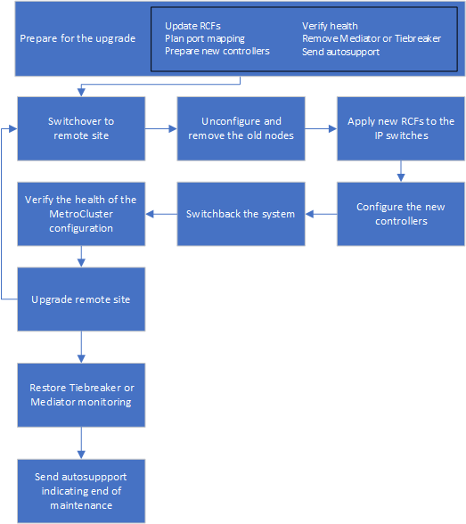
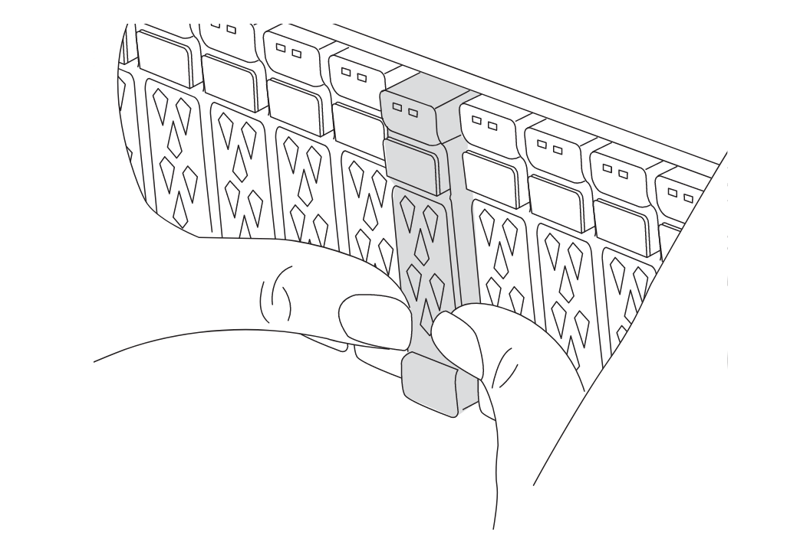
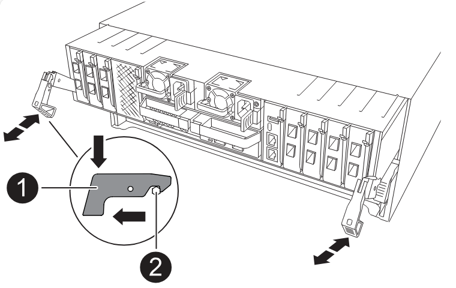

= Upgrading controllers in a MetroCluster IP configuration using switchover and switchback (ONTAP 9.8 and later)
:icons: font
:imagesdir: ../media/

[.lead]
Beginning with ONTAP 9.8, you can use the MetroCluster switchover operation to provide nondisruptive service to clients while the controller modules on the partner cluster are upgraded. Other components (such as storage shelves or switches) cannot be upgraded as part of this procedure.

== Platforms supported by this procedure

* The platforms must be running ONTAP 9.8 or later.
* The target (new) platform must be a different model than the original platform.
* You can only upgrade specific platform models using this procedure in a MetroCluster IP configuration. 
** For information on what platform upgrade combinations are supported review the MetroCluster IP upgrade table in  link:concept_choosing_controller_upgrade_mcc.html[Choose a controller upgrade procedure].
+
Refer to https://docs.netapp.com/us-en/ontap-metrocluster/upgrade/concept_choosing_controller_upgrade_mcc.html#choosing-a-procedure-that-uses-the-switchover-and-switchback-process[Choosing an upgrade or refresh method] for additional procedures.

== About this task

* This procedure applies to controller modules in a MetroCluster IP configuration.
* All controllers in the configuration should be upgraded during the same maintenance period.
+
Operating the MetroCluster configuration with different controller types is not supported outside of this maintenance activity.

* The MetroCluster IP switches (switch type, vendor, and model) and firmware version must be supported on the existing and new controllers in your upgrade configuration. 
+
Refer to the link:https://hwu.netapp.com[NetApp Hardware Universe^] or the link:https://imt.netapp.com/matrix/[IMT^] for supported switches and firmware versions.

* If it is enabled on your system, link:../maintain/task-configure-encryption.html#disable-end-to-end-encryption[disable end-to-end encryption] before performing the upgrade. 

* If the new platform has fewer slots than the original system, or if it has fewer or different types of ports, you might need to add an adapter to the new system.

* You reuse the IP addresses, netmasks, and gateways of the original platforms on the new platforms.

The following example names are used in this procedure:

* site_A
 ** Before upgrade:
  *** node_A_1-old
  *** node_A_2-old
 ** After upgrade:
  *** node_A_1-new
  *** node_A_2-new
* site_B
 ** Before upgrade:
  *** node_B_1-old
  *** node_B_2-old
 ** After upgrade:
  *** node_B_1-new
  *** node_B_2-new
  
== Enable console logging

include::../_include/console-logging.adoc[]

// 2024 Aug 13, ONTAPDOC-1988

== Set the required bootarg on the existing system

If you are upgrading to an AFF A70, AFF A90, or AFF A1K system, follow the steps to set the `hw.cxgbe.toe_keepalive_disable=1` bootarg.

CAUTION: If you are upgrading to an AFF A70, AFF A90, or AFF A1K system you *must* complete this task before performing the upgrade. This task *only* applies to upgrades to an AFF A70, AFF A90, or AFF A1K system from a supported system. For all other upgrades, you can skip this task and go directly to <<prepare_so_sb_upgrade,Prepare for the upgrade>>.

.Steps

. Halt one node at each site and allow its HA partner to perform a storage takeover of the node:
+
`halt  -node <node_name>`

. At the `LOADER` prompt of the halted node, enter the following: 
+
`setenv hw.cxgbe.toe_keepalive_disable 1` 
+
`saveenv` 
+
`printenv hw.cxgbe.toe_keepalive_disable`  

. Boot the node:
+
`boot_ontap`
    
. When the node boots, perform a giveback for the node at the prompt: 
+
`storage failover giveback -ofnode <node_name>`

. Repeat the steps on each node in the DR group that is being upgraded.

[[prepare_so_sb_upgrade]]
== Prepare for the upgrade

Before making any changes to the existing MetroCluster configuration, you must check the health of the configuration, prepare the new platforms, and perform other miscellaneous tasks.

=== Workflow for upgrading controllers in an MetroCluster IP configuration

You can use the workflow diagram to help you plan the upgrade tasks.

 
=== Update the MetroCluster switch RCF files before upgrading controllers

Depending on the old platform models, or if switch configuration is not on the minimum version, or if you want to change VLAN IDs used by the back-end MetroCluster connections, you must update the switch RCF files before you begin the platform upgrade procedure.

.About this task

You must update the RCF file in the following scenarios:

* For certain platform models, the switches must be using a supported VLAN ID for the back-end MetroCluster IP connections. If the old or new platform models are in the following table, *and not* using a supported VLAN ID, you must update the switch RCF files.
+
NOTE: The local cluster connections can use any VLAN, they do not need to be in the given range.
+

|===

h| Platform model (old or new) h| Supported VLAN IDs

a|

 ** AFF A400

a|

 ** 10
 ** 20
 ** Any value in the range 101 to 4096 inclusive.

|===

* The switch configuration was not configured with minimum supported RCF version:
+

|===

h| Switch model h| Required RCF file version

a|
Cisco 3132Q-V
a|
1.7 or later
a|
Cisco 3232C
a|
1.7 or later
a|
Broadcom BES-53248
a|
1.3 or later
|===

* You want to change the VLAN configuration.
+
The VLAN ID range is 101 to 4096 inclusive.

The switches at site_A will be upgraded when the controllers on site_A are upgraded.

.Steps

. Prepare the IP switches for the application of the new RCF files.
+
Follow the steps in the section for your switch vendor: 

 ** link:../install-ip/task_switch_config_broadcom.html#resetting-the-broadcom-ip-switch-to-factory-defaults[Reset the Broadcom IP switch to factory defaults]
 ** link:../install-ip/task_switch_config_cisco.html#resetting-the-cisco-ip-switch-to-factory-defaults[Reset the Cisco IP switch to factory defaults]
 ** link:../install-ip/task_switch_config_nvidia.html#reset-the-nvidia-ip-sn2100-switch-to-factory-defaults[Reset the NVIDIA IP SN2100 switch to factory defaults]

. Download and install the RCF files.
+
Follow the steps in the section for your switch vendor: 

 ** link:../install-ip/task_switch_config_broadcom.html#downloading-and-installing-the-broadcom-rcf-files[Download and install the Broadcom RCF files]
 ** link:../install-ip/task_switch_config_cisco.html#downloading-and-installing-the-cisco-ip-rcf-files[Download and install the Cisco IP RCF files]
 ** link:../install-ip/task_switch_config_nvidia.html#download-and-install-the-nvidia-rcf-files[Download and install the NVIDIA IP RCF files]

=== Map ports from the old nodes to the new nodes

You must verify that the physical ports on node_A_1-old map correctly to the physical ports on node_A_1-new, which will allow node_A_1-new to communicate with other nodes in the cluster and with the network after the upgrade.

.About this task

When the new node is first booted during the upgrade process, it will replay the most recent configuration of the old node it is replacing. When you boot node_A_1-new, ONTAP attempts to host LIFs on the same ports that were used on node_A_1-old. Therefore, as part of the upgrade you must adjust the port and LIF configuration so it is compatible with that of the old node. During the upgrade procedure, you will perform steps on both the old and new nodes to ensure correct cluster, management, and data LIF configuration.

The following table shows examples of configuration changes related to the port requirements of the new nodes.

|===

3+h| Cluster interconnect physical ports
h| Old controller h| New controller h| Required action

a|
e0a, e0b

a|
e3a, e3b

a|
No matching port. After upgrade, you must recreate cluster ports.

a|
e0c, e0d

a|
e0a,e0b,e0c,e0d

a|
e0c and e0d are matching ports. You do not have to change the configuration, but after upgrade you can spread your cluster LIFs across the available cluster ports.

|===

.Steps
. Determine what physical ports are available on the new controllers and what LIFs can be hosted on the ports.
+
The controller's port usage depends on the platform module and which switches you will use in the MetroCluster IP configuration. You can gather the port usage of the new platforms from the link:https://hwu.netapp.com[NetApp Hardware Universe].

. Plan your port usage and fill in the following tables for reference for each of the new nodes.
+
You will refer to the table as you carry out the upgrade procedure.
+

|===

h|  3+h| node_A_1-old 3+h| node_A_1-new
h| LIF h| Ports h| IPspaces h| Broadcast domains h| Ports h| IPspaces h| Broadcast domains

a|
Cluster 1
a|

a|

a|

a|

a|

a|

a|
Cluster 2
a|

a|

a|

a|

a|

a|

a|
Cluster 3
a|

a|

a|

a|

a|

a|

a|
Cluster 4
a|

a|

a|

a|

a|

a|

a|
Node management
a|

a|

a|

a|

a|

a|

a|
Cluster management
a|

a|

a|

a|

a|

a|

a|
Data 1
a|

a|

a|

a|

a|

a|

a|
Data 2
a|

a|

a|

a|

a|

a|

a|
Data 3
a|

a|

a|

a|

a|

a|

a|
Data 4
a|

a|

a|

a|

a|

a|

a|
SAN
a|

a|

a|

a|

a|

a|

a|
Intercluster port
a|

a|

a|

a|

a|

a|

|===

=== Netboot the new controllers

After you install the new nodes, you need to netboot to ensure the new nodes are running the same version of ONTAP as the original nodes. The term netboot means you are booting from an ONTAP image stored on a remote server. When preparing for netboot, you must put a copy of the ONTAP 9 boot image onto a web server that the system can access.

.Steps

. Netboot the new controllers:
 .. Access the https://mysupport.netapp.com/site/[NetApp Support Site] to download the files used for performing the netboot of the system.
 .. Download the appropriate ONTAP software from the software download section of the NetApp Support Site and store the `ontap-version_image.tgz` file on a web-accessible directory.
 .. Change to the web-accessible directory and verify that the files you need are available.
+
Your directory listing should contain a netboot folder with a kernel file:
+
`_ontap-version_image.tgz`
+
You do not need to extract the `_ontap-version_image.tgz` file.

.. At the LOADER prompt, configure the netboot connection for a management LIF:
+

|===

h| If IP addressing is... h| Then...

a|
DHCP
a|
Configure the automatic connection:

`ifconfig e0M -auto`
a|
Static
a|
Configure the manual connection:

`ifconfig e0M -addr=_ip_addr_ -mask=_netmask_ -gw=_gateway_`
|===

..  Perform the netboot.
+
`netboot \http://_web_server_ip/path_to_web-accessible_directory/ontap-version_image.tgz`

.. From the boot menu, select option **(7) Install new software first** to download and install the new software image to the boot device.
+
Disregard the following message:
+
`"This procedure is not supported for Non-Disruptive Upgrade on an HA pair"`. It applies to nondisruptive upgrades of software, not to upgrades of controllers.

.. If you are prompted to continue the procedure, enter `y`, and when prompted for the package, enter the URL of the image file:
+
`http://__web_server_ip/path_to_web-accessible_directory/ontap-version___image.tgz`

.. Enter the user name and password if applicable, or press Enter to continue.

.. Be sure to enter `n` to skip the backup recovery when you see a prompt similar to the following:
+
----
Do you want to restore the backup configuration now? {y|n} n
----

.. Reboot by entering `*y*` when you see a prompt similar to the following:
+
----
The node must be rebooted to start using the newly installed software. Do you want to reboot now? {y|n}
----

=== Clear the configuration on a controller module

// include reference

include::../_include/steps_clear_config_boot_to_maint_mode.adoc[]

// end include reference

=== Verify MetroCluster health before site upgrade

You must verify the health and connectivity of the MetroCluster configuration prior to performing the upgrade.

.Steps

. Verify the operation of the MetroCluster configuration in ONTAP:
.. Check whether the nodes are multipathed:
 +
`node run -node <node_name> sysconfig -a`
+
You should issue this command for each node in the MetroCluster configuration.

 .. Verify that there are no broken disks in the configuration:
 +
`storage disk show -broken`
+
You should issue this command on each node in the MetroCluster configuration.

.. Check for any health alerts:
+
`system health alert show`
+
You should issue this command on each cluster.

.. Verify the licenses on the clusters:
+
`system license show`
+
You should issue this command on each cluster.

.. Verify the devices connected to the nodes:
+
`network device-discovery show`
+
You should issue this command on each cluster.

.. Verify that the time zone and time is set correctly on both sites:
+
`cluster date show`
+
You should issue this command on each cluster. You can use the `cluster date` commands to configure the time and time zone.
. Confirm the operational mode of the MetroCluster configuration and perform a MetroCluster check.
 .. Confirm the MetroCluster configuration and that the operational mode is `normal`:
 +
`metrocluster show`
 .. Confirm that all expected nodes are shown:
 +
`metrocluster node show`
 .. Issue the following command:
+
`metrocluster check run`
 .. Display the results of the MetroCluster check:
+
`metrocluster check show`
. Check the MetroCluster cabling with the Config Advisor tool.
 .. Download and run Config Advisor.
+
https://mysupport.netapp.com/site/tools/tool-eula/activeiq-configadvisor[NetApp Downloads: Config Advisor]

 .. After running Config Advisor, review the tool's output and follow the recommendations in the output to address any issues discovered.

[[gather_info_so_sb]]
=== Gather information before the upgrade

Before upgrading, you must gather information for each of the nodes, and, if necessary, adjust the network broadcast domains, remove any VLANs and interface groups, and gather encryption information.

.Steps

. Record the physical cabling for each node, labelling cables as needed to allow correct cabling of the new nodes.
. Gather interconnect, port and LIF information for each node.
+
You should gather the output of the following commands for each node:

 ** `metrocluster interconnect show`
 ** `metrocluster configuration-settings connection show`
 ** `network interface show -role cluster,node-mgmt`
 ** `network port show -node <node_name> -type physical`
 ** `network port vlan show -node <node_name>`
 ** `network port ifgrp show -node <node_name> -instance`
 ** `network port broadcast-domain show`
 ** `network port reachability show -detail`
 ** `network ipspace show`
 ** `volume show`
 ** `storage aggregate show`
 ** `system node run -node <node_name> sysconfig -a`
  ** `aggr show -r` 
 ** `disk show`  
 ** `system node run <node-name> disk show`  
 ** `vol show -fields type` 
 ** `vol show -fields type , space-guarantee`
 ** `vserver fcp initiator show`
 ** `storage disk show`
 ** `metrocluster configuration-settings interface show`

. Gather the UUIDs for the site_B (the site whose platforms are currently being upgraded):
+
`metrocluster node show -fields node-cluster-uuid, node-uuid`
+
These values must be configured accurately on the new site_B controller modules to ensure a successful upgrade. Copy the values to a file so that you can copy them into the proper commands later in the upgrade process.
+
The following example shows the command output with the UUIDs:
+
----
cluster_B::> metrocluster node show -fields node-cluster-uuid, node-uuid
  (metrocluster node show)
dr-group-id cluster     node   node-uuid                            node-cluster-uuid
----------- --------- -------- ------------------------------------ ------------------------------
1           cluster_A node_A_1 f03cb63c-9a7e-11e7-b68b-00a098908039 ee7db9d5-9a82-11e7-b68b-00a098908039
1           cluster_A node_A_2 aa9a7a7a-9a81-11e7-a4e9-00a098908c35 ee7db9d5-9a82-11e7-b68b-00a098908039
1           cluster_B node_B_1 f37b240b-9ac1-11e7-9b42-00a098c9e55d 07958819-9ac6-11e7-9b42-00a098c9e55d
1           cluster_B node_B_2 bf8e3f8f-9ac4-11e7-bd4e-00a098ca379f 07958819-9ac6-11e7-9b42-00a098c9e55d
4 entries were displayed.
cluster_B::*
----
+
It is recommended that you record the UUIDs into a table similar to the following.
+

|===

h| Cluster or node h| UUID

a|
cluster_B
a|
07958819-9ac6-11e7-9b42-00a098c9e55d
a|
node_B_1
a|
f37b240b-9ac1-11e7-9b42-00a098c9e55d
a|
node_B_2
a|
bf8e3f8f-9ac4-11e7-bd4e-00a098ca379f
a|
cluster_A
a|
ee7db9d5-9a82-11e7-b68b-00a098908039
a|
node_A_1
a|
f03cb63c-9a7e-11e7-b68b-00a098908039
a|
node_A_2
a|
aa9a7a7a-9a81-11e7-a4e9-00a098908c35
|===

. If the MetroCluster nodes are in a SAN configuration, collect the relevant information.
+
You should gather the output of the following commands:

 ** `fcp adapter show -instance`
 ** `fcp interface show -instance`
 ** `iscsi interface show`
 ** `ucadmin show`

. If the root volume is encrypted, collect and save the passphrase used for key-manager:
+
`security key-manager backup show`

. If the MetroCluster nodes are using encryption for volumes or aggregates, copy information about the keys and passphrases.
+
For additional information, see https://docs.netapp.com/ontap-9/topic/com.netapp.doc.pow-nve/GUID-1677AE0A-FEF7-45FA-8616-885AA3283BCF.html[Backing up onboard key management information manually].

 .. If Onboard Key Manager is configured:
 +
`security key-manager onboard show-backup`
+
You will need the passphrase later in the upgrade procedure.

 .. If enterprise key management (KMIP) is configured, issue the following commands:
+
`security key-manager external show -instance`
`security key-manager key query`

. Gather the system IDs of the existing nodes:
+
`metrocluster node show -fields node-systemid,ha-partner-systemid,dr-partner-systemid,dr-auxiliary-systemid`
+
The following output shows the reassigned drives.
+
----
::> metrocluster node show -fields node-systemid,ha-partner-systemid,dr-partner-systemid,dr-auxiliary-systemid

dr-group-id cluster     node     node-systemid ha-partner-systemid dr-partner-systemid dr-auxiliary-systemid
----------- ----------- -------- ------------- ------------------- ------------------- ---------------------
1           cluster_A node_A_1   537403324     537403323           537403321           537403322
1           cluster_A node_A_2   537403323     537403324           537403322           537403321
1           cluster_B node_B_1   537403322     537403321           537403323           537403324
1           cluster_B node_B_2   537403321     537403322           537403324           537403323
4 entries were displayed.
----

=== Remove Mediator or Tiebreaker monitoring

Before the upgrading the platforms, you must remove monitoring if the MetroCluster configuration is monitored with the Tiebreaker or Mediator utility.

.Steps

. Collect the output for the following command:
+
`storage iscsi-initiator show`

. Remove the existing MetroCluster configuration from Tiebreaker, Mediator, or other software that can initiate switchover.
+

|===

h| If you are using... h| Use this procedure...

a|
Tiebreaker
a|
link:../tiebreaker/concept_configuring_the_tiebreaker_software.html#removing-metrocluster-configurations[Removing MetroCluster Configurations] 
a|
Mediator
a|
Issue the following command from the ONTAP prompt:

`metrocluster configuration-settings mediator remove`
a|
Third-party applications
a|
Refer to the product documentation.
|===

=== Send a custom AutoSupport message prior to maintenance

Before performing the maintenance, you should issue an AutoSupport message to notify NetApp technical support that maintenance is underway. Informing technical support that maintenance is underway prevents them from opening a case on the assumption that a disruption has occurred.

.About this task

This task must be performed on each MetroCluster site.

.Steps

. Log in to the cluster.

. Invoke an AutoSupport message indicating the start of the maintenance:
+
`system node autosupport invoke -node * -type all -message MAINT=__maintenance-window-in-hours__`
+
The `maintenance-window-in-hours` parameter specifies the length of the maintenance window, with a maximum of 72 hours. If the maintenance is completed before the time has elapsed, you can invoke an AutoSupport message indicating the end of the maintenance period:
+
`system node autosupport invoke -node * -type all -message MAINT=end`

. Repeat these steps on the partner site.

== Switch over the MetroCluster configuration

You must switch over the configuration to site_A so that the platforms on site_B can be upgraded.

.About this task

This task must be performed on site_A.

After completing this task, cluster_A is active and serving data for both sites. cluster_B is inactive, and ready to begin the upgrade process.

image::../media/mcc_upgrade_cluster_a_in_switchover.png[]

.Steps

. Switch over the MetroCluster configuration to site_A so that site_B's nodes can be upgraded:

.. Issue the following command on cluster_A:
+
`metrocluster switchover -controller-replacement true`
+
The operation can take several minutes to complete.

.. Monitor the switchover operation:
+
`metrocluster operation show`

.. After the operation is complete, confirm that the nodes are in switchover state:
+
`metrocluster show`

.. Check the status of the MetroCluster nodes:
+
`metrocluster node show`
+
Automatic healing of aggregates after negotiated switchover is disabled during controller upgrade.

== Remove interface configurations and uninstall the old controllers

Verify the correct LIF placement, remove VLANs and interface groups on the old controllers, and then physically uninstall the controllers.

.About this task

* These steps are performed on the old controllers (node_B_1-old, node_B_2-old).

* See the information you gathered in link:task_upgrade_controllers_in_a_four_node_ip_mcc_us_switchover_and_switchback_mcc_ip.html[Map ports from the old nodes to the new nodes].

.Steps

. Boot the old nodes and log in to the nodes:
+
`boot_ontap`

. Modify the intercluster LIFs on the old controllers to use a different home port than the ports used for HA interconnect or MetroCluster IP DR interconnect on the new controllers.
+
NOTE: This step is required for a successful upgrade.
+
The intercluster LIFs on the old controllers must use a different home port than the ports used for HA interconnect or MetroCluster IP DR interconnect on the new controllers. For example, when you upgrade to AFF A90 controllers, the HA interconnect ports are e1a and e7a, and the MetroCluster IP DR interconnect ports are e2b and e3b. You must move the intercluster LIFs on the old controllers if they are hosted on ports e1a, e7a, e2b, or e3b.
+
For port distribution and allocation on the new nodes, refer to the https://hwu.netapp.com[NetApp Hardware Universe].
+
.. On the old controllers, view the intercluster LIFs:
+
`network interface show  -role intercluster`
+
Take one of the following actions depending on whether the intercluster LIFs on the old controllers use the same ports as the ports used for HA interconnect or MetroCluster IP DR interconnect on the new controllers.
+
[cols=2*,options="header"]
|===
| If the intercluster LIFs...
| Go to...
| Use the same home port | <<controller_manual_upgrade_prepare_network_ports_2b,Substep b>>
| Use a different home port | <<controller_manual_upgrade_prepare_network_ports_3,Step 3>>
|===
+
.. [[controller_manual_upgrade_prepare_network_ports_2b]]Modify the intercluster LIFs to use a different home port:
+
`network interface modify -vserver <vserver> -lif <intercluster_lif> -home-port <port-not-used-for-ha-interconnect-or-mcc-ip-dr-interconnect-on-new-nodes>`
+
.. Verify that all intercluster LIFs are on their new home ports:
+
`network interface show -role intercluster -is-home  false`
+
The command output should be empty, indicating that all intercluster LIFs are on their respective home ports. 

.. If there are any LIFs that are not on their home ports, revert them using the following command:
+
`network interface revert -lif <intercluster_lif>`
+
Repeat the command for each intercluster LIF that is not on the home port.

. [[controller_manual_upgrade_prepare_network_ports_3]]Assign the home port of all data LIFs on the old controller to a common port that is the same on both the old and new controller modules.
+
CAUTION: If the old and new controllers do not have a common port, you do not need to modify the data LIFs. Skip this step and go directly to <<upgrades_assisted_without_matching_ports, Step 4>>. 

.. Display the LIFs:
+
`network interface show`
+
All data LIFS including SAN and NAS will be admin up and operationally down since those are up at switchover site (cluster_A).

 .. Review the output to find a common physical network port that is the same on both the old and new controllers that is not used as a cluster port.
+
For example, e0d is a physical port on old controllers and is also present on new controllers. e0d is not used as a cluster port or otherwise on the new controllers.
+
For port usage for platform models, see the https://hwu.netapp.com/[NetApp Hardware Universe]

.. Modify all data LIFS to use the common port as the home port:
 +
`network interface modify -vserver <svm-name> -lif <data-lif> -home-port <port-id>`
+
In the following example, this is "e0d".
+
For example:
+
----
network interface modify -vserver vs0 -lif datalif1 -home-port e0d
----

. [[upgrades_manual_without_matching_ports]] Modify broadcast domains to remove VLAN and physical ports that need to be deleted:
+
`broadcast-domain remove-ports -broadcast-domain <broadcast-domain-name> -ports <node-name:port-id>`
+
Repeat this step for all VLAN and physical ports.

. Remove any VLAN ports using cluster ports as member ports and ifgrps using cluster ports as member ports.
 .. Delete VLAN ports:
 +
`network port vlan delete -node <node_name> -vlan-name <portid-vlandid>`
+
For example:
+
----
network port vlan delete -node node1 -vlan-name e1c-80
----

.. Remove physical ports from the interface groups:
+
`network port ifgrp remove-port -node <node_name> -ifgrp <interface-group-name> -port <portid>`
+
For example:
+
----
network port ifgrp remove-port -node node1 -ifgrp a1a -port e0d
----

.. Remove VLAN and interface group ports from broadcast domain:
+
`network port broadcast-domain remove-ports -ipspace <ipspace> -broadcast-domain <broadcast-domain-name> -ports <nodename:portname,nodename:portnamee>,..`

.. Modify interface group ports to use other physical ports as member, as needed:
+
`ifgrp add-port -node <node_name> -ifgrp <interface-group-name> -port <port-id>`

. Halt the nodes to the LOADER prompt:
+
`halt -inhibit-takeover true`

. Connect to the serial console of the old controllers (node_B_1-old and node_B_2-old) at site_B and verify it is displaying the LOADER prompt.

. Gather the bootarg values:
+
`printenv`

. Disconnect the storage and network connections on node_B_1-old and node_B_2-old and label the cables so they can be reconnected to the new nodes.
. Disconnect the power cables from node_B_1-old and node_B_2-old.
. Remove the node_B_1-old and node_B_2-old controllers from the rack.

=== Set up the new controllers

You must rack and cable the new controllers.

.Steps

. Plan out the positioning of the new controller modules and storage shelves as needed.
+
The rack space depends on the platform model of the controller modules, the switch types, and the number of storage shelves in your configuration.

. Properly ground yourself.

. If your upgrade requires replacement of the controller modules, for example, upgrading from an AFF 800 to an AFF A90 system, you must remove the controller module from the chassis when you replace the controller module. For all other upgrades, skip to <<ip_upgrades_so_sb_4,Step 4>>.
+
On the front of the chassis, use your thumbs to firmly push each drive in until you feel a positive stop. This confirms that the drives are firmly seated against the chassis midplane.
+

. [[ip_upgrades_so_sb_4]] Install the controller modules.
+
NOTE: The installation steps you follow depend on whether your upgrade requires replacement of the controller modules, such as an upgrade from an AFF 800 to an AFF A90 system. 
+
[role="tabbed-block"]
====
.Replacing controller modules
--
Installing the new controllers separately is not applicable for upgrades of integrated systems with disks and controllers in the same chassis, for example, from an AFF A800 system to an AFF A90 system. The new controller modules and I/O cards must be swapped after powering off the old controllers, as shown in the image below.

The following example image is for representation only, the controller modules and I/O cards can vary between systems. 

-- 
.All other upgrades
--
Install the controller modules in the rack or cabinet.
--
====

. Cable the controllers' power, serial console, and management connections as described in link:../install-ip/using_rcf_generator.html[Cabling the MetroCluster IP switches]
+
Do not connect any other cables that were disconnected from old controllers at this time.
+
https://docs.netapp.com/us-en/ontap-systems/index.html[ONTAP Hardware Systems Documentation^]

. Power up the new nodes and boot them to Maintenance mode.

=== Restore the HBA configuration

Depending on the presence and configuration of HBA cards in the controller module, you need to configure them correctly for your site's usage.

.Steps

. In Maintenance mode configure the settings for any HBAs in the system:

.. Check the current settings of the ports:
+
`ucadmin show`

.. Update the port settings as needed.

+

|===

h| If you have this type of HBA and desired mode... h| Use this command...

a|
CNA FC
a|
`ucadmin modify -m fc -t initiator <adapter-name>`
a|
CNA Ethernet
a|
`ucadmin modify -mode cna <adapter-name>`
a|
FC target
a|
`fcadmin config -t target <adapter-name>`
a|
FC initiator
a|
`fcadmin config -t initiator <adapter-name>`
|===

. Exit Maintenance mode:
+
`halt`
+
After you run the command, wait until the node stops at the LOADER prompt.

. Boot the node back into Maintenance mode to enable the configuration changes to take effect:
+
`boot_ontap maint`

. Verify the changes you made:
+

|===

h| If you have this type of HBA... h| Use this command...

a|
CNA
a|
`ucadmin show`
a|
FC
a|
`fcadmin show`
|===

=== Set the HA state on the new controllers and chassis

You must verify the HA state of the controllers and chassis, and, if necessary, update the state to match your system configuration.

.Steps

. In Maintenance mode, display the HA state of the controller module and chassis:
+
`ha-config show`
+
The HA state for all components should be `mccip`.

. If the displayed system state of the controller or chassis is not correct, set the HA state:
+
`ha-config modify controller mccip`
+
`ha-config modify chassis mccip`

. Verify and modify the Ethernet ports connected to NS224 shelves or storage switches.
+
.. Verify the Ethernet ports connected to NS224 shelves or storage switches:
+
`storage port show`
+
.. Set all Ethernet ports connected to Ethernet shelves or storage switches, including shared switches for storage and cluster, to `storage` mode:
+ 
`storage port modify -p <port> -m storage` 
+
Example:
+
----
*> storage port modify -p e5b -m storage
Changing NVMe-oF port e5b to storage mode
----
+
NOTE: This must be set on all affected ports for a successful upgrade.
+
Disks from the shelves attached to the Ethernet ports are reported in the `sysconfig -v` output. 
+
Refer to the link:https://hwu.netapp.com[NetApp Hardware Universe^] for information on the storage ports for the system you are upgrading to.

.. Verify that `storage` mode is set and confirm that the ports are in the online state:
+
`storage port show`

. Halt the node: `halt`
+
The node should stop at the `LOADER>` prompt.

.	On each node, check the system date, time, and time zone: `show date`
.	If necessary, set the date in UTC or GMT: `set date <mm/dd/yyyy>`
.	Check the time by using the following command at the boot environment prompt: `show time`
.	If necessary, set the time in UTC or GMT: `set time <hh:mm:ss>`

.	Save the settings: `saveenv`
.	Gather environment variables: `printenv`

=== Update the switch RCFs to accommodate the new platforms

You must update the switches to a configuration that supports the new platform models.

.About this task

You perform this task at the site containing the controllers that are currently being upgraded. In the examples shown in this procedure, we are upgrading site_B first.

The switches at site_A will be upgraded when the controllers on site_A are upgraded.

.Steps

. Prepare the IP switches for the application of the new RCF files.
+
Follow the steps in the procedure for your switch vendor:
+
link:../install-ip/concept_considerations_differences.html[MetroCluster IP installation and configuration]

 ** link:../install-ip/task_switch_config_broadcom.html#resetting-the-broadcom-ip-switch-to-factory-defaults[[Reset the Broadcom IP switch to factory defaults]
 ** link:../install-ip/task_switch_config_cisco.html#resetting-the-cisco-ip-switch-to-factory-defaults[Reset the Cisco IP switch to factory defaults]
** link:../install-ip/task_switch_config_nvidia.html#reset-the-nvidia-ip-sn2100-switch-to-factory-defaults[Reset the NVIDIA IP SN2100 switch to factory defaults] 

. Download and install the RCF files.
+
Follow the steps in the section for your switch vendor:

** link:../install-ip/task_switch_config_broadcom.html#downloading-and-installing-the-broadcom-rcf-files[Download and install the Broadcom RCF files]

** link:../install-ip/task_switch_config_cisco.html#downloading-and-installing-the-cisco-ip-rcf-files[Download and install the Cisco IP RCF files]

** link:../install-ip/task_switch_config_nvidia.html#download-and-install-the-nvidia-rcf-files[Download and install the NVIDIA IP SN2100 switch RCF files]

=== Set the MetroCluster IP bootarg variables

Certain MetroCluster IP bootarg values must be configured on the new controller modules. The values must match those configured on the old controller modules.

.About this task

In this task, you will use the UUIDs and system IDs identified earlier in the upgrade procedure in <<gather_info_so_sb,Gather information before the upgrade>>.

.Steps

. If the nodes being upgraded are AFF A400, FAS8300, or FAS8700 models, set the following bootargs at the LOADER prompt:
+
`setenv bootarg.mcc.port_a_ip_config <local-IP-address/local-IP-mask,0,HA-partner-IP-address,DR-partner-IP-address,DR-aux-partnerIP-address,vlan-id>`
+
`setenv bootarg.mcc.port_b_ip_config <local-IP-address/local-IP-mask,0,HA-partner-IP-address,DR-partner-IP-address,DR-aux-partnerIP-address,vlan-id>`
+
NOTE: If the interfaces are using the default VLANs, the vlan-id is not necessary.

+
The following commands set the values for node_B_1-new using VLAN 120 for the first network and VLAN 130 for the second network:
+
----
setenv bootarg.mcc.port_a_ip_config 172.17.26.10/23,0,172.17.26.11,172.17.26.13,172.17.26.12,120
setenv bootarg.mcc.port_b_ip_config 172.17.27.10/23,0,172.17.27.11,172.17.27.13,172.17.27.12,130
----
+
The following commands set the values for node_B_2-new using VLAN 120 for the first network and VLAN 130 for the second network:
+
----
setenv bootarg.mcc.port_a_ip_config 172.17.26.11/23,0,172.17.26.10,172.17.26.12,172.17.26.13,120
setenv bootarg.mcc.port_b_ip_config 172.17.27.11/23,0,172.17.27.10,172.17.27.12,172.17.27.13,130
----
+
The following example shows the commands for node_B_1-new when the default VLAN is used:
+
----
setenv bootarg.mcc.port_a_ip_config 172.17.26.10/23,0,172.17.26.11,172.17.26.13,172.17.26.12
setenv bootarg.mcc.port_b_ip_config 172.17.27.10/23,0,172.17.27.11,172.17.27.13,172.17.27.12
----
+
The following example shows the commands for node_B_2-new when the default VLAN is used:
+
----
setenv bootarg.mcc.port_a_ip_config 172.17.26.11/23,0,172.17.26.10,172.17.26.12,172.17.26.13
setenv bootarg.mcc.port_b_ip_config 172.17.27.11/23,0,172.17.27.10,172.17.27.12,172.17.27.13
----

. If the nodes being upgraded are not systems listed in the previous step, at the LOADER prompt for each of the surviving nodes, set the following bootargs with local_IP/mask:
+
`setenv bootarg.mcc.port_a_ip_config <local-IP-address/local-IP-mask,0,HA-partner-IP-address,DR-partner-IP-address,DR-aux-partnerIP-address>`
+
`setenv bootarg.mcc.port_b_ip_config <local-IP-address/local-IP-mask,0,HA-partner-IP-address,DR-partner-IP-address,DR-aux-partnerIP-address>`
+
The following commands set the values for node_B_1-new:
+
----
setenv bootarg.mcc.port_a_ip_config 172.17.26.10/23,0,172.17.26.11,172.17.26.13,172.17.26.12
setenv bootarg.mcc.port_b_ip_config 172.17.27.10/23,0,172.17.27.11,172.17.27.13,172.17.27.12
----
+
The following commands set the values for node_B_2-new:
+
----
setenv bootarg.mcc.port_a_ip_config 172.17.26.11/23,0,172.17.26.10,172.17.26.12,172.17.26.13
setenv bootarg.mcc.port_b_ip_config 172.17.27.11/23,0,172.17.27.10,172.17.27.12,172.17.27.13
----

. At the new nodes' LOADER prompt, set the UUIDs:
+
`setenv bootarg.mgwd.partner_cluster_uuid <partner-cluster-UUID>`
+
`setenv bootarg.mgwd.cluster_uuid <local-cluster-UUID>`
+
`setenv bootarg.mcc.pri_partner_uuid <DR-partner-node-UUID>`
+
`setenv bootarg.mcc.aux_partner_uuid <DR-aux-partner-node-UUID>`
+
`setenv bootarg.mcc_iscsi.node_uuid <local-node-UUID>`

.. Set the UUIDs on node_B_1-new.
+
The following example shows the commands for setting the UUIDs on node_B_1-new:
+
----
setenv bootarg.mgwd.cluster_uuid ee7db9d5-9a82-11e7-b68b-00a098908039
setenv bootarg.mgwd.partner_cluster_uuid 07958819-9ac6-11e7-9b42-00a098c9e55d
setenv bootarg.mcc.pri_partner_uuid f37b240b-9ac1-11e7-9b42-00a098c9e55d
setenv bootarg.mcc.aux_partner_uuid bf8e3f8f-9ac4-11e7-bd4e-00a098ca379f
setenv bootarg.mcc_iscsi.node_uuid f03cb63c-9a7e-11e7-b68b-00a098908039
----

.. Set the UUIDs on node_B_2-new:
+
The following example shows the commands for setting the UUIDs on node_B_2-new:
+
----
setenv bootarg.mgwd.cluster_uuid ee7db9d5-9a82-11e7-b68b-00a098908039
setenv bootarg.mgwd.partner_cluster_uuid 07958819-9ac6-11e7-9b42-00a098c9e55d
setenv bootarg.mcc.pri_partner_uuid bf8e3f8f-9ac4-11e7-bd4e-00a098ca379f
setenv bootarg.mcc.aux_partner_uuid f37b240b-9ac1-11e7-9b42-00a098c9e55d
setenv bootarg.mcc_iscsi.node_uuid aa9a7a7a-9a81-11e7-a4e9-00a098908c35
----

. Determine whether the original systems were configured for Advanced Drive Partitioning (ADP) by running the following command from the site that is up:
+
`disk show`
+ 
The "container type" column displays "shared" in the `disk show` output if ADP is configured. If "container type" has any other value, ADP is not configured on the system. The following example output shows a system configured with ADP:
+
----
::> disk show
                    Usable               Disk    Container   Container
Disk                Size       Shelf Bay Type    Type        Name      Owner

Info: This cluster has partitioned disks. To get a complete list of spare disk
      capacity use "storage aggregate show-spare-disks".
----------------    ---------- ----- --- ------- ----------- --------- --------
1.11.0              894.0GB    11    0   SSD      shared     testaggr  node_A_1
1.11.1              894.0GB    11    1   SSD      shared     testaggr  node_A_1
1.11.2              894.0GB    11    2   SSD      shared     testaggr  node_A_1
----

. If the original systems were configured with partitioned disks for ADP, enable it at the `LOADER` prompt for each replacement node:
+
`setenv bootarg.mcc.adp_enabled true`

. Set the following variables:
+
`setenv bootarg.mcc.local_config_id <original-sys-id>`
+
`setenv bootarg.mcc.dr_partner <dr-partner-sys-id>`
+
NOTE: The `setenv bootarg.mcc.local_config_id` variable must be set to the sys-id of the *original* controller module, node_B_1-old.

.. Set the variables on node_B_1-new.
+
The following example shows the commands for setting the values on node_B_1-new:
+
----
setenv bootarg.mcc.local_config_id 537403322
setenv bootarg.mcc.dr_partner 537403324
----

.. Set the variables on node_B_2-new.
+
The following example shows the commands for setting the values on node_B_2-new:
+
----
setenv bootarg.mcc.local_config_id 537403321
setenv bootarg.mcc.dr_partner 537403323
----

. If using encryption with external key manager, set the required bootargs:
+
`setenv bootarg.kmip.init.ipaddr`
+
`setenv bootarg.kmip.kmip.init.netmask`
+
`setenv bootarg.kmip.kmip.init.gateway`
+
`setenv bootarg.kmip.kmip.init.interface`

=== Reassign root aggregate disks

Reassign the root aggregate disks to the new controller module, using the sysids gathered earlier.

.About this task

These steps are performed in Maintenance mode.

NOTE: Root aggregate disks are the only disks that must be reassigned during the controller upgrade process. Disk ownership of data aggregates is handled as part of the switchover/switchback operation. 

.Steps

. Boot the system to Maintenance mode:
+
`boot_ontap maint`

. Display the disks on node_B_1-new from the Maintenance mode prompt:
+
`disk show -a`
+
CAUTION: Before you proceed with disk reassignment, you must verify that the pool0 and pool1 disks belonging to the node's root aggregate are displayed in the `disk show` output. In the following example, the output lists the pool0 and pool1 disks owned by node_B_1-old.
+
The command output shows the system ID of the new controller module (1574774970). However, the root aggregate disks are still owned by the old system ID (537403322). This example does not show drives owned by other nodes in the MetroCluster configuration.
+
----
*> disk show -a
Local System ID: 1574774970
DISK                  OWNER                 POOL   SERIAL NUMBER   HOME                  DR HOME
------------          ---------             -----  -------------   -------------         -------------
prod3-rk18:9.126L44   node_B_1-old(537403322)  Pool1  PZHYN0MD     node_B_1-old(537403322)  node_B_1-old(537403322)
prod4-rk18:9.126L49   node_B_1-old(537403322)  Pool1  PPG3J5HA     node_B_1-old(537403322)  node_B_1-old(537403322)
prod4-rk18:8.126L21   node_B_1-old(537403322)  Pool1  PZHTDSZD     node_B_1-old(537403322)  node_B_1-old(537403322)
prod2-rk18:8.126L2    node_B_1-old(537403322)  Pool0  S0M1J2CF     node_B_1-old(537403322)  node_B_1-old(537403322)
prod2-rk18:8.126L3    node_B_1-old(537403322)  Pool0  S0M0CQM5     node_B_1-old(537403322)  node_B_1-old(537403322)
prod1-rk18:9.126L27   node_B_1-old(537403322)  Pool0  S0M1PSDW     node_B_1-old(537403322)  node_B_1-old(537403322)
.
.
.
----

. Reassign the root aggregate disks on the drive shelves to the new controllers.
+

|===

h| If you are using ADP... h| Then use this command...

a|
Yes
a|
`disk reassign -s <old-sysid> -d <new-sysid> -r <dr-partner-sysid>`
a|
No
a|
`disk reassign -s <old-sysid> -d <new-sysid>`
|===

. Reassign the root aggregate disks on the drive shelves to the new controllers:
+
`disk reassign -s <old-sysid> -d <new-sysid>`
+
The following example shows reassignment of drives in a non-ADP configuration:
+
----
*> disk reassign -s 537403322 -d 1574774970
Partner node must not be in Takeover mode during disk reassignment from maintenance mode.
Serious problems could result!!
Do not proceed with reassignment if the partner is in takeover mode. Abort reassignment (y/n)? n

After the node becomes operational, you must perform a takeover and giveback of the HA partner node to ensure disk reassignment is successful.
Do you want to continue (y/n)? y
Disk ownership will be updated on all disks previously belonging to Filer with sysid 537403322.
Do you want to continue (y/n)? y
----

. Verify that the disks of the root aggregate are properly reassigned old-remove:
+
`disk show`
+
`storage aggr status`
+
----

*> disk show
Local System ID: 537097247

  DISK                    OWNER                    POOL   SERIAL NUMBER   HOME                     DR HOME
------------              -------------            -----  -------------   -------------            -------------
prod03-rk18:8.126L18 node_B_1-new(537097247)  Pool1  PZHYN0MD        node_B_1-new(537097247)   node_B_1-new(537097247)
prod04-rk18:9.126L49 node_B_1-new(537097247)  Pool1  PPG3J5HA        node_B_1-new(537097247)   node_B_1-new(537097247)
prod04-rk18:8.126L21 node_B_1-new(537097247)  Pool1  PZHTDSZD        node_B_1-new(537097247)   node_B_1-new(537097247)
prod02-rk18:8.126L2  node_B_1-new(537097247)  Pool0  S0M1J2CF        node_B_1-new(537097247)   node_B_1-new(537097247)
prod02-rk18:9.126L29 node_B_1-new(537097247)  Pool0  S0M0CQM5        node_B_1-new(537097247)   node_B_1-new(537097247)
prod01-rk18:8.126L1  node_B_1-new(537097247)  Pool0  S0M1PSDW        node_B_1-new(537097247)   node_B_1-new(537097247)
::>
::> aggr status
           Aggr          State           Status                Options
aggr0_node_B_1           online          raid_dp, aggr         root, nosnap=on,
                                         mirrored              mirror_resync_priority=high(fixed)
                                         fast zeroed
                                         64-bit
----

=== Boot up the new controllers

You must boot the new controllers, taking care to ensure that the bootarg variables are correct and, if needed, perform the encryption recovery steps.

.Steps

. Halt the new nodes:
+
`halt`
. If external key manager is configured, set the related bootargs:
+
`setenv bootarg.kmip.init.ipaddr <ip-address>`
+
`setenv bootarg.kmip.init.netmask <netmask>`
+
`setenv bootarg.kmip.init.gateway <gateway-addres>`
+
`setenv bootarg.kmip.init.interface <interface-id>`
. Check if the partner-sysid is the current:
+
`printenv partner-sysid`
+
If the partner-sysid is not correct, set it:
+
`setenv partner-sysid <partner-sysID>`

. Display the ONTAP boot menu:
+
`boot_ontap menu`
. If root encryption is used, select the boot menu option for your key management configuration.
+

|===

h| If you are using... h| Select this boot menu option...

a|
Onboard key management
a|
Option `10`

Follow the prompts to provide the required inputs to recover and restore the key-manager configuration.
a|
External key management
a|
Option `11`

Follow the prompts to provide the required inputs to recover and restore the key-manager configuration.
|===

. From the boot menu, select "`(6) Update flash from backup config`".
+
NOTE: Option 6 will reboot the node twice before completing.

+
Respond "`y`" to the system id change prompts. Wait for the second reboot messages:
+
----
Successfully restored env file from boot media...

Rebooting to load the restored env file...
----

. On LOADER, double-check the bootarg values and update the values as needed.
+
Use the steps in link:task_upgrade_controllers_in_a_four_node_ip_mcc_us_switchover_and_switchback_mcc_ip.html[Setting the MetroCluster IP bootarg variables].

. Double-check that the partner-sysid is the correct:
+
`printenv partner-sysid`
+
If the partner-sysid is not correct, set it:
+
`setenv partner-sysid <partner-sysID>`

. If root encryption is used, select the boot menu option again for your key management configuration.
+
|===

h| If you are using... h| Select this boot menu option...

a|
Onboard key management
a|
Option `10`

Follow the prompts to provide the required inputs to recover and restore the key-manager configuration.
a|
External key management
a|
Option "`11`"

Follow the prompts to provide the required inputs to recover and restore the key-manager configuration.
|===
+
Depending on the key manager setting, perform the recovery procedure by selecting option "`10`" or option "`11`", followed by option `6` at the first boot menu prompt. To boot the nodes completely, you might need to repeat the recovery procedure continued by option "`1`" (normal boot).

. Wait for the replaced nodes to boot up.
+
If either node is in takeover mode, perform a giveback using the `storage failover giveback` command.

. If encryption is used, restore the keys using the correct command for your key management configuration.
+

|===

h| If you are using... h| Use this command...
a|
Onboard key management
a|
`security key-manager onboard sync`

For more information, see https://docs.netapp.com/ontap-9/topic/com.netapp.doc.pow-nve/GUID-E4AB2ED4-9227-4974-A311-13036EB43A3D.html[Restoring onboard key management encryption keys].
a|
External key management
a|
`security key-manager external restore -vserver <SVM> -node <node> -key-server <host_name\|IP_address:port> -key-id key_id -key-tag key_tag <node_name>`

For more information, see https://docs.netapp.com/ontap-9/topic/com.netapp.doc.pow-nve/GUID-32DA96C3-9B04-4401-92B8-EAF323C3C863.html[Restoring external key management encryption keys].

|===

. Verify that all ports are in a broadcast domain:
 .. View the broadcast domains:
+
`network port broadcast-domain show`

.. If a new broadcast domain is created for the data ports on the newly upgraded controllers, delete the broadcast domain:
+
NOTE: Only delete the the new broadcast domain. Do not delete any of the broadcast domains that existed before starting the upgrade.
+
`broadcast-domain delete -broadcast-domain <broadcast_domain_name>`

.. Add any ports to a broadcast domain as needed.
+
https://docs.netapp.com/ontap-9/topic/com.netapp.doc.dot-cm-nmg/GUID-003BDFCD-58A3-46C9-BF0C-BA1D1D1475F9.html[Adding or removing ports from a broadcast domain]

.. Recreate VLANs and interface groups as needed.
+
VLAN and interface group membership might be different than that of the old node.
+
https://docs.netapp.com/ontap-9/topic/com.netapp.doc.dot-cm-nmg/GUID-8929FCE2-5888-4051-B8C0-E27CAF3F2A63.html[Creating a VLAN]
+
https://docs.netapp.com/ontap-9/topic/com.netapp.doc.dot-cm-nmg/GUID-DBC9DEE2-EAB7-430A-A773-4E3420EE2AA1.html[Combining physical ports to create interface groups]

=== Verify and restore LIF configuration

Verify that LIFs are hosted on appropriate nodes and ports as mapped out at the beginning of the upgrade procedure.

.About this task

* This task is performed on site_B.
* See the port mapping plan you created in link:task_upgrade_controllers_in_a_four_node_ip_mcc_us_switchover_and_switchback_mcc_ip.html[Mapping ports from the old nodes to the new nodes].

CAUTION: You must verify that the location of the data LIFs is correct on the new nodes before you perform a switchback. When you switchback the configuration, ONTAP attempts to resume traffic on the home port used by the LIFs. I/O failure can occur if the home port is not connected correctly to the correct switch port and VLAN.

.Steps

. Verify that LIFs are hosted on the appropriate node and ports prior to switchback.

.. Change to the advanced privilege level:
+
`set -privilege advanced`

..  Display the LIFs, and confirm that each data LIF is using the correct home port:
+
`network interface show` 

.. Modify any LIFs that aren't using the correct home port:
+
`network interface modify -vserver <svm-name> -lif <data-lif> -home-port <port-id>`
+
If the command returns an error, you can override the port configuration using the following command:
+
`vserver config override -command "network interface modify -vserver <svm-name> -home-port <active_port_after_upgrade> -lif <lif_name> -home-node <new_node_name>`
+
When entering the network interface modify command within the `vserver config override` command, you cannot use the tab autocomplete feature. You can create the network `interface modify` using autocomplete and then enclose it in the `vserver config override` command.

.. Confirm that all data LIFs are now on the correct home port:
+
`network interface show` 

.. Return to the admin privilege level:
+
`set -privilege admin`
. Revert the interfaces to their home node:
+
`network interface revert * -vserver <svm-name>`
+
Perform this step on all SVMs as required.

== Switch back the MetroCluster configuration

In this task, you will perform the switchback operation, and the MetroCluster configuration returns to normal operation. The nodes on site_A are still awaiting upgrade.

image::../media/mcc_upgrade_cluster_a_switchback.png[]

.Steps

. Issue the `metrocluster node show` command on site_B and check the output.
 .. Verify that the new nodes are represented correctly.
 .. Verify that the new nodes are in "Waiting for switchback state."
. Perform the healing and switchback by running the required commands from any node in the active cluster (the cluster that is not undergoing upgrade).
 .. Heal the data aggregates:
 +
`metrocluster heal aggregates`
 .. Heal the root aggregates:
+
`metrocluster heal root`
 .. Switchback the cluster:
+
`metrocluster switchback`
. Check the progress of the switchback operation:
+
`metrocluster show`
+
The switchback operation is still in progress when the output displays `waiting-for-switchback`:
+
----
cluster_B::> metrocluster show
Cluster                   Entry Name          State
------------------------- ------------------- -----------
 Local: cluster_B         Configuration state configured
                          Mode                switchover
                          AUSO Failure Domain -
Remote: cluster_A         Configuration state configured
                          Mode                waiting-for-switchback
                          AUSO Failure Domain -
----
+
The switchback operation is complete when the output displays normal:
+
----
cluster_B::> metrocluster show
Cluster                   Entry Name          State
------------------------- ------------------- -----------
 Local: cluster_B         Configuration state configured
                          Mode                normal
                          AUSO Failure Domain -
Remote: cluster_A         Configuration state configured
                          Mode                normal
                          AUSO Failure Domain -
----
+
If a switchback takes a long time to finish, you can check on the status of in-progress baselines by using the `metrocluster config-replication resync-status show` command. This command is at the advanced privilege level.

== Check the health of the MetroCluster configuration

After upgrading the controller modules you must verify the health of the MetroCluster configuration.

.About this task

This task can be performed on any node in the MetroCluster configuration.

.Steps
. Verify the operation of the MetroCluster configuration:
 .. Confirm the MetroCluster configuration and that the operational mode is normal:
 +
`metrocluster show`
 .. Perform a MetroCluster check:
 +
`metrocluster check run`
 .. Display the results of the MetroCluster check:
+
`metrocluster check show`
. Verify the MetroCluster connectivity and status.
 .. Check the MetroCluster IP connections:
+
`storage iscsi-initiator show`
 .. Check that the nodes are operating:
+
`metrocluster node show`
 .. Check that the MetroCluster IP interfaces are up:
+
`metrocluster configuration-settings interface show`
 .. Check that local failover is enabled:
+
`storage failover show`

== Upgrade the nodes on cluster_A

You must repeat the upgrade tasks on cluster_A.

.Steps

. Repeat the steps to upgrade the nodes on cluster_A, beginning with link:task_upgrade_controllers_in_a_four_node_ip_mcc_us_switchover_and_switchback_mcc_ip.html[Preparing for the upgrade].
+
As you perform the tasks, all example references to the clusters and nodes are reversed. For example, when the example is given to switchover from cluster_A, you will switchover from cluster_B.

== Restore Tiebreaker or Mediator monitoring

After completing the upgrade of the MetroCluster configuration, you can resume monitoring with the Tiebreaker or Mediator utility.

.Steps

. Restore monitoring if necessary, using the procedure for your configuration.
+

|===
h| If you are using... h| Use this procedure

a|
Tiebreaker
a|
link:../tiebreaker/concept_configuring_the_tiebreaker_software.html#adding-metrocluster-configurations[Adding MetroCluster configurations].
a|
Mediator
a|
link:../install-ip/concept_mediator_requirements.html[Configuring the ONTAP Mediator service from a MetroCluster IP configuration].
a|
Third-party applications
a|
Refer to the product documentation.
|===

== Send a custom AutoSupport message after maintenance

After completing the upgrade, you should send an AutoSupport message indicating the end of maintenance, so automatic case creation can resume.

.Steps

. To resume automatic support case generation, send an Autosupport message to indicate that the maintenance is complete.
 .. Issue the following command:
 +
`system node autosupport invoke -node * -type all -message MAINT=end`
 .. Repeat the command on the partner cluster.

== Configure end-to-end encryption

If it is supported on your system, you can encrypt back-end traffic, such as NVlog and storage replication data, between the MetroCluster IP sites. Refer to link:../maintain/task-configure-encryption.html[Configure end-to-end encryption] for more information.

// 2024 Jul 18, ONTAPDOC-2213
// 2024 Jun 17, ONTAPDOC-1735
// BURT 1448684, 02 FEB 2022
// 2023-11-09, ONTAPDOC-919