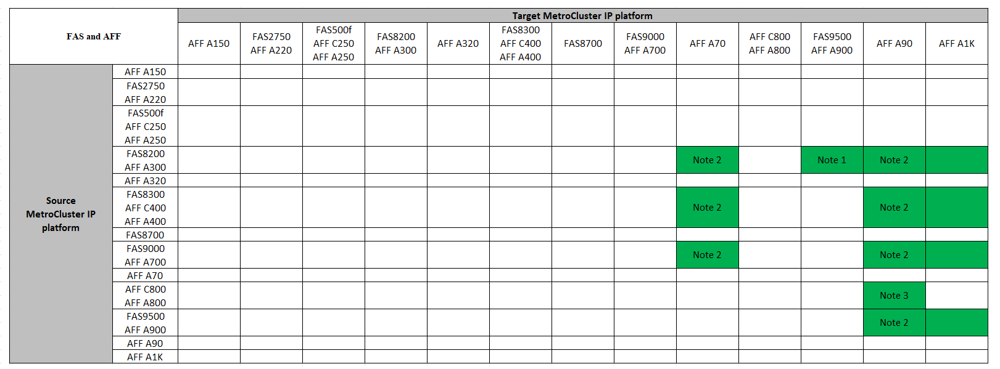

= Upgrade controllers in a four-node MetroCluster IP configuration using switchover and switchback with "system controller replace" commands (ONTAP 9.13.1 and later)
:icons: font
:imagesdir: ../media/

[.lead]
You can use this guided automated MetroCluster switchover operation to perform a non-disruptive controller upgrade on a four-node MetroCluster IP configuration. Other components (such as storage shelves or switches) cannot be upgraded as part of this procedure.

== Supported platform combinations

Before starting the upgrade, review the following considerations to verify that your configuration is supported.

* If your platform is not listed, there is no supported controller upgrade combination.

* When you perform a controller upgrade, the old and the new platform type *must* match:

** You can upgrade a FAS system to a FAS system, or an AFF A-Series to an AFF A-Series.
** You cannot upgrade a FAS system to an AFF A-Series, or an AFF A-Series to an AFF C-Series.
+
For example, if the platform you want to upgrade is a FAS8200, you can upgrade to a FAS9000. You cannot upgrade a FAS8200 system to an AFF A700 system. 
* All nodes (old and new) in the MetroCluster configuration must be running the same ONTAP version.

.Supported AFF and FAS MetroCluster IP controller upgrades 

The following table shows the supported platform combinations for upgrading an AFF or FAS system in a MetroCluster IP configuration:

NOTE: AFF A90, AFF A70, and AFF A1K systems require ONTAP 9.15.1 or later. 

* Note 1: Controller upgrades are supported on systems running ONTAP 9.13.1 or later.
* Note 2: The target platform cannot have internal drives until after the controller upgrade is complete. You can add the internal drives after the upgrade.
* Note 3: Requires replacement of the controller modules.

.Supported ASA MetroCluster IP controller upgrades 

Upgrading controllers by using `system controller replace` commands on ASA systems is not supported.

Refer to link:https://docs.netapp.com/us-en/ontap-metrocluster/upgrade/concept_choosing_an_upgrade_method_mcc.html[Choosing an upgrade or refresh method] for additional procedures.

== About this task

* You can use this procedure only for controller upgrade.
+
Other components in the configuration, such as storage shelves or switches, cannot be upgraded at the same time.

* The MetroCluster IP switches (switch type, vendor, and model) and the firmware version must be supported on the existing and new controllers in your upgrade configuration. 
+
Refer to the link:https://hwu.netapp.com[NetApp Hardware Universe^] or the link:https://imt.netapp.com/matrix/[IMT^] for supported switches and firmware versions. 

* The MetroCluster systems must be running the same ONTAP version at both sites. 
* You can use this procedure to upgrade controllers in a four-node MetroCluster IP configuration using NSO based automated switchover and switchback. 
+
NOTE: Performing an upgrade using aggregate relocation (ARL) with “systems controller replace” commands” is not supported for a four-node MetroCluster IP configuration.

* If it is enabled on your system, link:../maintain/task-configure-encryption.html#disable-end-to-end-encryption[disable end-to-end encryption] before performing the upgrade. 

* You must use the automated NSO controller upgrade procedure to upgrade the controllers at both sites in sequence.
* This automated NSO based controller upgrade procedure gives you the capability to initiate controller replacement to a MetroCluster disaster recovery (DR) site. You can only initiate a controller replacement at one site at a time.
* To initiate a controller replacement at site A, you need to run the controller replacement start command from site B. The operation guides you to replace controllers of both the nodes at site A only. To replace the controllers at site B, you need to run the controller replacement start command from site A. A message displays identifying the site at which the controllers are being replaced.

The following example names are used in this procedure:

* site_A
 ** Before upgrade:
  *** node_A_1-old
  *** node_A_2-old
 ** After upgrade:
  *** node_A_1-new
  *** node_A_2-new
* site_B
 ** Before upgrade:
  *** node_B_1-old
  *** node_B_2-old
 ** After upgrade:
  *** node_B_1-new
  *** node_B_2-new

== Set the required bootarg on the existing system

If you are upgrading to an AFF A70, AFF A90, or AFF A1K system, follow the steps to set the `hw.cxgbe.toe_keepalive_disable=1` bootarg.

CAUTION: If you are upgrading to an AFF A70, AFF A90, or AFF A1K system you *must* complete this task before performing the upgrade. This task *only* applies to upgrades to an AFF A70, AFF A90, or AFF A1K system from a supported system. For all other upgrades, you can skip this task and go directly to <<prepare_system_replace_upgrade,Prepare for the upgrade>>.

.Steps

. Halt one node at each site and allow its HA partner to perform a storage takeover of the node:
+
`halt  -node <node_name>`

. At the `LOADER` prompt of the halted node, enter the following: 
+
`setenv hw.cxgbe.toe_keepalive_disable 1` 
+
`saveenv` 
+
`printenv hw.cxgbe.toe_keepalive_disable`  

. Boot the node:
+
`boot_ontap`
    
. When the node boots, perform a giveback for the node at the prompt: 
+
`storage failover giveback -ofnode <node_name>`

. Repeat the steps on each node in the DR group that is being upgraded.

[[prepare_system_replace_upgrade]]
== Prepare for the upgrade

To prepare for the controller upgrade, you need to perform system prechecks and collect the configuration information.

Before the prechecks start, if ONTAP Mediator is installed, it is automatically detected and removed. To confirm the removal, you are prompted to enter a username and password. When you complete the upgrade, or if prechecks fail or you choose not to proceed with the upgrade, you must <<man_reconfig_mediator,manually reconfigure ONTAP Mediator>>.

At any stage during the upgrade, you can run the `system controller replace show` or `system controller replace show-details` command from site A to check the status. If the commands return a blank output, wait for a few minutes and rerun the command.

.Steps

.	Start the automated controller replacement procedure from site A to replace the controllers at site B:
+
`system controller replace start -nso true`
+
The automated operation executes the prechecks. If no issues are found, the operation pauses so you can manually collect the configuration related information.
+
[NOTE]
====
* If you do not run the `system controller replace start -nso true` command, the controller upgrade procedure chooses NSO based automated switchover and switchback as the default procedure on MetroCluster IP systems.

* The current source system and all compatible target systems are displayed. If you have replaced the source controller with a controller that has a different ONTAP version or a non-compatible platform, the automation operation halts and reports an error after the new nodes are booted up. To bring the cluster back to a healthy state, you need to follow the manual recovery procedure.
+
The `system controller replace start` command might report the following precheck error:
+
----
Cluster-A::*>system controller replace show
Node        Status         Error-Action
----------- -------------- ------------------------------------
Node-A-1    Failed         MetroCluster check failed. Reason : MCC check showed errors in component aggregates
----
+
Check if this error occurred because you have unmirrored aggregates or due to another aggregate issue. Verify that all mirrored aggregates are healthy and not degraded or mirror-degraded. If this error is due to unmirrored aggregates only, you can override this error by selecting the `-skip-metrocluster-check true` option on the `system controller replace start` command. If remote storage is accessible, the unmirrored aggregates come online after switchover. If the remote storage link fails, the unmirrored aggregates fail to come online.
====

.	Manually collect the configuration information by logging in at site B and following the commands listed in the console message under the `system controller replace show` or `system controller replace show-details` command.

[[gather_info_system_replace]]
=== Gather information before the upgrade

Before upgrading, if the root volume is encrypted, you must gather the backup key and other information to boot the new controllers with the old encrypted root volumes.

.About this task

This task is performed on the existing MetroCluster IP configuration.

.Steps

. Label the cables for the existing controllers, so you can easily identify the cables when setting up the new controllers.
. Display the commands to capture the backup key and other information:
+
`system controller replace show`
+
Run the commands listed under the `show` command from the partner cluster.
+
The `show` command output displays three tables containing the MetroCluster interface IPs, system IDs, and system UUIDs. This information is required later in the procedure to set the bootargs when you boot the new node. 

. Gather the system IDs of the nodes in the MetroCluster configuration:
+
--
`metrocluster node show -fields node-systemid,dr-partner-systemid`

During the upgrade procedure, you will replace these old system IDs with the system IDs of the new controller modules.

In this example for a four-node MetroCluster IP configuration, the following old system IDs are retrieved:

** node_A_1-old: 4068741258
** node_A_2-old: 4068741260
** node_B_1-old: 4068741254
** node_B_2-old: 4068741256

----
metrocluster-siteA::> metrocluster node show -fields node-systemid,ha-partner-systemid,dr-partner-systemid,dr-auxiliary-systemid
dr-group-id        cluster           node            node-systemid     ha-partner-systemid     dr-partner-systemid    dr-auxiliary-systemid
-----------        ---------------   ----------      -------------     -------------------     -------------------    ---------------------
1                    Cluster_A       Node_A_1-old    4068741258        4068741260              4068741256             4068741256
1                    Cluster_A       Node_A_2-old    4068741260        4068741258              4068741254             4068741254
1                    Cluster_B       Node_B_1-old    4068741254        4068741256              4068741258             4068741260
1                    Cluster_B       Node_B_2-old    4068741256        4068741254              4068741260             4068741258
4 entries were displayed.
----

In this example for a two-node MetroCluster IP configuration, the following old system IDs are retrieved:

** node_A_1: 4068741258
** node_B_1: 4068741254

----
metrocluster node show -fields node-systemid,dr-partner-systemid

dr-group-id cluster    node          node-systemid dr-partner-systemid
----------- ---------- --------      ------------- ------------
1           Cluster_A  Node_A_1-old  4068741258    4068741254
1           Cluster_B  node_B_1-old  -             -
2 entries were displayed.
----
--

. Gather port and LIF information for each old node.
+
You should gather the output of the following commands for each node:

 ** `network interface show -role cluster,node-mgmt`
 ** `network port show -node <node-name> -type physical`
 ** `network port vlan show -node <node-name>`
 ** `network port ifgrp show -node <node-name> -instance`
 ** `network port broadcast-domain show`
 ** `network port reachability show -detail`
 ** `network ipspace show`
 ** `volume show`
 ** `storage aggregate show`
 ** `system node run -node <node-name> sysconfig -a`
 ** `aggr show -r` 
 ** `disk show`  
 ** `system node run <node-name> disk show`   
 ** `vol show -fields type` 
 ** `vol show -fields type , space-guarantee` 
 ** `vserver fcp initiator show` 
 ** `storage disk show`
 ** `metrocluster configuration-settings interface show` 

. If the MetroCluster nodes are in a SAN configuration, collect the relevant information.
+
You should gather the output of the following commands:

 ** `fcp adapter show -instance`
 ** `fcp interface show -instance`
 ** `iscsi interface show`
 ** `ucadmin show`

. If the root volume is encrypted, collect and save the passphrase used for key-manager:
+
`security key-manager backup show`
. If the MetroCluster nodes are using encryption for volumes or aggregates, copy information about the keys and passphrases.
+
For additional information, see https://docs.netapp.com/ontap-9/topic/com.netapp.doc.pow-nve/GUID-1677AE0A-FEF7-45FA-8616-885AA3283BCF.html[Backing up onboard key management information manually^].

.. If Onboard Key Manager is configured:
+
`security key-manager onboard show-backup`
+
You will need the passphrase later in the upgrade procedure.

.. If enterprise key management (KMIP) is configured, issue the following commands:
+
`security key-manager external show -instance`
+
`security key-manager key query`

. After you finish collecting the configuration information, resume the operation:
+
`system controller replace resume`

=== Remove the existing configuration from the Tiebreaker or other monitoring software

If the existing configuration is monitored with the MetroCluster Tiebreaker configuration or other third-party applications (for example, ClusterLion) that can initiate a switchover, you must remove the MetroCluster configuration from the Tiebreaker or other software prior to replacing the old controller.

.Steps

. link:../tiebreaker/concept_configuring_the_tiebreaker_software.html#removing-metrocluster-configurations[Remove the existing MetroCluster configuration] from the Tiebreaker software.

. Remove the existing MetroCluster configuration from any third-party application that can initiate switchover.
+
Refer to the documentation for the application.

== Replace the old controllers and boot up the new controllers

After you gather information and resume the operation, the automation  proceeds with the switchover operation.

.About this task

The automation operation initiates the switchover operations. After these operations complete, the operation pauses at *paused for user intervention* so you can rack and install the controllers, boot up the partner controllers, and reassign the root aggregate disks to the new controller module from flash backup using the `sysids` gathered earlier.

.Before you begin

Before initiating switchover, the automation operation pauses so you can manually verify that all LIFs are "`up`" at site B. If necessary, bring any LIFs that are "`down`" to "`up`" and resume the automation operation by using the `system controller replace resume` command.

=== Prepare the network configuration of the old controllers

To ensure that the networking resumes cleanly on the new controllers, you must move LIFs to a common port and then remove the networking configuration of the old controllers.

.About this task

* This task must be performed on each of the old nodes.
* You will use the information gathered in <<prepare_system_replace_upgrade,Prepare for the upgrade>>.

.Steps

. Boot the old nodes and then log in to the nodes:
+
`boot_ontap`

. Assign the home port of all data LIFs on the old controller to a common port that is the same on both the old and new controller modules.

.. Display the LIFs:
+
`network interface show`
+
All data LIFS including SAN and NAS will be admin "`up`" and operationally "`down`" since those are up at switchover site (cluster_A).

.. Review the output to find a common physical network port that is the same on both the old and new controllers that is not used as a cluster port.
+
For example, "`e0d`" is a physical port on old controllers and is also present on new controllers. "`e0d`" is not used as a cluster port or otherwise on the new controllers.
+
For port usage for platform models, see the link:https://hwu.netapp.com/[NetApp Hardware Universe^]

.. Modify all data LIFS to use the common port as the home port:
+
`network interface modify -vserver <svm-name> -lif <data-lif> -home-port <port-id>`
+
In the following example, this is "`e0d`".
+
For example:
+
----
network interface modify -vserver vs0 -lif datalif1 -home-port e0d
----
. Modify broadcast domains to remove VLAN and physical ports that need to be deleted:
+
`broadcast-domain remove-ports -broadcast-domain <broadcast-domain-name>-ports <node-name:port-id>`
+
Repeat this step for all VLAN and physical ports.

. Remove any VLAN ports using cluster ports as member ports and interface groups using cluster ports as member ports.
.. Delete VLAN ports:
+
`network port vlan delete -node <node-name> -vlan-name <portid-vlandid>`
+
For example:
+
----
network port vlan delete -node node1 -vlan-name e1c-80
----

.. Remove physical ports from the interface groups:
+
`network port ifgrp remove-port -node <node-name> -ifgrp <interface-group-name> -port <portid>`
+
For example:
+
----
network port ifgrp remove-port -node node1 -ifgrp a1a -port e0d
----

.. Remove VLAN and interface group ports from the broadcast domain:
+
`network port broadcast-domain remove-ports -ipspace <ipspace> -broadcast-domain <broadcast-domain-name>-ports <nodename:portname,nodename:portname>,..`
.. Modify interface group ports to use other physical ports as member as needed.:
+
`ifgrp add-port -node <node-name> -ifgrp <interface-group-name> -port <port-id>`

. Halt the nodes:
+
`halt -inhibit-takeover true -node <node-name>`
+
This step must be performed on both nodes.

. Verify the nodes are at the `LOADER` prompt and collect and preserve the current environment variables.

. Gather the bootarg values: 
+
`printenv`

. Power off the nodes and shelves at the site where the controller is being upgraded.  

=== Set up the new controllers

You must rack and cable the new controllers.

.Steps

. Plan out the positioning of the new controller modules and storage shelves as needed.
+
The rack space depends on the platform model of the controller modules, the switch types, and the number of storage shelves in your configuration.

. Properly ground yourself.

. If your upgrade requires replacement of the controller modules, for example, upgrading from an AFF 800 to an AFF A90 system, you must remove the controller module from the chassis when you replace the controller module. For all other upgrades, skip to <<ip_upgrades_replace_4,Step 4>>.
+
On the front of the chassis, use your thumbs to firmly push each drive in until you feel a positive stop. This confirms that the drives are firmly seated against the chassis midplane.
+
image::../media/drw_a800_drive_seated.png[Shows removing controller module from chassis]

. [[ip_upgrades_replace_4]] Install the controller modules.
+
NOTE: The installation steps you follow depend on whether your upgrade requires replacement of the controller modules, such as an upgrade from an AFF 800 to an AFF A90 system. 
+
[role="tabbed-block"]
====
.Upgrades that require controller module replacement
--
Installing the new controllers separately is not applicable for upgrades of integrated systems with disks and controllers in the same chassis, for example, from an AFF A800 system to an AFF A90 system. The new controller modules and I/O cards must be swapped after powering off the old controllers, as shown in the image below.

The following example image is for representation only, the controller modules and I/O cards can vary between systems. 

image::../media/a90_a70_pcm_swap.png[Shows controller module swap]
-- 
.All other upgrades
--
Install the controller modules in the rack or cabinet.
--
====
. Cable the controllers' power, serial console, and management connections as described in link:../install-ip/using_rcf_generator.html[Cabling the MetroCluster IP switches]
+
Do not connect any other cables that were disconnected from old controllers at this time.
+
https://docs.netapp.com/us-en/ontap-systems/index.html[ONTAP Hardware Systems Documentation^]

. Power up the new nodes and press Ctrl-C when prompted to display the `LOADER` prompt.

=== Netboot the new controllers

After you install the new nodes, you need to netboot to ensure the new nodes are running the same version of ONTAP as the original nodes. The term netboot means you are booting from an ONTAP image stored on a remote server. When preparing for netboot, you must put a copy of the ONTAP 9 boot image onto a web server that the system can access.

This task is performed on each of the new controller modules.

.Steps

. Access the link:https://mysupport.netapp.com/site/[NetApp Support Site^] to download the files used for performing the netboot of the system.
. Download the appropriate ONTAP software from the software download section of the NetApp Support Site and store the ontap-version_image.tgz file on a web-accessible directory.
. Go to the web-accessible directory and verify that the files you need are available.
+
Your directory listing should contain a netboot folder with a kernel file: ontap-version_image.tgz
+
You do not need to extract the ontap-version_image.tgz file.

. At the `LOADER` prompt, configure the netboot connection for a management LIF:
** If IP addressing is DHCP, configure the automatic connection:
+
`ifconfig e0M -auto`
** If IP addressing is static, configure the manual connection:
+
`ifconfig e0M -addr=ip_addr -mask=netmask` `-gw=gateway`

. Perform the netboot.
+
`netboot \http://web_server_ip/path_to_web-accessible_directory/ontap-version_image.tgz`

. From the boot menu, select option *(7) Install new software first* to download and install the new software image to the boot device.

    Disregard the following message: "This procedure is not supported for Non-Disruptive Upgrade on an HA pair". It applies to nondisruptive upgrades of software, not to upgrades of controllers.

. If you are prompted to continue the procedure, enter `y`, and when prompted for the package, enter the URL of the image file: `\http://web_server_ip/path_to_web-accessible_directory/ontap-version_image.tgz`
+
....
Enter username/password if applicable, or press Enter to continue.
....

. Be sure to enter `n` to skip the backup recovery when you see a prompt similar to the following:
+
....
Do you want to restore the backup configuration now? {y|n}
....

. Reboot by entering `y` when you see a prompt similar to the following:
+
....
The node must be rebooted to start using the newly installed software. Do you want to reboot now? {y|n}
....

=== Clear the configuration on a controller module

// include reference
include::../_include/steps_clear_config_boot_to_maint_mode.adoc[]
// end include reference

=== Restore the HBA configuration

Depending on the presence and configuration of HBA cards in the controller module, you need to configure them correctly for your site's usage.

.Steps

. In Maintenance mode configure the settings for any HBAs in the system:
.. Check the current settings of the ports: `ucadmin show`
.. Update the port settings as needed.

+

|===

h| If you have this type of HBA and desired mode... h| Use this command...

a|
CNA FC
a|
`ucadmin modify -m fc -t initiator <adapter-name>`
a|
CNA Ethernet
a|
`ucadmin modify -mode cna <adapter-name>`
a|
FC target
a|
`fcadmin config -t target <adapter-name>`
a|
FC initiator
a|
`fcadmin config -t initiator <adapter-name>`
|===
. Exit Maintenance mode:
+
`halt`
+
After you run the command, wait until the node stops at the `LOADER` prompt.

. Boot the node back into Maintenance mode to enable the configuration changes to take effect:
+
`boot_ontap maint`
. Verify the changes you made:
+

|===

h| If you have this type of HBA... h| Use this command...

a|
CNA
a|
`ucadmin show`
a|
FC
a|
`fcadmin show`
|===

=== Set the HA state on the new controllers and chassis

You must verify the HA state of the controllers and chassis, and, if necessary, update the state to match your system configuration.

.Steps

. In Maintenance mode, display the HA state of the controller module and chassis:
+
`ha-config show`
+
The HA state for all components should be `mccip`.

. If the displayed system state of the controller or chassis is not correct, set the HA state:
+
`ha-config modify controller mccip`
+
`ha-config modify chassis mccip`

. Verify and modify the Ethernet ports connected to NS224 shelves or storage switches.
+
.. Verify the Ethernet ports connected to NS224 shelves or storage switches:
+
`storage port show`
+
.. Set all Ethernet ports connected to Ethernet shelves or storage switches, including shared switches for storage and cluster, to `storage` mode:
+ 
`storage port modify -p <port> -m storage` 
+
Example:
+
----
*> storage port modify -p e5b -m storage
Changing NVMe-oF port e5b to storage mode
----
+
NOTE: This must be set on all affected ports for a successful upgrade.
+
Disks from the shelves attached to the Ethernet ports are reported in the `sysconfig -v` output. 
+
Refer to the link:https://hwu.netapp.com[NetApp Hardware Universe^] for information on the storage ports for the system you are upgrading to.

.. Verify that `storage` mode is set and confirm that the ports are in the online state:
+
`storage port show`

. Halt the node: `halt`
+
The node should stop at the `LOADER>` prompt.

.	On each node, check the system date, time, and time zone: `show date`
.	If necessary, set the date in UTC or GMT: `set date <mm/dd/yyyy>`
.	Check the time by using the following command at the boot environment prompt: `show time`
.	If necessary, set the time in UTC or GMT: `set time <hh:mm:ss>`

.	Save the settings: `saveenv`
.	Gather environment variables: `printenv`

=== Update the switch RCF files to accommodate the new platforms

include::../_include/update_the_switch_rcf_files.adoc[]

=== Set the MetroCluster IP bootarg variables

Certain MetroCluster IP bootarg values must be configured on the new controller modules. The values must match those configured on the old controller modules.

.About this task

In this task, you will use the UUIDs and system IDs identified earlier in the upgrade procedure in <<gather_info_system_replace, Gather information before the upgrade>>.

.Steps

.	At the `LOADER>` prompt, set the following bootargs on the new nodes at site_B:
+
`setenv bootarg.mcc.port_a_ip_config <local-IP-address/local-IP-mask,0,HA-partner-IP-address,DR-partner-IP-address,DR-aux-partnerIP-address,vlan-id>`
+
`setenv bootarg.mcc.port_b_ip_config <local-IP-address/local-IP-mask,0,HA-partner-IP-address,DR-partner-IP-address,DR-aux-partnerIP-address,vlan-id>`
+
The following example sets the values for node_B_1 using VLAN 120 for the first network and VLAN 130 for the second network:
+
----
setenv bootarg.mcc.port_a_ip_config 172.17.26.10/23,0,172.17.26.11,172.17.26.13,172.17.26.12,120
setenv bootarg.mcc.port_b_ip_config 172.17.27.10/23,0,172.17.27.11,172.17.27.13,172.17.27.12,130
----
+
The following example sets the values for node_B_2 using VLAN 120 for the first network and VLAN 130 for the second network:
+
----
setenv bootarg.mcc.port_a_ip_config 172.17.26.11/23,0,172.17.26.10,172.17.26.12,172.17.26.13,120
setenv bootarg.mcc.port_b_ip_config 172.17.27.11/23,0,172.17.27.10,172.17.27.12,172.17.27.13,130
----
+
The following example sets the values for node_B_1 using default VLANs for all MetroCluster IP DR connections:
+
----
setenv bootarg.mcc.port_a_ip_config
172.17.26.10/23,0,172.17.26.11,172.17.26.13,172.17.26.12
setenv bootarg.mcc.port_b_ip_config
172.17.27.10/23,0,172.17.27.11,172.17.27.13,172.17.27.12
----
+
The following example sets the values for node_B_2 using default VLANs for all MetroCluster IP DR connections:
+
----
setenv bootarg.mcc.port_a_ip_config
172.17.26.11/23,0,172.17.26.10,172.17.26.12,172.17.26.13
setenv bootarg.mcc.port_b_ip_config
172.17.27.11/23,0,172.17.27.10,172.17.27.12,172.17.27.13
----

. At the new nodes' `LOADER` prompt, set the UUIDs:
+
`setenv bootarg.mgwd.partner_cluster_uuid <partner-cluster-UUID>`
+
`setenv bootarg.mgwd.cluster_uuid <local-cluster-UUID>`
+
`setenv bootarg.mcc.pri_partner_uuid <DR-partner-node-UUID>`
+
`setenv bootarg.mcc.aux_partner_uuid <DR-aux-partner-node-UUID>`
+
`setenv bootarg.mcc_iscsi.node_uuid <local-node-UUID>`

.. Set the UUIDs on node_B_1.
+
The following example shows the commands for setting the UUIDs on node_B_1:
+
----
setenv bootarg.mgwd.cluster_uuid ee7db9d5-9a82-11e7-b68b-00a098908039
setenv bootarg.mgwd.partner_cluster_uuid 07958819-9ac6-11e7-9b42-00a098c9e55d
setenv bootarg.mcc.pri_partner_uuid f37b240b-9ac1-11e7-9b42-00a098c9e55d
setenv bootarg.mcc.aux_partner_uuid bf8e3f8f-9ac4-11e7-bd4e-00a098ca379f
setenv bootarg.mcc_iscsi.node_uuid f03cb63c-9a7e-11e7-b68b-00a098908039
----

.. Set the UUIDs on node_B_2:
+
The following example shows the commands for setting the UUIDs on node_B_2:
+
----
setenv bootarg.mgwd.cluster_uuid ee7db9d5-9a82-11e7-b68b-00a098908039
setenv bootarg.mgwd.partner_cluster_uuid 07958819-9ac6-11e7-9b42-00a098c9e55d
setenv bootarg.mcc.pri_partner_uuid bf8e3f8f-9ac4-11e7-bd4e-00a098ca379f
setenv bootarg.mcc.aux_partner_uuid f37b240b-9ac1-11e7-9b42-00a098c9e55d
setenv bootarg.mcc_iscsi.node_uuid aa9a7a7a-9a81-11e7-a4e9-00a098908c35
----

. Determine whether the original systems were configured for Advanced Drive Partitioning (ADP) by running the following command from the site that is up:
+
`disk show`
+ 
The "container type" column displays "shared" in the `disk show` output if ADP is configured. If "container type" has any other value, ADP is not configured on the system. The following example output shows a system configured with ADP:
+
----
::> disk show
                    Usable               Disk    Container   Container
Disk                Size       Shelf Bay Type    Type        Name      Owner

Info: This cluster has partitioned disks. To get a complete list of spare disk
      capacity use "storage aggregate show-spare-disks".
----------------    ---------- ----- --- ------- ----------- --------- --------
1.11.0              894.0GB    11    0   SSD      shared     testaggr  node_A_1
1.11.1              894.0GB    11    1   SSD      shared     testaggr  node_A_1
1.11.2              894.0GB    11    2   SSD      shared     testaggr  node_A_1
----

. If the original systems were configured for ADP, at each of the replacement nodes' `LOADER` prompt, enable ADP:
+
`setenv bootarg.mcc.adp_enabled true`

. Set the following variables:
+
`setenv bootarg.mcc.local_config_id <original-sys-id>`
+
`setenv bootarg.mcc.dr_partner <dr-partner-sys-id>`
+
NOTE: The `setenv bootarg.mcc.local_config_id` variable must be set to the sys-id of the *original* controller module, node_B_1.

.. Set the variables on node_B_1.
+
The following example shows the commands for setting the values on node_B_1:
+
----
setenv bootarg.mcc.local_config_id 537403322
setenv bootarg.mcc.dr_partner 537403324
----

.. Set the variables on node_B_2.
+
The following example shows the commands for setting the values on node_B_2:
+
----
setenv bootarg.mcc.local_config_id 537403321
setenv bootarg.mcc.dr_partner 537403323
----

. If using encryption with external key manager, set the required bootargs:
+
`setenv bootarg.kmip.init.ipaddr`
+
`setenv bootarg.kmip.kmip.init.netmask`
+
`setenv bootarg.kmip.kmip.init.gateway`
+
`setenv bootarg.kmip.kmip.init.interface`

=== Reassign root aggregate disks

Reassign the root aggregate disks to the new controller module, using the `sysids` gathered earlier

.About this task

This task is performed in Maintenance mode.

The old system IDs were identified in <<gather_info_system_replace,Gather information before the upgrade>>.

The examples in this procedure use controllers with the following system IDs:

|===

h| Node h| Old system ID h| New system ID

a|
node_B_1
a|
4068741254
a|
1574774970
|===

.Steps

. Cable all other connections to the new controller modules (FC-VI, storage, cluster interconnect, etc.).

. Halt the system and boot to Maintenance mode from the `LOADER` prompt:
+
`boot_ontap maint`

. Display the disks owned by node_B_1-old:
+
`disk show -a`
+
The command output shows the system ID of the new controller module (1574774970). However, the root aggregate disks are still owned by the old system ID (4068741254). This example does not show drives owned by other nodes in the MetroCluster configuration.
+
CAUTION: Before you proceed with disk reassignement, you must verify that the pool0 and pool1 disks belonging to the node's root aggregate are displayed in the `disk show` output. In the following example, the output lists the pool0 and pool1 disks owned by node_B_1-old.
+
----
*> disk show -a
Local System ID: 1574774970

  DISK         OWNER                     POOL   SERIAL NUMBER    HOME                      DR HOME
------------   -------------             -----  -------------    -------------             -------------
...
rr18:9.126L44 node_B_1-old(4068741254)   Pool1  PZHYN0MD         node_B_1-old(4068741254)  node_B_1-old(4068741254)
rr18:9.126L49 node_B_1-old(4068741254)   Pool1  PPG3J5HA         node_B_1-old(4068741254)  node_B_1-old(4068741254)
rr18:8.126L21 node_B_1-old(4068741254)   Pool1  PZHTDSZD         node_B_1-old(4068741254)  node_B_1-old(4068741254)
rr18:8.126L2  node_B_1-old(4068741254)   Pool0  S0M1J2CF         node_B_1-old(4068741254)  node_B_1-old(4068741254)
rr18:8.126L3  node_B_1-old(4068741254)   Pool0  S0M0CQM5         node_B_1-old(4068741254)  node_B_1-old(4068741254)
rr18:9.126L27 node_B_1-old(4068741254)   Pool0  S0M1PSDW         node_B_1-old(4068741254)  node_B_1-old(4068741254)
...
----

. Reassign the root aggregate disks on the drive shelves to the new controller:
+
`disk reassign -s <old-sysid> -d <new-sysid>`
+
NOTE: If your MetroCluster IP system is configured with Advanced Disk Partitioning, you must include the DR partner system id by running the `disk reassign -s old-sysid -d new-sysid -r dr-partner-sysid` command.
+
The following example shows reassignment of drives:
+
----
*> disk reassign -s 4068741254 -d 1574774970
Partner node must not be in Takeover mode during disk reassignment from maintenance mode.
Serious problems could result!!
Do not proceed with reassignment if the partner is in takeover mode. Abort reassignment (y/n)? n

After the node becomes operational, you must perform a takeover and giveback of the HA partner node to ensure disk reassignment is successful.
Do you want to continue (y/n)? Jul 14 19:23:49 [localhost:config.bridge.extra.port:error]: Both FC ports of FC-to-SAS bridge rtp-fc02-41-rr18:9.126L0 S/N [FB7500N107692] are attached to this controller.
y
Disk ownership will be updated on all disks previously belonging to Filer with sysid 4068741254.
Do you want to continue (y/n)? y
----

. Check that all disks are reassigned as expected:
+
`disk show`
+
----
*> disk show
Local System ID: 1574774970

  DISK        OWNER                      POOL   SERIAL NUMBER   HOME                      DR HOME
------------  -------------              -----  -------------   -------------             -------------
rr18:8.126L18 node_B_1-new(1574774970)   Pool1  PZHYN0MD        node_B_1-new(1574774970)  node_B_1-new(1574774970)
rr18:9.126L49 node_B_1-new(1574774970)   Pool1  PPG3J5HA        node_B_1-new(1574774970)  node_B_1-new(1574774970)
rr18:8.126L21 node_B_1-new(1574774970)   Pool1  PZHTDSZD        node_B_1-new(1574774970)  node_B_1-new(1574774970)
rr18:8.126L2  node_B_1-new(1574774970)   Pool0  S0M1J2CF        node_B_1-new(1574774970)  node_B_1-new(1574774970)
rr18:9.126L29 node_B_1-new(1574774970)   Pool0  S0M0CQM5        node_B_1-new(1574774970)  node_B_1-new(1574774970)
rr18:8.126L1  node_B_1-new(1574774970)   Pool0  S0M1PSDW        node_B_1-new(1574774970)  node_B_1-new(1574774970)
*>
----

. Display the aggregate status:
+
`aggr status`
+
----
*> aggr status
           Aggr            State       Status           Options
aggr0_node_b_1-root        online      raid_dp, aggr    root, nosnap=on,
                           mirrored                     mirror_resync_priority=high(fixed)
                           fast zeroed
                           64-bit
----

. Repeat the above steps on the partner node (node_B_2-new).

=== Boot up the new controllers
You must reboot the controllers from the boot menu to update the controller flash image. Additional steps are required if encryption is configured.

You can reconfigure VLANs and interface groups. If required, manually modify the ports for the cluster LIFs and broadcast domain details before resuming the operation by using the `system controller replace resume` command.

.About this task

This task must be performed on all the new controllers.

.Steps

. Halt the node:
+
`halt`

. If external key manager is configured, set the related bootargs:
+
`setenv bootarg.kmip.init.ipaddr <ip-address>`
+
`setenv bootarg.kmip.init.netmask <netmask>`
+
`setenv bootarg.kmip.init.gateway <gateway-address>`
+
`setenv bootarg.kmip.init.interface <interface-id>`
. Display the boot menu:
+
`boot_ontap menu`
. If root encryption is used, select the boot menu option for your key management configuration.
+

|===

h| If you are using... h| Select this boot menu option...

a|
Onboard key management
a|
Option "`10`"

Follow the prompts to provide the required inputs to recover and restore the key-manager configuration.
a|
External key management
a|
Option "`11`"

Follow the prompts to provide the required inputs to recover and restore the key-manager configuration.
|===

. From the boot menu, run option "`6`".
+
NOTE: Option "`6`" will reboot the node twice before completing.
+

Respond "`y`" to the system id change prompts. Wait for the second reboot messages:
+
----
Successfully restored env file from boot media...

Rebooting to load the restored env file...
----
+
During one of the reboots after option "`6`", the confirmation prompt `Override system ID? {y|n}` appears. Enter `y`.
. If root encryption is used, select the boot menu option again for your key management configuration.
+

|===

h| If you are using... h| Select this boot menu option...

a|
Onboard key management
a|
Option "`10`"

Follow the prompts to provide the required inputs to recover and restore the key-manager configuration.
a|
External key management
a|
Option "`11`"

Follow the prompts to provide the required inputs to recover and restore the key-manager configuration.
|===
+
Depending on the key manager setting, perform the recovery procedure by selecting option "`10`" or option "`11`", followed by option "`6`" at the first boot menu prompt. To boot the nodes completely, you might need to repeat the recovery procedure continued by option "`1`" (normal boot).

. Boot the nodes:
+
`boot_ontap`

. Wait for the replaced nodes to boot up.
+
If either node is in takeover mode, perform a giveback using the `storage failover giveback` command.

. Verify that all ports are in a broadcast domain:

.. View the broadcast domains:
+
`network port broadcast-domain show`

.. If a new broadcast domain is created for the data ports on the newly upgraded controllers, delete the broadcast domain:
+
NOTE: Only delete the the new broadcast domain. Do not delete any of the broadcast domains that existed before starting the upgrade.
+
`broadcast-domain delete -broadcast-domain <broadcast_domain_name>`
.. Add any ports to a broadcast domain as needed.
+
https://docs.netapp.com/ontap-9/topic/com.netapp.doc.dot-cm-nmg/GUID-003BDFCD-58A3-46C9-BF0C-BA1D1D1475F9.html[Adding or removing ports from a broadcast domain^]

.. Add the physical port that will host the intercluster LIFs to the corresponding broadcast domain.
.. Modify intercluster LIFs to use the new physical port as home port.
.. After the intercluster LIFs are up, check the cluster peer status and re-establish cluster peering as needed.
+
You may need to reconfigure cluster peering.
+
link:../install-ip/task_sw_config_configure_clusters.html#peering-the-clusters[Creating a cluster peer relationship]

.. Recreate VLANs and interface groups as needed.
+
VLAN and interface group membership might be different than that of the old node.
+
https://docs.netapp.com/ontap-9/topic/com.netapp.doc.dot-cm-nmg/GUID-8929FCE2-5888-4051-B8C0-E27CAF3F2A63.html[Creating a VLAN^]
+
https://docs.netapp.com/ontap-9/topic/com.netapp.doc.dot-cm-nmg/GUID-DBC9DEE2-EAB7-430A-A773-4E3420EE2AA1.html[Combining physical ports to create interface groups^]

.. Verify that the partner cluster is reachable and that the
configuration is successfully resynchronized on the partner cluster: 
+
`metrocluster switchback -simulate true`

. If encryption is used, restore the keys using the correct command for your key management configuration.
+

|===

h| If you are using... h| Use this command...

a|
Onboard key management
a|
`security key-manager onboard sync`

For more information, see https://docs.netapp.com/ontap-9/topic/com.netapp.doc.pow-nve/GUID-E4AB2ED4-9227-4974-A311-13036EB43A3D.html[Restoring onboard key management encryption keys^].
a|
External key management
a|
`security key-manager external restore -vserver <svm-name> -node <node-name> -key-server <host_name\|IP_address:port> -key-id <key_id> -key-tag key_tag <node-name>`

For more information, see https://docs.netapp.com/ontap-9/topic/com.netapp.doc.pow-nve/GUID-32DA96C3-9B04-4401-92B8-EAF323C3C863.html[Restoring external key management encryption keys^].

|===

. Before you resume the operation, verify that the MetroCluster is configured correctly. Check the node status:
+
`metrocluster node show`
+
Verify that the new nodes (site_B) are in *Waiting for switchback state* from site_A.

. Resume the operation:
+
`system controller replace resume`

== Complete the upgrade

The automation operation runs verification system checks and then pauses so you can verify the network reachability. After verification, the resource regain phase is initiated and the automation operation executes switchback at site A and pauses at the post upgrade checks. After you resume the automation operation, it performs the post upgrade checks and if no errors are detected, marks the upgrade as complete.

.Steps

.	Verify the network reachability by following the console message.
.	After you complete the verification, resume the operation:
+
`system controller replace resume`
.	The automation operation performs `heal-aggregate`, `heal-root-aggregate`, and switchback operations at site A, and the post upgrade checks. When the operation pauses, manually check the SAN LIF status and verify the network configuration by following the console message.
.	After you complete the verification, resume the operation:
+
`system controller replace resume`

.	Check the post upgrade checks status:
+
`system controller replace show`
+
If the post upgrade checks did not report any errors, the upgrade is complete.

.	After you complete the controller upgrade, log in at site B and verify that the replaced controllers are configured correctly.

[[man_reconfig_mediator]]
=== Reconfigure ONTAP Mediator 

Manually configure ONTAP Mediator which was automatically removed before you started the upgrade. 

. Use the steps in link:../install-ip/task_configuring_the_ontap_mediator_service_from_a_metrocluster_ip_configuration.html[Configure the ONTAP Mediator service from a MetroCluster IP configuration]. 

=== Restore Tiebreaker monitoring

If the MetroCluster configuration was previously configured for monitoring by the Tiebreaker software, you can restore the Tiebreaker connection.

. Use the steps in http://docs.netapp.com/ontap-9/topic/com.netapp.doc.hw-metrocluster-tiebreaker/GUID-7259BCA4-104C-49C6-BAD0-1068CA2A3DA5.html[Adding MetroCluster configurations].

=== Configure end-to-end encryption

If it is supported on your system, you can encrypt back-end traffic, such as NVlog and storage replication data, between the MetroCluster IP sites. Refer to link:../maintain/task-configure-encryption.html[Configure end-to-end encryption] for more information.

// 2024 Jun 17, ONTAPDOC-1735
// 2023 AUG 24, ONTAPDOC-1030
// 2023 JULY 5, ONTAPDOC-1083
// 2023 APR 17, BURT 1535231