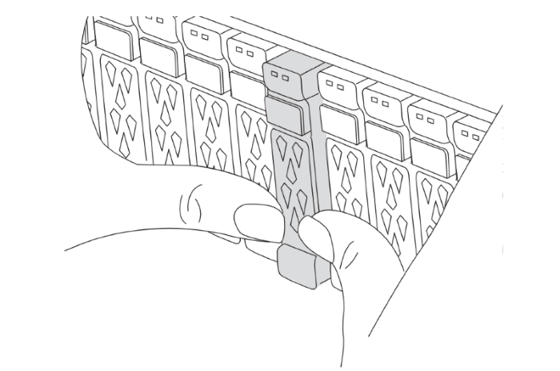

= Set up the new controllers 
:icons: font
:imagesdir: ../media/

[.lead]
Set up the new controllers before you netboot the controllers to confirm the new nodes are running the same version of ONTAP as the original nodes.

== Set up the new controllers

You must rack and cable the new controllers.

.Steps

. Plan out the positioning of the new controller modules and storage shelves as needed.
+
The rack space depends on the platform model of the controller modules, the switch types, and the number of storage shelves in your configuration.

. Properly ground yourself.

. If your upgrade requires replacement of the controller modules, for example, upgrading from an AFF 800 to an AFF A90 system, you must remove the controller module from the chassis when you replace the controller module. For all other upgrades, skip to <<ip_upgrades_replace_4,Step 4>>.
+
On the front of the chassis, use your thumbs to firmly push each drive in until you feel a positive stop. This confirms that the drives are firmly seated against the chassis midplane.
+

. [[ip_upgrades_replace_4]] Install the controller modules.
+
The installation steps you follow depend on whether your upgrade requires replacement of the controller modules, or if IOM modules are required to convert the old controllers to an external shelf. 
+
[cols=2*,options="header"]
|===
| If you are upgrading...
| Follow the steps for ...
| An AFF A150 or AFF A220 system to an AFF A20 system | Convert old controllers
| An AFF A800 system to an AFF A90 system | Controller module replacement
| Any other upgrade combinations | All other upgrades
|===
+
[role="tabbed-block"]
====
.Convert old controllers
--
<insert content here>
--
.Controller module replacement
--
Installing the new controllers separately is not applicable for upgrades of integrated systems with disks and controllers in the same chassis, for example, from an AFF A800 system to an AFF A90 system. The new controller modules and I/O cards must be swapped after powering off the old controllers, as shown in the image below.

The following example image is for representation only, the controller modules and I/O cards can vary between systems. 

image::../media/a90_a70_pcm_swap.png[Shows controller module swap]
-- 
.All other upgrades
--
Install the controller modules in the rack or cabinet.
--
====
. Cable the controllers' power, serial console, and management connections as described in link:../install-ip/using_rcf_generator.html[Cabling the MetroCluster IP switches]
+
Do not connect any other cables that were disconnected from old controllers at this time.
+
https://docs.netapp.com/us-en/ontap-systems/index.html[ONTAP Hardware Systems Documentation^]

. Power up the new nodes and press Ctrl-C when prompted to display the `LOADER` prompt.

== Netboot the new controllers

After you install the new nodes, you need to netboot to ensure the new nodes are running the same version of ONTAP as the original nodes. The term netboot means you are booting from an ONTAP image stored on a remote server. When preparing for netboot, you must put a copy of the ONTAP 9 boot image onto a web server that the system can access.

This task is performed on each of the new controller modules.

.Steps

. Access the link:https://mysupport.netapp.com/site/[NetApp Support Site^] to download the files used for performing the netboot of the system.
. Download the appropriate ONTAP software from the software download section of the NetApp Support Site and store the ontap-version_image.tgz file on a web-accessible directory.
. Go to the web-accessible directory and verify that the files you need are available.
+
Your directory listing should contain a netboot folder with a kernel file: ontap-version_image.tgz
+
You do not need to extract the ontap-version_image.tgz file.

. At the `LOADER` prompt, configure the netboot connection for a management LIF:
** If IP addressing is DHCP, configure the automatic connection:
+
`ifconfig e0M -auto`
** If IP addressing is static, configure the manual connection:
+
`ifconfig e0M -addr=ip_addr -mask=netmask` `-gw=gateway`

. Perform the netboot.
+
`netboot \http://web_server_ip/path_to_web-accessible_directory/ontap-version_image.tgz`

. From the boot menu, select option *(7) Install new software first* to download and install the new software image to the boot device.

    Disregard the following message: "This procedure is not supported for Non-Disruptive Upgrade on an HA pair". It applies to nondisruptive upgrades of software, not to upgrades of controllers.

. If you are prompted to continue the procedure, enter `y`, and when prompted for the package, enter the URL of the image file: `\http://web_server_ip/path_to_web-accessible_directory/ontap-version_image.tgz`
+
....
Enter username/password if applicable, or press Enter to continue.
....

. Be sure to enter `n` to skip the backup recovery when you see a prompt similar to the following:
+
....
Do you want to restore the backup configuration now? {y|n}
....

. Reboot by entering `y` when you see a prompt similar to the following:
+
....
The node must be rebooted to start using the newly installed software. Do you want to reboot now? {y|n}
....

== Clear the configuration on a controller module

// include reference
include::../_include/steps_clear_config_boot_to_maint_mode.adoc[]
