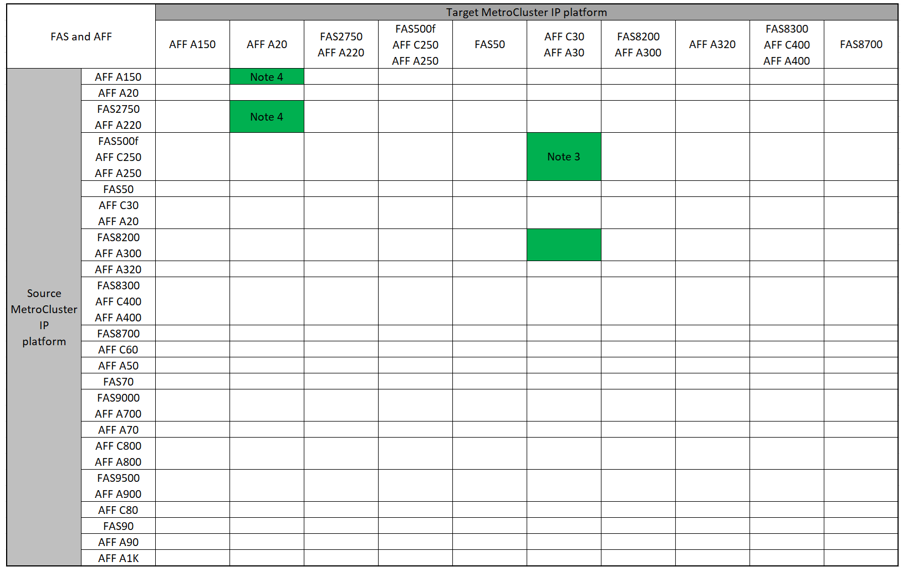
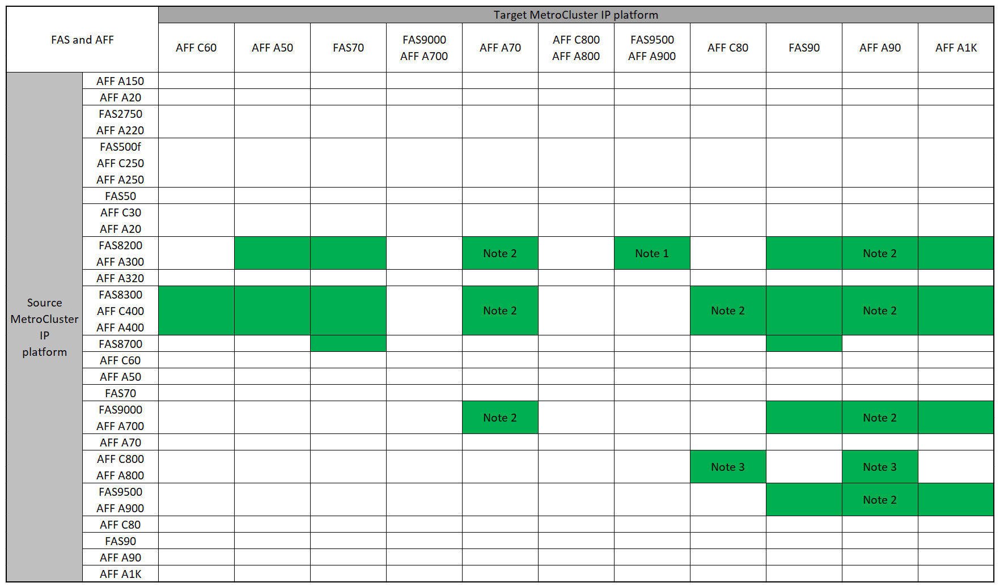

= Supported MetroCluster IP controller upgrades using "system controller replace" commands
:icons: font
:imagesdir: ../media/

[.lead]
Before you begin the MetroCluster IP controller upgrade, you need to verify that your upgrade combination is supported.

Find your *Source* platform from the MetroCluster controller upgrade tables in this section. If the intersection of the *Source* platform row and *Target* platform column is blank, the upgrade is not supported.

Before starting the upgrade, review the following considerations to verify that your configuration is supported.

* If your platform is not listed, there is no supported controller upgrade combination.

* When you perform a controller upgrade, the old and the new platform type *must* match:

** You can upgrade a FAS system to a FAS system, or an AFF A-Series to an AFF A-Series.
** You cannot upgrade a FAS system to an AFF A-Series, or an AFF A-Series to an AFF C-Series.
+
For example, if the platform you want to upgrade is a FAS8200, you can upgrade to a FAS9000. You cannot upgrade a FAS8200 system to an AFF A700 system. 
* All nodes (old and new) in the MetroCluster configuration must be running the same ONTAP version. Refer to the link:https://hwu.netapp.com[Hardware universe^] for the minimum supported ONTAP version for your combination. 

== Supported AFF and FAS MetroCluster IP controller upgrades 

The following table shows the supported platform combinations for upgrading an AFF or FAS system in a MetroCluster IP configuration using "system controller replace" commands, split into two groups. 

* *Group 1* shows combinations for upgrades to AFF A150, AFF A20, FAS2750, AFF A220, FAS500f, AFF C250, AFF A250, FAS50, AFF C30, AFF A30, FAS8200, AFF A300, AFF A320, FAS8300, AFF C400, AFF A400, and FAS8700 systems.
* *Group 2* shows combinations for upgrades to AFF C60, AFF A50, FAS70, FAS9000, AFF A700, AFF A70, AFF C800, AFF A800, FAS9500, AFF A900, AFF C80, FAS90, AFF A90, and AFF A1K systems.

The following notes apply to both groups:

* Note 1: Controller upgrades are supported on systems running ONTAP 9.13.1 or later.
* Note 2: The target platform cannot have internal drives until after the controller upgrade is complete. You can add the internal drives after the upgrade.
* Note 3: Requires replacement of the controller modules.
* Note 4: Requires IOM modules to convert the old controllers to an external SAS shelf. Refer to the link:https://hwu.netapp.com/[Hardware Universe^] for supported IOM modules.

[role="tabbed-block"]
====
.AFF and FAS combinations group 1
--
Review the supported combinations for upgrades to AFF A150, AFF A20, FAS2750, AFF A220, FAS500f, AFF C250, AFF A250, FAS50, AFF C30, AFF A30, FAS8200, AFF A300, AFF A320, FAS8300, AFF C400, AFF A400, and FAS8700 systems.

--
.AFF and FAS combinations group 2
--
Review the supported combinations for upgrades to AFF C60, AFF A50, FAS70, FAS9000, AFF A700, AFF A70, AFF C800, AFF A800, FAS9500, AFF A900, AFF C80, FAS90, AFF A90, and AFF A1K systems. 

--
====

== Supported ASA MetroCluster IP controller upgrades 

Upgrading controllers by using `system controller replace` commands on ASA systems is not supported.

Refer to link:https://docs.netapp.com/us-en/ontap-metrocluster/upgrade/concept_choosing_an_upgrade_method_mcc.html[Choose an upgrade or refresh method] for additional procedures.

.What's next?
Review the link:upgrade-mcc-ip-system-controller-replace-requirements.html[requirements for using this upgrade procedure].

// 2025 May 29, ONTAPDOC-3039
// 2024 Dec 09, ONTAPDOC-2350
// 2024 Nov 12, ONTAPDOC-2351